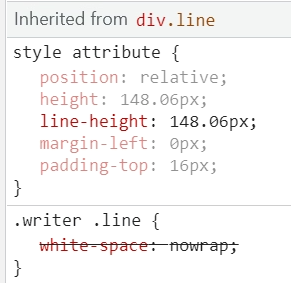
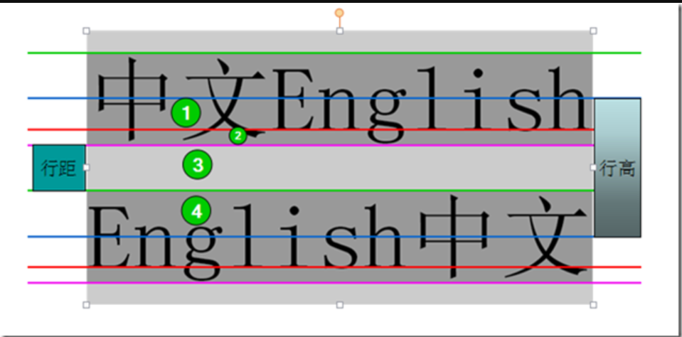
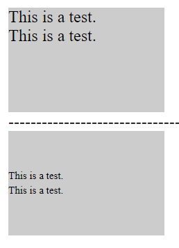

# 一 gitlab pipeline

https://docs.gitlab.com/ee/ci/pipelines/


# 二 强制让css生效的话，怎么加！important


# 三 控制台里面的样式部分



style attribute 代表的是那种类型的样式？

element.style 代表的是那种类型的样式？


# 四 下划线的粗细thickness影响下划线的位置

https://www.zhangxinxu.com/wordpress/2016/11/css-text-decoration-underline-skip-override/

https://runebook.dev/zh-CN/docs/css/text-underline-offset

下划线有没有什么基准线？？？

https://runebook.dev/zh-CN/docs/css/text-underline-position


offset 在浏览器的渲染机制中是怎么影响元素布局的？

https://www.zhangxinxu.com/wordpress/2016/11/css-text-decoration-underline-skip-override/


# 五 CSS文字基准线

CSS行高与基线

https://www.cnblogs.com/dolphinX/p/3236686.html

 **顶线、中线、基线、底线**

```
vertical-align: top || middle || baseline || bottom
```




**行高、行距**

**行高 = 字体size + 行距 ** 


**内容区、行内框、行框**

* 内容区：底线和顶线之间
* 行内框：每个行内元素会生成一个行内框，行内框是一个浏览器渲染模型中的一个概念，无法显示出来，在没有其他因素影响的时候（padding等），行内框等于内容区域。*而设定行高时行内框高度不变，半行距【（行高-字体size）/2】分别增加/减少到内容区域的上下两边*
* 行框：行框高度等于本行内所有元素中行内框最大的值（以行高值最大的行内框为基准，其他行内框采用自己的对齐方式向基准对齐，最终计算行框的高度），当有多行内容时，每行都会有自己的行框。


**line-height**

> line-height 属性设置行间的距离（行高），不能使用负值。该属性会影响行框的布局。在应用到一个块级元素时，它定义了该元素中基线之间的最小距离而不是最大距离


```html
<div style="width:150px;height:100px;background-color:#ccc;">
    <span>This is a test.<br/>
        This is a test.
    </span>
</div>
```



```html
// 看不懂下面是怎么实现垂直居中的(主要是不懂br的影响)
<div style="width:150px;height:100px;line-height:100px;background-color:#ccc;font-size:0;">
    <span style="display:inline-block;font-size:10px;line-height:1.4em;vertical-align:middle;">This is a test.<br/>
        This is a test.
    </span>
</div>
```

```
```

这个问题还没有弄完 要继续看

**行高的继承**


# 六 怎么设置merge的同时删除远程分支


# 七 git怎么回退

拒绝上一次的merge
