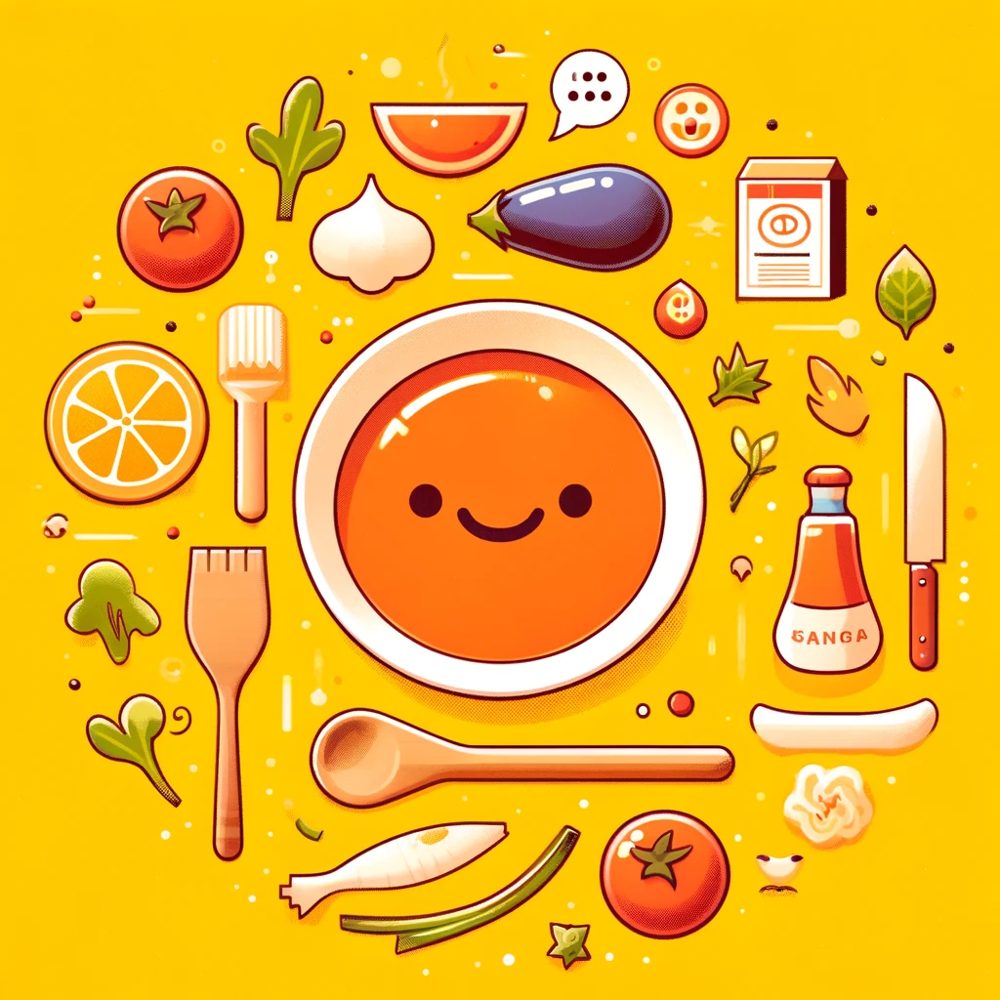
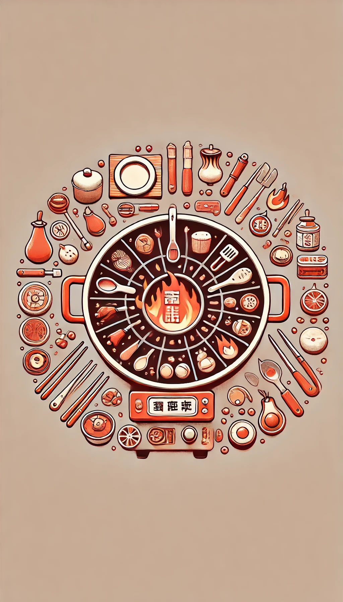
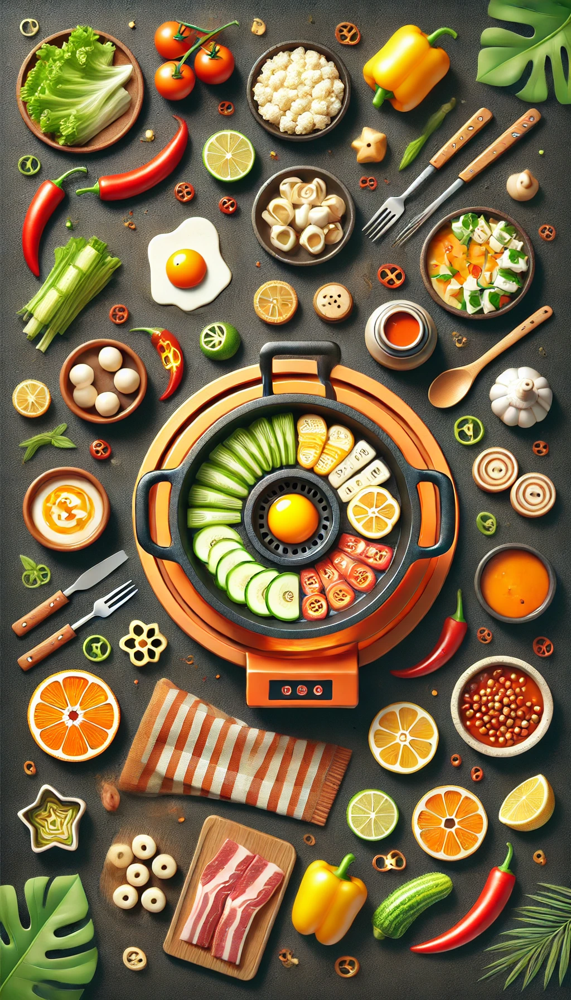
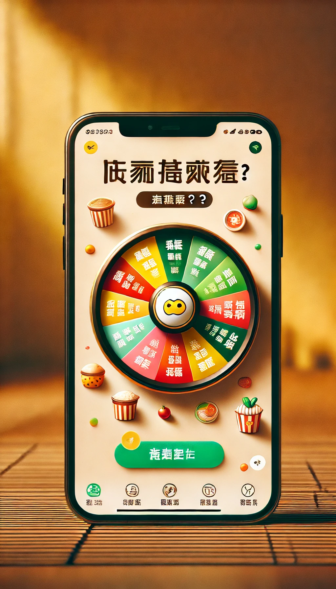
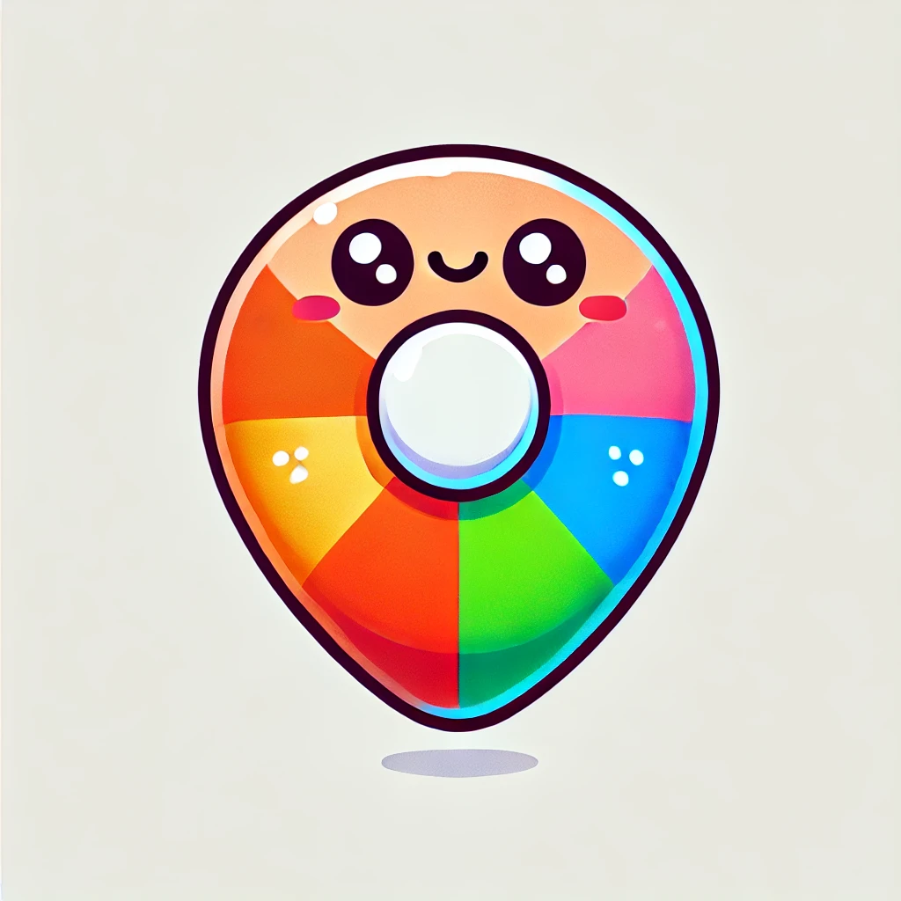

https://www.bilibili.com/video/BV1LF4m1E7kB?spm_id_from=333.788.player.switch&vd_source=a7089a0e007e4167b4a61ef53acc6f7e&p=6

# 1. 设计图

该小程序是一款旨在帮助用户解决用餐决策的小工具，它提供随机选择功能，让用户在纠结时快速做出决定，提升用餐效率

我现在在做一款微信小程序，该小程序是一款旨在帮助用户解决用餐决策的小工具，它提供随机选择功能，让用户在纠结时快速做出决定，提升用餐效率。你可以帮我设计一张小程序的页面图并输出吗。注意点1：我希望小程序页面中是中文元素，无英文元素。注意点2：我希望页面中有一个可以旋转的大转盘，作用是方便我选择今天吃什么。注意点3：我希望转盘的配色可以好看一点，让人比较有食欲。注意点4：我希望图片的尺寸能够适配一般手机页面。注意点5：我希望图片是png或者jpg格式。注意点6：我希望页面顶部有一个标题，你可以帮我想想标题取什么好。注意点7：我希望页面底部有一个可以修改食物选项的按钮











# 2. 小程序基础知识

小程序ID——AppID——wx9a06dff445b1583a

小程序秘钥——AppSecret——443fba1299d3230cb3ec2543fb262e7c——是开发者对小程序拥有所有权的凭证，在进行微信登录，微信支付，或者发送消息等高级开发时会用到

- app.js：小程序入口文件
- app.json：小程序的全局配置文件
- app.wxss：小程序的全局样式

# 3. 食物图片素材网站

以下是一些提供高质量图片素材的网站，包含免费和收费选项，其中很多提供了大量食物主题的照片：

---

### **免费素材网站**

1. **[Unsplash](https://unsplash.com/)**
   - 高质量免费图片素材网站，食物类照片丰富。
   - 关键词搜索：输入 "food" 或具体食物名称（如 "pizza"）。
   - 无需注册即可下载，但需遵守版权说明（通常需要署名）。

2. **[Pexels](https://www.pexels.com/)**
   - 免费商业用途图片和视频素材。
   - 食物照片多样，适合餐饮、烹饪等相关项目。

3. **[Pixabay](https://pixabay.com/)**
   - 提供高分辨率图片，涵盖食物、饮料等主题。
   - 所有图片均为 CC0 协议，免费且无需署名。

4. **[Foodiesfeed](https://www.foodiesfeed.com/)**
   - 专注于食物摄影的免费素材网站。
   - 适合寻找专业级美食照片。

5. **[Burst by Shopify](https://burst.shopify.com/)**
   - Shopify 提供的免费图片素材网站。
   - 提供食物类图片，适合电商或博客使用。

---

### **收费素材网站**

1. **[Shutterstock](https://www.shutterstock.com/)**
   - 专业的收费素材网站，食物照片质量极高。
   - 提供多种套餐选择，适合长期素材需求。

2. **[Adobe Stock](https://stock.adobe.com/)**
   - 高质量收费素材，支持与 Adobe 产品（如 Photoshop）无缝集成。
   - 包含丰富的食物类图片和插画。

3. **[Getty Images](https://www.gettyimages.com/)**
   - 专业的高端图片库，食物主题素材非常精致。
   - 适合商业广告或高级项目使用。

4. **[iStock](https://www.istockphoto.com/)**
   - Getty Images 的子品牌，提供更实惠的图片选项。
   - 食物类素材覆盖广泛，支持按需求购买。

---

### **创意图片生成**

如果你需要更加个性化或独特的食物图片，可以尝试使用 AI 图像生成工具，如 **DALL·E** 或 **MidJourney**，自定义生成符合需求的图片。

---

### **推荐使用技巧**

1. **搜索技巧**：
   - 使用具体关键词（如 "healthy food"、"street food"、"coffee"）提高精确度。
   - 根据语言切换关键词，如英文结果通常更丰富。

2. **格式与大小**：
   - 优先选择高分辨率图片，适合打印或高清显示。

3. **版权与使用规则**：
   - 确认是否需署名或购买使用授权，尤其是商业用途。

# 4. 颜色提取

有许多实用的软件和工具可以帮助你提取颜色，从屏幕或图像中获取颜色值（如 RGB、HEX、HSL 等）。以下是一些推荐的选择，包含桌面应用、在线工具和浏览器插件。

---

### **桌面应用**

1. **[Color Picker](https://colorpicker.com/)**
   - 免费开源的颜色提取工具。
   - 支持实时从屏幕任何位置提取颜色。
   - 提供多种颜色格式（HEX、RGB 等）。

2. **[Instant Eyedropper](https://instant-eyedropper.com/)**
   - Windows 专用工具，简单易用。
   - 在屏幕上移动鼠标即可实时显示颜色值。

3. **[Sip](https://sipapp.io/)**
   - 专为 macOS 设计，外观简洁。
   - 支持颜色历史记录和颜色分组。
   - 付费版本提供更多高级功能。

4. **[Just Color Picker](https://annystudio.com/software/colorpicker/)**
   - Windows 和 macOS 均支持。
   - 提供色彩和梯度工具，还支持 HTML、CSS 格式输出。

5. **Adobe Photoshop / Illustrator**
   - 内置的滴管工具（Eyedropper Tool）可用于提取颜色。
   - 适合需要处理图像或设计的用户。

---

### **在线工具**

1. **[Coolors](https://coolors.co/)**
   - 提供在线调色板工具，可从上传的图片中提取颜色。
   - 自动生成配色方案，非常适合设计师使用。

2. **[HTML Color Codes](https://htmlcolorcodes.com/)**
   - 上传图片后提取颜色并查看 HEX、RGB、CMYK 值。
   - 简单易用，适合初学者。

3. **[Canva](https://www.canva.com/colors/color-palette-generator/)**
   - 在线生成图片配色方案。
   - 自动从图片中提取主要颜色，适合快速使用。

4. **[ImageColorPicker](https://imagecolorpicker.com/)**
   - 在线上传图片并点击任意区域提取颜色。
   - 提供颜色预览和 HEX/RGB 值。

---

### **浏览器插件**

1. **[ColorZilla (Chrome/Firefox)](https://www.colorzilla.com/)**
   - 功能强大的浏览器扩展，可从网页任意位置提取颜色。
   - 提供渐变生成器和颜色历史记录。

2. **[Eye Dropper (Chrome)](https://eyedropper.org/)**
   - 简单实用的 Chrome 扩展。
   - 支持屏幕取色和历史记录功能。

3. **[Palette Creator (Firefox)](https://addons.mozilla.org/en-US/firefox/addon/palette-creator/)**
   - Firefox 专用，基于网页内容自动生成调色板。

---

### **移动端应用**

1. **[Adobe Capture](https://www.adobe.com/products/capture.html)**
   - iOS 和 Android 支持。
   - 可通过摄像头或图片提取颜色，并生成配色方案。

2. **[Color Grab](https://play.google.com/store/apps/details?id=com.loomatix.colorgrab)**
   - Android 专用，强大的实时颜色提取工具。
   - 提供详细的颜色数据和历史记录。

3. **[Pocket Palette](https://apps.apple.com/)**
   - iOS 专用，适合提取图片和实时捕捉的颜色。
   - 支持保存调色板。

---

### **推荐使用场景**

- **设计师/前端开发**：推荐使用 `Coolors` 或 `ColorZilla`，快速生成配色方案。
- **平面设计和图像处理**：选择 Photoshop、Sip 等支持高级功能的工具。
- **快速取色**：使用浏览器插件（如 `ColorZilla`）或桌面工具（如 `Just Color Picker`）。

# 5. 指针素材

你可以使用一些可爱风格、背景透明的指针图像。以下是一些建议，供你参考：

1. **使用透明背景的指针图标**：可以在一些资源网站上找到适合的图标，例如 [Flaticon](https://www.flaticon.com/) 或者 [Iconfinder](https://www.iconfinder.com/)，它们提供了各种可爱风格的指针图标，且大部分提供透明背景的PNG格式图片。
2. **制作自定义指针图标**：
   - 你也可以使用像 [Canva](https://www.canva.com/) 或 [Figma](https://www.figma.com/) 等在线设计工具，轻松设计带有透明背景的可爱指针图标。
   - 选择合适的颜色和样式，并导出为 PNG 格式，确保背景透明。
3. **在线素材库**：你还可以访问以下网站，寻找适合的图标素材：
   - [Pixabay](https://pixabay.com/) - 免费的图像和矢量图标资源库。
   - [Unsplash](https://unsplash.com/) - 提供大量免版权的高质量图像，适合一些图标样式。

https://www.freepik.com/search?format=search&iconType=standard&img=1&last_filter=img&last_value=1&query=&type=icon

# 6. app.json

```json
{
  "pages": [
    "pages/index/index"
  ],
  "window": {
    "navigationBarTextStyle": "black",
    "navigationStyle": "custom"
  },
  "style": "v2",
  "renderer": "skyline",
  "rendererOptions": {
    "skyline": {
      "defaultDisplayBlock": true,
      "defaultContentBox": true,
      "tagNameStyleIsolation": "legacy",
      "disableABTest": true,
      "sdkVersionBegin": "3.0.0",
      "sdkVersionEnd": "15.255.255"
    }
  },
  "componentFramework": "glass-easel",
  "sitemapLocation": "sitemap.json",
  "lazyCodeLoading": "requiredComponents"
}
```

