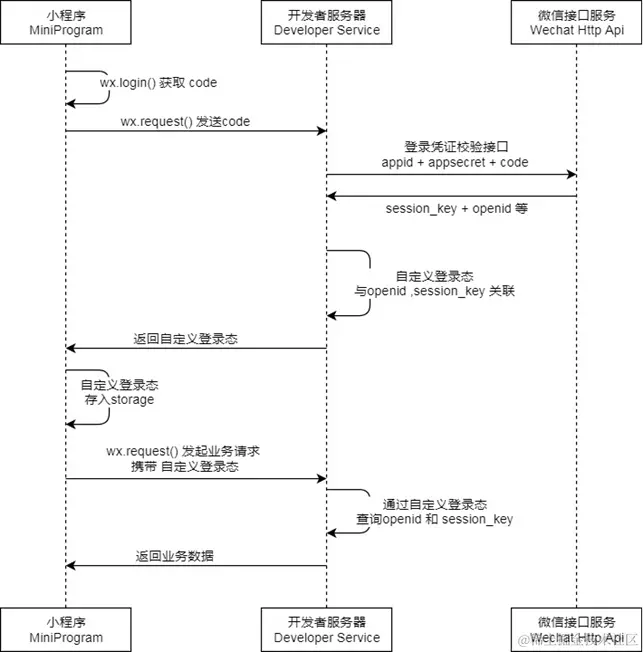

# [1. 小程序架构](https://juejin.cn/post/6976805521407868958)

## 前言

微信小程序的整体架构图：


## 发展由来

张小龙于**2017年01月09日**在微信公开课上宣布微信小程序正式上线。小程序英文名为 `Mini Program`，是一种不需要下载安装即可使用的应用，它实现了应用“触手可及”的梦想，用户扫一扫或搜一下即可打开应用。

小程序上线以来，一直被称为便携版的 APP，关于两者之间的区别，无外乎是小程序相对轻便、开发成本低、开发周期短、收效快。

小程序并非凭空冒出来的一个概念，当微信中的 `WebView` 逐渐成为移动 `Web` 的一个重要入口时，微信就有相关的 `JS API` 了。

> `WebView` 是移动端（手机、IPad）提供的运行 `JavaScript` 的环境，是系统渲染 Web 网页的一个控件，可与页面 `JavaScript` 交互，实现 APP 与 Web 的混合开发，`WebView` 渲染 Web 页面需要强大的渲染内核支持，这其中 Android 与 IOS 系统的内核又有所不一样。

根据了解，小程序诞生的背景主要推动力是由于**移动网页在微信内传播体验不良**，**能力不强**，当然我觉得这其中也有原生 APP 缺点原因的推动，比如每次都要从 `App Store` 或者其他应用市场下载，即使下载了，也占据系统很大的空间，如果不经常用，被用户删掉的可能性也非常大。

我们先抛开原生APP的问题不谈，对于**移动网页在微信内传播体验不良**，**能力不强**的问题，即使后来微信团队推出了 [JS-SDK](https://link.juejin.cn?target=https%3A%2F%2Fdevelopers.weixin.qq.com%2Fdoc%2Foffiaccount%2FOA_Web_Apps%2FJS-SDK.html) 来解决移动网页能力不足的问题，但 `JS-SDK` 的模式并没有解决使用移动网页遇到的体验不良的问题，这其中的原因大概能概括为这三个点：白屏问题、页面切换的生硬和点击的迟滞感。

为了解决这些问题，微信团队面临的问题是如何设计一个比较好的系统，使得所有开发者在微信中都能获得比较好的体验。这个问题是之前的 `JS-SDK` 所处理不了的，需要一个全新的系统来完成，它需要使得所有的开发者都能做到：

- 快速的加载。
- 更强大的能力。
- 原生的体验。
- 易用且安全的微信数据开放。
- 高效和简单的开发。

这就是小程序的由来。[文档](https://link.juejin.cn?target=https%3A%2F%2Fdevelopers.weixin.qq.com%2Fminiprogram%2Fdev%2Fframework%2Fquickstart%2F%23%E5%B0%8F%E7%A8%8B%E5%BA%8F%E6%8A%80%E6%9C%AF%E5%8F%91%E5%B1%95%E5%8F%B2)

## 宿主环境

我们称微信客户端给小程序所提供的环境为宿主环境。小程序借助宿主环境提供的能力，可以完成许多普通网页无法完成的功能

## 执行环境

小程序的主要开发语言是 `Javascript`，它与传统网页开发具有相似性但还是有一定区别：

- 网页开发，**渲染线程**和**脚本**是互斥的，这也是为什么长时间的脚本运行可能会导致页面失去响应的原因，本质就是我们常说的 `JS` 是单线程的。
- 小程序，**视图层**和**逻辑层**是分开的，**双线程同时运行**，视图层的界面使用 `WebView` 进行渲染，逻辑层运行在 `JSCore` 中。
- 网页开发，主要面对各厂商的浏览器，在移动端还需要面对 `Safari`、`Chrome` 以及 `iOS`、`Android` 系统中的各式 `WebView`。
- 小程序，主要面对两大操作系统IOS和Android的微信客户端，还有开发工具、PC端（window）、Mac。开发时候需要注意的是微信客户端的版本号和小程序API 支持的基础库版本号。

微信小程序运行在多种平台上：iOS（iPhone/iPad）微信客户端、Android 微信客户端、PC 微信客户端、Mac 微信客户端和用于调试的微信开发者工具。

各平台脚本执行环境以及用于渲染非原生组件的环境是各不相同的，具体区别如下：

| 运行环境       | 逻辑层     | 渲染层                          |
| -------------- | ---------- | ------------------------------- |
| Android        | V8         | 自研Xweb引擎，基于Mobile Chrome |
| IOS            | JSCore     | WKWebView                       |
| 开发工具       | NW.js      | Chromium Webview                |
| PC端（window） | Chrome内核 | Chrome内核                      |
| Mac            | JSCore     | WKWebView                       |

## 小程序的通信模型


这两个线程的通信会经由微信客户端（下文中也会采用Native来代指微信客户端）做中转，逻辑层发送网络请求也经由Native转发

## 小程序整体架构

整个小程序系统构架分成两个部分：`视图层(WebView)` 和 `逻辑层(App Service)`，这两个部分分别由两个独立线程管理。

- **视图层**：也称为**渲染层**，渲染层用来渲染页面结构，主要由 `WebView` 进行渲染，一个小程序可以存在多个界面，==所以渲染层可能存在多个 `WebView` 线程？？？==
- 逻辑层：逻辑层采用 `JSCore` 线程运行 `JS` 脚本。逻辑层主要用来逻辑处理、数据请求、接口调用等。

视图层和逻辑层之间的沟通则需要借助 `系统层(WeixinJsBridage)` 进行通信，逻辑层把数据变化通知到视图层，触发视图层页面更新，视图层把触发的事件通知到逻辑层进行业务逻辑处理。

> 页面渲染大致过程为：我们把项目进行编译会把 `WXML` 转化成对应的 `JS` 对象（`Virtual DOM`），在逻辑层发生数据变化的时候，我们会通过 `setData()` 方法把数据从逻辑层传递到视图层，视图层在接收到数据后，会内部进行差异对比，把差异应用在原来的 `Dom` 树上，再正确的渲染出 `UI` 界面，完成页面的渲染过程。


上面的分析还提及到了一个 `系统层(WeixinJsBridage)`，一般简称为 `JSBridge`，它起到了一个中间桥梁的作用，非常重要。它不仅让视图层与逻辑层两个单独线程能进行通信，而且也架起上层开发与系统底层功能（`Native`）的桥梁，使得小程序可以通过调用 `API` 使用原生功能，且部分组件用原生组件实现，从而有良好体验。

逻辑层还有一个重要的操作，发送网络请求，它也是经由 `系统层` 转发的。

## 运行机制

小程序启动运行两种情况：

- 冷启动（重新开始）：用户首次打开或者小程序被微信主动销毁后再次打开的情况，此时小程序需要重新加载启动，即为冷启动。
- 热启动：用户已经打开过小程序，然后在一定时间内再次打开该小程序，此时无需重新启动，只需要将后台态的小程序切换到前台，这个过程就是热启动。

> 注意：
>  1.小程序没有重启的概念。
>  2.当小程序进入后台，客户端会维持一段时间的运行状态，超过一定时间后会被微信主动销毁。
>  3.短时间内收到系统两次以上内存警告，也会对小程序进行销毁，这也就为什么一旦页面内存溢出，页面会奔溃的本质原因了

## 更新机制

小程序 `冷启动` 时如果发现有新版本，将会异步下载新版本的包，并同时会先用客户端本地的旧包进行启动，等下次冷启动才会应用上。如果需要马上应用最新版本，可以用 `wx.getUpdateManager` API 进行处理。

```js
const updateManager = wx.getUpdateManager()

updateManager.onCheckForUpdate(function (res) {
  // 请求完新版本信息的回调
  console.log(res.hasUpdate)
})

updateManager.onUpdateReady(function () {
  wx.showModal({
    title: '更新提示',
    content: '新版本已经准备好，是否重启应用？',
    success(res) {
      if (res.confirm) {
        // 新的版本已经下载好，调用 applyUpdate 应用新版本并重启
        updateManager.applyUpdate()
      }
    }
  })
})

updateManager.onUpdateFailed(function () {
  // 新版本下载失败
})
```

## 数据通信机制

前面我们讲过小程序是基于双线程的，那就意味着任何在视图层和逻辑层之间的数据传递都是线程间的通信，也就是会有一定的延时。这不像传统Web一样，当页面要更新时调用相关API就能同步渲染出来，**在小程序架构里面，这一切成了异步操作**。

异步会使得各部分的运行时序变得复杂一些。比如在渲染首屏的时候，逻辑层与渲染层会同时开始初始化工作，但是渲染层需要有逻辑层的数据才能把界面渲染出来，如果渲染层初始化工作较快完成，就要等逻辑层的指令才能进行下一步工作。因此逻辑层与渲染层需要有一定的机制保证时序正确，在每个小程序页面的生命周期中，存在着若干次页面数据通信

|  | 1. onLoad：页面创建时执行<br />2. onShow：页面出现在前台时执行<br />3. onReady：页面首次渲染完毕时执行<br />4. onHide：页面从前台变为后台时执行<br />5. onUnload：页面销毁时执行 |
| -------------------------------------------------- | ------------------------------------------------------------ |

知道视图层与逻辑层的具体通信过程后，我们也稍微了解一下视图层和逻辑层的数据传输大致是如何的，我们知道这两者通信是借助了系统层的作用，而实际上是通过两边提供的 `evaluateJavascript` 所实现的。即用户传输的数据，需要将其转换为字符串形式传递，同时把转换后的数据内容拼接成一份 `JS` 脚本，再通过执行 `JS` 脚本的形式传递到两边独立环境。

> 关于`evaluateJavascript`：
>  `Native` 调用 `JS`， 一般就是直接 `JS` 代码字符串，有点类似我们调用 `JS` 中的 `eval` 去执行一串代码。它一般有 `loadUrl`、`evaluateJavascript` 等几种方法。
>  这里就不做过多的介绍了，你只要记住，它是用来调用执行 `JS` 字符串，是一种 `Native` 用来识别 `JS` 代码的方式的就行啦。

## 登录机制



图中过程主要是为了获得微信用户的唯一 `openid` 与 `session_key`，之后开发者服务器可以根据用户标识来生成自定义登录态，用于后续业务逻辑中前后端交互时识别用户身份。

1. 调用 [wx.login()](https://link.juejin.cn?target=https%3A%2F%2Fdevelopers.weixin.qq.com%2Fminiprogram%2Fdev%2Fapi%2Fopen-api%2Flogin%2Fwx.login.html) 获取临时登录凭证 `code`，并回传到开发者服务器。
2. 调用 [auth.code2Session](https://link.juejin.cn?target=https%3A%2F%2Fdevelopers.weixin.qq.com%2Fminiprogram%2Fdev%2Fapi-backend%2Fopen-api%2Flogin%2Fauth.code2Session.html) 接口，换取用户唯一标识 `openid` 、用户在微信开放平台帐号下的唯一标识 `UnionID`（若当前小程序已绑定到微信开放平台帐号）和会话密钥 `session_key`。

### UnionID 机制说明

`UnionID` 是微信不久前新增加的一个性质，其获取方式和 `openid` 差不多，作用也差不多，都是指用户唯一标识，但它的范围广一点。

> 官方解释：如果开发者拥有多个移动应用、网站应用、和公众帐号（包括小程序），可通过 UnionID 来区分用户的唯一性，因为只要是同一个微信开放平台帐号下的移动应用、网站应用和公众帐号（包括小程序），用户的 UnionID 是唯一的。换句话说，同一用户，对同一个微信开放平台下的不同应用，UnionID是相同的。

不懂？说白了，就是把小程序绑定 [微信开放平台帐号](https://link.juejin.cn?target=https%3A%2F%2Fopen.weixin.qq.com%2F) 后，可与该帐号下绑定的的其他移动应用、网站应用及公众号打通。例如：同个用户在PC端的扫描登录、微信公众号开发的页面授权登录、微信小程序授权登录，这些场景中都能识别出是同一个用户，获取到的 `UnionID` 相同的。 [传送门](https://link.juejin.cn?target=https%3A%2F%2Fdevelopers.weixin.qq.com%2Fminiprogram%2Fintroduction%2F%23%E5%B0%8F%E7%A8%8B%E5%BA%8F%E7%BB%91%E5%AE%9A%E5%BE%AE%E4%BF%A1%E5%BC%80%E6%94%BE%E5%B9%B3%E5%8F%B0%E5%B8%90%E5%8F%B7)

## 性能问题

通过学习了小程序的架构原理，我们再来用底层架构的眼光来简单分析一下常见的小程序性能问题是如何产生的。

### 频繁调用setData()

频繁调用 `setData()`，这个问题相信已经是很常见的，比如在定时器中调用、在监听页面滚动的钩子中调用，这些场景很容易就会引起小程序的性能问题，容易出现页面卡顿、页面数据更新不及时的情况。

前面在 `数据通信机制` 中我们讲过小程序是基于双线程的，那就意味着任何在视图层和逻辑层之间的数据传递都是线程间的通信，频繁的去调用 `setData()`，会使得线程之间一直处于忙碌状态，逻辑层通知到视图层耗时就会上升，视图层收到消息的时候可能已经距离发出的时间超过一定时间了，渲染页面就不够及时了。

### 庞大的数据量去调用setData()

还是在前面的 `数据通信机制` 中，我们说过传输的数据需要转换成转换为字符串的形式传递，且通过 `JS` 脚本的形式去执行，当数据量大时，执行脚本的编译执行时间也会上涨，占用线程。

### 页面复杂繁多的DOM结构

当一个页面 `DOM` 结构复杂并且非常多的时候，这必定带来页面显示不及时，页面卡顿，甚至可能会出现页面奔溃的情况，这其中的原因可想而知，是过于 `DOM` 绘制、计算都是需要时间的，这将使得线程过渡的工作，带来客户端内存占用上升，从而触发系统回收小程序页面。

## JSCore

上面我提到说，对 “逻辑层运行在 `JSCore` 中” 这句话有点疑问，是因为我在看到表格中列举的逻辑层运行的环境应该是按系统环境区分的才对，那这句话是不是就太笼统了？还是说这句话就是指 `IOS` 的情况呢？因为是官方文档写的话语，所以我没有直接就否决是写错了，或者单指`IOS` 的情况。


经过一翻查证，证实其实这句话是没有问题的，要追寻结果的过程，我们需要写了解一下浏览器的大致情况：

浏览器中最核心的部分则是浏览器内核，每个浏览器都有其各自的内核，而对移动领域影响最深的则当属 `WebKit`。

`WebKit` 就是一个页面渲染以及逻辑处理引擎，`HTML/CSS/JavaScript` 经过它的处理，成为可见且可操作的Web页面。

`WebKit` 由多个重要模块组成，整体结构如下图：


`WebKit` 由四个部分组成，分别是：

- `WebKit Embedding API`：负责浏览器 UI 与 WebKit 进行交互的部分。
- `Platform API（WebKit Ports）`：让 `Webkit` 更加方便的移植到各个操作系统、平台上，提供的一些调用Native Library的接口。
- `WebCore`：整个 `WebKit` 中最核心的渲染引擎。
- `JavascriptCore`：`JSCore` 是 `WebKit` 默认内嵌的JS引擎，由苹果使用 `C` 开发。

我们来重点来关注 `JSCore` 部分，`JSCore` 是 `WebKit` 默认内嵌的JS引擎，之所以说是默认内嵌，是因为很多基于 `WebKit` 分支开发的浏览器引擎都开发了自家的JS引擎，其中最出名的就是 `Chrome的V8` 引擎。

`V8` 引擎，相信前端的小伙伴应该不会很陌生了，既然它是基于 `WebKit` 的，那底层默认也是内嵌 `JSCore` 的，而 `Android` 的逻辑层是运行在 `V8` 上的。

而 `IOS` 的浏览器引擎则是 `WebKit`，内部则就是 `JSCore`。

最后 `开发工具` 的逻辑层是运行在 `NW.js`, 上它的[官网](https://link.juejin.cn?target=https%3A%2F%2Fnwjs.readthedocs.io%2Fen%2Flatest%2F)，看到怎么一段话：


我相信它应该也和 `WebKit` 扯上关系了。

到此这个问题就有了一定认识了，小编就没有继续深入下去了，终结吧。(-^〇^-)

# [2. 小程序开发指南](https://developers.weixin.qq.com/miniprogram/dev/framework/quickstart/release.html#%E5%8F%91%E5%B8%83%E4%B8%8A%E7%BA%BF)

