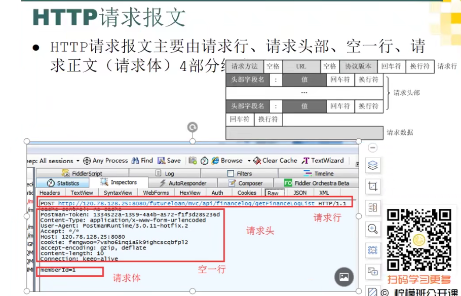

https://www.bilibili.com/video/BV1c4411c7zH?from=search&seid=10869355342277996879&spm_id_from=333.337.0.0

# 一 开始

# 二 BS架构简介和请求过程理解

# 三 Fiddler原理

# 四 http协议概述

# 五 http协议请求报文详解

**请求报文：**

- 请求行
  - 请求方法
  - 统一资源定位符
    -  
  - http协议及版本号
- 请求头部
  - 
- 空一行
- 请求体（get请求没有请求体）

**响应报文：**

1. 响应状态行
2. 响应的头部信息
3. 空一行
4. 响应体

# 六 HTTP协议响应报文详解

**响应报文：**

- 响应状态行
  - http协议及版本号
  - 状态码
    - 
- 响应的头部信息
  - 
- 空一行
- 响应体

# 七 Fiddler安装

# 八 Fiddler菜单栏

# 九 Fiddler工具栏——重放请求和移除请求

# 十 Fiddler工具栏2

