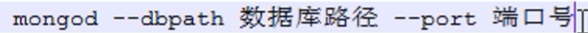
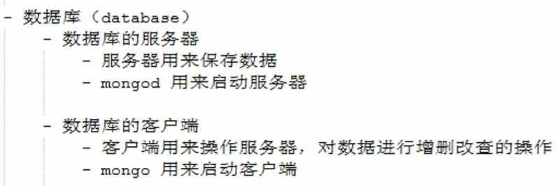
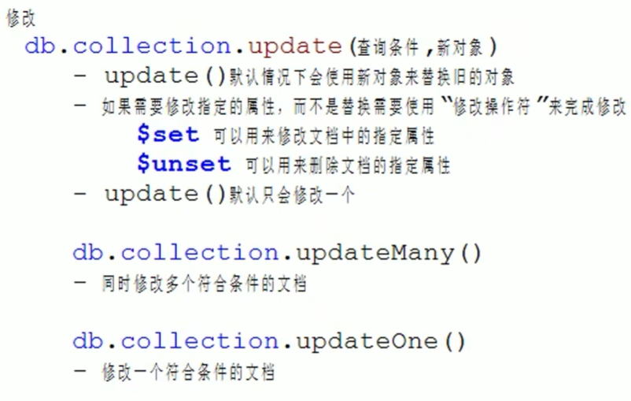
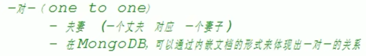
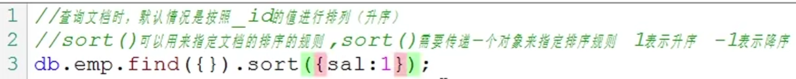
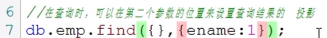
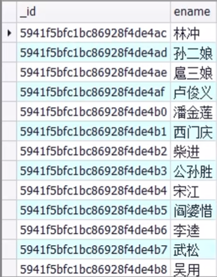

https://www.bilibili.com/video/BV1bJ411x7mq/?spm_id_from=333.337.search-card.all.click&vd_source=a7089a0e007e4167b4a61ef53acc6f7e


# [1 数据库简介](https://www.bilibili.com/video/BV18s411E78K/?spm_id_from=333.337.search-card.all.click&vd_source=a7089a0e007e4167b4a61ef53acc6f7e)

- 关系型数据库(RDBMS)
  - MySQL，Oracle，DB2，SQL Server
  - 里面全是表
- 非关系型数据库(No SQL)
  - MongoDB，Redis
  - 文档数据库MongoDB


- SQL：结构化查询语言

# [2 mongodb简介](https://www.bilibili.com/video/BV18s411E78K/?p=2&spm_id_from=pageDriver&vd_source=a7089a0e007e4167b4a61ef53acc6f7e)


```
// 启动数据库
mongod // 这条命令好像不是必须的
mongo
show dbs
```


# 3 将mongodb设置为系统服务

27017端口







11min处

# 4. mongodb的基本操作


[MongoDB中文手册|官方文档中文版](https://docs.mongoing.com/)


# 5. 安装图形化工具

# [6. 插入文档](https://www.bilibili.com/video/BV18s411E78K?p=6&vd_source=a7089a0e007e4167b4a61ef53acc6f7e)

https://docs.mongoing.com/mongodb-crud-operations/insert-documents/insert-methods

# [7. 查询文档](https://www.bilibili.com/video/BV18s411E78K?p=7&spm_id_from=pageDriver&vd_source=a7089a0e007e4167b4a61ef53acc6f7e)

https://docs.mongoing.com/mongodb-crud-operations/query-documents

# [8. 修改文档](https://www.bilibili.com/video/BV18s411E78K?p=8&spm_id_from=pageDriver&vd_source=a7089a0e007e4167b4a61ef53acc6f7e)

https://docs.mongoing.com/mongodb-crud-operations/update-documents



# [9. 删除文档](https://www.bilibili.com/video/BV18s411E78K?p=9&vd_source=a7089a0e007e4167b4a61ef53acc6f7e)

https://docs.mongoing.com/mongodb-crud-operations/delete-documents


# [10. 练习一](https://www.bilibili.com/video/BV18s411E78K?p=10&spm_id_from=pageDriver&vd_source=a7089a0e007e4167b4a61ef53acc6f7e)

# [11. 练习二](https://www.bilibili.com/video/BV18s411E78K?p=11&vd_source=a7089a0e007e4167b4a61ef53acc6f7e)

看到4min处

# [12. 文档间的关系](https://www.bilibili.com/video/BV18s411E78K?p=12&spm_id_from=pageDriver&vd_source=a7089a0e007e4167b4a61ef53acc6f7e)

|  |      |
| ------------------------------------------------------------ | ---- |

# [14. sort和投影](https://www.bilibili.com/video/BV18s411E78K?p=14&spm_id_from=pageDriver&vd_source=a7089a0e007e4167b4a61ef53acc6f7e)








# 为什么文档编辑系统一般采用mongodb作为数据库

文档编辑系统通常采用 MongoDB 作为数据库，主要是由于 MongoDB 的几个特性非常适合文档型数据和复杂的数据结构。以下是一些关键原因：

### 1. **文档模型适应性**
- **灵活的数据结构**：MongoDB 使用 BSON（Binary JSON）格式存储数据，允许文档具有不同的结构和字段。这使得它非常适合处理不规则的数据或需要频繁变更的数据结构，例如文档编辑系统中的不同文档类型和内容。

### 2. **动态模式**
- **无模式设计**：MongoDB 不需要事先定义模式（schema），允许在运行时动态地添加或修改文档字段。这对于文档编辑系统很重要，因为文档的内容和结构可能随着需求的变化而变化。

### 3. **高性能和可扩展性**
- **水平扩展**：MongoDB 支持水平扩展（sharding），使得在处理大量数据和高并发请求时能够实现良好的性能和可扩展性。这对于大规模的文档编辑和存储需求非常有用。

### 4. **丰富的查询功能**
- **强大的查询和索引**：MongoDB 提供了丰富的查询语言和索引选项，使得能够高效地查询和检索文档。它支持复杂的查询操作，包括嵌套文档和数组的查询，适合处理复杂的文档内容。

### 5. **内置的副本集和高可用性**
- **数据冗余和恢复**：MongoDB 支持副本集（Replica Sets），提供数据的冗余备份和自动故障转移。这确保了文档编辑系统的数据的高可用性和可靠性。

### 6. **支持大文档**
- **大文档存储**：MongoDB 支持存储大文档，并且对大文档有很好的性能优化。这对于文档编辑系统中可能存在的大型文档（如富文本、图像等）非常重要。

### 7. **方便的数据处理和分析**
- **聚合框架**：MongoDB 的聚合框架允许对数据进行复杂的数据处理和分析操作。这对于需要分析和生成文档内容统计信息的系统特别有用。

### 总结

MongoDB 的灵活性、动态模式、强大的查询功能和高性能特性使其成为文档编辑系统的一个理想选择。它能够有效地管理和存储文档数据，并且适应快速变化的需求。

# Mongodb中的Binary.createFromBase64()

在 MongoDB 中，`Binary.createFromBase64` 用于从 Base64 编码的字符串创建一个 `Binary` 对象。`Binary` 是 MongoDB 的一种数据类型，专门用于存储二进制数据，例如文件内容、图片或其他非文本数据

### 详细解释

1. **Base64 编码**：
   Base64 编码是一种将二进制数据转换成文本格式的方式，以便于在文本环境中传输或存储。Base64 编码后的字符串可以包含字母、数字和某些特殊字符，适合于网络传输和存储。

2. **MongoDB 的 Binary 数据类型**：
   MongoDB 的 `Binary` 数据类型用于存储二进制数据。它在 `Buffer` 和 `Binary` 对象的帮助下处理二进制数据。

3. **`Binary.createFromBase64` 方法**：
   在 MongoDB 的某些驱动程序中（如 Node.js 的 MongoDB 驱动），`Binary.createFromBase64` 是一种方法，用于将 Base64 编码的字符串转换为 `Binary` 类型。这个方法创建一个包含原始二进制数据的 `Binary` 对象。

### 示例代码

假设你正在使用 Node.js 的 MongoDB 驱动，可以使用 `Binary.createFromBase64` 来处理 Base64 编码的二进制数据。以下是一个示例代码，展示如何将 Base64 字符串转换为 MongoDB 的 `Binary` 对象：

```javascript
const { Binary } = require('mongodb');

// Base64 编码字符串
const base64String = 'UEsDBAoAAAAAAIdO4kAAAAAAAAAAAAAAAAAJAAAAZG9jUHJvcHMvUEsDBBQAAAAIAIdO4kDxkgKDZgEAAHgCAAAQAAAAZG9jUHJv…';

// 从 Base64 字符串创建 Binary 对象
const binaryData = Binary.createFromBase64(base64String, 0);

// 打印 Binary 对象
console.log(binaryData);
```

### 解释

- **`base64String`**：这是一个 Base64 编码的字符串，代表某种二进制数据的编码形式。
- **`Binary.createFromBase64`**：将 Base64 编码的字符串解码为 `Binary` 对象。第二个参数 `0` 通常是偏移量或额外的选项，但具体含义可能取决于库的实现。
- **`binaryData`**：这是一个 `Binary` 对象，包含了从 Base64 编码字符串解码后的二进制数据。

### 结论

`Binary.createFromBase64` 在 MongoDB 驱动中用于将 Base64 编码的字符串转换为 `Binary` 数据类型。这样可以将文本格式的二进制数据恢复为其原始的二进制形式，以便在 MongoDB 中进行存储或处理。


