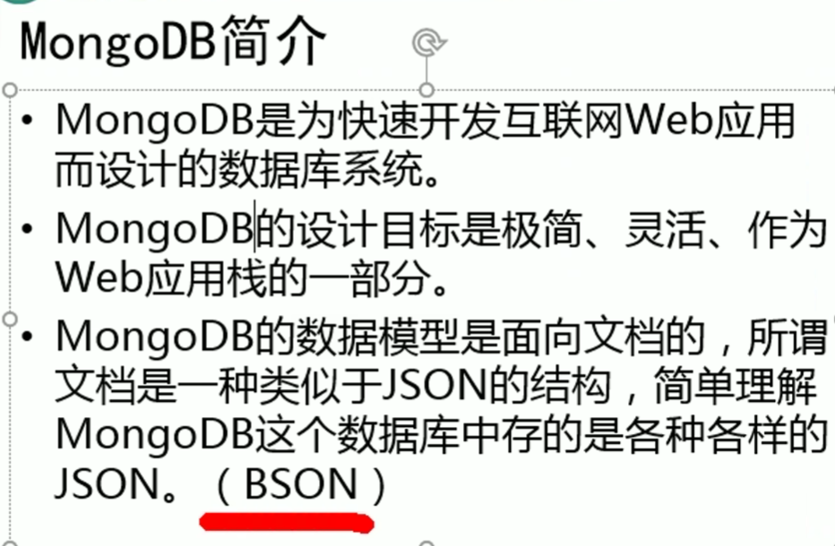

https://www.bilibili.com/video/BV1bJ411x7mq/?spm_id_from=333.337.search-card.all.click&vd_source=a7089a0e007e4167b4a61ef53acc6f7e

https://www.bilibili.com/video/BV18s411E78K/?spm_id_from=333.337.search-card.all.click&vd_source=a7089a0e007e4167b4a61ef53acc6f7e

# 1 数据库简介

- 关系型数据库(RDBMS)
  - MySQL，Oracle，DB2，SQL Server
  - 里面全是表
- 非关系型数据库(No SQL)
  - MongoDB，Redis
  - 文档数据库MongoDB


- SQL：结构化查询语言

# [2 mongodb简介](https://www.bilibili.com/video/BV18s411E78K/?p=2&spm_id_from=pageDriver&vd_source=a7089a0e007e4167b4a61ef53acc6f7e)



```
// 启动数据库
mongod // 这条命令好像不是必须的
mongo
show dbs
```


# 3 将mongodb设置为系统服务


