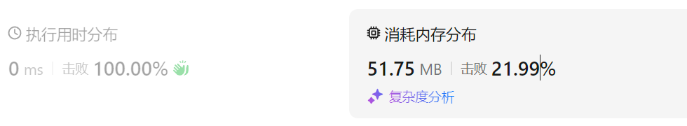
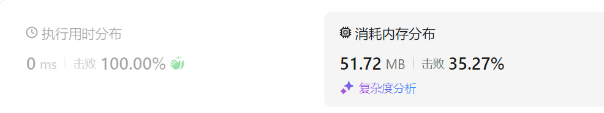
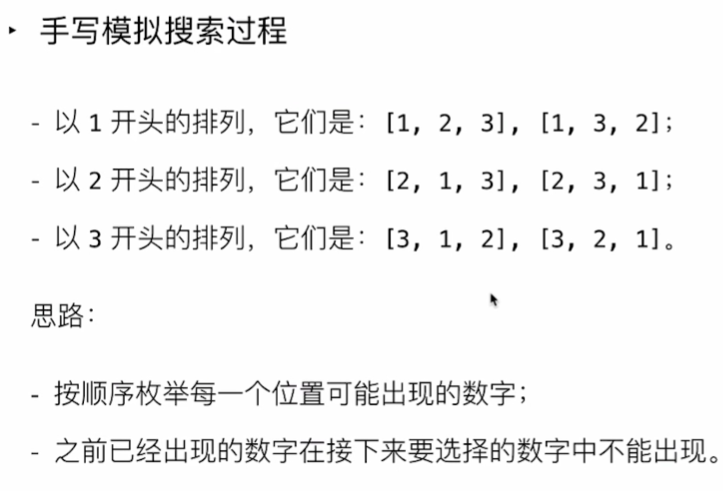
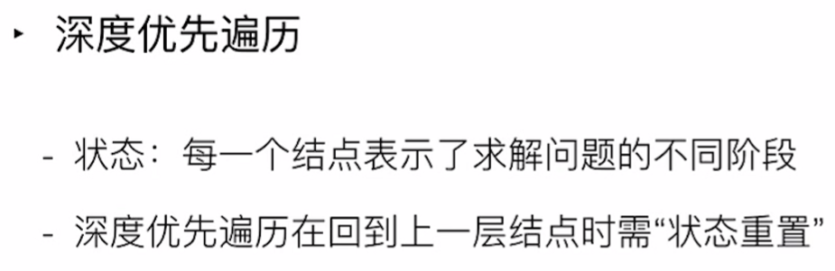

#  1. 求一个数组最大值

## 方法一 使用Math.max()

```javascript
const array1 = [1, 3, 2];
console.log(Math.max(...array1));
// ...表示啥？———— 扩展运算符 spread operator
```

当数组有太多的元素，展开语法...会返回失败或者错误的结果，因为它们试图将数组元素作为函数形参传递。参见[使用 apply 和内置函数](https://developer.mozilla.org/zh-CN/docs/Web/JavaScript/Reference/Global_Objects/Function/apply#使用_apply_和内置函数)了解更多细节。reduce解决方案不存在这个问题

## 方法二 使用arr.reduce()

```javascript
const arr = [1, 2, 3];
const max = arr.reduce((a, b) => Math.max(a, b), -Infinity);
console.log(`max:${max}`)
```

## 方法三 使用apply(thisArg, argsArray)

```javascript
const arr2 = [1, 2, 3, 9, 1];
// apply(thisArg, argsArray)
const max2 = Math.max.apply(null, arr2)
console.log(`max2:${max2}`)
```

一般而言，`fn.apply(null, args)` 等同于使用参数展开语法的 `fn(...args)`，只是在前者的情况下，`args` 期望是类数组对象，而在后者的情况下，`args` 期望是[可迭代对象](https://developer.mozilla.org/zh-CN/docs/Web/JavaScript/Reference/Iteration_protocols#可迭代协议)。


为什么`fn.apply(null, args)` 等同于使用参数展开语法的 `fn(...args)`？

> `fn.apply(null, args)` 和 `fn(...args)` 都是用于将数组中的元素作为单独的参数传递给函数的两种不同的语法。
>
> 1. **`apply` 方法**： `apply` 是 JavaScript 函数对象的一个方法，它调用一个函数，并且：
>
>    - 第一个参数是函数调用时的 `this` 值（在你的例子中是 `null`）。
>    - 第二个参数是一个数组或类数组对象，这个数组中的每个元素将作为独立的参数传递给函数。
>
>    ```javascript
>    function sum(a, b, c) {
>      return a + b + c;
>    }
>    const args = [1, 2, 3];
>    console.log(sum.apply(null, args)); // 输出：6
>    ```
>
> 2. **参数展开语法（Spread Syntax）**： 扩展运算符 `...` 可以将数组或对象展开。在函数调用中，它可以将数组中的每个元素作为独立的参数传递给函数。
>
>    ```javascript
>    function sum(a, b, c) {
>      return a + b + c;
>    }
>                         
>    const args = [1, 2, 3];
>    console.log(sum(...args)); // 输出：6
>    ```
>
> 这两种方式在效果上是等价的，因为它们都将数组中的每个元素作为独立的参数传递给函数。不过，参数展开语法更简洁，也更符合现代JavaScript的编程风格。
>
> ### 区别
>
> - `apply` 是一种较老的方式，在ES6之前已经存在。
> - 参数展开语法 `...` 是ES6引入的新特性，更加简洁和直观

# [2. 数组原地删除定制值](https://leetcode.cn/problems/remove-element/description/)

给你一个数组 `nums` 和一个值 `val`，你需要 **[原地](https://baike.baidu.com/item/原地算法)** 移除所有数值等于 `val` 的元素。元素的顺序可能发生改变。然后返回 `nums` 中与 `val` 不同的元素的数量。

假设 `nums` 中不等于 `val` 的元素数量为 `k`，要通过此题，您需要执行以下操作：

- 更改 `nums` 数组，使 `nums` 的前 `k` 个元素包含不等于 `val` 的元素。`nums` 的其余元素和 `nums` 的大小并不重要。

- 返回 `k`。

- **示例 1：**

  ```
  输入：nums = [3,2,2,3], val = 3
  输出：2, nums = [2,2,_,_]
  解释：你的函数函数应该返回 k = 2, 并且 nums 中的前两个元素均为 2。
  你在返回的 k 个元素之外留下了什么并不重要（因此它们并不计入评测）。
  ```

  **示例 2：**

  ```
  输入：nums = [0,1,2,2,3,0,4,2], val = 2
  输出：5, nums = [0,1,4,0,3,_,_,_]
  解释：你的函数应该返回 k = 5，并且 nums 中的前五个元素为 0,0,1,3,4。
  注意这五个元素可以任意顺序返回。
  你在返回的 k 个元素之外留下了什么并不重要（因此它们并不计入评测）。
  ```

## 方法一

```javascript
/**
 * @param {number[]} nums
 * @param {number} val
 * @return {number}
 */
var removeElement = function(nums, val) {
    let left = 0;
    let length = nums.length;
    while(left < length) {
        if (nums[left] === val) {
            nums.splice(left, 1);
            length--;
        } else {
            left++;
        }
    }
    console.log('nums:', nums)
    return length;
};
```

## 进阶方法一

```js
var removeElement = function(nums, val) {
    let ans = 0;
    for(const num of nums) {
        if(num != val) {
            nums[ans] = num;
            ans++;
        }
    }
    console.log('nums:', nums)
    return ans;
};
```

# [3. 判断一个数组是否是递增或递减](https://leetcode.cn/problems/monotonic-array/description/)


# 4. 有序数组合并

# 5. 打乱一个数组

# 6. 数组去重

# 7. 把a-bc-def格式的字符串转成驼峰

# 8. 判断回文串

# 9. 驼峰命名转下划线命名

# 10. 快速排序

# 11. Github

https://github.com/ConardLi/awesome-coding-js

# [12. 旋转数组的二分查找](https://leetcode.cn/problems/search-in-rotated-sorted-array/description/)

## 解法一：不使用二分查找

```js
function search(nums: number[], target: number): number {
    return nums.indexOf(target)
};
```

`indexOf`的工作原理：`indexOf`方法会从数组的第一个元素开始，逐个开始比较元素的值，直到找到`target`，或者遍历完整个数组

因此，在最坏情况下，`indexOf`可能需要检查数组中的所有元素，尤其是当`target`不在数组中，或者是数组中的最后一个元素时

时间复杂度：由于`indexOf`可能要遍历所有元素，因此该方法的时间复杂度为O(N)，其中N是数组nums的长度

## 解法二： 使用二分查找

```js
function search(nums: number[], target: number): number {
    let targetIndex = -1;
    let left = 0;
    let right = nums.length - 1;
    while(left <= right){
        let mid = Math.floor((left+right) / 2);
        if(nums[mid] === target){
            targetIndex = mid;
            break;
        }
        // 一定有一边是有序的
        if (nums[mid] >= nums[left]) {
            // 左边是有序的
            if (target >= nums[left] && target < nums[mid]) {
                // 在有序的左边
                right = mid - 1;
            } else {
                // 在无序的右边
                left = mid + 1;
            }
        } else if (nums[right] > nums[mid]) {
            // 右边是有序的
            if (target > nums[mid] && target <= nums[right]) {
                // 在有序的右边
                left = mid + 1;
            } else {
                right = mid;
            }
        }
    }
    return targetIndex;
};
```


进一步简化版：

- 不使用 `targetIndex` 变量

```js
function search(nums: number[], target: number): number {
    let left = 0;
    let right = nums.length - 1;
    while(left <= right){
        let mid = Math.floor((left+right) / 2);
        if(nums[mid] === target){
            return mid;
        }
        // 一定有一边是有序的
        if (nums[mid] >= nums[left]) {
            // 左边是有序的
            if (target >= nums[left] && target < nums[mid]) {
                // 在有序的左边
                right = mid - 1;
            } else {
                // 在无序的右边
                left = mid + 1;
            }
        } else if (nums[right] > nums[mid]) {
            // 右边是有序的
            if (target > nums[mid] && target <= nums[right]) {
                // 在有序的右边
                left = mid + 1;
            } else {
                right = mid
            }
        }
    }
    return -1;
};
```





# 13. O(N)和O(logN)

在算法的时间复杂度分析中，\( O(N) \) 和 \( O(log N) \) 是两种不同的增长率，用来衡量算法的效率和在不同规模输入下的表现。它们的区别在于算法随着输入规模 \( N \) 增长的速度。

### \( O(N) \) — 线性时间复杂度

- **定义**：如果算法的时间复杂度是 \( O(N) \)，意味着算法的运行时间**和输入规模成正比**。也就是说，当输入 \( N \) 增大时，执行时间会以同样的比例增大。
- **例子**：遍历一个数组时，每一个元素都需要被访问一次，因此执行时间会随着数组长度 \( N \) 增加而增加。
- **典型场景**：线性查找、简单遍历或统计数组中元素个数等操作

### \( O(\log N) \) — 对数时间复杂度

- **定义**：如果算法的时间复杂度是 \( O(log N) \)，意味着算法的运行时间**随着输入规模的对数增长**。当 \( N \) 增大时，执行时间增加的速度显著减缓。
- **例子**：二分查找算法，在一个有序数组中查找某个元素时，每次都将搜索空间减半。
- **典型场景**：分治法（如二分查找）、树形结构中查找（如平衡二叉树）等操作。

### 总结

- **\( O(N) \)**：适合线性结构中需要遍历所有元素的情况。
- **\( O(log N) \)**：适合有序数据或需要逐步缩小搜索范围的情况。

在相同规模的输入下，\( O(\log N) \) 的算法通常比 \( O(N) \) 的算法更快，因为 \( log N \) 增长速度比 \( N \) 慢得多。

# [14. 全排列](https://leetcode.cn/problems/permutations/description/)

给定一个不含重复数字的数组 `nums` ，返回其 *所有可能的全排列* 。你可以 **按任意顺序** 返回答案。

**示例 1：**

```
输入：nums = [1,2,3]
输出：[[1,2,3],[1,3,2],[2,1,3],[2,3,1],[3,1,2],[3,2,1]]
```

**示例 2：**

```
输入：nums = [0,1]
输出：[[0,1],[1,0]]
```

**示例 3：**

```
输入：nums = [1]
输出：[[1]]
```

**提示：**

- `1 <= nums.length <= 6`
- `-10 <= nums[i] <= 10`
- `nums` 中的所有整数 **互不相同**

https://www.bilibili.com/video/BV1oa4y1v7Kz/?spm_id_from=333.337.search-card.all.click&vd_source=a7089a0e007e4167b4a61ef53acc6f7e

|  |  |
| ------------------------------------------------------------ | ------------------------------------------------------------ |
|  |  |

树形问题上的深度优先遍历就是大名鼎鼎的回溯算法

## 解法一：迭代法（非递归）

```js
function permute(nums: number[]): number[][] {
    const result = [[]];
    for (const num of nums) {
        const newPermutations = [];
        for(const perm of result) {
            console.log('perm:', perm)
            for (let j = 0; j <= perm.length; j++) {
                console.log('test:', ...perm.slice(0, j))
                // array.slice(start, end)
                // start：提取的起始索引（包含该索引的元素）
                // end：提取的结束索引（不包含该索引的元素）
                newPermutations.push([...perm.slice(0, j), num, ...perm.slice(j)])
            }
        }
        // array.splice(start, deleteCount, item1, item2, ...)
        result.splice(0, result.length, ...newPermutations)
    }
    return result;
};
```


## 解法二：回溯法

回溯是一种深度优先搜索的方法，通过尝试每种可能的选择来构建解，并在需要时撤回（回溯）

```js
/**
 * @param {number[]} nums
 * @return {number[][]}
 */
var permute = function(nums) {
    const result = [];

    function backtrack(currentPermutation) {
        // 如果当前排列的长度等于输入数组的长度，说明找到一个全排列
        if (currentPermutation.length === nums.length) {
            result.push([...currentPermutation]); // 将当前排列添加到结果中
            return;
        }

        for (let num of nums) {
            // 如果当前数字已经在排列中，跳过
            if (currentPermutation.includes(num)) {
                continue;
            }
            // 选择当前数字
            currentPermutation.push(num);
            // 递归生成下一个数字
            backtrack(currentPermutation);
            // 撤销选择
            currentPermutation.pop();
        }
    }

    backtrack([]);
    return result;
};
```


以下是与全排列相关的 LeetCode 中文网站链接：

1. **[46. 全排列](https://leetcode.cn/problems/permutations/)**
   - **描述**：给定一个没有重复数字的数组 `nums`，返回其所有可能的排列。
   - **示例**：
     - 输入：`nums = [1, 2, 3]`
     - 输出：`[[1, 2, 3], [1, 3, 2], [2, 1, 3], [2, 3, 1], [3, 1, 2], [3, 2, 1]]`

2. **[47. 全排列 II](https://leetcode.cn/problems/permutations-ii/)**
   - **描述**：给定一个可能包含重复数字的数组 `nums`，返回其所有不同的排列。
   - **示例**：
     - 输入：`nums = [1, 1, 2]`
     - 输出：`[[1, 1, 2], [1, 2, 1], [2, 1, 1]]`

3. **[784. 字母大小写全排列](https://leetcode.cn/problems/letter-case-permutation/)**
   - **描述**：给定一个字符串，返回其所有可能的大小写排列。
   - **示例**：
     - 输入：`S = "a1b2"`
     - 输出：`["a1b2", "a1B2", "A1b2", "A1B2"]`

4. **[60. 排列序列](https://leetcode.cn/problems/permutation-sequence/)**
   - **描述**：给定 `n` 和 `k`，返回第 `k` 个排列。
   - **示例**：
     - 输入：`n = 3, k = 3`
     - 输出：`"213"`

5. **[31. 下一个排列](https://leetcode.cn/problems/next-permutation/)**
   - **描述**：实现获取下一个字典序排列的算法。
   - **示例**：
     - 输入：`nums = [1, 2, 3]`
     - 输出：`[1, 3, 2]`

你可以通过这些链接访问对应的 LeetCode 中文页面，查看题目的详细描述和讨论。

# 15. 括号相关算法

实现一个`getIncludeStrings` 函数，函数的作用是输出字符串中所有被"()"包裹的字符串

```js
function getIncludeStrings(string) {}
console.log(getIncludeStrings('(a+b)*c+(c*(d-e)+f)')) // 输出 ['a+b', 'd-e', 'c*(d-e)+f']
```

用左右指针不太可行
