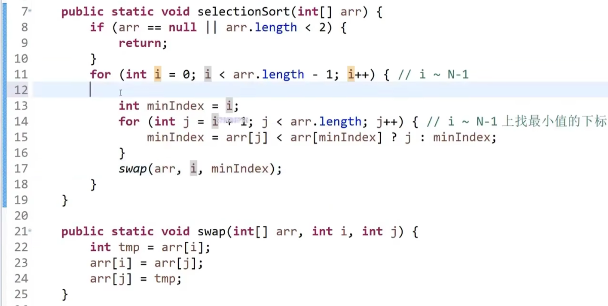
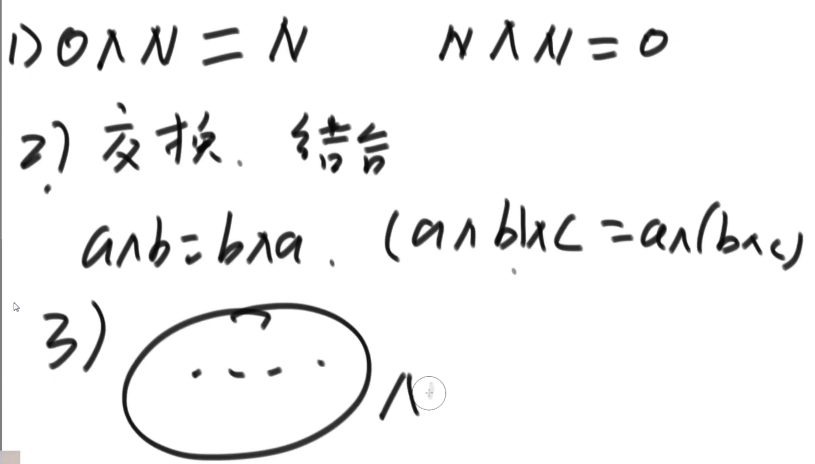
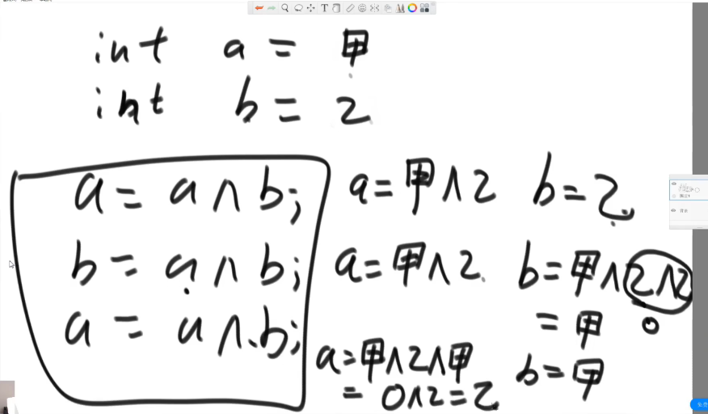
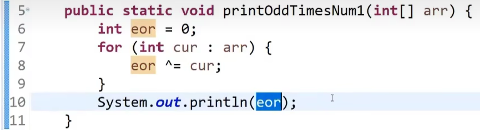
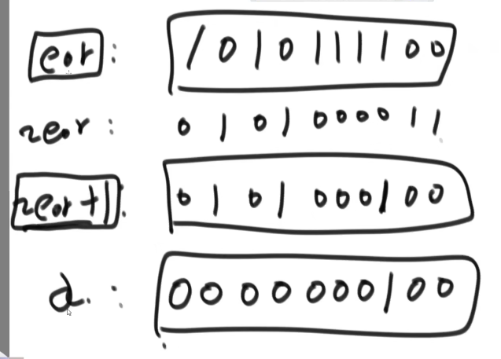
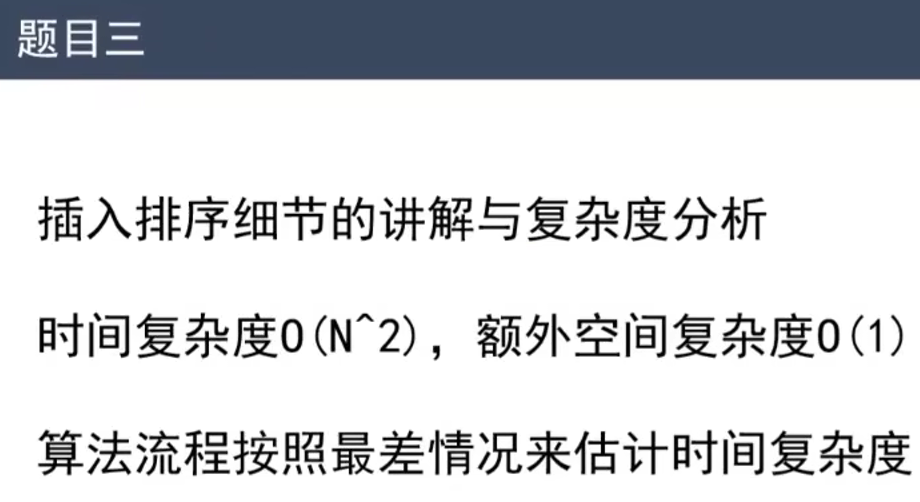
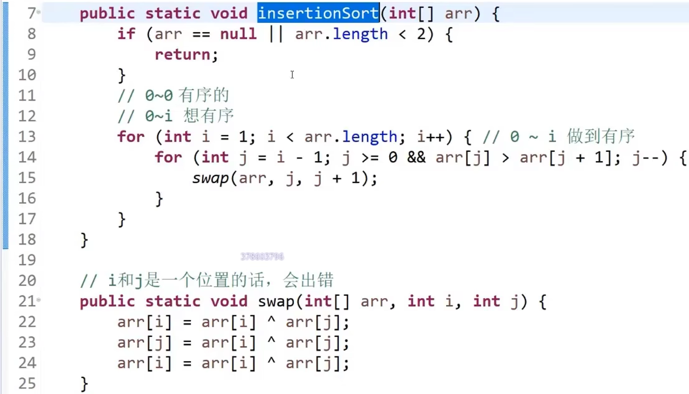
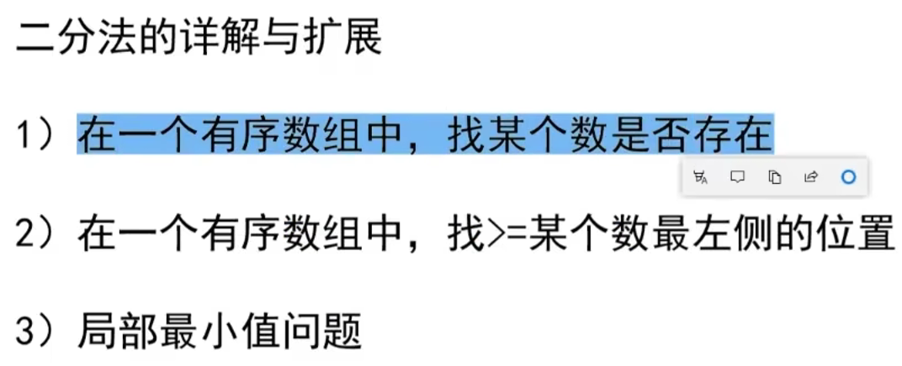
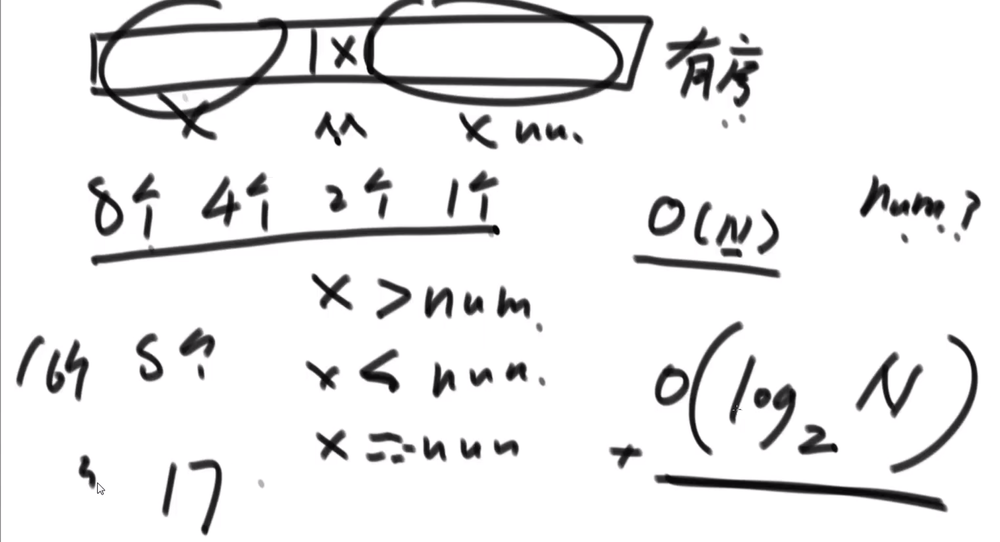
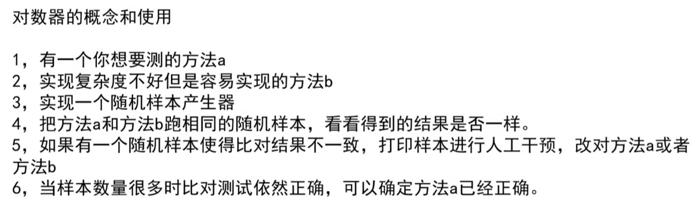

https://www.bilibili.com/video/BV13g41157hK/?spm_id_from=333.1007.top_right_bar_window_custom_collection.content.click&vd_source=a7089a0e007e4167b4a61ef53acc6f7e


https://www.bilibili.com/video/BV13g41157hK?p=3&vd_source=a7089a0e007e4167b4a61ef53acc6f7e

# 1. 选择排序

23min处

为啥叫选择排序？


在i~N-1位置上选最小值，并将其放到i位置上。

从前到后排好

选择最小值



# 2. 冒泡排序 O(n * n)

26min处

谁大谁往右移动

冒泡排序之所以叫冒泡排序，是因为在排序过程中，较大的元素会逐步“冒泡”到列表的顶端或尾端，就像水中的气泡一样上升。具体来说，冒泡排序的工作原理是重复地遍历待排序的列表，每次比较相邻的两个元素，并根据需要交换它们，使得较大的元素逐渐移动到列表的一端。这个过程持续进行，直到整个列表有序。由于这种“冒泡”的现象，这种排序算法被形象地称为“冒泡排序”。

**第一版代码**

```javascript
// 谁大谁往右交换
const arr = [3, 2, 5, 4, 3, 6]
for (let i = arr.length; i > 0; i--) {
    for (let j = 0; j < i; j++) {
        if (arr[j] > arr[j + 1]) {
            swap(j, j + 1);
        }
    }
}
```

**第二版代码：修改了i的初始值**

```js
for (let i = arr.length - 1; i > 0; i--) {
    for (let j = 0; j < i; j++) {
        if (arr[j] > arr[j + 1]) {
            swap(j, j + 1);
        }
    }
}

function swap(arr, i, j) {
    arr[i] = arr[i] ^ arr[j];
    arr[j] = arr[i] ^ arr[j];
    arr[i] = arr[i] ^ arr[j];
}
```

# 3. 异或运算

**异或运算：相同为0，不同为1**。还可以理解为**无进位相加**

异或运算的定义源于逻辑运算中的“互斥或”原则

互斥为1

                      


 **为什么异或运算满足交换律和结合律？**

交换ab值：

                      

# 4. 异或引申面试题

- 在一个数组中，只有一种数出现了奇数次，其他的所有数都出现了偶数次，怎么找到出现了奇数次的数。—— 数组中的每一个数互相异或



- 在一个数组中，有两种数出现了奇数次，其他的所有数都出现了偶数次，怎么找到这两种出现了奇数次的数


要求时间复杂度：O(n)，额外空间复杂度O(1)

                     

~：取反

# 5. 插入排序

1小时14min处





# 6. 二分法

1h32min处

|  |  |
| ------------------------------------------------------------ | ------------------------------------------------------------ |

# 7. 对数器

1h54min处



看到2小时01min处


​                 


