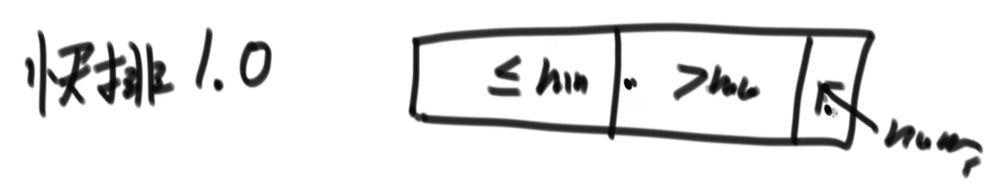

https://www.bilibili.com/video/BV13g41157hK?p=4&spm_id_from=pageDriver&vd_source=a7089a0e007e4167b4a61ef53acc6f7e

# 1. arr[L..R]范围上求最大值

可以数组从左往右遍历一遍，记录最大值就行了

为了讲递归，写一个递归版本的：

的排序.assets/image-20230903133800858-16937194822711.png)

### 取L R中点 

```java
int mid = (L + R) / 2; // 这样写其实是有问题的，如果数组长度比较大，L+R可能会溢出
int mid = (L + R) / 2 = L + (R - L) / 2
int mid = L + ((R - L) >> 1) // 右移一位，右移一位比除2要快
```


# 2. master公式

17min处


- T(N)：母问题的数据量是N级别的
- T(N/b)：子问题的规模是N/b
- a: 子问题的调用次数
- N^b：除去子问题调用之外剩下的过程

                  

# 3. 归并排序 O(N * logN)

 

**双指针**


P1：左侧部分的下标

P2：右侧部分的下标


# 4. 归并排序的扩展——小和问题

1h01min处


# 5. 归并排序的扩展——逆序对问题

1h28min处


# 6. 荷兰国旗问题

1h40min处


  

# 7. 快速排序 O(N*N)

2h02min处




# Master定理

https://blog.gocalf.com/algorithm-complexity-and-master-theorem

https://www.bilibili.com/video/BV1oq4y167oR/?spm_id_from=333.337.search-card.all.click&vd_source=a7089a0e007e4167b4a61ef53acc6f7e

用n表示问题的规模，T(n)表示某个给定算法的复杂度。

的排序.assets/image-20231224210203957.png)

的排序.assets/image-20231224205445342.png)

的排序.assets/image-20231224210217937.png)

的排序.assets/image-20231224210542541.png)

的排序.assets/image-20231224210937979.png)

的排序.assets/image-20231224211614637.png)


​	


