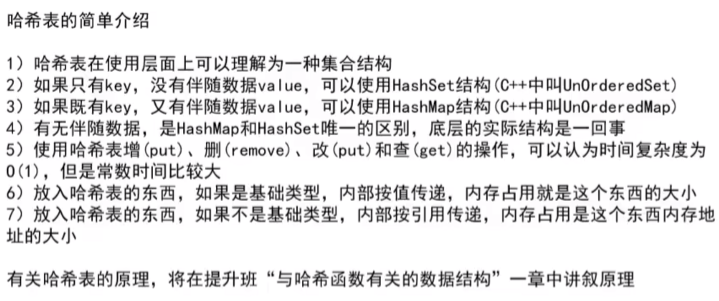
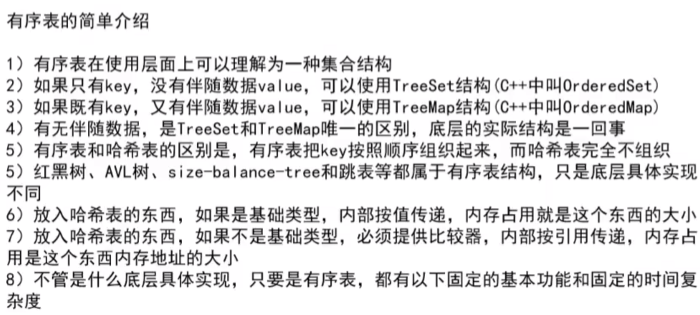
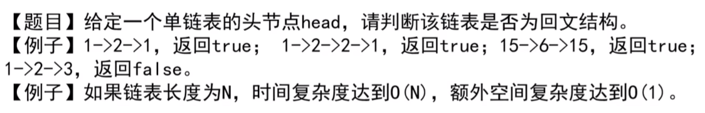
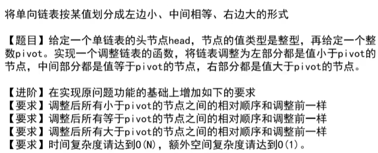
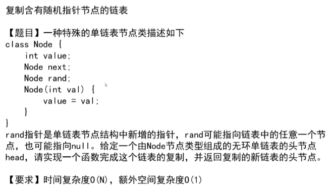
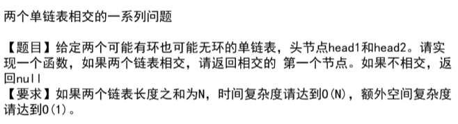

https://www.bilibili.com/video/BV13g41157hK?p=6&vd_source=a7089a0e007e4167b4a61ef53acc6f7e

41min处开始

# 1.哈希表的简单介绍

==**注意：Hash表在使用的时候认为时间复杂度都是常数级别**==

和数据量没关系，数据量再大，它也能做到常数时间返回值

但是是一个比较大的常数，比数组直接寻址要大得多

为什么？

# 2.有序表的简单介绍

时间复杂度：O(lgN)

# 3.单链表和双链表

# 4.反转单向和双向链表

https://leetcode.cn/problems/reverse-linked-list/

# 5.打印两个有序链表的公共部分

==思路：谁小谁移动，相等的时候打印，打印完成之后共同移动，有一个越界了就停止==

# 6.面试时链表解题的方法论

# 7.判断一个链表是否是回文结构

## 7.1 借助额外的空间

- 把链表遍历一遍，遍历的过程中申请一个容器——栈，按照链表顺序将其放到栈里面，栈弹出的顺序是原来链表中逆序的顺序
- 链表每遍历一个，栈里面就弹出一个，比对是否一样；如果这个过程中，每一步都一样，说明是回文结构

以上是笔试的做法，有没有再省一点空间的做法呢？

- 可以只把链表右边部分的东西放到栈里面

怎么只把链表右边部分放到栈里？（即怎么只把右边部分逆序？）（遍历到什么程度开始进入到右部分了呢？）

- 借助快慢指针

## 7.2 不借助额外的空间

1. 借助快慢指针，快指针结束的时候，慢指针来到中点的位置
2. 慢指针继续往下遍历的时候，逆序（3指向空，2指向3，1指向2）
3. 
4. 链表遍历完的时候，起始位置和结束位置分别用两个引用记住，然后A和B同时往中间走，每一步去比对
5. 
6. 返回true或者fals之前，将右边部分恢复成原来的样子

# 8.快慢指针

快指针一次走两步

慢指针一次走一步

快指针走完的时候，慢指针会来到中点的位置

这个时候就可以把慢指针后面的东西放到栈里面去了

链表比较短（长度为1，2，3之类的）的时候也要正确实现

# 9.将单向链表按某值划分成左边小，中间相等，右边大的形式

1h30min处

要实现：小于5的放左边，等于5的放中间，大于5的放右边

**需要六个变量**

要注意边界

# 10.复制含有随机指针节点的链表

1h42min处

方法一：借助map，这个的额外空间复杂度应该是O(N)

方法二：

- 生成clone节点

  

# 11.两个单链表相交的一系列问题

https://www.bilibili.com/video/BV13g41157hK/?p=7&spm_id_from=pageDriver&vd_source=a7089a0e007e4167b4a61ef53acc6f7e

- 怎么判断有没有环？有环和无环情况应该不太一样
- 

