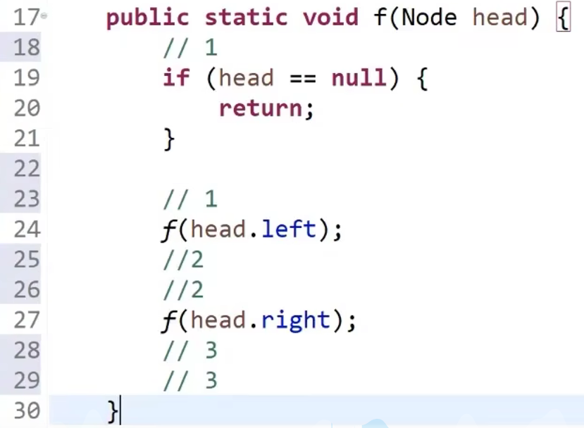
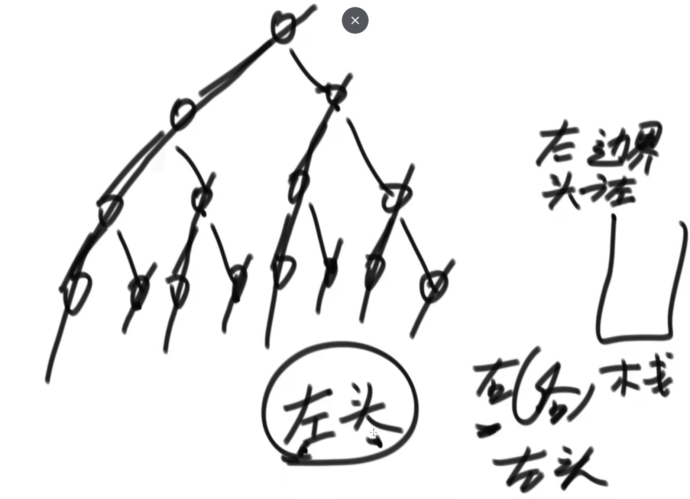
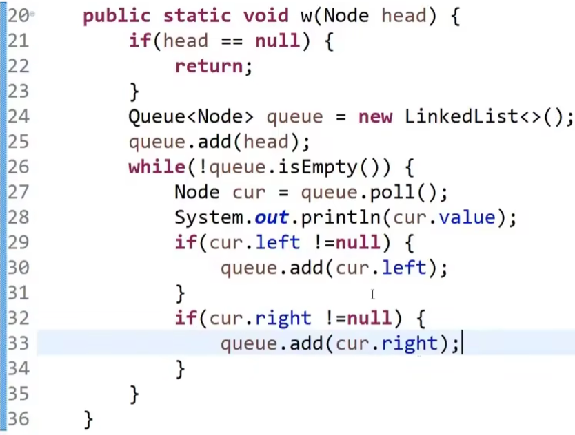
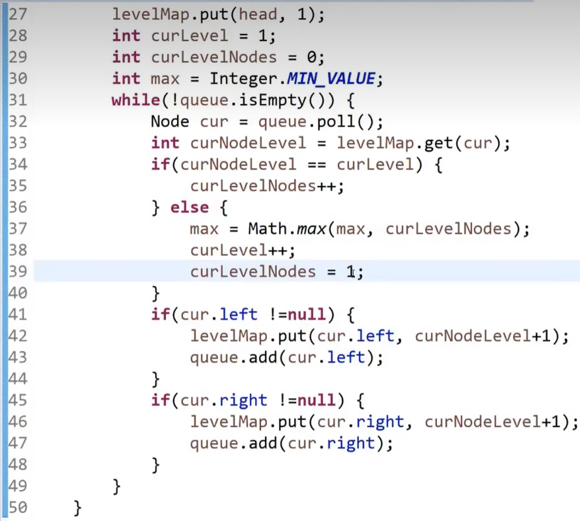

https://www.bilibili.com/video/BV13g41157hK?p=7&vd_source=a7089a0e007e4167b4a61ef53acc6f7e

# 1.先序 中序 后序遍历——递归

52min处

递归序：

- 1,2,4,4,4,2,5,5,5,2,1,3,6,6,6,3,7,7,7,3,1

- 先序遍历：头节点 左节点 右节点  1 2 4 5 3 6 7 在第一次打印value
- 中序遍历：左节点 中节点 右节点  4 2 5 1 6 3 7 在第二次打印value
- 后序遍历：左节点 右节点 中节点  4 5 2 6 7 3 1 在第三次打印value
- 

# 2.先序 中序 后序遍历——非递归

1h9min处

任何递归函数都可以改为非递归函数

递归函数是系统帮你压栈

非递归函数：自己压栈

## 2.1 先序

## 2.2 后序

## 2.3 中序

- 为什么这样处理就是中序了呢？
  - 因为所有的树都是可以被左边界分解掉的
  - 

# 3.二叉树的宽度优先遍历（即广度优先）

1h45min

二叉树的先序遍历是二叉树的深度优先遍历——为啥？？？？

宽度遍历用**队列**（先进先出）

- 先把头结点放队列里面去，每一次弹出就打印
- 先放左节点，再放右节点，周而复始

# 4.求一颗二叉树的宽度

maybe 1h50min处

[求二叉树的最大宽度](https://leetcode.cn/problems/maximum-width-of-binary-tree/)

使用hash表的方法：

不使用hash表的方法：

2小时10min处

# 5.判断一棵树是否是搜索二叉树

https://www.bilibili.com/video/BV13g41157hK/?p=8&spm_id_from=pageDriver&vd_source=a7089a0e007e4167b4a61ef53acc6f7e

搜索二叉树：每一颗子树它的左树都比它小，右树都比它大

**用中序遍历打印的话，一定是升序的**

## 5.1 方法1

## 5.2 方法2

## 5.3 方法3

## 5.4 方法4

# 6.判断一棵树是否是完全二叉树

20min处

**使用宽度优先遍历，用队列**

队列：先进先出

# 7.判断一棵树是否是满二叉树

34min处

## 7.1 方法1

先求二叉树的最大深度，再求二叉树的节点个数，节点个数和最大深度满足公式：

==怎么求二叉树的最大深度？==

# 8.判断一棵树是否是平衡二叉树

37min处

平衡二叉树：对于任何一个子树来说，左树的高度和右树的高度差都不超过1

 # 9.二叉树解题套路

# 10.动态规划

Dynamic programming

# 11.给定两个二叉树的节点node1和node2，找到他们的最低公共祖先节点

D和F的公共祖先是B

## 11.1 方法1

## 11.2 方法2（难）

1h33min

# 12.后继结点？

# 13.二叉树的序列化和反序列化

2h2min

反序列化：根据先序遍历的方式，先见头结点，再建左子树，最后建右子树

# 14.折纸问题

2h13min

二叉树中序遍历

头节点为凹折痕

每一颗左子树的头节点都为凹折痕

每一颗右子树的头节点都为凸折痕

