https://www.bilibili.com/video/BV13g41157hK/?p=10&spm_id_from=pageDriver&vd_source=a7089a0e007e4167b4a61ef53acc6f7e

# 1. 前缀树

最长公共前缀：https://leetcode.cn/problems/longest-common-prefix/?company_slug=bytedance

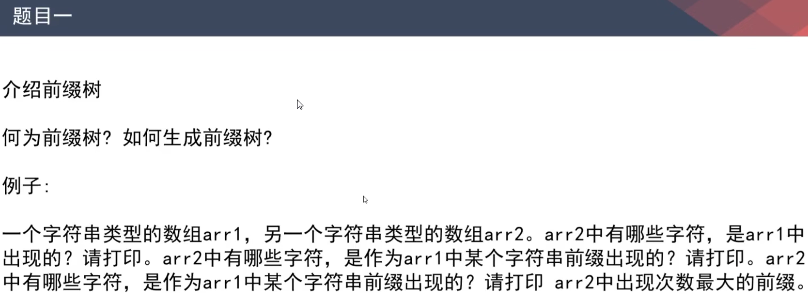

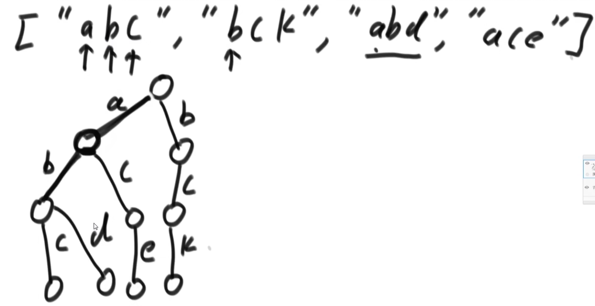

pass：在加前缀树的时候，这个节点到达过多少次？

end：这个节点是否是一个字符串的结尾节点，如果是，它是多少个字符串的结尾节点？

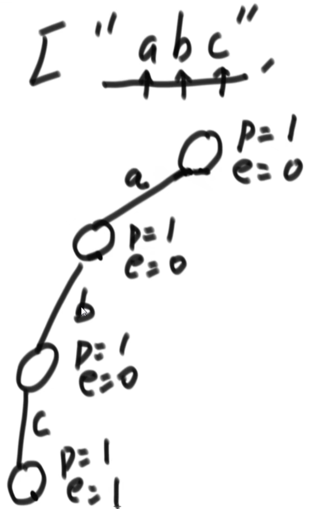                                                    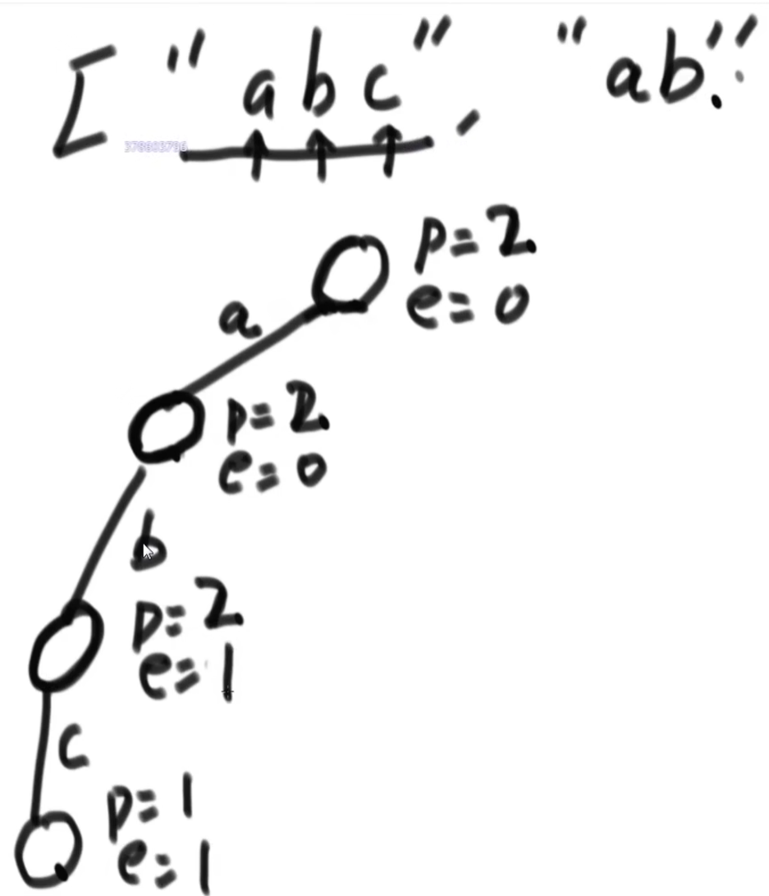                                    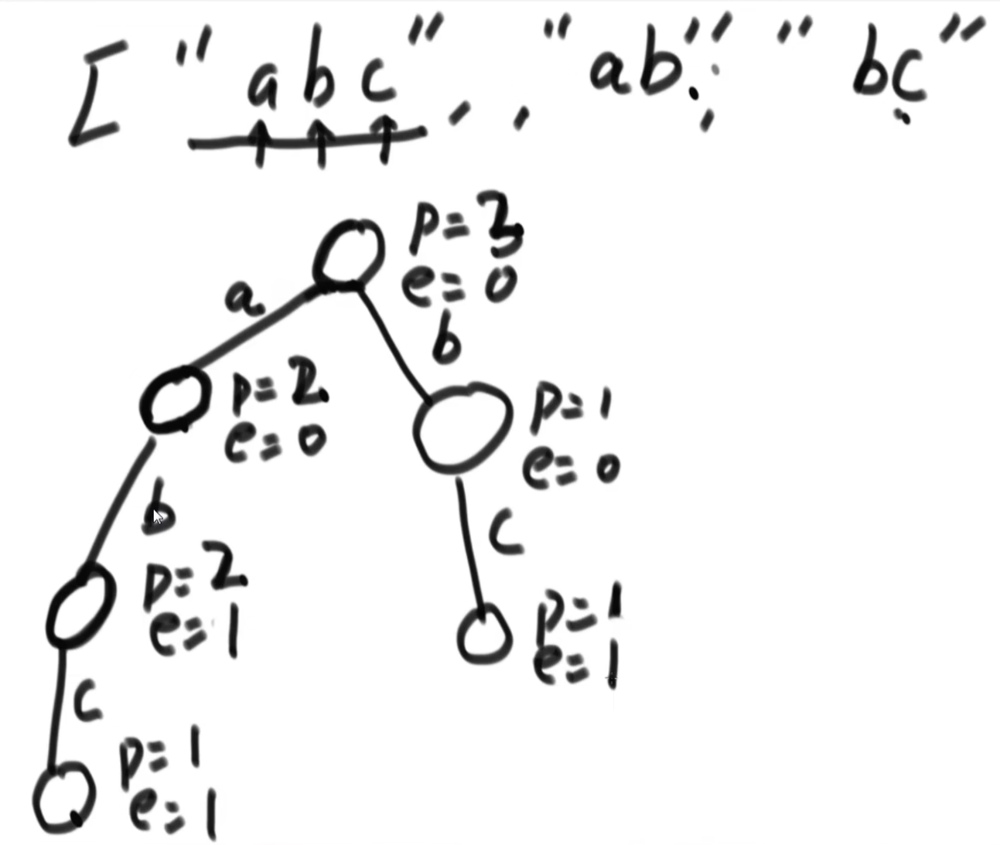   

​              

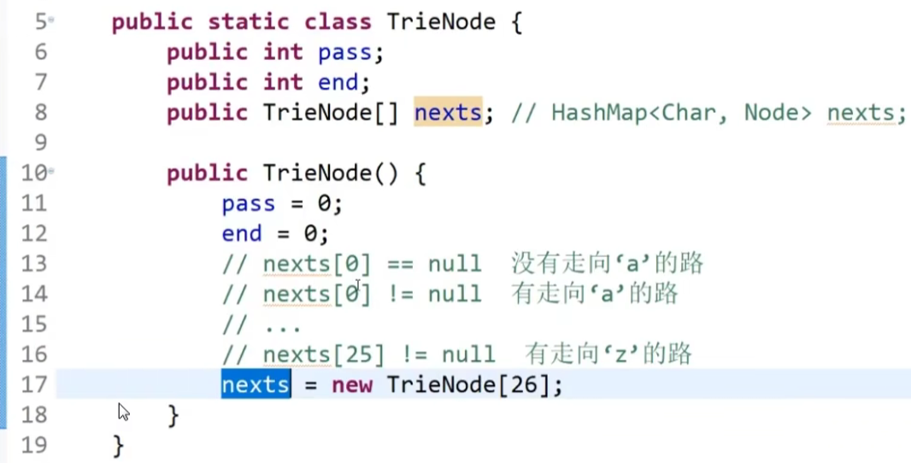                         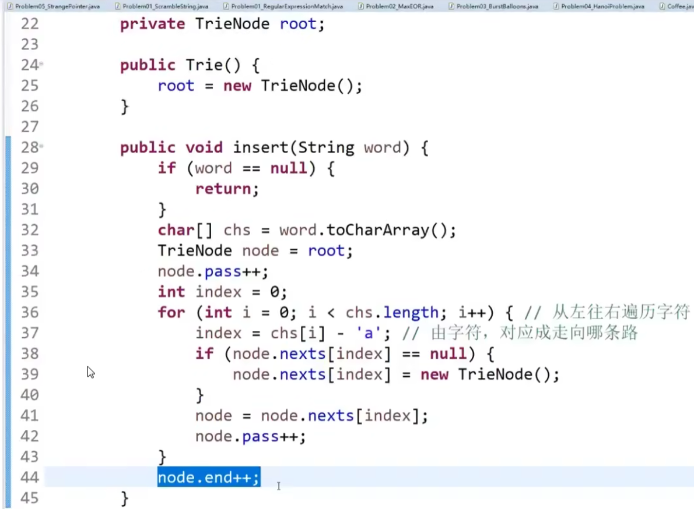

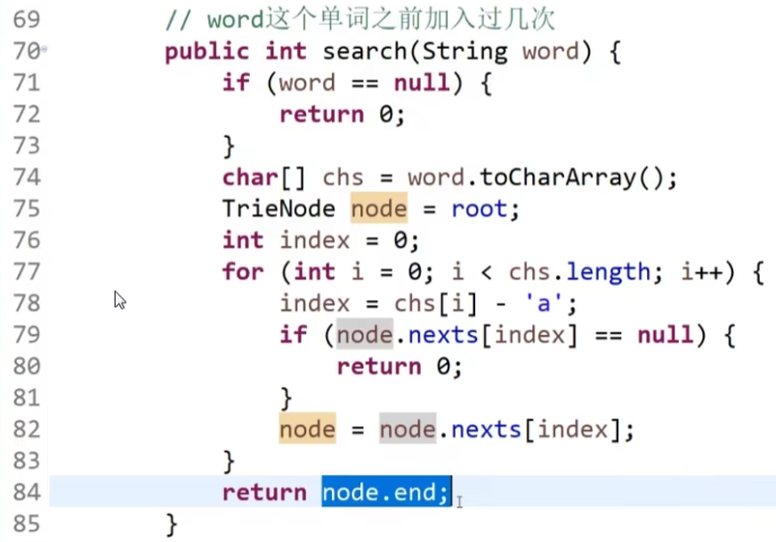                              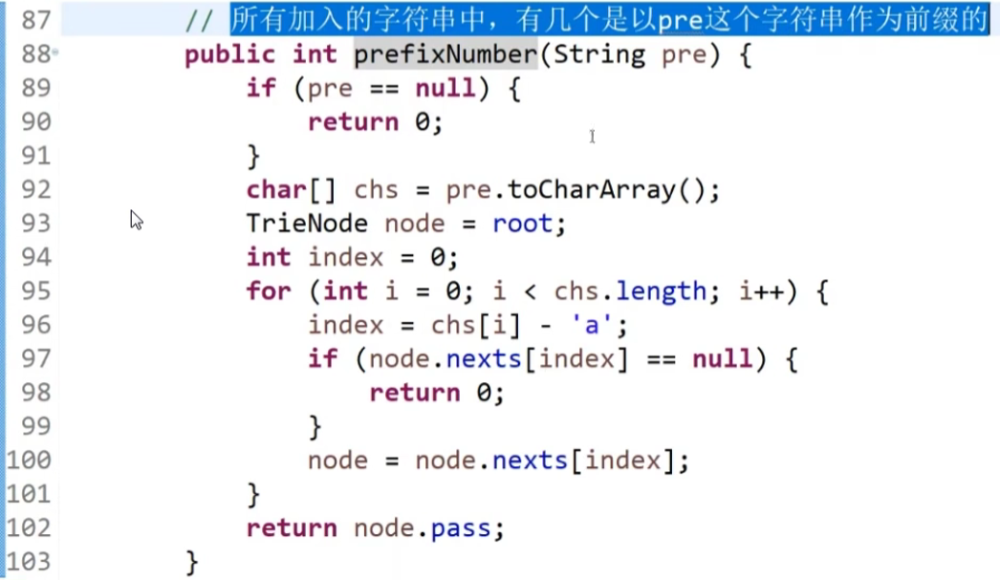

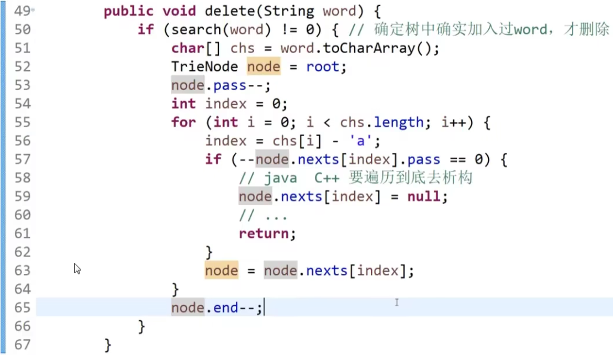

# 2. 贪心算法

58min处

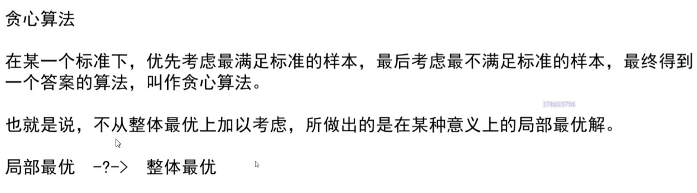

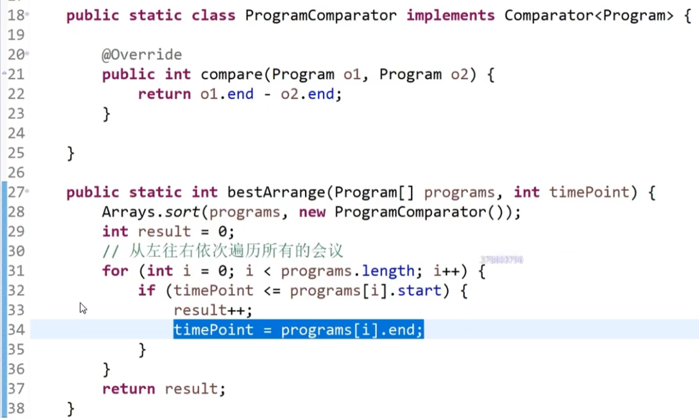

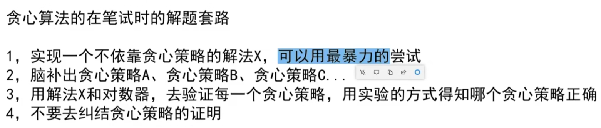

 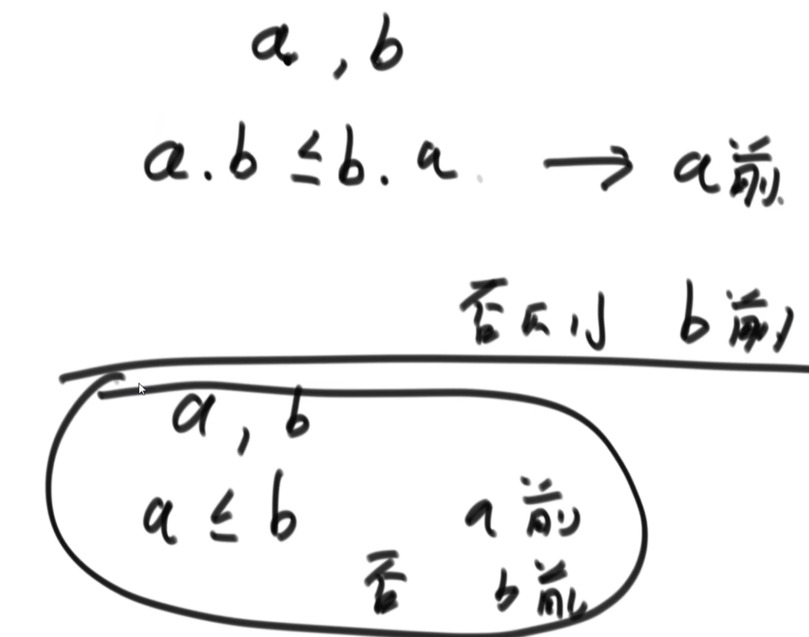

要证明我们的比较策略是一个有效的比较策略

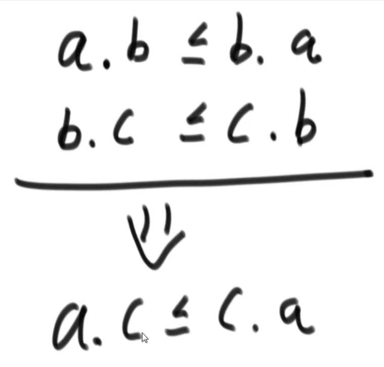

一个字符串可不可以认为是一个k进制的数？

1小时34min处

