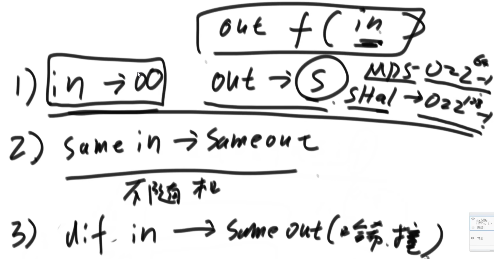
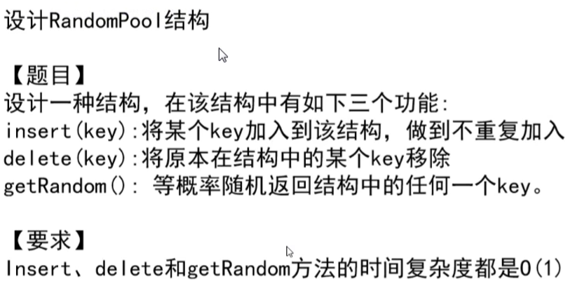
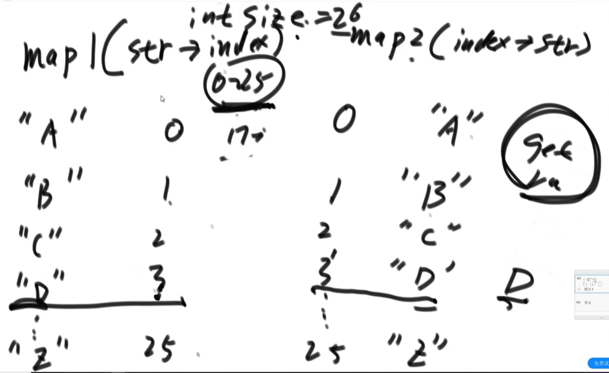
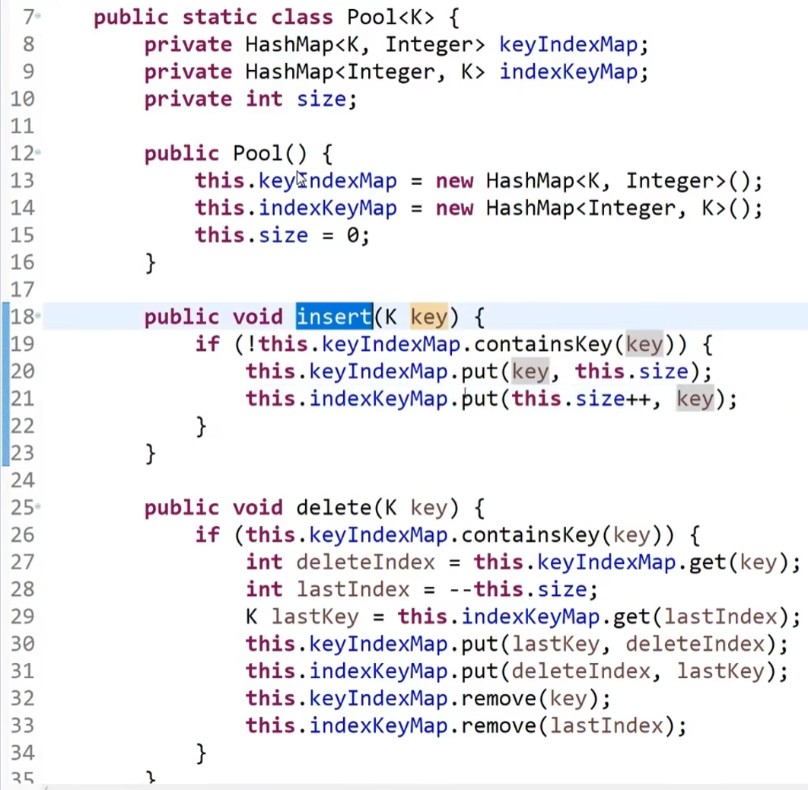
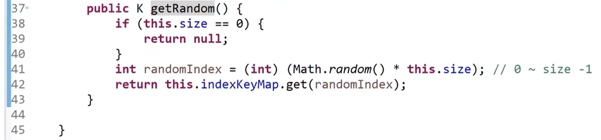
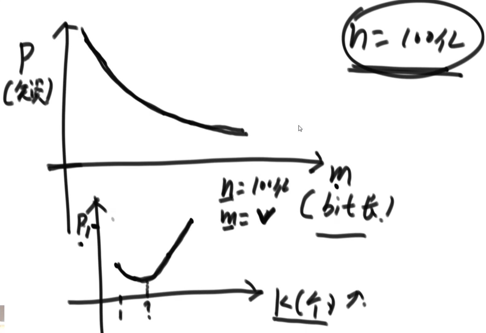
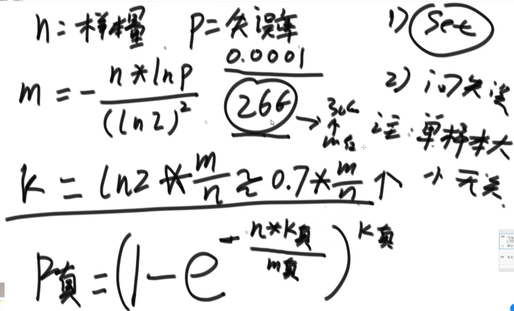

https://www.bilibili.com/video/BV13g41157hK?p=12

# 1.认识哈希函数和哈希表的实现

- **4）均匀性 && 离散性**

如果放1000个字符串，最多经历多少次扩容

2--》4--》8--》16--》。。。1000

如果链的长度不能超过2——logN

如果N个字符串都要加到hash表里面去，在这个过程中最多经历多少次扩容？

O(logN)

# 2. 设计RandomPool结构

54min处

delete这个方法如果用JS实现的话是不是不是这样写？

啊也是

put的话是在链表后面加

remove的话是删除了

# 3. 详解布隆过滤器

1小时07min处

一个字节（Byte）通常由8个二进制位（bit）组成。每个二进制位是一个0或1，表示计算机存储或处理数据的最小单位。换句话说，一个字节可以表示从0到255（即 \(2^8 - 1\)）的256种不同的状态。

在更大数据单位的换算中：
- 1 KB (Kilobyte) = 1024 Bytes
- 1 MB (Megabyte) = 1024 KB
- 1 GB (Gigabyte) = 1024 MB
- 1 TB (Terabyte) = 1024 GB

这些换算基于二进制计数法，常用于计算机和数字存储设备。

## 3.1 位图

布隆过滤器是一个大位图

## 3.2 布隆过滤器相关公式

布隆过滤器（Bloom Filter）是一种空间效率很高的概率数据结构，常用于集合成员查询，以快速判断一个元素是否在集合中。布隆过滤器有一定的误报率，即有可能错误地认为某个元素在集合中。以下是布隆过滤器相关的几个关键公式：

### 1. 位数组长度（m）
布隆过滤器的位数组长度 \(m\) 通常根据希望容纳的元素数量 \(n\) 和允许的误报率 \(P\) 来计算。其公式为：

\[ m = -\frac{n \cdot \ln P}{(\ln 2)^2} \]

### 2. 哈希函数数量（k）
所需的哈希函数数量 \(k\) 可以通过以下公式确定：

\[ k = \frac{m}{n} \cdot \ln 2 \]

### 3. 误报率（P）
布隆过滤器的误报率 \(P\) 可以通过以下公式计算：

\[ P = \left(1 - \left(1 - \frac{1}{m}\right)^{kn}\right)^k \]

在实际应用中，由于 \( m \) 通常较大且 \( kn \) 相对于 \( m \) 较小，可以近似为：

\[ P \approx \left(1 - e^{-\frac{kn}{m}}\right)^k \]

### 4. 近似公式
当 \( n \) 和 \( m \) 较大时，可以近似地使用以下公式：

\[ P \approx \left(1 - e^{-\frac{k \cdot n}{m}}\right)^k \]

### 5.示例

假设有以下参数：
- 想要存储的元素数量 \( n = 1000 \)
- 允许的误报率 \( P = 0.01 \) (1%)

#### 计算位数组长度 \( m \)：
\[ m = -\frac{1000 \cdot \ln 0.01}{(\ln 2)^2} \approx 9585 \]

#### 计算哈希函数数量 \( k \)：
\[ k = \frac{9585}{1000} \cdot \ln 2 \approx 7 \]

这些公式可以帮助设计和分析布隆过滤器的参数，使其在特定应用场景中表现最佳。

# 4. 详解一致性哈希原理

1小时58min处

一致性哈希——用来讨论 数据服务器怎么组织

问题一：数量很少的时候，怎么把环均分？

问题二：怎么做到负载均衡？

以上问题用**虚拟节点技术**解决

