https://www.bilibili.com/video/BV13g41157hK?p=13&vd_source=a7089a0e007e4167b4a61ef53acc6f7e

# 1. 岛问题

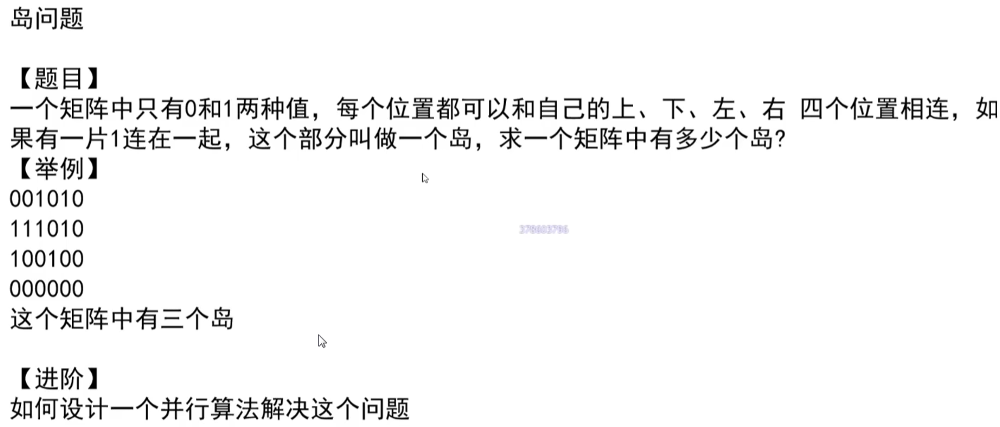

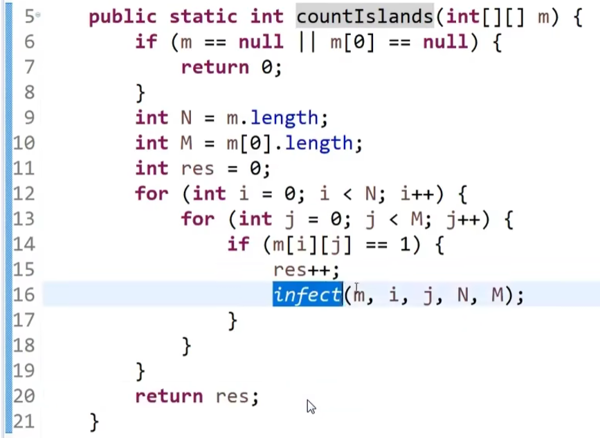

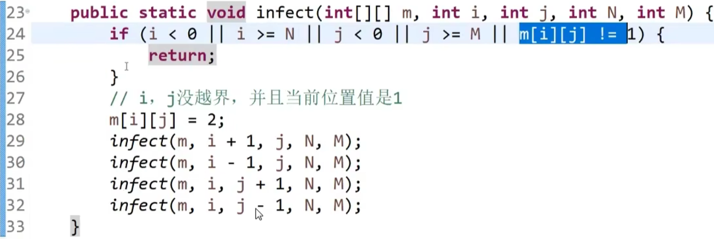

时间复杂度：O(N*M)

以上代码只是简单的解决了岛问题

【进阶】如何设计一个并行算法解决岛问题？

# 2. 并查集

25min处

并查集——快速支持集合合并的一个结构

  

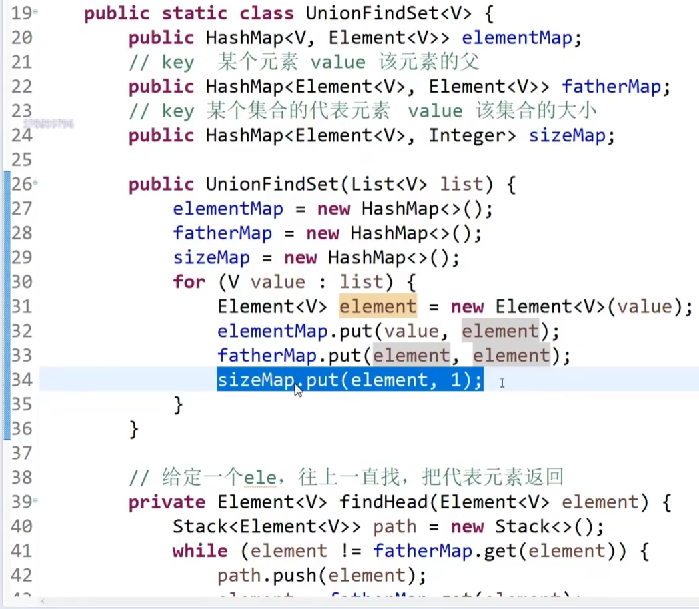

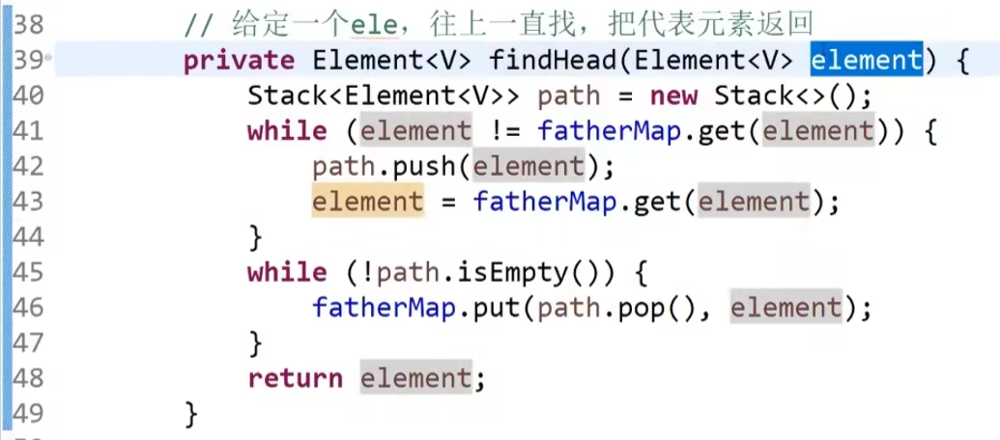

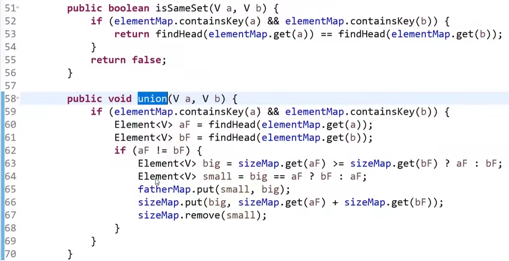

# 3. 用并查集解决岛问题

# 4. KMP算法

1小时20分钟处

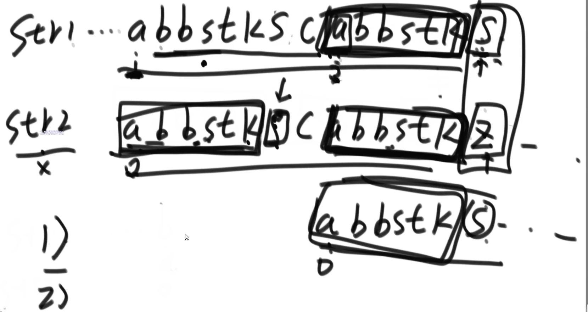

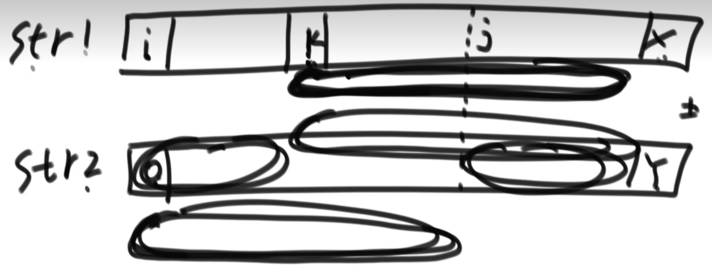

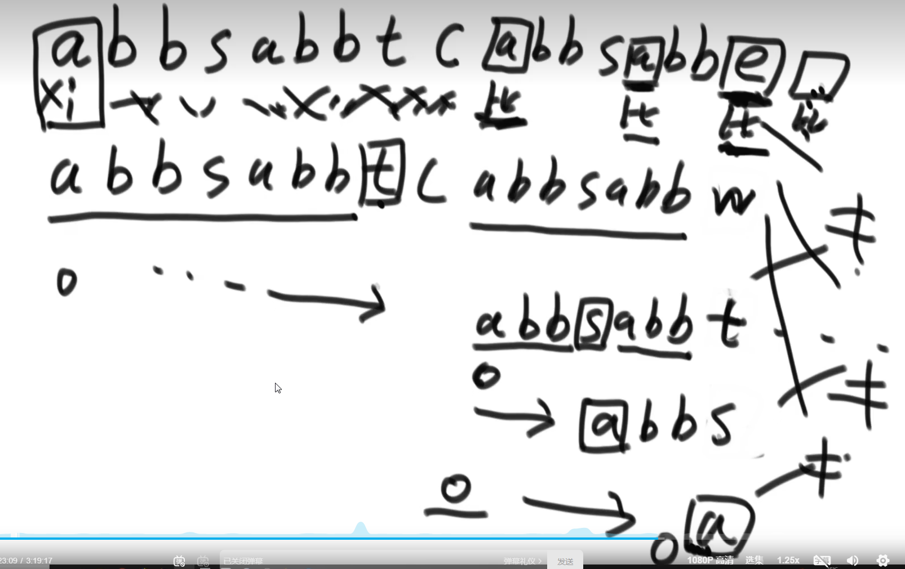

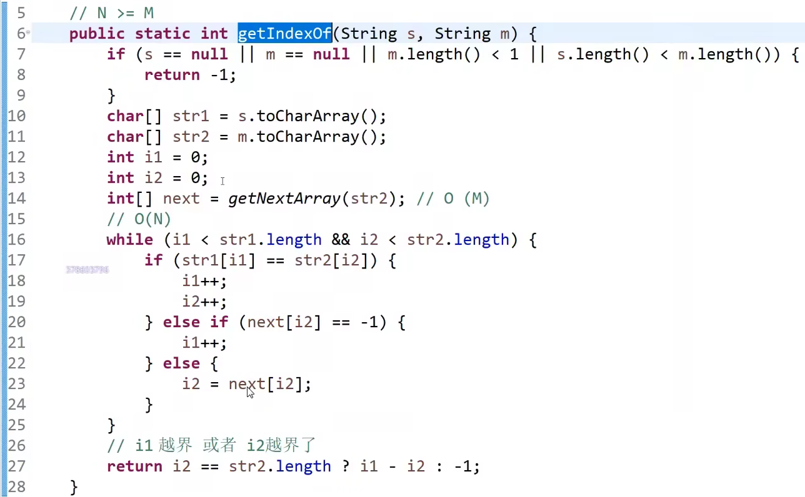

while循环的复杂度：

i1的最大值是N

i1-i2的最大值是N

 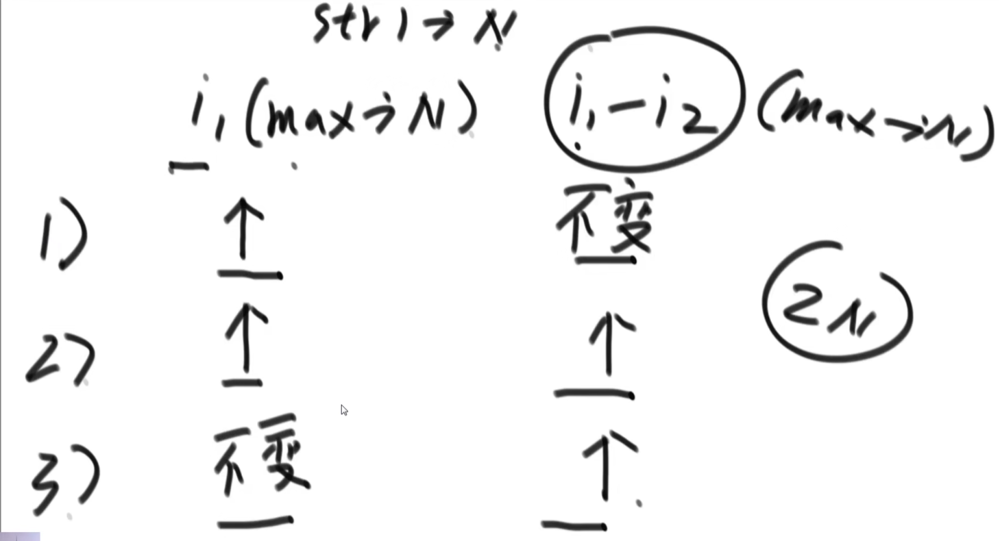

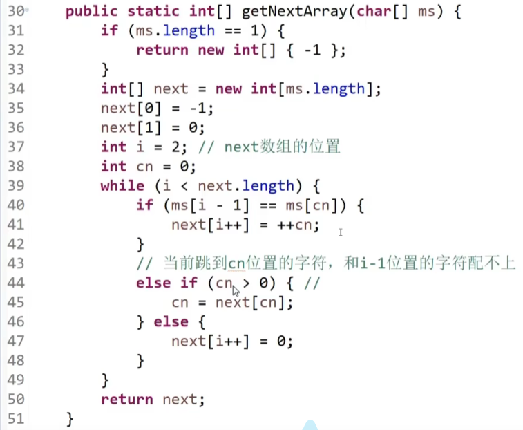

 在KMP（Knuth-Morris-Pratt）字符串匹配算法中，`next`数组（有时也称为`pi`数组或前缀函数）用于优化模式匹配的过程，使得在匹配失败时，不需要重新从头开始匹配，而是可以跳过一些已经匹配过的字符。

具体来说，`next`数组的含义是：对于模式字符串`P`的每一个位置`j`，`next[j]`表示从`P[0]`到`P[j-1]`这一段字符串的最长的相同的前缀和后缀的长度。

例如，假设模式字符串`P`为`"ABCDABD"`，那么它的`next`数组计算过程如下：

1. `P[0]` = 'A'，没有前缀也没有后缀，`next[0]` = 0。
2. `P[1]` = 'B'，没有前缀和后缀，`next[1]` = 0。
3. `P[2]` = 'C'，没有前缀和后缀，`next[2]` = 0。
4. `P[3]` = 'D'，没有前缀和后缀，`next[3]` = 0。
5. `P[4]` = 'A'，最长的前缀和后缀为'A'，`next[4]` = 1。
6. `P[5]` = 'B'，最长的前缀和后缀为'AB'，`next[5]` = 2。
7. `P[6]` = 'D'，没有前缀和后缀，`next[6]` = 0。

所以模式字符串`"ABCDABD"`的`next`数组为 `[0, 0, 0, 0, 1, 2, 0]`。

这个`next`数组的作用是在主字符串与模式字符串匹配失败时，通过跳转`next`数组中的位置，避免重新从头开始匹配，提高匹配效率。

 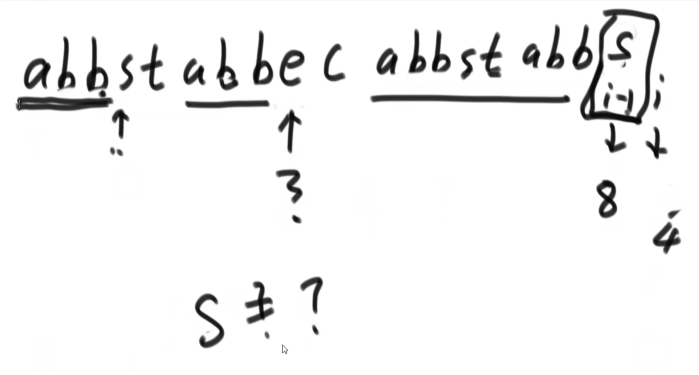

复杂度：

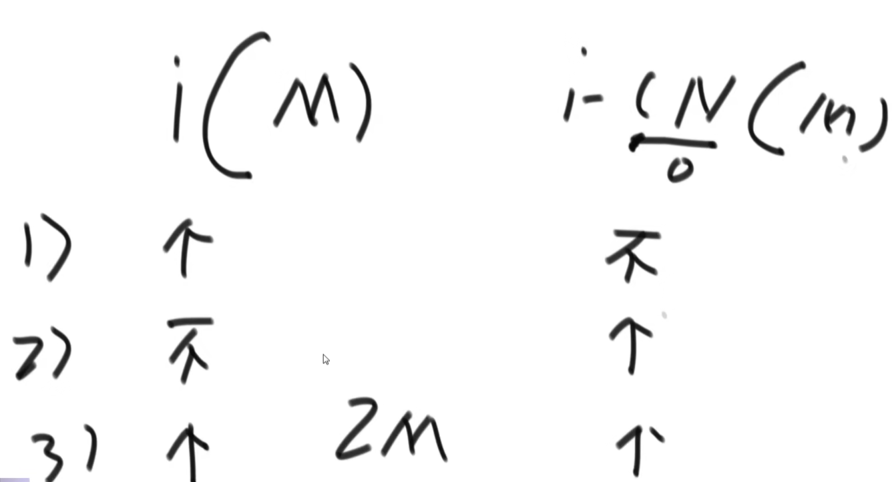

