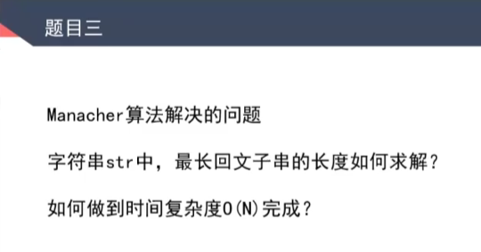
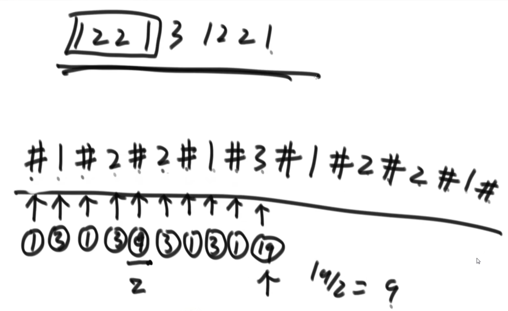

https://www.bilibili.com/video/BV13g41157hK?p=14&vd_source=a7089a0e007e4167b4a61ef53acc6f7e

# 1. 最长回文子串经典解法

时间复杂度：O(n*n)

# 2. 相关重要概念

- 回文直径
- 回文半径
- 之前扩的所有位置中，所到达的最右回文右边界

- 第一种情况：当来到某一个中心点的时候，这个点没有在‘最右回文右边界’里。此时，暴力扩
- 第二种情况：当来到某一个中心点的时候，这个点在‘最右回文右边界’里。此时，有下图所示关系：

- 
  - 2.1 i的回文区域在LR范围内 
  - 
  - 2.2 i的回文区域不在LR范围内 
  - 
  - 2.3 i的回文区域跟L压线 

用来分析时间复杂度的伪代码：

 

