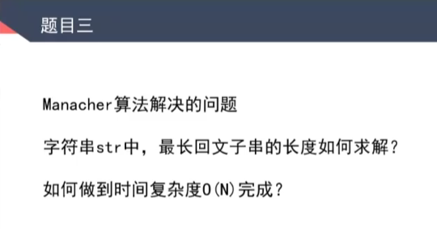
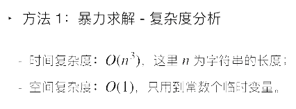
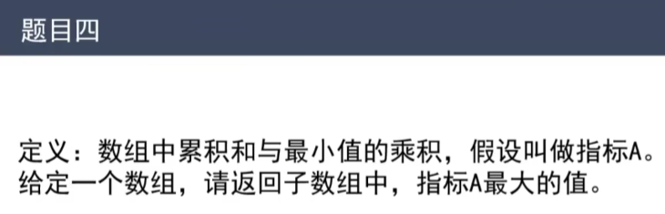

https://www.bilibili.com/video/BV13g41157hK?p=14&vd_source=a7089a0e007e4167b4a61ef53acc6f7e



# 1. Manacher算法

重要信息：每一个位置的最长回文半径

# 2. 最长回文子串解法

## 2.1 暴力解法 leetcode

从开头开始循环

https://leetcode.cn/problems/longest-palindromic-substring/?company_slug=bytedanc

```javascript
/**
 * @param {string} s
 * @return {string}
 */
var longestPalindrome = function (s) {
    if (s.length < 2) return s;
    let charArray = Array.from(s)
    let begin = 0;
    let maxLen = 0;
    let validPalindrome = function (charArray, left, right) {
        while (left < right) {
            if (charArray[left] != charArray[right]) {
                return false;
            }
            left++;
            right--
        }
        return true;
    }
    for (let i = 0; i < s.length; i++) {
        for (let j = i; j < s.length; j++) {
            if (j - i + 1 > maxLen && validPalindrome(charArray, i, j)) {
                maxLen = j - i + 1;
                begin = i;
            }
        }
    }
    return s.substring(begin, begin + maxLen)
};
```



## 2.2 中心扩散法 leetcode

leetcode：区分奇数偶数了

b站：扩充字符串


## 2.3 动态规划

## 2.4 Manacher算法

时间复杂度：O(n*n)

# 3. 相关重要概念

- 回文直径
- 回文半径
- 之前扩的所有位置中，所到达的最右回文右边界


- 第一种情况：当来到某一个中心点的时候，这个点没有在‘最右回文右边界’里。此时，暴力扩
- 第二种情况：当来到某一个中心点的时候，这个点在‘最右回文右边界’里。此时，有下图所示关系：

- 
  - 2.1 i的回文区域在LR范围内 
  - 
  - 2.2 i的回文区域不在LR范围内 
  - 
  - 2.3 i的回文区域跟L压线 


用来分析时间复杂度的伪代码：

 


# 4. 滑动窗口

1小时40min处


双端队列


# 5. 单调栈结构

2小时11min处





