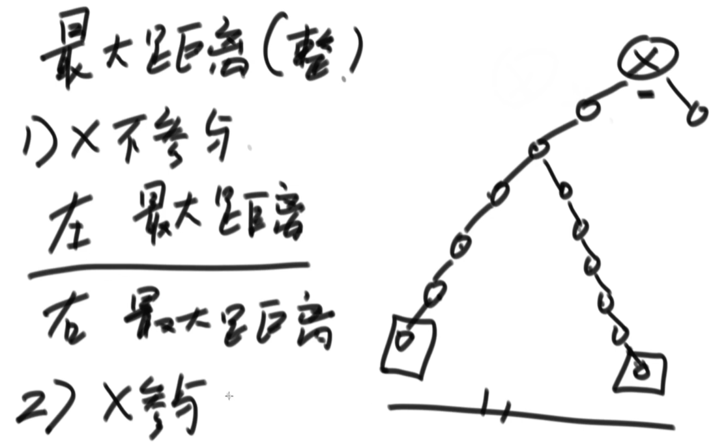
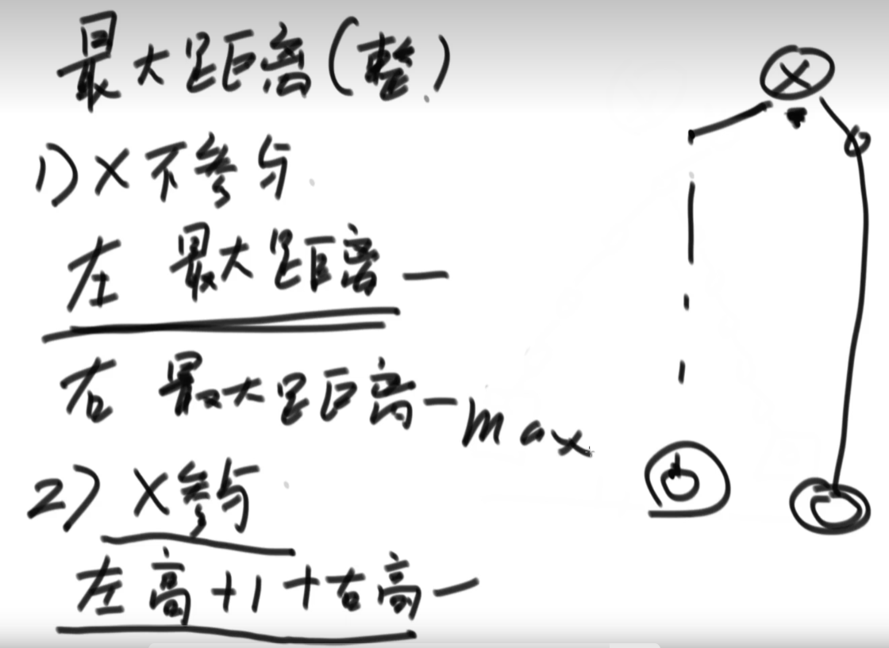
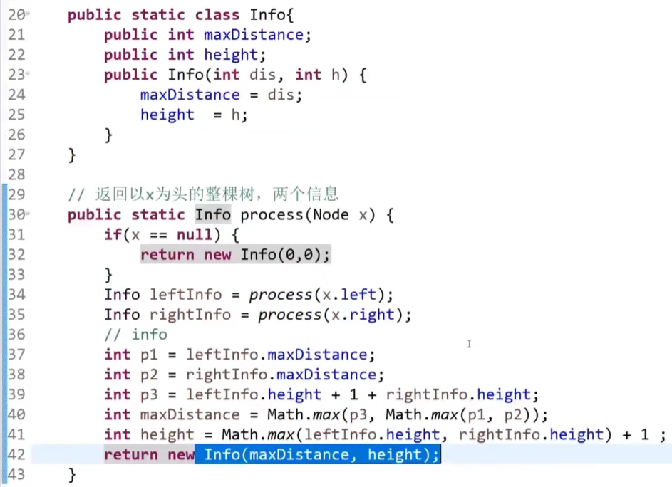
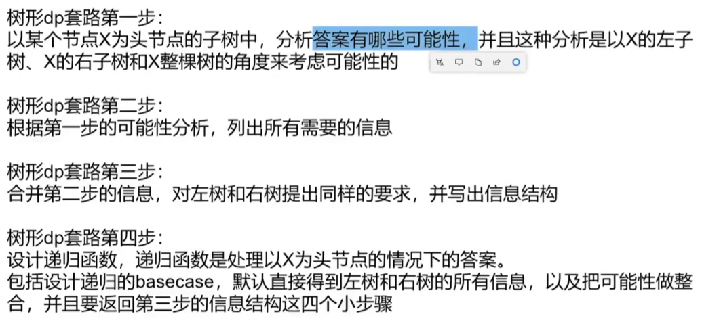
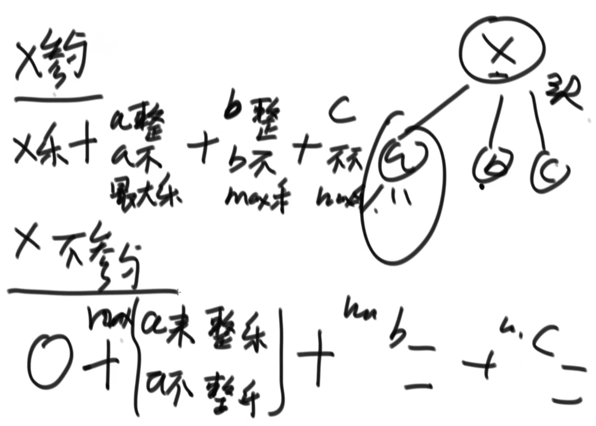
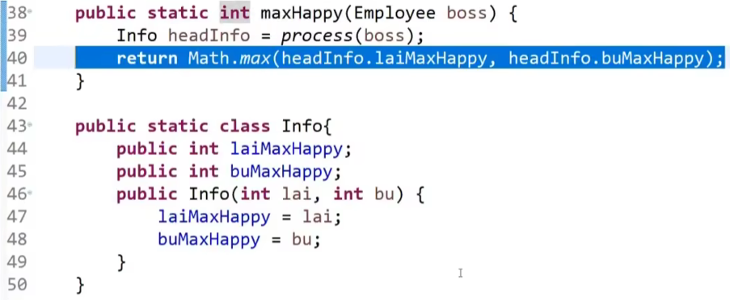
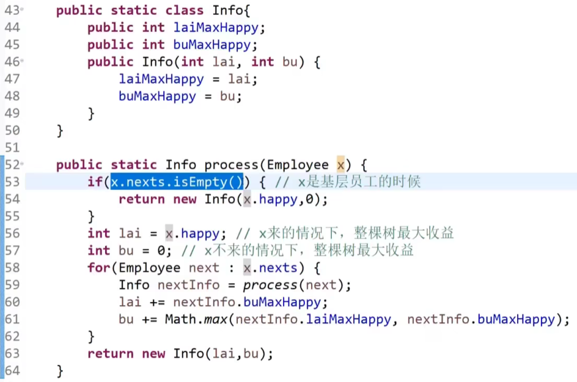
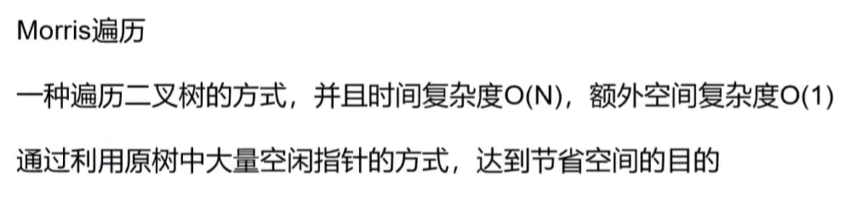
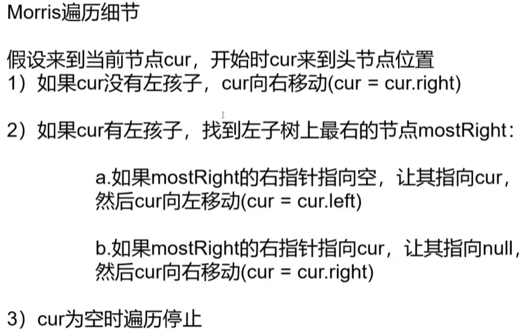
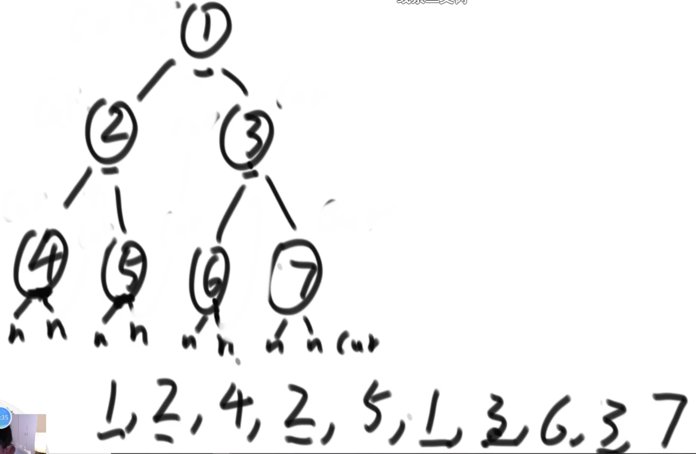

https://www.bilibili.com/video/BV13g41157hK?p=15&vd_source=a7089a0e007e4167b4a61ef53acc6f7e

# 1. 树形dp套路

# 2. 二叉树节点间的最大距离问题

                                                       

# 3. 派对的最大快乐值

23min处

# 4. Morris遍历

42min处

55min处

