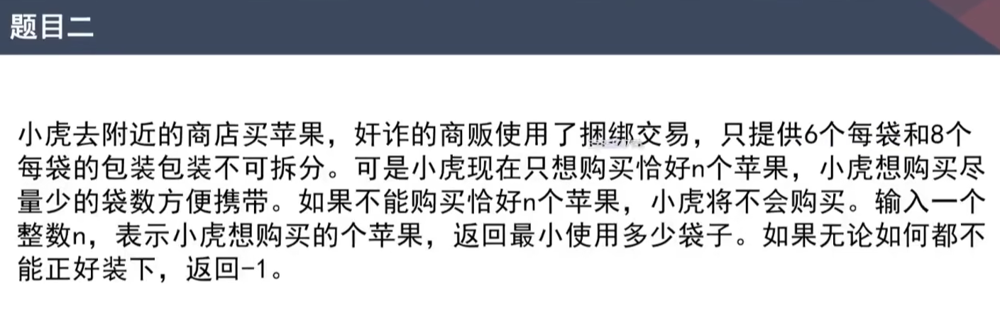
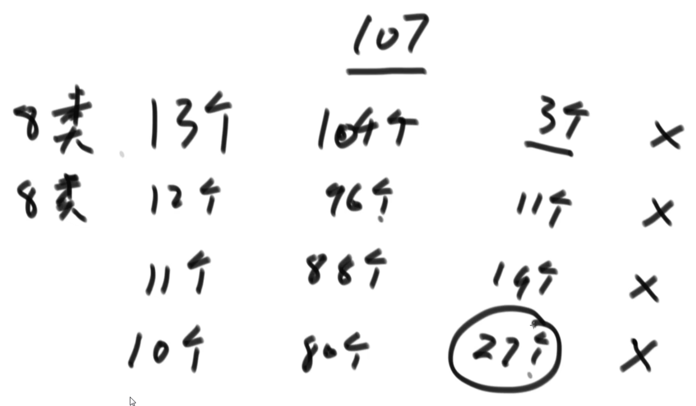
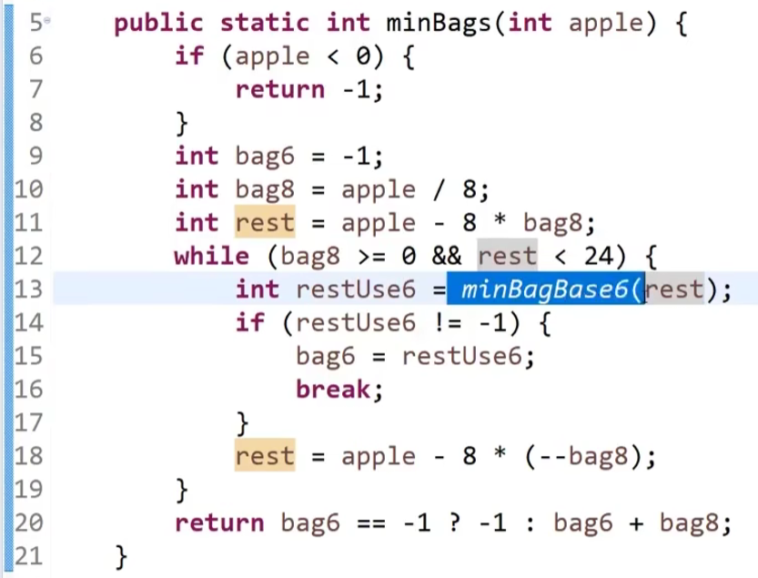
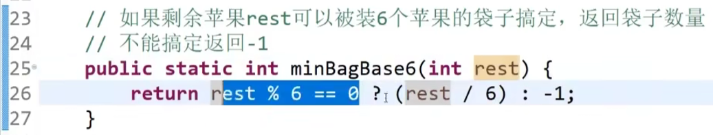
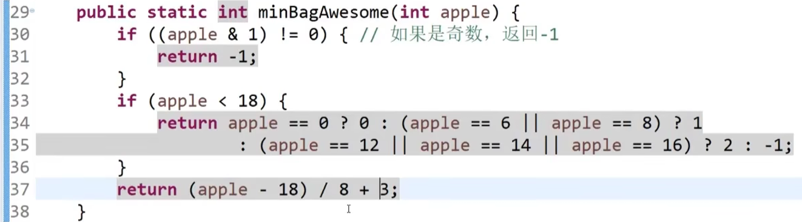
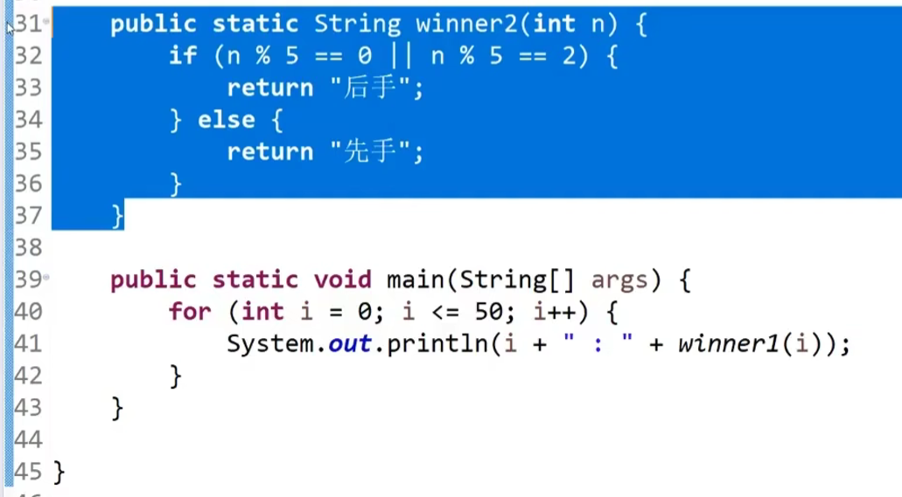
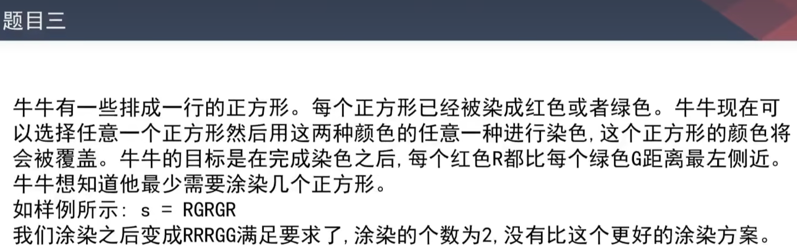

https://www.bilibili.com/video/BV13g41157hK/?p=20&spm_id_from=pageDriver&vd_source=a7089a0e007e4167b4a61ef53acc6f7e

# 1. 题目一

 

# 2.  题目二

17min处

策略：先尽量使用八类型的袋子

 

当剩余苹果数量大于24的时候，不需要往下尝试了

为什么？

# 3. 题目

44min处

# 4. 题目三

1小时10min处

