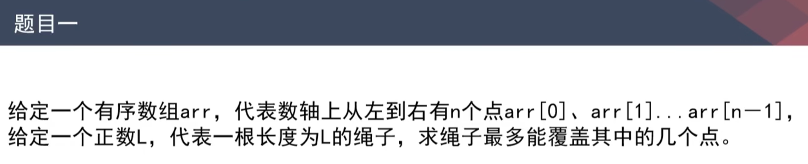
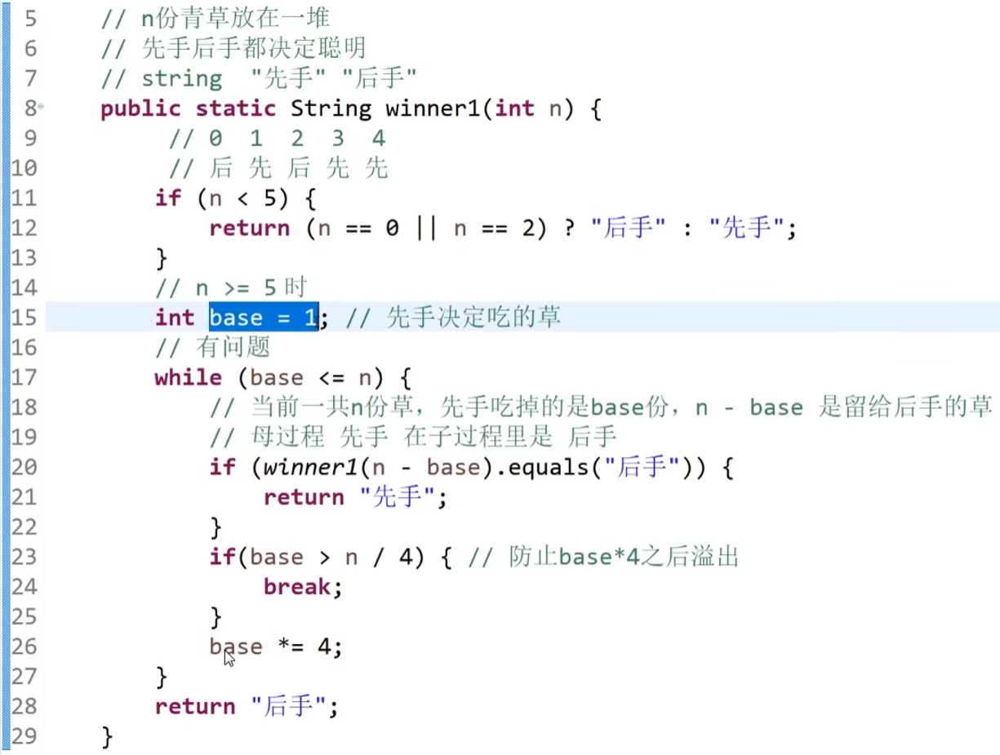
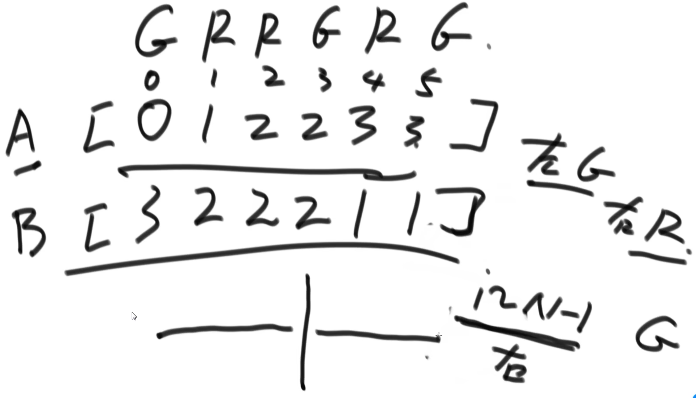
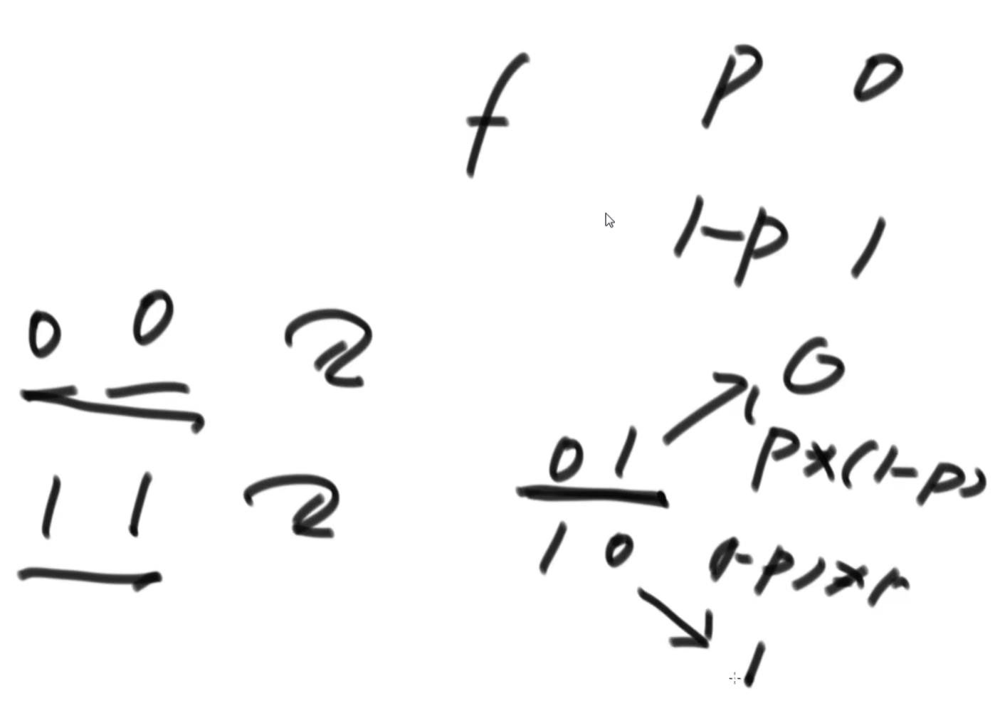

https://www.bilibili.com/video/BV13g41157hK/?p=20&spm_id_from=pageDriver&vd_source=a7089a0e007e4167b4a61ef53acc6f7e

# 1. 题目一

 

# 2.  题目二

17min处

策略：先尽量使用八类型的袋子

 

当剩余苹果数量大于24的时候，不需要往下尝试了

为什么？

# 3. 题目其他

44min处

|  |  |
| ------------------------------------------------------------ | ------------------------------------------------------------ |

# 4. 题目三 预处理思路

用空间换时间

1小时10min处

|  |  |
| ------------------------------------------------------------ | ------------------------------------------------------------ |
|  |  |
|                                                              | A数组中的每一项代表：0——i上有多少个R；B数组中的每一项代表：i——N-1上有多少个G |

# 5. 题目四 预处理技巧

1h30min处

|  |  |
| ------------------------------------------------------------ | ------------------------------------------------------------ |
| N*N的矩阵，里面长方形子矩阵的数量是多少数量级？—— O(N^4)                                     N*N的矩阵，里面正方形子矩阵的数量是多少数量级？—— O(N^3) |  |
|  |  |
|  |                                                              |

# 6. 题目五

1h55min处

|  |  |
| ------------------------------------------------------------ | ------------------------------------------------------------ |
|  |  |
|  |                                                              |

