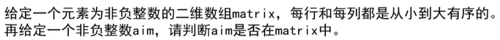

https://www.bilibili.com/video/BV13g41157hK/?p=21&spm_id_from=pageDriver&vd_source=a7089a0e007e4167b4a61ef53acc6f7e

# 1. 题目六 动态规划

|                                                              |  |
| ------------------------------------------------------------ | ------------------------------------------------------------ |
|  |  |
|  |  |

# 2. 题目七

8min处

|                                                              |  |
| ------------------------------------------------------------ | ------------------------------------------------------------ |
|  |  |

# 3. 题目一 哈希表

17min处

|  |  |
| ------------------------------------------------------------ | ------------------------------------------------------------ |
| 用哈希表去实现                                               |                                                              |

# 4. 题目二

21min处

|  |  |
| ------------------------------------------------------------ | ------------------------------------------------------------ |
|  |  |
|  |  |

 # 5. 题目四 括号

中3，5min处

|  | 遇到左括号count++，遇到右括号count--，这个过程中count达到的最大值就是其深度 |
| ------------------------------------------------------------ | ------------------------------------------------------------ |

扩展题：最长的有效括号子串

|  |  |
| ------------------------------------------------------------ | ------------------------------------------------------------ |
|  |  |

# 6. 题目五 栈

26min处

|  |                                                              |
| ------------------------------------------------------------ | ------------------------------------------------------------ |
|  |  |

# 7. 题目三 动态规划

30min处

|  |  |
| ------------------------------------------------------------ | ------------------------------------------------------------ |
|  |  |
|  |                                                              |

递归如何转动态规划会在进阶班详细说明

# 8. 题目七 二叉树

46min处

|  |  |
| ------------------------------------------------------------ | ------------------------------------------------------------ |

# 9.  题目五 二维数组matrix

1h1min处

|  |  |
| ------------------------------------------------------------ | ------------------------------------------------------------ |

扩展题：返回含有1数量最多的行

|  |  |
| ------------------------------------------------------------ | ------------------------------------------------------------ |
