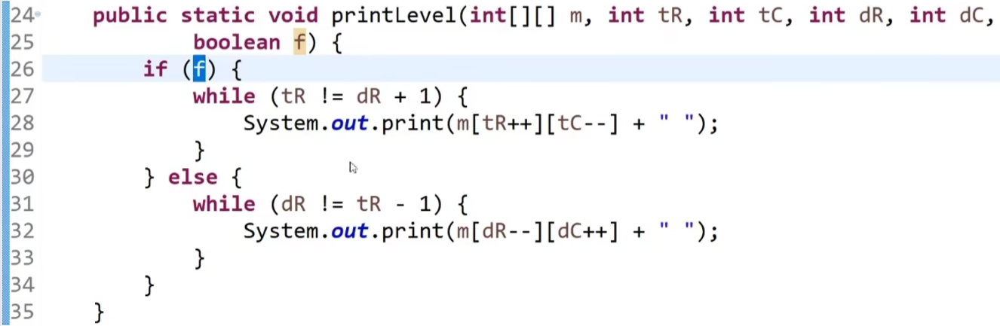

https://www.bilibili.com/video/BV13g41157hK/?p=23&spm_id_from=pageDriver&vd_source=a7089a0e007e4167b4a61ef53acc6f7e

# 1. 题目一 基于业务的贪心

基于业务的贪心题目

leetcode517 

|  |  |
| ------------------------------------------------------------ | ------------------------------------------------------------ |
|  |  |
|  |  |

# 2. 题目三 打印螺旋矩阵 宏观调度

26min处

|  |  |
| ------------------------------------------------------------ | ------------------------------------------------------------ |
|  |  |
|  |  |

# 3. 题目四 转动正方形矩阵

33min处

|  |  |
| ------------------------------------------------------------ | ------------------------------------------------------------ |
|  |  |
|  |  |

# 4. 题目二 zigzag打印矩阵

52min处

|  |  |
| ------------------------------------------------------------ | ------------------------------------------------------------ |
|  |  |

# 5. 题目六 业务类型题

1小时处

|  |  |
| ------------------------------------------------------------ | ------------------------------------------------------------ |
|  |  |

# 6. 题目七

1h23min处

|  |  |
| ------------------------------------------------------------ | ------------------------------------------------------------ |
|                                                              | 什么是小根堆？？                                             |

# 7. 扩展题 手写堆

|  |  |
| ------------------------------------------------------------ | ------------------------------------------------------------ |
|  |  |
|  |  |
|  |  |
|  |  |
|  |  |
|  |                                                              |