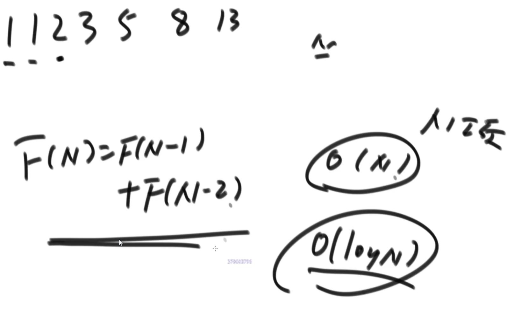
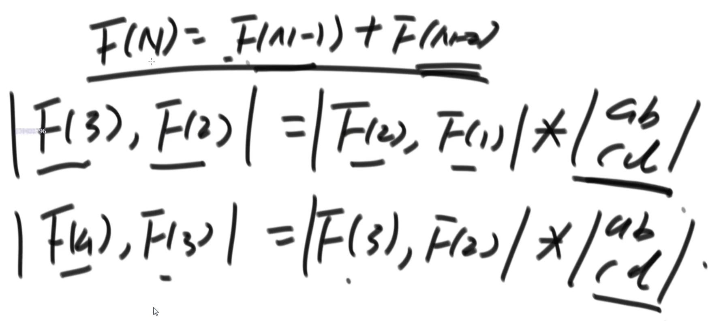
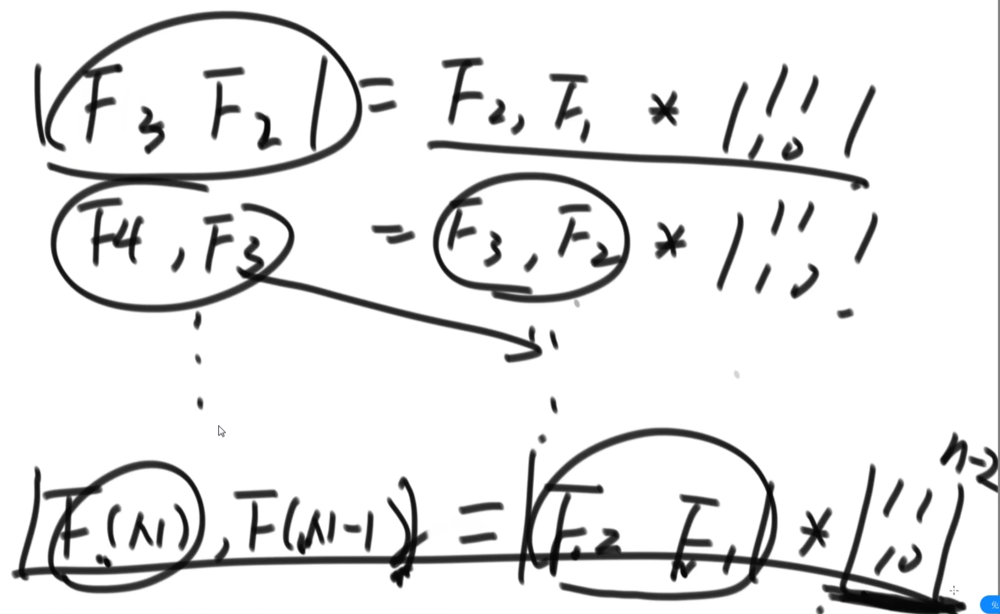
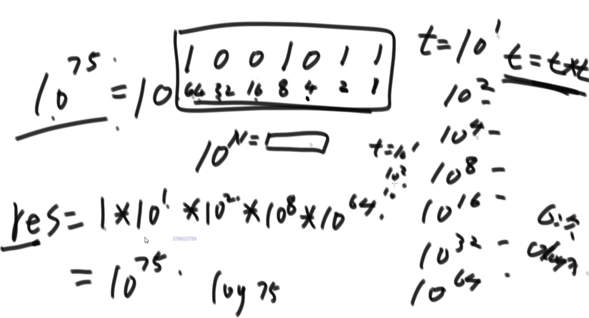
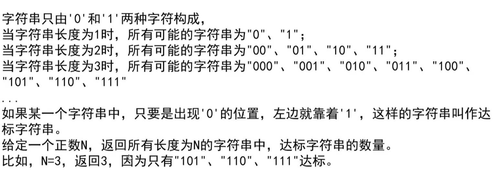

https://www.bilibili.com/video/BV13g41157hK/?p=25&spm_id_from=pageDriver&vd_source=a7089a0e007e4167b4a61ef53acc6f7e

# 1. 斐波拉契数列第N项 没听懂！？？？

|  |  |
| ------------------------------------------------------------ | ------------------------------------------------------------ |
|                                                              |  |
|                                                              | 怎么算一个矩阵的某次方最快？怎么算一个数的某次方最快？ |

# 2. 题目一 达标字符串

54min处

