https://www.bilibili.com/video/BV13g41157hK?p=26&vd_source=a7089a0e007e4167b4a61ef53acc6f7e

# 1. 题目一 前缀树 + 深度优先遍历

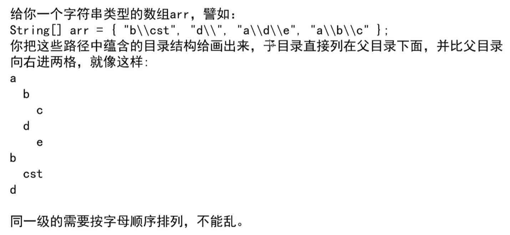

​        经典的前缀树设计：字符串是放在路上的

| 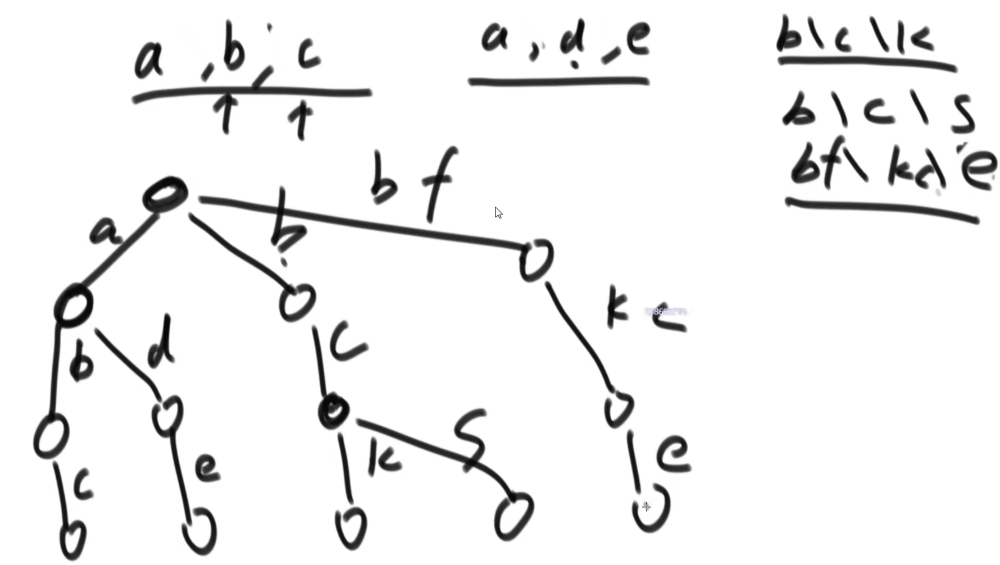 | 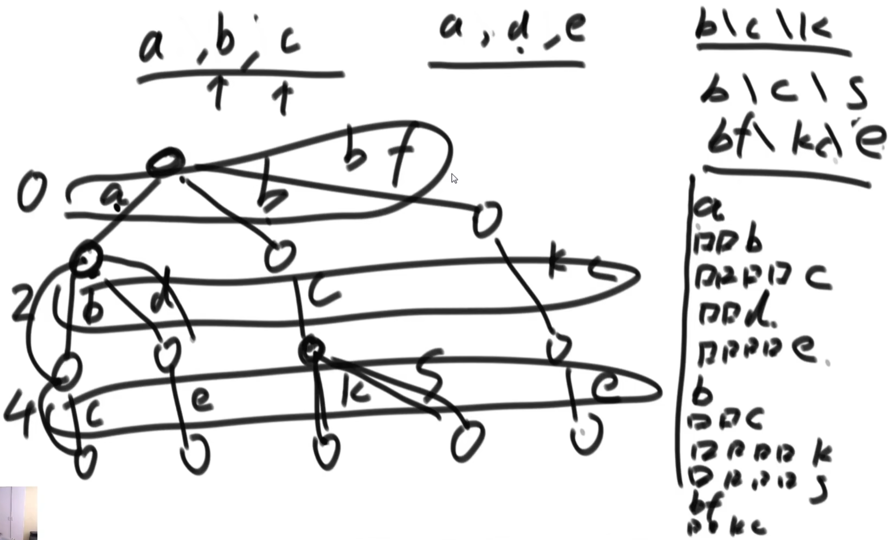 |
| ------------------------------------------------------------ | ------------------------------------------------------------ |
| 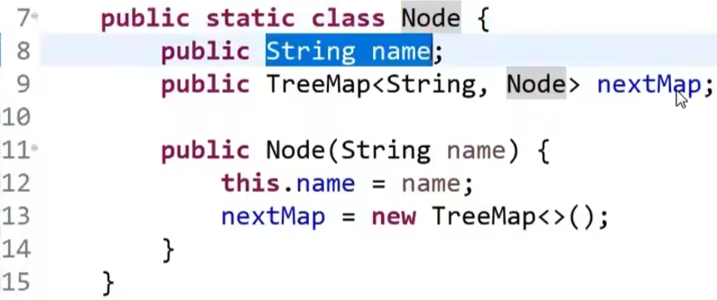 | 对TreeMap的理解： 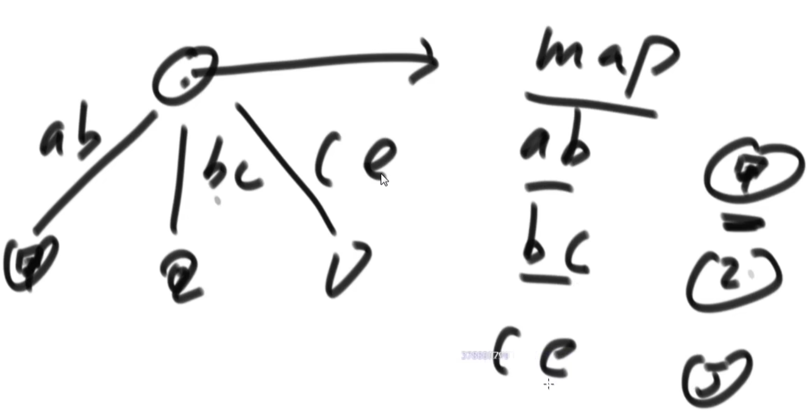 |
| 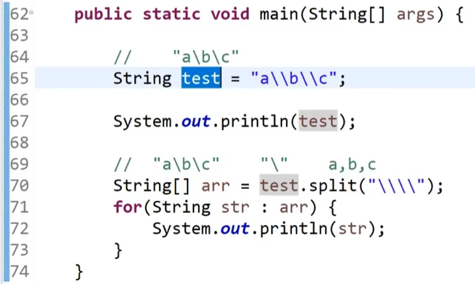 | 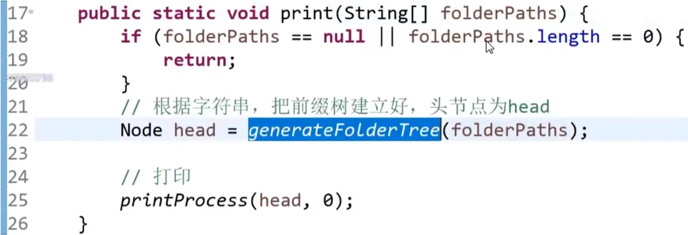 |
| 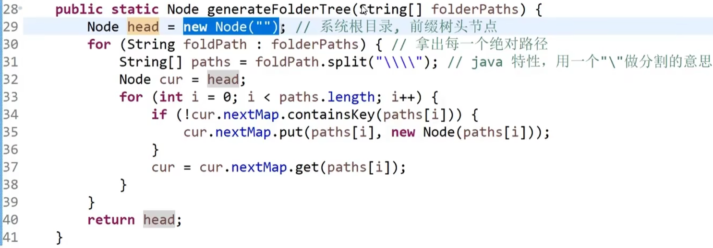 | 按照**深度优先**的顺序打印： 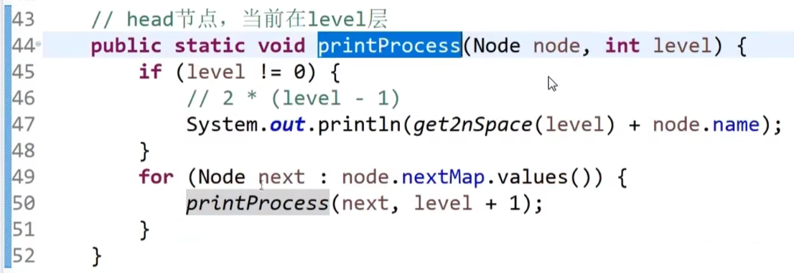 |

# 2. 题目二 

20min处

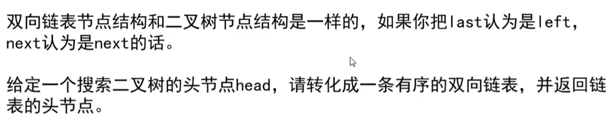

| 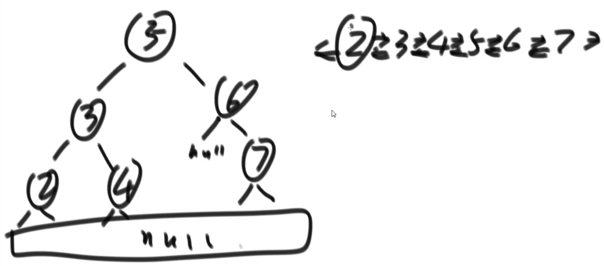 |      |
| ------------------------------------------------------------ | ---- |
|                                                              |      |

