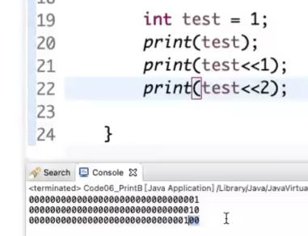

https://www.bilibili.com/video/BV1K2421u75G/?spm_id_from=333.999.0.0&vd_source=a7089a0e007e4167b4a61ef53acc6f7e

# 1. 给定一个整数，打印这个整数的32位

整数是否为32位取决于计算机系统、编程语言和环境

### 常见的情况
1. **32位系统**：在32位操作系统和32位编译器中，整数通常被表示为32位（即4个字节），这意味着它们可以表示的范围是：
   
   - 有符号整数（`int`）：从 \(-2^{31}\) 到 \(2^{31}-1\)（即 -2,147,483,648 到 2,147,483,647）。
   - 无符号整数（`unsigned int`）：从 \(0\) 到 \(2^{32}-1\)（即 0 到 4,294,967,295）。
   - 在32位系统中，整数的表示范围取决于它是有符号整数还是无符号整数。
   
   **解释**：
   
   - **有符号整数**：使用一个位（最高位）来表示正负号，因此只有31位用于表示数值的大小。这就是为什么范围是 \(-2^{31}\) 到 \(2^{31}-1\)。
   - **无符号整数**：所有32位都用来表示数值，因此它可以表示从0到 \(2^{32}-1\) 的范围。
   
2. **64位系统**：在64位操作系统中，虽然可以处理更大范围的整数，但具体到编程语言中的整数类型大小往往依旧是32位，除非使用特定的类型。
   
   - 在C/C++中，标准`int`类型通常仍然是32位，而`long`或`long long`可能是64位。
   - 在Python中，整数类型的大小是动态的，可以表示任意大数值，只受限于可用内存。
   
3. **其他情况**：某些特定的嵌入式系统或应用场景中，整数可能被表示为16位、8位甚至64位。

综上，**整数在很多情况下是32位的**，但具体还需依赖于操作系统、编译器和编程语言的设置和使用。

|  | 1. 1左移i位  |
| ------------------------------------------------------------ | ------------------------------------------------------------ |
|                                                              | 2. 进行**与运算**                                            |

左移一位：

14min处