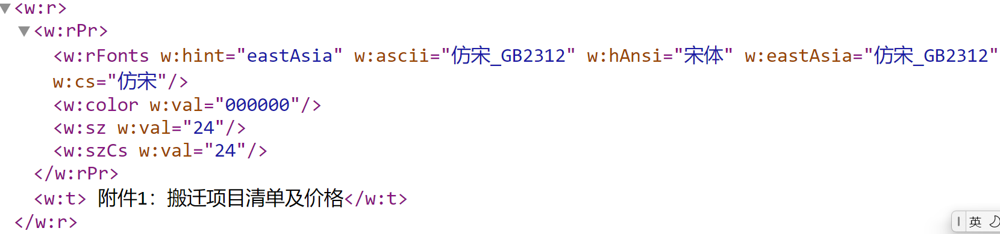
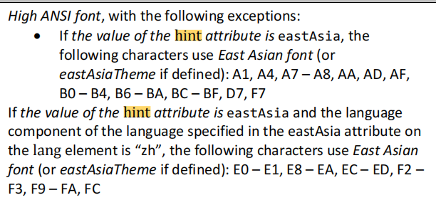

rFonts是在哪个环节被处理的？https://www.processon.com/diagraming/5f87ecfbe401fd06fd8b2fc6

Unicode code point:

- ascii：ASCII 即前128个Unicode码位 U+0000~U+007F
- hAnsi：高
- eastAsia：中文
- cs：复杂文种

这些字体的使用应由运行内容的Unicode字符值决定

| Attributes                | Description                                                  |
| ------------------------- | ------------------------------------------------------------ |
| cs(Complex Script Font)   |                                                              |
| eastAsia(East Asian Font) | Specifies a font which shall be used to format all characters in a Unicode code point  range within the parent run which does not fall into one of the three categories defined above, which is called the *high ANSI* range in WordprocessingML. |
| hAnsi(High ANSI Font)     |                                                              |
| ascii                     |                                                              |

| Unicode Block      | Range          | Classification                                               |
| ------------------ | -------------- | ------------------------------------------------------------ |
| Basic Latin        | U+0000——U+007F | ASCII font                                                   |
| Latin-1 Supplement | U+00A0——U+00FF |  |
|                    |                |                                                              |

