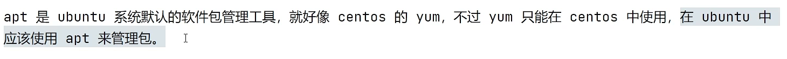
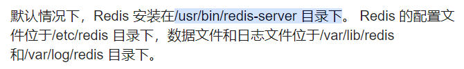
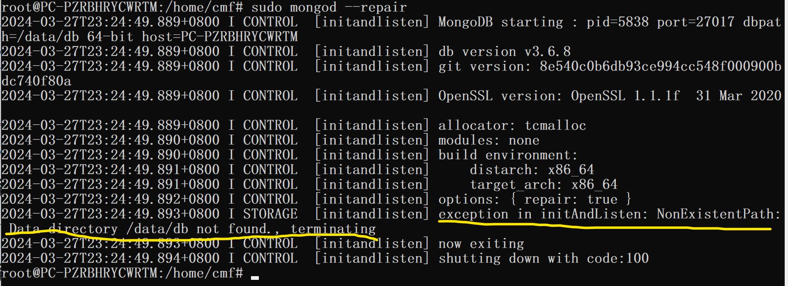
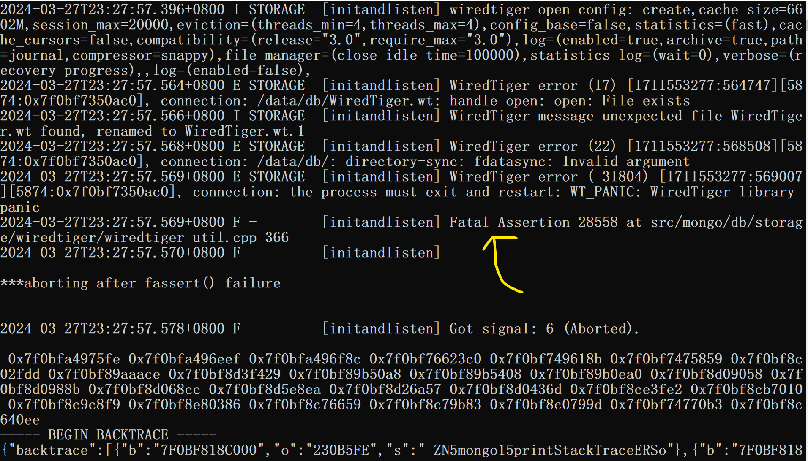
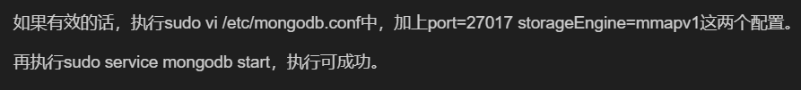

window subsystem for linux

# [1. apt——ubuntu的软件包管理工具](https://www.bilibili.com/video/BV1yP4y1D787/?spm_id_from=333.788&vd_source=a7089a0e007e4167b4a61ef53acc6f7e)



## [1.1 软件源](https://www.bilibili.com/video/BV1yP4y1D787/?p=27&spm_id_from=pageDriver)

- 不同的操作系统版本使用的软件源是不一样的，因此配置源时需要配置操作系统版本对应的源

- ```shell
  # 查看操作系统版本
  lsb_release -a
  # 让配置的源生效
  apt update
  ```

- 清华软件源：

  - https://mirrors.tuna.tsinghua.edu.cn/
  - https://mirrors.tuna.tsinghua.edu.cn/help/ubuntu/   (可以手动选择到合适的系统版本)

## [1.2 软件包](https://www.bilibili.com/video/BV19A41197W2/?spm_id_from=333.788&vd_source=a7089a0e007e4167b4a61ef53acc6f7e)

### 1.2.1 安装软件包

```shell
apt install wget
apt install /tmp/xxx.deb
```

### 1.2.2 卸载软件包

```shell
# 卸载软件 保留相关文件
apt remove wget
# 卸载软件
apt purge wget
```

### 1.2.3 更新软件包

```shell
# 先更新存储库，确保获取到更新的版本包信息
apt update
# 更新系统中所有的软件包
apt upgrade
```

## 1.3 apt和apt-get的关系


# 2. curl——用于在命令行中从 Internet 下载内容的工具

- curl可以让你不需要浏览器也能作为HTTP客户端发送请求，可以在终端直接输入命令，也可以作为脚本传输数据，而且它是跨平台的

## [2.1 在ubuntu中安装curl](https://learn.microsoft.com/zh-cn/windows/dev-environment/javascript/nodejs-on-wsl)

```shell
sudo apt-get install curl
```

## [2.2 如何使用curl命令](https://www.bilibili.com/video/BV1n94y1U7Eu/?spm_id_from=333.337.search-card.all.click&vd_source=a7089a0e007e4167b4a61ef53acc6f7e)

- curl xxxx(url) 测试是否能与目标url进行连接
- curl默认发送get请求
- 发送post请求：  
- 发送post请求且携带数据：
- 获取到响应的所有首部：
- 

# [3. 在WSL环境下安装nvm](https://learn.microsoft.com/zh-cn/windows/dev-environment/javascript/nodejs-on-wsl)

```shell
curl -o- https://raw.githubusercontent.com/nvm-sh/nvm/master/install.sh | bash
```

报错：curl: (7) Failed to connect to raw.githubusercontent.com port 443: Connection refused

解决：https://github.com/hawtim/hawtim.github.io/issues/10

185.199.108.133

185.199.109.133

185.199.110.133 

185.199.111.133

**注意：修改的不是windows的hosts文件，是ubuntu的hosts文件**

但还是有报错

```
// 最终使用
sudo bash -c "$(curl -fsSL https://gitee.com/RubyMetric/nvm-cn/raw/main/install.sh)"
```

# [4. 在WSL环境下安装node](https://learn.microsoft.com/zh-cn/windows/dev-environment/javascript/nodejs-on-wsl)

```
nvm install 14.21.3
nvm install 20.9.0
```

# 5. 安装lerna

```
 npm install -g lerna@4.0.0
```

怎么查看是否安装了lerna？

# 6. 在wsl中安装Redis



方法1（复杂，不建议使用）：

```shell
sudo apt-get update
sudo apt-get install build-essential
sudo apt-get install make gcc
gcc -v
```

方法2：https://redis.io/docs/install/install-redis/install-redis-on-linux/  (但是按这种方法安装的redis，在启动luoshu-server的时候会报错，报‘redis client is closed’)

```shell
$ curl -fsSL https://packages.redis.io/gpg | sudo gpg --dearmor -o /usr/share/keyrings/redis-archive-keyring.gpg

$ echo "deb [signed-by=/usr/share/keyrings/redis-archive-keyring.gpg] https://packages.redis.io/deb $(lsb_release -cs) main" | sudo tee /etc/apt/sources.list.d/redis.list

$ sudo apt-get update
$ sudo apt-get install redis
```

- 查看redis安装目录：


```shell
$ which redis-server
```

- 启动redis服务：https://www.jianshu.com/p/77ced41dbc47


```shell
$ redis-server 
```

# 7. wsl中安装MongoDB

```shell
sudo apt-get install mongodb
mongo -version
sudo service mongodb start
sudo mongod --repair // 查看报错信息
```



解决：创建目录 /data/db

```shell
mkdir /data/db -p
```



解决：执行下面的命令

```shell
sudo mongod -port=27017 -storageEngine=mmapv1 --logappend --journal
sudo service mongodb start
```



# 8. wsl中安装Java JDK

```shell
sudo apt-get install openjdk-8-jdk
java -version
```

# 9. wsl中安装python

```shell
sudo apt-get install python
python --version
```

# 10. wsl位于windows中的哪个位置

可以在运行(win+R)或资源管理器的路径里直接输入`\\wsl$`进入Ubuntu的目录

# 11. 启动luoshu—server

```
npm config set registry https://registry.npmmirror.com
npm run lerna-build
```

中间遇到了问题，补充执行了以下命令：

```
apt-get install make
apt-get install g++
```

# 12.WSL中卸载ubuntu

```shell
wsl --unregister Ubuntu
```


