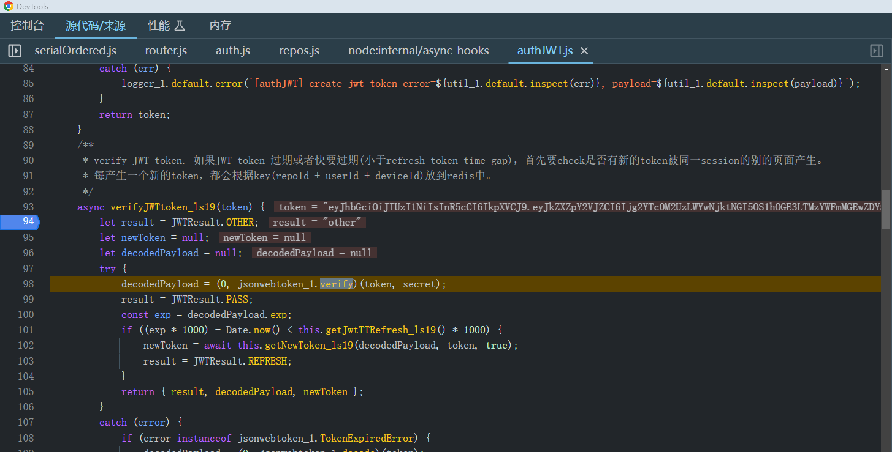

# 1.router.post

```typescript
 router.post('/api/:repo/entries/new', authorizeByToken_ls19,  pathParamHandler, koaBodyparser(), createNewFile_ls19);
```

这一行代码是用来定义一个用于处理POST请求的路由，它会响应路径为 `/api/:repo/entries/new` 的请求，并依次执行几个中间件函数。以下是详细解释：

1. **`router.post('/api/:repo/entries/new', ...middlewares)`**:
   - `router.post` 定义一个处理POST请求的路由。
   - `'/api/:repo/entries/new'` 是请求路径，其中 `:repo` 是一个路径参数，表示任意的仓库名称。

2. **`authorizeByToken_ls19`**:
   - 这是一个中间件函数，通常用于通过令牌（token）进行授权。它会在请求被处理之前验证请求中的令牌是否合法。如果验证失败，通常会返回一个错误响应，阻止请求继续处理。

3. **`pathParamHandler`**:
   - 这是另一个中间件函数，通常用于处理路径参数。它可能会从路径参数中提取信息并进行一些预处理，供后续中间件和处理函数使用。

4. **`koaBodyparser()`**:
   - `koa-bodyparser` 是一个用于解析请求体的中间件，适用于Koa框架。它可以将JSON、表单数据等解析为JavaScript对象，并将其附加到 `ctx.request.body` 上，供后续中间件和处理函数使用。

5. **`createNewFile_ls19`**:
   - 这是最终处理请求的函数。经过前面的中间件处理后，这个函数会执行主要的业务逻辑，例如创建一个新的文件。通常，它会读取解析后的请求体数据，进行相关的业务处理，然后返回响应。

综上所述，当客户端向 `/api/:repo/entries/new` 发送POST请求时，这个路由会依次执行 `authorizeByToken_ls19`、`pathParamHandler`、`koaBodyparser()` 和 `createNewFile_ls19` 这几个中间件函数，来进行授权、路径参数处理、请求体解析和创建新文件的操作。

# 2.token redis



# 3. app.use(file.routes(), file.allowedMethods());

这一行代码是用来在Koa应用程序中注册路由和允许的HTTP方法。具体解释如下：

1. **`app.use()`**:
   - `app` 是一个Koa应用实例。
   - `use()` 方法用于将中间件函数注册到Koa应用中。

2. **`file.routes()`**:
   - `file` 是一个Koa路由对象，通常是由 `koa-router` 创建的。
   - `routes()` 方法返回一个中间件函数，用于处理在该路由对象上定义的所有路由。这个中间件函数会将所有匹配的请求交给相应的路由处理器。

3. **`file.allowedMethods()`**:
   - `allowedMethods()` 方法返回一个中间件函数，用于处理请求方法不被允许的情况。当请求的HTTP方法不在定义的路由方法列表中时，这个中间件会返回405 Method Not Allowed响应，或者在某些情况下返回501 Not Implemented响应。
   - 它还可以设置适当的响应头，如 `Allow`，指明允许的方法。

综合起来，这一行代码将两个中间件函数注册到Koa应用中：
- 第一个中间件 `file.routes()` 处理在 `file` 路由对象上定义的所有路由。
- 第二个中间件 `file.allowedMethods()` 处理HTTP方法不被允许的情况。

这确保了Koa应用能够正确地路由请求，并在请求方法不被允许时返回适当的响应。

```javascript
const Koa = require('koa');
const Router = require('koa-router');

// 创建一个新的Koa应用实例
const app = new Koa();

// 创建一个新的路由对象
const file = new Router();

// 定义一些路由
file.get('/example', async (ctx) => {
  ctx.body = 'This is an example route';
});

// 将路由和允许的方法中间件注册到Koa应用中
app.use(file.routes());
app.use(file.allowedMethods());

// 启动Koa应用
app.listen(3000, () => {
  console.log('Server is running on http://localhost:3000');
});
```

在这个示例中，当访问 `http://localhost:3000/example` 时，Koa应用会响应 "This is an example route"。如果使用不被允许的方法（如POST）访问相同的路径，会返回405 Method Not Allowed。