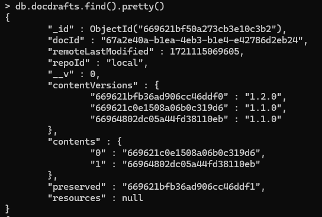

# 1. 怎么在ubuntu中查看mongoDB数据库的详情

在Ubuntu中查看MongoDB数据库的详情可以通过MongoDB的命令行工具 `mongo` 或 `mongosh`。以下是详细步骤：

## 1. 连接到MongoDB

打开终端并输入以下命令以启动MongoDB Shell并连接到MongoDB实例：

```bash
mongosh
```

或者，如果你使用的是旧版本的 MongoDB，可以使用：

```bash
mongo
```

## 2. 查看数据库列表

连接到MongoDB后，使用以下命令查看所有数据库的列表：

```javascript
show dbs
```

## 3. 切换到特定数据库

使用以下命令切换到你感兴趣的数据库（例如，`mydatabase`）：

```javascript
use mydatabase
```

## 4. 查看集合列表

切换到目标数据库后，使用以下命令查看该数据库中的集合（类似于表）列表：

```javascript
show collections
```

## 5. 查看集合中的文档

使用以下命令查看特定集合中的文档（例如，`mycollection`）：

```javascript
db.mycollection.find().pretty()
```

## 6. 查看数据库的统计信息

使用以下命令查看当前数据库的统计信息：

```javascript
db.stats()
```

## 7. 查看集合的详细信息

使用以下命令查看特定集合的详细信息（例如，`mycollection`）：

```javascript
db.mycollection.stats()
```

## 8. 查看索引信息

使用以下命令查看集合的索引信息：

```javascript
db.mycollection.getIndexes()
```

## 示例流程

以下是一个示例流程，从连接到MongoDB实例开始，一直到查看特定集合中的文档：

```bash
# 连接到MongoDB
mongosh

# 查看数据库列表
show dbs

# 切换到特定数据库
use mydatabase

# 查看集合列表
show collections

# 查看集合中的文档
db.mycollection.find().pretty()

# 查看数据库的统计信息
db.stats()

# 查看集合的详细信息
db.mycollection.stats()

# 查看集合的索引信息
db.mycollection.getIndexes()
```

## 参考命令总结

- `show dbs`: 显示所有数据库
- `use <database_name>`: 切换到指定数据库
- `show collections`: 显示当前数据库中的所有集合
- `db.<collection_name>.find().pretty()`: 显示指定集合中的所有文档并格式化输出
- `db.stats()`: 显示当前数据库的统计信息
- `db.<collection_name>.stats()`: 显示指定集合的详细信息
- `db.<collection_name>.getIndexes()`: 显示指定集合的索引信息

使用这些命令，你可以在Ubuntu中查看MongoDB数据库的详细信息。

# 2. 数据库字段

|  |  |
| ------------------------------------------------------------ | ------------------------------------------------------------ |


