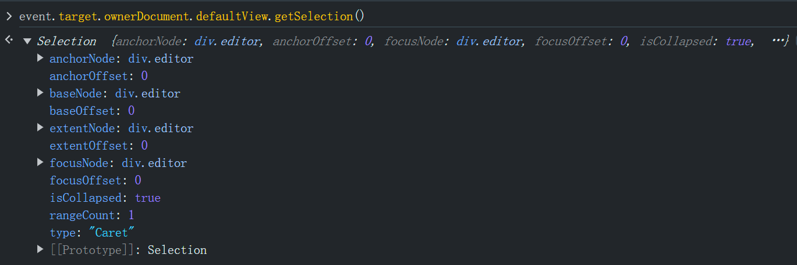
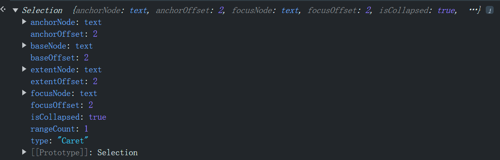

# 1. react如何实现文档的多人实时协同编辑功能

使用 `Socket.IO` 库可以非常方便地在前后端之间建立实时通信。下面是一个完整的示例，展示如何使用 React 作为前端框架，Koa 作为后端框架，实现实时通信功能。

### 后端（Koa + Socket.IO）

#### 1. 初始化项目并安装依赖

首先，创建一个新的 Node.js 项目，并安装必要的依赖：

```bash
mkdir server
cd server
npm init -y
npm install koa koa-router socket.io
```

#### 2. 创建 Koa 服务器并集成 Socket.IO

创建一个 `server.js` 文件，设置 Koa 和 Socket.IO：

```javascript
// server/server.js

const Koa = require('koa');
const http = require('http');
const Router = require('koa-router');
const socketIo = require('socket.io');

const app = new Koa();
const server = http.createServer(app.callback());
const io = socketIo(server);

const router = new Router();

router.get('/', (ctx) => {
  ctx.body = 'Hello World';
});

app.use(router.routes()).use(router.allowedMethods());

io.on('connection', (socket) => {
  console.log('A user connected');

  socket.on('message', (message) => {
    console.log('Received message:', message);
    io.emit('message', message);
  });

  socket.on('disconnect', () => {
    console.log('A user disconnected');
  });
});

const PORT = 4000;
server.listen(PORT, () => {
  console.log(`Server is running on port ${PORT}`);
});
```

### 前端（React + Socket.IO Client）

#### 1. 初始化 React 项目并安装依赖

创建一个新的 React 项目，并安装 Socket.IO 客户端：

```bash
npx create-react-app collaborative-editor
cd collaborative-editor
npm install socket.io-client
```

#### 2. 创建编辑器组件并集成 Socket.IO

创建一个 `Editor.js` 文件，并实现与 Socket.IO 的集成：

```javascript
// src/Editor.js

import React, { useEffect, useState } from 'react';
import io from 'socket.io-client';

const socket = io('http://localhost:4000');

const Editor = () => {
  const [messages, setMessages] = useState([]);
  const [input, setInput] = useState('');

  useEffect(() => {
    socket.on('message', (message) => {
      setMessages((prevMessages) => [...prevMessages, message]);
    });

    return () => {
      socket.off('message');
    };
  }, []);

  const sendMessage = () => {
    socket.emit('message', input);
    setInput('');
  };

  return (
    <div>
      <div className="messages">
        {messages.map((msg, index) => (
          <div key={index}>{msg}</div>
        ))}
      </div>
      <input
        type="text"
        value={input}
        onChange={(e) => setInput(e.target.value)}
      />
      <button onClick={sendMessage}>Send</button>
    </div>
  );
};

export default Editor;
```

#### 3. 在应用中使用编辑器组件

将编辑器组件添加到你的主应用组件中：

```javascript
// src/App.js

import React from 'react';
import Editor from './Editor';
import './App.css';

function App() {
  return (
    <div className="App">
      <h1>Collaborative Document Editor</h1>
      <Editor />
    </div>
  );
}

export default App;
```

#### 4. 启动服务器和客户端

首先，在 `server` 目录下启动后端服务器：

```bash
node server.js
```

然后，在 `collaborative-editor` 目录下启动 React 开发服务器：

```bash
npm start
```

### 5. 完整的文件结构

项目的文件结构如下所示：

```
/server
  ├── node_modules
  ├── package.json
  ├── server.js
/collaborative-editor
  ├── node_modules
  ├── public
  ├── src
      ├── App.js
      ├── App.css
      ├── Editor.js
  ├── package.json
```

### 结论

通过以上步骤，我们实现了一个简单的多人实时协同编辑器。用户在输入框中输入内容并点击发送按钮后，消息会通过 Socket.IO 传输到服务器，服务器会将消息广播给所有连接的客户端。你可以根据需要扩展和优化这个示例，实现更复杂和高级的协同编辑功能。

# 2. react如何实现一个文档编辑功能

在 React 中实现一个文档编辑功能，可以通过以下几个步骤来完成。我们将使用 `contenteditable` 属性来创建一个可编辑的区域，并结合 React 的状态管理和事件处理来实现基本的文档编辑功能。以下是一个基本的示例，展示如何在 React 中实现一个简单的文档编辑器。

### 1. 创建一个新的 React 应用

首先，创建一个新的 React 应用。如果你还没有创建一个 React 应用，可以使用以下命令：

```bash
npx create-react-app document-editor
cd document-editor
```

### 2. 设置编辑器组件

创建一个新的组件 `Editor.js` 来实现文档编辑功能。

#### `src/Editor.js`

```javascript
import React, { useState, useRef } from 'react';

const Editor = () => {
  const [content, setContent] = useState('');
  const editorRef = useRef(null);

  const handleInput = (event) => {
    setContent(event.target.innerHTML);
  };

  const handleBold = () => {
    document.execCommand('bold');
  };

  const handleItalic = () => {
    document.execCommand('italic');
  };

  const handleUnderline = () => {
    document.execCommand('underline');
  };

  return (
    <div>
      <div className="toolbar">
        <button onClick={handleBold}>Bold</button>
        <button onClick={handleItalic}>Italic</button>
        <button onClick={handleUnderline}>Underline</button>
      </div>
      <div
        className="editor"
        contentEditable
        ref={editorRef}
        onInput={handleInput}
        dangerouslySetInnerHTML={{ __html: content }}
      />
    </div>
  );
};

export default Editor;
```

### 3. 添加样式

创建一个样式文件 `Editor.css` 来设置编辑器的样式。

#### `src/Editor.css`

```css
.editor {
  border: 1px solid #ccc;
  padding: 10px;
  min-height: 200px;
  margin-top: 10px;
}

.toolbar {
  margin-bottom: 10px;
}

.toolbar button {
  margin-right: 5px;
}
```

### 4. 在应用中使用编辑器组件

将编辑器组件添加到你的主应用组件中。

#### `src/App.js`

```javascript
import React from 'react';
import Editor from './Editor';
import './Editor.css';

function App() {
  return (
    <div className="App">
      <h1>Document Editor</h1>
      <Editor />
    </div>
  );
}

export default App;
```

### 5. 运行应用

现在，你可以运行应用并查看效果：

```bash
npm start
```

### 功能说明

- **编辑器区域**：我们使用了一个 `div` 元素，并设置 `contentEditable` 属性，使其成为一个可编辑的区域。通过 `dangerouslySetInnerHTML` 属性将内容显示在编辑器中。
- **工具栏**：提供基本的文本格式化按钮，如加粗、斜体和下划线。点击这些按钮会触发相应的 `document.execCommand` 命令来进行文本格式化。
- **状态管理**：使用 React 的 `useState` 钩子来管理编辑器内容的状态，并在 `onInput` 事件中更新状态。

### 扩展功能

以上是一个基本的文档编辑器的实现，你可以根据需要扩展更多的功能：

1. **高级格式化**：增加更多的文本格式化选项，如字体大小、颜色、列表等。
2. **保存和加载**：实现文档内容的保存和加载功能，可以使用浏览器的本地存储或后端服务。
3. **协同编辑**：集成 WebSockets 或其他实时通信技术，实现多人实时协同编辑功能。
4. **插件系统**：实现一个插件系统，允许用户自定义扩展编辑器的功能。

通过以上步骤和建议，你可以逐步实现一个功能完善的文档编辑器。

# 3. 在contentEditable的div中编辑能获取到当前编辑的位置吗

在一个 `contentEditable` 的 `div` 中编辑时，你可以通过 JavaScript 获取当前编辑位置。获取编辑位置主要涉及到光标（或称为“插入符”）的位置。以下是获取和操作编辑位置的几种方法：

## 获取光标位置

你可以使用 `Selection` 和 `Range` 对象来获取当前光标的位置。以下是一个示例代码：

```html
<!DOCTYPE html>
<html lang="en">
<head>
  <meta charset="UTF-8">
  <meta name="viewport" content="width=device-width, initial-scale=1.0">
  <title>ContentEditable Example</title>
</head>
<body>
  <div id="editable" contentEditable="true" style="border: 1px solid #000; padding: 10px; width: 300px; height: 200px;">
    This is an editable div. Try typing here...
  </div>
  <p>Current position: <span id="position"></span></p>

  <script>
    const editableDiv = document.getElementById('editable');
    const positionDisplay = document.getElementById('position');

    function getCaretCharacterOffsetWithin(element) {
      let caretOffset = 0;
      const doc = element.ownerDocument || element.document;
      const win = doc.defaultView || doc.parentWindow;
      const sel = win.getSelection();
      
      if (sel.rangeCount > 0) {
        const range = sel.getRangeAt(0);
        const preCaretRange = range.cloneRange();
        preCaretRange.selectNodeContents(element);
        preCaretRange.setEnd(range.endContainer, range.endOffset);
        caretOffset = preCaretRange.toString().length;
      }
      
      return caretOffset;
    }

    function updateCaretPosition() {
      const position = getCaretCharacterOffsetWithin(editableDiv);
      positionDisplay.textContent = position;
    }

    editableDiv.addEventListener('keyup', updateCaretPosition);
    editableDiv.addEventListener('mouseup', updateCaretPosition);
  </script>
</body>
</html>
```

## 代码解释

1. **HTML结构**：
   - 一个 `contentEditable` 的 `div`，允许用户进行编辑。
   - 一个 `span` 元素，用于显示当前光标的位置。

2. **JavaScript逻辑**：
   - `getCaretCharacterOffsetWithin` 函数：计算并返回光标在 `div` 中的字符偏移量。
     - 获取当前 `Selection` 对象。
     - 获取当前选择的 `Range` 对象。
     - 克隆 `Range` 对象，创建一个从 `div` 开始到光标位置的 `Range`。
     - 返回克隆的 `Range` 的字符串长度，即光标的位置。
   - `updateCaretPosition` 函数：更新显示的光标位置。
   - 为 `div` 元素添加 `keyup` 和 `mouseup` 事件监听器，在用户键入或点击时更新光标位置。

## 扩展

除了获取光标位置，还可以通过类似的方式实现一些高级功能：

1. **设置光标位置**：
   - 可以使用 `Range` 对象和 `Selection` 对象设置光标位置。例如：

   ```javascript
   function setCaretPosition(element, offset) {
     const range = document.createRange();
     const sel = window.getSelection();
   
     range.setStart(element.childNodes[0], offset);
     range.collapse(true);
   
     sel.removeAllRanges();
     sel.addRange(range);
   }
   
   setCaretPosition(editableDiv, 5); // 将光标设置到第5个字符位置
   ```

2. **保存和恢复光标位置**：
   - 可以在进行编辑时保存光标位置，并在需要时恢复它。

   ```javascript
   let savedRange;
   
   function saveCaretPosition() {
     const sel = window.getSelection();
     if (sel.rangeCount > 0) {
       savedRange = sel.getRangeAt(0);
     }
   }
   
   function restoreCaretPosition() {
     if (savedRange) {
       const sel = window.getSelection();
       sel.removeAllRanges();
       sel.addRange(savedRange);
     }
   }
   
   // 在需要保存光标位置时调用 saveCaretPosition
   // 在需要恢复光标位置时调用 restoreCaretPosition
   ```

通过这些方法，你可以更好地控制和操作 `contentEditable` 元素中的光标位置，从而实现更复杂和丰富的编辑功能。

# 4. Range和Selection

在Web开发中，`Range`和`Selection`是两个非常重要的对象，它们用于处理和操作用户在网页上的文本选择。

### `Range` 对象

`Range`对象表示一个文档的一部分，包含从一个起点到一个终点之间的所有内容。这可以是一个节点中的部分文本，也可以跨越多个节点。

#### 特性和方法

- **`startContainer`**: Range的开始节点。
- **`startOffset`**: 开始节点内的偏移量。
- **`endContainer`**: Range的结束节点。
- **`endOffset`**: 结束节点内的偏移量。
- **`commonAncestorContainer`**: Range开始和结束节点的共同祖先节点。

**常用方法**:

- **`setStart(node, offset)`**: 设置Range的起始位置。
- **`setEnd(node, offset)`**: 设置Range的结束位置。
- **`setStartBefore(node)`**: 设置Range的起始位置在指定节点之前。
- **`setEndAfter(node)`**: 设置Range的结束位置在指定节点之后。
- **`collapse(toStart)`**: 将Range折叠到它的起始点或终点。
- **`selectNode(node)`**: 设置Range以包含整个节点。
- **`selectNodeContents(node)`**: 设置Range以包含节点的所有内容。

**示例**:

```javascript
let range = document.createRange();
let startNode = document.getElementById('start');
let endNode = document.getElementById('end');

range.setStart(startNode, 0);
range.setEnd(endNode, endNode.childNodes.length);
console.log(range.toString()); // 打印Range内的文本内容
```

### `Selection` 对象

`Selection`对象表示用户在页面上选择的文本范围，可以包含一个或多个Range。

#### 特性和方法

- **`anchorNode`**: 选择的起始节点。
- **`anchorOffset`**: 起始节点内的偏移量。
- **`focusNode`**: 选择的终点节点。
- **`focusOffset`**: 终点节点内的偏移量。

**常用方法**:

- **`getRangeAt(index)`**: 返回指定索引处的Range对象。
- **`addRange(range)`**: 向Selection中添加一个Range。
- **`removeRange(range)`**: 从Selection中移除一个Range。
- **`removeAllRanges()`**: 移除Selection中的所有Range。
- **`collapse(node, offset)`**: 将Selection折叠到指定节点和偏移量。

**示例**:

```javascript
let selection = window.getSelection();
selection.removeAllRanges(); // 移除所有Range

let range = document.createRange();
let startNode = document.getElementById('start');
let endNode = document.getElementById('end');

range.setStart(startNode, 0);
range.setEnd(endNode, endNode.childNodes.length);
selection.addRange(range);

console.log(selection.toString()); // 打印Selection内的文本内容
```

### `Range` 和 `Selection` 的区别

- **范围**: `Range`表示文档中的一个区域，而`Selection`表示用户在页面上选择的一个或多个范围。
- **使用场景**: `Range`通常用于精确地操作文档中的特定部分，例如插入节点、删除节点等；`Selection`则用于处理用户的选择，例如获取用户选中的文本、改变用户选中的区域等。

### 参考资料

- [MDN Web Docs: Range](https://developer.mozilla.org/en-US/docs/Web/API/Range)
- [MDN Web Docs: Selection](https://developer.mozilla.org/en-US/docs/Web/API/Selection)
- [W3C: Range](https://www.w3.org/TR/DOM-Level-2-Traversal-Range/ranges.html)
- [W3C: Selection](https://www.w3.org/TR/selection-api/)

# 5. 文档编辑系统中如何准确获取光标所在的位置

在文档编辑系统中，准确获取光标所在的位置对于实现高效的用户交互和编辑功能非常重要。为了实现这一目标，可以使用 `Selection` 和 `Range` 对象来获取光标的精确位置，包括字符偏移量和相对于页面的坐标。

以下是一些关键步骤和示例代码，展示如何准确获取光标所在的位置：

### 获取字符偏移量

获取光标在 `contentEditable` 元素中的字符偏移量，可以通过以下代码实现：

```html
<!DOCTYPE html>
<html lang="en">
<head>
  <meta charset="UTF-8">
  <meta name="viewport" content="width=device-width, initial-scale=1.0">
  <title>ContentEditable Example</title>
  <style>
    #editable {
      border: 1px solid #000;
      padding: 10px;
      width: 300px;
      height: 200px;
    }
  </style>
</head>
<body>
  <div id="editable" contentEditable="true">
    This is an editable div. Try typing here...
  </div>
  <p>Character offset: <span id="char-offset"></span></p>
  <p>Cursor position: <span id="cursor-pos"></span></p>

  <script>
    const editableDiv = document.getElementById('editable');
    const charOffsetDisplay = document.getElementById('char-offset');
    const cursorPosDisplay = document.getElementById('cursor-pos');

    function getCaretCharacterOffsetWithin(element) {
      let caretOffset = 0;
      const doc = element.ownerDocument || element.document;
      const win = doc.defaultView || doc.parentWindow;
      const sel = win.getSelection();
      
      if (sel.rangeCount > 0) {
        const range = sel.getRangeAt(0);
        const preCaretRange = range.cloneRange();
        preCaretRange.selectNodeContents(element);
        preCaretRange.setEnd(range.endContainer, range.endOffset);
        caretOffset = preCaretRange.toString().length;
      }
      
      return caretOffset;
    }

    function updateCaretPosition() {
      const position = getCaretCharacterOffsetWithin(editableDiv);
      charOffsetDisplay.textContent = position;
    }

    editableDiv.addEventListener('keyup', updateCaretPosition);
    editableDiv.addEventListener('mouseup', updateCaretPosition);

    // 获取光标相对于页面的坐标
    function getCaretPosition() {
      const sel = window.getSelection();
      if (sel.rangeCount) {
        const range = sel.getRangeAt(0).cloneRange();
        if (range.getClientRects().length > 0) {
          const rect = range.getClientRects()[0];
          return {
            x: rect.left,
            y: rect.top
          };
        }
      }
      return { x: 0, y: 0 };
    }

    function updateCursorPos() {
      const pos = getCaretPosition();
      cursorPosDisplay.textContent = `X: ${pos.x}, Y: ${pos.y}`;
    }

    editableDiv.addEventListener('keyup', updateCursorPos);
    editableDiv.addEventListener('mouseup', updateCursorPos);
  </script>
</body>
</html>
```

### 代码解释

1. **HTML结构**：
   - 一个 `contentEditable` 的 `div`，允许用户进行编辑。
   - 两个 `span` 元素，分别用于显示当前光标的字符偏移量和光标相对于页面的坐标。

2. **JavaScript逻辑**：
   - `getCaretCharacterOffsetWithin` 函数：计算并返回光标在 `div` 中的字符偏移量。
     - 获取当前 `Selection` 对象。
     - 获取当前选择的 `Range` 对象。
     - 克隆 `Range` 对象，创建一个从 `div` 开始到光标位置的 `Range`。
     - 返回克隆的 `Range` 的字符串长度，即光标的位置。
   - `updateCaretPosition` 函数：更新显示的字符偏移量。
   - 为 `div` 元素添加 `keyup` 和 `mouseup` 事件监听器，在用户键入或点击时更新字符偏移量。

3. **获取光标相对于页面的坐标**：
   - `getCaretPosition` 函数：获取光标相对于页面的坐标。
     - 获取当前 `Selection` 对象。
     - 获取当前选择的 `Range` 对象并克隆它。
     - 获取 `Range` 的 `ClientRect` 对象，返回光标位置的 `left` 和 `top` 值。
   - `updateCursorPos` 函数：更新显示的光标位置。
   - 为 `div` 元素添加 `keyup` 和 `mouseup` 事件监听器，在用户键入或点击时更新光标位置。

### 进一步优化

1. **Debouncing**：为避免频繁更新导致性能问题，可以在事件处理函数中添加防抖动（debouncing）机制。
2. **跨浏览器兼容性**：确保在所有现代浏览器中测试代码，因为某些方法可能会有兼容性问题。
3. **处理复杂内容**：对于复杂的 HTML 内容，可以进一步增强函数，以处理嵌套元素和各种节点类型。

通过这些方法，你可以在文档编辑系统中准确获取光标的位置，并实现更复杂和丰富的用户交互。

# 6. Selection





# 7. 怎么获取到contentEditable div编辑时候变化的那部分内容

要获取 `contentEditable` `div` 中编辑时变化的那部分内容，你可以使用 JavaScript 来监听 `input` 事件，并且比较编辑前后的内容差异。以下是一个基本的实现示例：

### 基本思路

1. **保存编辑前的内容**：在开始编辑之前，保存 `div` 的初始内容。
2. **监听编辑事件**：监听 `input` 事件，实时捕捉用户的编辑操作。
3. **比较内容变化**：在每次编辑事件触发时，比较当前内容与保存的初始内容之间的差异。

### 示例代码

```html
<!DOCTYPE html>
<html lang="en">
<head>
  <meta charset="UTF-8">
  <meta name="viewport" content="width=device-width, initial-scale=1.0">
  <title>ContentEditable Example</title>
  <style>
    #editable {
      border: 1px solid #000;
      padding: 10px;
      width: 300px;
      height: 200px;
    }
  </style>
</head>
<body>
  <div id="editable" contentEditable="true">
    This is an editable div. Try typing here...
  </div>
  <p>Changed content: <span id="changed-content"></span></p>

  <script>
    const editableDiv = document.getElementById('editable');
    const changedContentDisplay = document.getElementById('changed-content');
    
    let previousContent = editableDiv.innerHTML;

    function findChanges(prev, current) {
      // 简单的字符串比较可以使用 diff 算法
      let diff = "";
      for (let i = 0; i < current.length; i++) {
        if (prev[i] !== current[i]) {
          diff += current[i];
        }
      }
      return diff;
    }

    function updateChangedContent() {
      const currentContent = editableDiv.innerHTML;
      const changedContent = findChanges(previousContent, currentContent);
      changedContentDisplay.textContent = changedContent;
      previousContent = currentContent;
    }

    editableDiv.addEventListener('input', updateChangedContent);
  </script>
</body>
</html>
```

### 代码解释

1. **HTML结构**：
   - 一个 `contentEditable` 的 `div`，允许用户进行编辑。
   - 一个 `span` 元素，用于显示变化的内容。

2. **JavaScript逻辑**：
   - **保存编辑前的内容**：使用 `previousContent` 变量保存 `div` 的初始内容。
   - **监听编辑事件**：通过 `addEventListener` 监听 `input` 事件。
   - **比较内容变化**：在每次 `input` 事件触发时，比较当前内容与之前保存的内容之间的差异，并更新显示变化的内容。

### 使用更复杂的差异算法

上述方法是一个基本的实现，用于简单的字符串比较。对于更复杂的 HTML 内容，可以使用更先进的差异算法，例如：

- **diff-match-patch**：Google 提供的一个强大的文本差异库，支持多种编程语言。
- **dom-diff**：专门用于比较和处理 DOM 结构的差异库。

以下是如何使用 `diff-match-patch` 库的示例：

1. **安装库**：
   ```bash
   npm install diff-match-patch
   ```

2. **示例代码**：

```html
<!DOCTYPE html>
<html lang="en">
<head>
  <meta charset="UTF-8">
  <meta name="viewport" content="width=device-width, initial-scale=1.0">
  <title>ContentEditable Example</title>
  <style>
    #editable {
      border: 1px solid #000;
      padding: 10px;
      width: 300px;
      height: 200px;
    }
  </style>
  <script src="https://cdnjs.cloudflare.com/ajax/libs/diff_match_patch/20221106/diff_match_patch.js"></script>
</head>
<body>
  <div id="editable" contentEditable="true">
    This is an editable div. Try typing here...
  </div>
  <p>Changed content: <span id="changed-content"></span></p>

  <script>
    const editableDiv = document.getElementById('editable');
    const changedContentDisplay = document.getElementById('changed-content');
    
    let previousContent = editableDiv.innerHTML;

    function findChanges(prev, current) {
      const dmp = new diff_match_patch();
      const diff = dmp.diff_main(prev, current);
      dmp.diff_cleanupSemantic(diff);
      return diff;
    }

    function updateChangedContent() {
      const currentContent = editableDiv.innerHTML;
      const diff = findChanges(previousContent, currentContent);
      const changedContent = diff.map(part => {
        // part[0] indicates the operation: -1 for delete, 1 for insert, 0 for equal
        const [operation, text] = part;
        if (operation === 1) { // Insert
          return text;
        }
        return '';
      }).join('');
      changedContentDisplay.textContent = changedContent;
      previousContent = currentContent;
    }

    editableDiv.addEventListener('input', updateChangedContent);
  </script>
</body>
</html>
```

### 总结

通过监听 `contentEditable` 元素的 `input` 事件，并比较编辑前后的内容，可以实时获取到用户编辑时变化的那部分内容。对于简单的字符串比较，可以直接使用基本的字符串操作；对于复杂的 HTML 内容，可以使用高级的差异算法库，如 `diff-match-patch`，以提供更精确的差异检测和显示。

# 8. TextEvent类型的event

`TextEvent` 是一种特定类型的事件，通常在某些浏览器中用于处理与输入和编辑文本相关的操作。然而，它是非标准的，并且在现代开发中不推荐使用。取而代之的是，使用更为标准的事件类型，例如 `input` 事件，来处理用户在 `contentEditable` 元素或表单输入元素中的文本输入。

尽管如此，了解 `TextEvent` 还是有助于理解一些旧的代码或特定的实现。在标准的 JavaScript 中，不建议直接使用 `TextEvent`。

### 示例：如何使用标准的 `input` 事件来处理文本输入

```html
<!DOCTYPE html>
<html lang="en">
<head>
    <meta charset="UTF-8">
    <meta name="viewport" content="width=device-width, initial-scale=1.0">
    <title>ContentEditable Example</title>
    <style>
        body {
            border: 1px solid #ccc;
            padding: 20px;
            min-height: 200px;
        }
    </style>
</head>
<body class="vsc-initialized" contenteditable="true" spellcheck="false" aria-hidden="true" role="region">
    <p>Edit me!</p>
</body>
<script>
    const editableBody = document.querySelector('body');

    editableBody.addEventListener('input', (event) => {
        console.log('New content:', editableBody.innerHTML);
    });
</script>
</html>
```

### 解释：
- **HTML**: 设置一个 `contentEditable` 的 `<body>` 元素，使其内容可以编辑。
- **CSS**: 为内容区域添加简单的边框和内边距，使其更加美观。
- **JavaScript**: 添加 `input` 事件监听器，实时捕获和打印用户输入的内容。

### 如果确实需要处理 `TextEvent`
尽管不推荐，如果你需要处理旧代码中的 `TextEvent`，你可以这样做：

```html
<!DOCTYPE html>
<html lang="en">
<head>
    <meta charset="UTF-8">
    <meta name="viewport" content="width=device-width, initial-scale=1.0">
    <title>TextEvent Example</title>
</head>
<body class="vsc-initialized" contenteditable="true" spellcheck="false" aria-hidden="true" role="region">
    <p>Edit me!</p>
</body>
<script>
    const editableBody = document.querySelector('body');

    editableBody.addEventListener('textInput', (event) => {
        console.log('Text input event:', event);
        console.log('New text:', event.data); // event.data contains the new character
    });
</script>
</html>
```

### 解释：
- **HTML**: 设置一个 `contentEditable` 的 `<body>` 元素。
- **JavaScript**: 添加 `textInput` 事件监听器来捕获 `TextEvent`，并打印新输入的字符。

### 总结
现代开发中，推荐使用标准的 `input` 事件来处理文本输入，确保跨浏览器的兼容性和稳定性。`TextEvent` 已经不再被广泛使用，且缺乏标准支持。