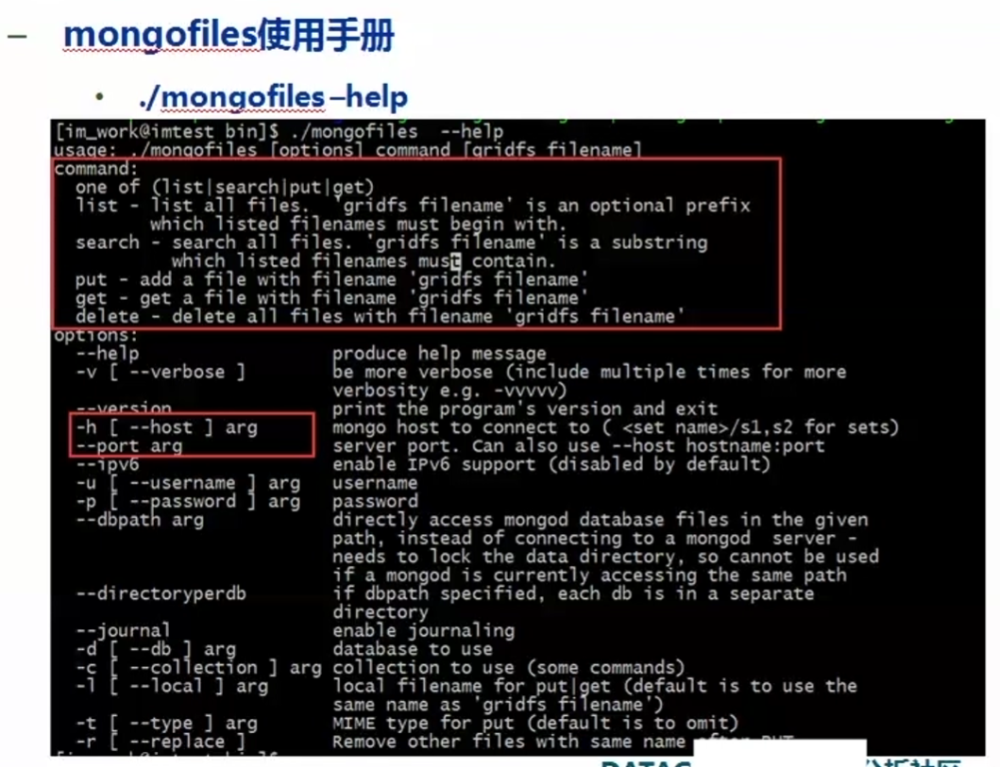

# 1. 用react和koa实现文件上传

### 1. 设置 React 项目

首先，创建一个 React 项目（如果尚未创建）：

```bash
npx create-react-app file-upload-example
cd file-upload-example
```

### 2. 安装 Axios

Axios 是一个流行的 HTTP 请求库，能够简化文件上传操作：

```bash
npm install axios
```

### 3. 创建 React 文件上传组件

创建一个新的组件 `FileUpload.js`，用于处理文件选择和上传：

```jsx
// src/FileUpload.js
import React, { useState } from 'react';
import axios from 'axios';

const FileUpload = () => {
  const [file, setFile] = useState(null);
  const [uploadProgress, setUploadProgress] = useState(0);

  // 处理文件选择
  const onFileChange = (e) => {
    setFile(e.target.files[0]);
  };

  // 处理文件上传
  const onFileUpload = () => {
    const formData = new FormData();
    formData.append('file', file);

    axios.post('http://localhost:4000/upload', formData, {
      headers: {
        'Content-Type': 'multipart/form-data',
      },
      onUploadProgress: (progressEvent) => {
        const { loaded, total } = progressEvent;
        const percent = Math.round((loaded * 100) / total);
        setUploadProgress(percent);
      },
    })
    .then((response) => {
      console.log('File uploaded successfully:', response.data);
    })
    .catch((error) => {
      console.error('Error uploading file:', error);
    });
  };

  return (
    <div>
      <h1>File Upload</h1>
      <input type="file" onChange={onFileChange} />
      <button onClick={onFileUpload}>Upload!</button>
      {uploadProgress > 0 && <p>Upload Progress: {uploadProgress}%</p>}
    </div>
  );
};

export default FileUpload;
```

### 4. 设置 Koa 服务器

在项目根目录下创建一个新的文件夹 `server`，并初始化 Node.js 项目：

```bash
mkdir server
cd server
npm init -y
```

安装 Koa 和必要的中间件：

```bash
npm install koa koa-router koa-bodyparser koa-static multer cors
```

创建一个 Koa 服务器来处理文件上传：

```javascript
// server/index.js
const Koa = require('koa');
const Router = require('koa-router');
const koaBody = require('koa-body');
const path = require('path');
const fs = require('fs');
const cors = require('@koa/cors');
const multer = require('@koa/multer');

// 创建 Koa 应用
const app = new Koa();
const router = new Router();

// 配置 CORS
app.use(cors());

// 配置上传目录
const uploadPath = path.join(__dirname, 'uploads');
if (!fs.existsSync(uploadPath)) {
  fs.mkdirSync(uploadPath);
}

// 使用 multer 处理文件上传
const upload = multer({ dest: uploadPath });

// 处理文件上传路由
router.post('/upload', upload.single('file'), async (ctx) => {
  ctx.body = 'File uploaded successfully!';
});

// 使用 Koa BodyParser 处理请求体
app.use(koaBody());

// 注册路由
app.use(router.routes()).use(router.allowedMethods());

// 启动服务器
const port = 4000;
app.listen(port, () => {
  console.log(`Server running at http://localhost:${port}`);
});
```

### 5. 运行 Koa 服务器

在 `server` 目录下启动 Koa 服务器：

```bash
node index.js
```

### 6. 运行 React 项目

在 React 项目的根目录下启动开发服务器：

```bash
npm start
```

### 总结

1. **前端**：
   - 创建一个文件选择和上传组件 `FileUpload`，使用 Axios 发送文件上传请求到 Koa 服务器。
   - 显示上传进度。

2. **后端**：
   - 使用 Koa 和 Multer 处理文件上传。
   - 配置 CORS，处理上传请求，并将文件保存到指定目录。

通过这两个步骤，你就可以在 React 和 Koa 中实现一个完整的文件上传功能。你可以根据需要进一步扩展这个示例，例如处理文件类型限制、文件大小限制、错误处理等。

# 2. @koa/multer

`@koa/multer` 是一个用于处理文件上传的中间件库，专门为 Koa.js 框架设计。它是 `multer` 的 Koa 版本，而 `multer` 是一个常用的 Express.js 中间件，用于处理 `multipart/form-data` 类型的表单数据，通常用于文件上传。

### 主要功能
- **文件上传**：处理来自表单的文件上传，并将文件保存到指定的目录中。
- **文件字段**：支持处理单个或多个文件字段。
- **文件过滤**：可以通过配置过滤上传的文件类型。
- **存储设置**：支持自定义存储引擎，将文件存储到自定义位置。

### 使用方法
1. **安装依赖**：
   ```bash
   npm install koa @koa/multer
   ```

2. **基本示例**：
   ```javascript
   const Koa = require('koa');
   const multer = require('@koa/multer');
   const path = require('path');
   const fs = require('fs');
   
   const app = new Koa();
   const upload = multer({
     dest: 'uploads/', // 上传文件保存的目录
   });
   
   // 上传单个文件
   app.use(upload.single('file')); // 'file' 是表单中文件上传字段的名称
   
   app.use(async (ctx) => {
     if (ctx.method === 'POST') {
       if (ctx.file) {
         ctx.body = {
           message: '文件上传成功！',
           file: ctx.file,
         };
       } else {
         ctx.body = {
           message: '没有上传文件',
         };
       }
     } else {
       ctx.body = '请上传文件';
     }
   });
   
   app.listen(3000, () => {
     console.log('服务器正在运行，监听端口3000');
   });
   ```

在这个示例中：
- `upload.single('file')` 用于处理一个文件字段。`file` 应与表单中文件输入的 `name` 属性匹配。
- 上传的文件将保存在 `uploads/` 目录下。

# 3. multer.memoryStorage

这行代码用于配置 `multer` 的文件存储方式。`multer` 支持多种存储引擎，`memStorage` 是其中的一种，它将上传的文件存储在内存中，而不是直接保存到磁盘。

### `memStorage` 的作用

`memStorage` 是 `multer` 的内存存储引擎，它将上传的文件存储在内存中的 `Buffer` 对象中。这对于需要临时处理上传文件而不希望将其写入磁盘的场景非常有用。

### 使用 `memStorage`

首先，你需要安装 `multer` 库，并在代码中引入 `memoryStorage` 方法。以下是如何使用 `memStorage` 的示例：

```javascript
const Koa = require('koa');
const multer = require('@koa/multer');
const { memoryStorage } = require('multer'); // 引入 memoryStorage

const app = new Koa();
const upload = multer({
  storage: memoryStorage(), // 使用内存存储引擎
});

app.use(upload.single('file')); // 上传单个文件

app.use(async (ctx) => {
  if (ctx.method === 'POST') {
    if (ctx.file) {
      // 上传的文件被存储在 ctx.file.buffer 中
      ctx.body = {
        message: '文件上传成功！',
        file: ctx.file,
      };
    } else {
      ctx.body = {
        message: '没有上传文件',
      };
    }
  } else {
    ctx.body = '请上传文件';
  }
});

app.listen(3000, () => {
  console.log('服务器正在运行，监听端口3000');
});
```

### 关键点
- `memoryStorage()`：这是 `multer` 提供的内存存储引擎，将上传的文件存储在内存中，而不是磁盘。
- `ctx.file.buffer`：在上传的文件被存储在内存中，你可以通过 `ctx.file.buffer` 访问文件的内容。

使用内存存储引擎通常适用于对文件大小较小的场景，或需要在上传后对文件进行进一步处理的情况。如果文件较大或需要持久保存，建议使用磁盘存储引擎。

# 4. upload.array('file')

`multer` 是一个用于处理 `multipart/form-data` 的中间件，常用于文件上传。在 `multer` 中，`upload.array('file')` 用于处理多个文件的上传，其中 `'file'` 是客户端表单中 `input` 元素的 `name` 属性。

具体来说：

- `upload.array('file')` 表示你希望处理名为 `'file'` 的字段中上传的多个文件。
- `'file'` 是表单中 `input` 元素的 `name` 属性，`input` 的 `type` 应该是 `file`。
- `upload.array` 方法的第一个参数是字段名，第二个参数是接收的文件数量（默认为 `undefined`，即没有限制）。

例如，如果你的 HTML 表单中有一个文件输入字段，如下：

```html
<form action="/upload" method="post" enctype="multipart/form-data">
  <input type="file" name="file" multiple>
  <button type="submit">Upload</button>
</form>
```

你可以使用 `multer` 的 `upload.array('file')` 中间件来处理这些文件：

```javascript
const multer = require('multer');
const upload = multer({ dest: 'uploads/' });

app.post('/upload', upload.array('file'), (req, res) => {
  // req.files 将包含上传的文件信息
  console.log(req.files);
  res.send('Files uploaded successfully');
});
```

在这个例子中，`upload.array('file')` 将处理所有名为 `'file'` 的文件输入，并将文件信息存储在 `req.files` 中。

# 5. @koa/multer可以用node中的原生模块代替吗

是的，你可以使用 Node.js 原生模块来代替 `@koa/multer` 进行文件上传处理。`@koa/multer` 是基于 `multer` 的中间件，用于处理 multipart/form-data 请求中的文件上传。虽然 `@koa/multer` 是一个方便的解决方案，但你可以使用 Node.js 原生的 `http` 模块或其他第三方库实现类似的功能。

### 使用 Node.js 原生模块处理文件上传

处理文件上传通常涉及解析 multipart/form-data 请求。Node.js 的原生模块 `http` 不直接支持 multipart/form-data，但你可以通过解析请求的内容来实现文件上传处理。

以下是一个使用 Node.js 原生模块处理文件上传的示例：

#### 1. 安装必要的库

虽然你可以完全依赖原生模块，但处理 multipart/form-data 可能需要一些额外的库来简化解析过程。一个常用的库是 `busboy`，它能帮助你处理文件上传。

```bash
npm install busboy
```

#### 2. 实现文件上传处理

**示例代码：**

```javascript
const http = require('http');
const Busboy = require('busboy');
const fs = require('fs');
const path = require('path');

const server = http.createServer((req, res) => {
  if (req.method === 'POST' && req.headers['content-type'].startsWith('multipart/form-data')) {
    const busboy = new Busboy({ headers: req.headers });

    busboy.on('file', (fieldname, file, filename, encoding, mimetype) => {
      console.log(`File [${fieldname}]: ${filename}`);
      const saveTo = path.join(__dirname, 'uploads', filename);
      file.pipe(fs.createWriteStream(saveTo));
    });

    busboy.on('finish', () => {
      res.writeHead(200, { 'Connection': 'close' });
      res.end('Upload complete');
    });

    req.pipe(busboy);
  } else {
    res.writeHead(404, { 'Content-Type': 'text/plain' });
    res.end('Not found');
  }
});

server.listen(3000, () => {
  console.log('Server listening on port 3000');
});
```

#### 3. 解析代码

- **创建服务器**: 使用 Node.js 的 `http` 模块创建一个 HTTP 服务器。
- **检测请求类型**: 检查请求方法是否为 POST，并且 Content-Type 是否以 `multipart/form-data` 开头。
- **创建 Busboy 实例**: `Busboy` 用于解析 multipart/form-data 请求。
- **处理文件字段**: 使用 `busboy.on('file')` 事件处理文件字段，将上传的文件流写入到本地文件系统。
- **完成处理**: 使用 `busboy.on('finish')` 事件表示所有文件都已上传完成。
- **启动服务器**: 监听端口 3000。

### 与 `@koa/multer` 的对比

**优点**:
- **原生解决方案**: 使用 Node.js 原生模块可以减少对第三方库的依赖。
- **灵活性**: 可以更细粒度地控制请求和文件上传的处理。

**缺点**:
- **复杂性**: 处理 multipart/form-data 请求比较复杂，涉及到流的管理和解析。
- **代码量**: 使用原生模块处理文件上传的代码可能更复杂、更长。

### 结论

虽然可以用 Node.js 原生模块和一些辅助库（如 `busboy`）来代替 `@koa/multer`，但 `@koa/multer` 提供了一个更简单、更易于集成的解决方案，特别是在 Koa 应用中。如果你希望使用原生模块，你可以按照上述示例来实现，但对于大多数应用程序来说，使用 `@koa/multer` 或类似的中间件会更方便。

# 6. input的file属性中为啥看不到上传文件的具体buffer

在 JavaScript 中，使用 `input` 元素上传文件时，文件的内容不会直接暴露为可访问的 `buffer`。这主要是出于安全和隐私考虑。虽然你可以获取文件的信息（如文件名、大小等），但要访问文件的内容，你需要通过其他方式进行处理。

### 如何访问上传文件的内容

1. **前端访问文件内容：**
   在客户端，你可以使用 `FileReader` API 来读取文件内容。下面是一个简单的例子：

   ```html
   <input type="file" id="fileInput">
   <script>
     document.getElementById('fileInput').addEventListener('change', function(event) {
       const file = event.target.files[0];
       if (file) {
         const reader = new FileReader();
         reader.onload = function(e) {
           const fileContent = e.target.result; // 文件内容
           console.log(fileContent); // 可以是文本或数据URL
         };
         reader.readAsText(file); // 也可以使用 readAsArrayBuffer、readAsDataURL 等方法
       }
     });
   </script>
   ```

   `FileReader` 提供了几种不同的方法来读取文件内容，如 `readAsText`、`readAsArrayBuffer` 和 `readAsDataURL`。这些方法会将文件内容转换为相应的格式。

2. **后端处理上传文件：**
   当文件上传到服务器后，服务器端可以使用 `multer` 等中间件来处理文件。文件会被存储在服务器上的临时位置，你可以访问文件的 `buffer`，如下所示：

   ```javascript
   const multer = require('multer');
   const upload = multer({ storage: multer.memoryStorage() });
   
   app.post('/upload', upload.single('file'), (req, res) => {
     const fileBuffer = req.file.buffer; // 文件的 Buffer
     console.log(fileBuffer); // 可以直接访问文件的 Buffer
     res.send('File uploaded and processed');
   });
   ```

   在这个例子中，`multer.memoryStorage()` 使得文件被存储在内存中，从而你可以直接访问其 `buffer`。

### 总结

- **前端**: 使用 `FileReader` API 来读取文件内容，但不能直接访问文件的原始 `buffer`。
- **后端**: 使用类似 `multer` 的中间件处理文件上传，可以直接访问文件的 `buffer`。

# 7. GridFS

https://docs.mongoing.com/cun-chu/journaling/guan-li-ri-zhi-ji-lu/gridfs#shi-mo-shi-hou-shi-yong-gridfs

https://www.bilibili.com/video/BV1JA411i7gi/?spm_id_from=333.337.search-card.all.click&vd_source=a7089a0e007e4167b4a61ef53acc6f7e


|  |  |
| ------------------------------------------------------------ | ------------------------------------------------------------ |

https://www.bilibili.com/video/BV1W5411W76G/?spm_id_from=333.999.0.0&vd_source=a7089a0e007e4167b4a61ef53acc6f7e

|  |      |
| ------------------------------------------------------------ | ---- |


|  |  |
| ------------------------------------------------------------ | ------------------------------------------------------------ |

# 8. GridFSBucket

`GridFSBucket` 是 MongoDB Node.js 驱动程序中的一个类，用于处理 GridFS 存储系统的文件上传和下载。GridFS 是 MongoDB 提供的一种机制，用于存储和检索大文件，例如图像、视频或其他大型文档。它将大文件拆分为较小的块，并将这些块存储在 MongoDB 的不同文档中，从而允许高效地存储和检索这些文件。

### 主要功能

`GridFSBucket` 提供了一些主要的功能：

1. **文件上传**：允许将文件上传到 GridFS 中。
2. **文件下载**：允许从 GridFS 中读取和下载文件。
3. **文件删除**：允许从 GridFS 中删除文件。
4. **文件查找**：允许查找存储在 GridFS 中的文件的元数据。

### 主要方法

以下是 `GridFSBucket` 中的一些常用方法：

1. **`openUploadStream(filename, options)`**

   创建一个上传流，用于将文件上传到 GridFS。

   ```javascript
   const uploadStream = bucket.openUploadStream('myFile.txt');
   ```

   **参数**:

   - `filename`：文件的名称。
   - `options`（可选）：上传选项，例如文件的元数据。

2. **`openDownloadStream(id)`**

   创建一个下载流，用于从 GridFS 中读取文件。

   ```javascript
   const downloadStream = bucket.openDownloadStream(fileId);
   ```

   **参数**:

   - `id`：文件的唯一标识符，通常是文件的 `_id` 字段值。

3. **`delete(id)`**

   删除存储在 GridFS 中的文件。

   ```javascript
   bucket.delete(fileId, (err) => {
     if (err) {
       console.error('Failed to delete file:', err);
     }
   });
   ```

   **参数**:

   - `id`：文件的唯一标识符。

4. **`find(filter)`**

   查找存储在 GridFS 中的文件的元数据。

   ```javascript
   bucket.find({ filename: 'myFile.txt' }).toArray((err, files) => {
     if (err) {
       console.error('Failed to find files:', err);
     } else {
       console.log('Found files:', files);
     }
   });
   ```

   **参数**:

   - `filter`：用于查询的过滤条件。

### 示例用法

以下是一个使用 `GridFSBucket` 上传和下载文件的简单示例：

```javascript
const { MongoClient, GridFSBucket } = require('mongodb');
const fs = require('fs');

async function run() {
  const client = new MongoClient('mongodb://localhost:27017', { useUnifiedTopology: true });
  await client.connect();

  const db = client.db('mydatabase');
  const bucket = new GridFSBucket(db);

  // 上传文件
  const uploadStream = bucket.openUploadStream('example.txt');
  fs.createReadStream('localfile.txt').pipe(uploadStream);

  uploadStream.on('finish', () => {
    console.log('File uploaded successfully');
  });

  // 下载文件
  const fileId = 'your-file-id-here'; // 替换为实际文件 ID
  const downloadStream = bucket.openDownloadStream(fileId);
  downloadStream.pipe(fs.createWriteStream('downloadedfile.txt'));

  downloadStream.on('end', () => {
    console.log('File downloaded successfully');
    client.close();
  });

  downloadStream.on('error', (err) => {
    console.error('Error downloading file:', err);
    client.close();
  });
}

run().catch(console.dir);
```

### 总结

`GridFSBucket` 是处理 MongoDB GridFS 存储的主要工具，它提供了方便的 API 用于文件的上传、下载、删除和查询。通过使用 `GridFSBucket`，你可以有效地管理存储在 MongoDB 中的大文件。

# 9. gridfs-stream

`gridfs-stream` 是一个用于在 Node.js 环境中与 MongoDB 的 GridFS 存储进行交互的库。GridFS 是 MongoDB 的一个规范，用于存储和检索超大文件，它将文件分成多个块存储在不同的文档中。`gridfs-stream` 库提供了一个流式接口来处理这些文件，使得文件的上传和下载更加高效。

### 核心功能

1. **流式上传和下载**：
   - `gridfs-stream` 提供了流式接口来处理文件的上传和下载，使得对大文件的操作更加高效。

2. **与 MongoDB 集成**：
   - 库与 MongoDB 的 `GridFS` 存储系统紧密集成，能够利用 MongoDB 的存储能力来处理文件。

3. **简化文件管理**：
   - 通过 `gridfs-stream`，可以方便地实现文件的读取、写入、删除和管理操作，而无需直接处理 MongoDB 的底层存储机制。

### 安装和使用

#### 安装

可以通过 npm 安装 `gridfs-stream`：

```bash
npm install gridfs-stream
```

#### 示例用法

以下是如何在 Node.js 中使用 `gridfs-stream` 进行文件上传和下载的基本示例。

1. **设置和连接到 MongoDB**

   ```javascript
   const mongoose = require('mongoose');
   const Grid = require('gridfs-stream');

   // 连接到 MongoDB
   mongoose.connect('mongodb://localhost:27017/mydatabase', {
     useNewUrlParser: true,
     useUnifiedTopology: true
   });

   // 获取连接对象
   const conn = mongoose.connection;
   let gfs;

   conn.once('open', () => {
     // 初始化 GridFS Stream
     gfs = Grid(conn.db, mongoose.mongo);
     gfs.collection('uploads'); // 设置 GridFS 的集合名称
   });
   ```

2. **文件上传**

   ```javascript
   const { PassThrough } = require('stream');
   const fs = require('fs');

   // 创建一个可读流来读取文件
   const readStream = fs.createReadStream('path/to/largefile.txt');

   // 创建一个可写流来将文件写入 GridFS
   const writeStream = gfs.createWriteStream({
     filename: 'largefile.txt',
     content_type: 'text/plain'
   });

   // 管道数据流
   readStream.pipe(writeStream);

   writeStream.on('close', (file) => {
     console.log(`${file.filename} written to DB`);
   });
   ```

3. **文件下载**

   ```javascript
   const fileId = '60d21b4667d0d8992e610c85'; // 文件 ID
   
   // 从 GridFS 获取一个读取流
   const readStream = gfs.createReadStream({
     _id: fileId
   });
   
   // 将文件流管道到响应对象（假设在 Express.js 中）
   readStream.pipe(res);
   ```

### 常用 API

- **`gfs.createWriteStream([options])`**：创建一个可写流，将数据写入 GridFS。`options` 可以包含文件名、内容类型等元数据。
  
- **`gfs.createReadStream([query])`**：创建一个可读流，从 GridFS 读取文件。`query` 通常包含文件 ID 或其他筛选条件。

- **`gfs.files.findOne(query)`**：查找一个文件，并返回其元数据。

- **`gfs.remove(query, [callback])`**：删除一个或多个文件。

### 优势

1. **流式处理**：通过流式接口可以有效处理大文件，减少内存占用。
2. **与 MongoDB 紧密集成**：方便将文件存储在 MongoDB 的 GridFS 中，利用 MongoDB 的存储和查询能力。
3. **简化操作**：简化了文件上传、下载、删除等操作，提高开发效率。

### 注意事项

- **错误处理**：在流的操作中需要适当的错误处理，确保操作的可靠性。
- **性能考量**：虽然 `gridfs-stream` 提供了流式接口，但对于非常大的文件或高并发的操作，仍需考虑性能优化和资源管理。

`gridfs-stream` 是处理大文件存储和管理的有力工具，通过流式操作提高了对 MongoDB GridFS 的文件操作效率。

# 10. fs.createReadStream('localfile.txt').pipe(uploadStream)

这行代码用于将本地文件 `localfile.txt` 的内容通过流的方式传输到 `uploadStream`。这种做法特别适用于处理大文件，因为它不需要一次性将整个文件加载到内存中，而是逐块读取和传输。下面是对这行代码的详细分析：

```javascript
fs.createReadStream('localfile.txt').pipe(uploadStream);
```

### 详细解释

1. **`fs.createReadStream('localfile.txt')`**:
   - **`fs`**: Node.js 的文件系统模块（`fs`）提供了文件操作的功能。
   - **`createReadStream`**: 这是 `fs` 模块中的一个方法，用于创建一个可读流（Readable Stream）。可读流用于从文件系统中读取数据。
   - **`'localfile.txt'`**: 这是要读取的本地文件的路径。`createReadStream` 会打开这个文件，并返回一个可读流对象。

2. **`.pipe(uploadStream)`**:
   - **`pipe`**: 这是流对象的一个方法，用于将一个流（在这里是可读流）连接到另一个流（在这里是写入流）。`pipe` 方法会将数据从源流（可读流）传输到目标流（写入流）。
   - **`uploadStream`**: 这是一个可写流（Writable Stream），它接收来自 `fs.createReadStream` 的数据，并将其写入目标位置。在实际应用中，`uploadStream` 可能是一个 MongoDB GridFS 的上传流、HTTP 响应流或其他类型的流。

### 示例用途

在实际应用中，这种代码片段通常用于以下几种场景：

- **文件上传**:
  - **上传到 GridFS**: 将本地文件流式地上传到 MongoDB 的 GridFS 存储中。
  - **上传到远程服务器**: 将本地文件流式地传输到远程服务器，例如使用 HTTP 请求上传文件。

- **文件处理**:
  - **文件转换**: 读取文件的内容，并将其传输到另一个流进行处理或转换。
  - **文件备份**: 将本地文件流式地备份到其他存储位置。

### 示例代码

以下是一个使用 `fs.createReadStream` 和 `pipe` 方法将本地文件上传到 MongoDB GridFS 的示例：

```javascript
const fs = require('fs');
const { MongoClient, GridFSBucket } = require('mongodb');

async function uploadFileToGridFS(filePath) {
  const uri = 'mongodb://localhost:27017';
  const client = new MongoClient(uri, { useNewUrlParser: true, useUnifiedTopology: true });

  try {
    await client.connect();
    const db = client.db('mydatabase');
    const bucket = new GridFSBucket(db);

    const uploadStream = bucket.openUploadStream('uploadedFile.txt');
    fs.createReadStream(filePath).pipe(uploadStream);

    uploadStream.on('finish', () => {
      console.log('File uploaded successfully');
    });
  } catch (error) {
    console.error('Error uploading file:', error);
  } finally {
    await client.close();
  }
}

uploadFileToGridFS('localfile.txt');
```

### 总结

- **`fs.createReadStream`**: 创建一个读取文件内容的流。
- **`pipe`**: 将一个流的输出传输到另一个流的输入。
- **`uploadStream`**: 目标流（例如 GridFS 的上传流），接收数据并写入。

这种流式处理方式有效地处理大文件，避免了将整个文件加载到内存中的问题，提高了性能和资源利用率。

# 11. writeStream.write(obj);

`writeStream.write(obj);` 这行代码用于将数据写入到可写流（Writable Stream）。在 Node.js 中，可写流是用于将数据写入目标（如文件、网络、标准输出等）的对象。下面是对这行代码的详细分析：

### 详细解释

1. **`writeStream`**:
   - `writeStream` 是一个可写流（Writable Stream）的实例。可写流是一种流对象，它用于将数据写入某个目标，例如文件系统、网络连接或其他输出流。
   - 常见的可写流包括文件流（`fs.createWriteStream`）、HTTP 响应流、TCP 套接字流等。

2. **`.write(obj)`**:
   - `write` 是可写流的一个方法，用于将数据写入流中。
   - **`obj`**: 这是要写入流的数据。`obj` 可以是一个字符串、Buffer、或其他类型的数据，具体取决于流的实现和目标。例如，对于文件流，`obj` 通常是一个字符串或 Buffer 对象，用于写入文件内容。

### 示例代码

以下是一个使用 `writeStream.write` 将数据写入文件的示例：

```javascript
const fs = require('fs');

// 创建一个写入流，指向目标文件
const writeStream = fs.createWriteStream('output.txt');

// 写入数据到流中
writeStream.write('Hello, world!\n');
writeStream.write('This is a test.\n');

// 关闭流
writeStream.end(() => {
  console.log('File has been written.');
});
```

### 工作原理

1. **创建可写流**:
   - `fs.createWriteStream('output.txt')` 创建一个可写流对象，该对象将数据写入到 `output.txt` 文件中。

2. **写入数据**:
   - `writeStream.write('Hello, world!\n')` 将字符串 `'Hello, world!\n'` 写入到 `output.txt` 文件。
   - `writeStream.write('This is a test.\n')` 将字符串 `'This is a test.\n'` 写入到 `output.txt` 文件。

3. **关闭流**:
   - `writeStream.end()` 结束写入操作，并关闭流。可以传递一个回调函数，这个函数在流关闭后执行。

### 数据类型

- **字符串**: 如果写入的 `obj` 是一个字符串，流会将其转化为字节并写入目标。
- **Buffer**: 如果写入的是 `Buffer` 对象，流会将其原始字节写入目标。
- **对象**: 如果流的 `write` 方法实现了处理对象的逻辑，可以写入对象数据。但通常情况下，写入对象需要将其序列化成字符串或 Buffer。

### 注意事项

1. **流的背压机制**:
   - 可写流有背压机制（backpressure），即在流的内部缓冲区满时，`write` 方法可能会返回 `false`，表示暂时无法写入更多数据。需要在流的 `drain` 事件中处理这种情况。

2. **错误处理**:
   - 应确保在流中添加错误处理，以捕获任何可能的写入错误。

   ```javascript
   writeStream.on('error', (err) => {
     console.error('Write error:', err);
   });
   ```

3. **流的结束**:
   - 在完成所有写入操作后调用 `end()` 方法，以关闭流并释放资源。

### 总结

- **`writeStream`**: 可写流实例，用于将数据写入目标。
- **`.write(obj)`**: 将数据写入流中。`obj` 可以是字符串、Buffer 或其他类型的数据。
- **流的背压和错误处理**: 处理流的缓冲区状态和可能的错误。

`writeStream.write(obj)` 是流式写入操作的核心方法，允许高效地将数据写入目标，尤其适用于处理大量数据和文件操作。

# 12. 怎么将fs.createWriteStream的返回值转换成Buffer

`fs.createWriteStream` 返回的是一个 `Writable` 流，不直接支持将其返回值转换为 `Buffer`。`Writable` 流主要用于**将数据写入文件**，而**不是将数据从流中读取到 `Buffer`**。

如果你需要将数据写入文件并同时获取 `Buffer`，你可以采用以下步骤：

1. **创建一个临时可读流**：首先，将数据写入一个临时的内存流，例如使用 `stream.PassThrough`。
2. **将数据从这个流中读取为 `Buffer`**：接着，你可以通过读取这个临时流来获取数据的 `Buffer`。

下面是一个示例代码，展示了如何实现这一点：

```javascript
const fs = require('fs');
const { PassThrough } = require('stream');

// 创建一个 PassThrough 流，用于临时存储数据
const passThroughStream = new PassThrough();

// 将 PassThrough 流写入文件
const fileStream = fs.createWriteStream('output.txt');
passThroughStream.pipe(fileStream);

// 将数据写入 PassThrough 流
passThroughStream.write('Hello, World!');
passThroughStream.end();

// 从 PassThrough 流中读取数据为 Buffer
const buffers = [];
passThroughStream.on('data', chunk => buffers.push(chunk));
passThroughStream.on('end', () => {
  const resultBuffer = Buffer.concat(buffers);
  console.log('Buffer:', resultBuffer);
});
```

这个示例中，我们使用了 `PassThrough` 流，它是一个可以被读写的流。数据首先通过 `PassThrough` 流被写入到文件中，然后我们监听 `PassThrough` 流的 `data` 事件来收集数据块，最后通过 `Buffer.concat` 将这些数据块合并成一个 `Buffer` 对象。

请注意，`PassThrough` 流的使用是为了示例说明实际应用中可能会遇到的场景。具体实现可能会根据你的应用需求有所不同。

# 13. 怎么查看存储在GridFs中的文件

要查看存储在 MongoDB GridFS 中的文件，你可以使用以下几种方法：

### 1. 使用 MongoDB Shell (`mongosh`)

MongoDB Shell 是一种交互式命令行工具，可以用于执行数据库查询和管理 GridFS 文件。

**示例：查看 GridFS 中的文件**

1. **连接到 MongoDB**：

   ```bash
   mongosh
   ```

2. **选择数据库**：

   ```javascript
   use mydatabase
   ```

3. **获取 GridFS 文件列表**：

   使用 `fs.files` 集合查询文件信息：

   ```javascript
   db.fs.files.find().pretty()
   ```

   这将列出 `fs.files` 集合中的所有文件及其相关信息，如文件名、上传日期等。

4. **获取特定文件信息**：

   ```javascript
   db.fs.files.findOne({ filename: "yourfile.txt" })
   ```

   替换 `yourfile.txt` 为你要查找的文件名。这个命令将返回该文件的元数据。

5. **下载文件内容**：

   你可以使用 `GridFSBucket` 的下载流来获取文件内容。例如，要下载文件并将其写入到本地文件，你可以使用以下命令：

   ```javascript
   const bucket = new Mongo.GridFSBucket(db);
   const downloadStream = bucket.openDownloadStreamByName('yourfile.txt');
   
   const fs = require('fs');
   const writeStream = fs.createWriteStream('localfile.txt');
   downloadStream.pipe(writeStream);
   ```

   上述代码将从 GridFS 下载名为 `yourfile.txt` 的文件，并将其保存为 `localfile.txt`。

### 2. 使用 MongoDB Compass

MongoDB Compass 是 MongoDB 的官方图形化工具，可以用来管理 GridFS 文件。

1. **打开 MongoDB Compass 并连接到你的 MongoDB 实例**。
2. **选择数据库**。
3. **找到 `fs.files` 集合**，点击它查看文件列表。
4. **点击文件的 `_id`** 来查看文件的详细信息。
5. **下载文件**: 在文件详细信息视图中，你可以点击下载按钮来下载文件。

### 3. 使用 Node.js 驱动程序

你可以使用 MongoDB 的 Node.js 驱动程序来查看和下载 GridFS 中的文件。

**示例代码：列出和下载 GridFS 文件**

```javascript
const { MongoClient, GridFSBucket } = require('mongodb');
const fs = require('fs');
const path = require('path');

async function run() {
  const uri = 'mongodb://localhost:27017';
  const client = new MongoClient(uri, { useNewUrlParser: true, useUnifiedTopology: true });

  try {
    await client.connect();
    const db = client.db('mydatabase');
    const bucket = new GridFSBucket(db);

    // 列出文件
    const files = await db.collection('fs.files').find().toArray();
    console.log('Files in GridFS:', files);

    // 下载特定文件
    const downloadStream = bucket.openDownloadStreamByName('yourfile.txt');
    const writeStream = fs.createWriteStream(path.join(__dirname, 'downloadedfile.txt'));

    downloadStream.pipe(writeStream);

    writeStream.on('finish', () => {
      console.log('File downloaded successfully');
    });
  } catch (error) {
    console.error('Error:', error);
  } finally {
    await client.close();
  }
}

run();
```

### 4. 使用 `mongofiles` 工具

`mongofiles` 是 MongoDB 的一个命令行工具，可以用于管理 GridFS 文件。它包括上传、下载、删除和列出文件的功能。

**列出文件**：

```bash
mongofiles --db mydatabase --collection fs.files list
```

**下载文件**：

```bash
mongofiles --db mydatabase --collection fs.files get yourfile.txt
```

**上传文件**：

```bash
mongofiles --db mydatabase --collection fs.files put yourfile.txt
```

### 总结

- **MongoDB Shell (`mongosh`)**: 通过查询 `fs.files` 集合查看文件信息，并使用 `GridFSBucket` 下载文件。
- **MongoDB Compass**: 图形化工具，查看和下载 GridFS 文件。
- **Node.js 驱动程序**: 使用代码查询和下载 GridFS 文件。
- **`mongofiles` 工具**: 命令行工具，用于管理 GridFS 文件。

这些方法提供了多种查看和操作 MongoDB GridFS 中文件的方式，可以根据你的需要选择合适的方法。

# 14. fs.files和fs.chunks有什么区别

在 MongoDB GridFS 中，文件被分为两个集合：`fs.files` 和 `fs.chunks`。这两个集合分别用于存储文件的元数据和实际的数据块。以下是它们之间的详细区别：

### `fs.files` 集合

- **作用**: 存储文件的元数据。
- **内容**: 包含有关每个文件的基本信息，如文件名、上传日期、文件大小、文件类型等。
- **结构**: 每个文档包含文件的描述信息，例如：
  ```json
  {
    "_id": ObjectId("..."),          // 文件的唯一标识符
    "filename": "example.txt",       // 文件名
    "metadata": { ... },             // 附加的元数据（可选）
    "length": 123456,                // 文件大小（字节）
    "chunkSize": 261120,             // 每个块的大小（字节）
    "uploadDate": ISODate("..."),    // 上传日期
    "md5": "..."                     // 文件的 MD5 哈希（可选）
  }
  ```

### `fs.chunks` 集合

- **作用**: 存储文件的实际数据块。
- **内容**: 包含文件数据的分块部分。文件被分成多个块，每个块存储在一个单独的文档中。
- **结构**: 每个文档包含文件数据的一部分和与文件相关的引用信息，例如：
  
  ```json
  {
    "_id": ObjectId("..."),          // 块的唯一标识符
    "files_id": ObjectId("..."),     // 引用 `fs.files` 集合中的文件 `_id`
    "n": 0,                          // 块的序号（从 0 开始）
    "data": BinData(0, "...")        // 文件数据块（以二进制格式存储）
  }
  ```

### 如何配合使用

1. **文件上传**:
   - 当文件上传到 GridFS 时，首先会在 `fs.files` 集合中创建一个文档，记录文件的元数据。
   - 然后，文件被分割成多个块，每个块会被存储在 `fs.chunks` 集合中。每个块都与 `fs.files` 集合中的文件文档关联起来。

2. **文件下载**:
   - 当文件从 GridFS 下载时，系统会根据 `fs.files` 集合中的文件 `_id` 查找相关的 `fs.chunks` 文档。
   - 将文件的所有块按正确的顺序组合在一起，恢复成原始文件。

### 示例操作

**查询文件元数据**:

```javascript
db.fs.files.find().pretty();
```

**查询文件数据块**:

```javascript
db.fs.chunks.find({ files_id: ObjectId("...") }).sort({ n: 1 }).toArray();
```

### 总结

- **`fs.files`**: 存储文件的元数据，描述文件的基本信息。
- **`fs.chunks`**: 存储文件的实际数据块，分块存储文件内容。

这两个集合共同作用，允许 MongoDB GridFS 存储和管理大文件，支持文件的分块上传、下载和恢复。

# 15. mongoose.createConnection和mongoose.connect的区别

`mongoose.createConnection` 和 `mongoose.connect` 是 Mongoose 提供的两个不同的方法，用于连接 MongoDB 数据库。它们各有不同的用途和特性。以下是它们之间的主要区别：

### 1. `mongoose.connect`

- **用途**: 用于建立全局单一的数据库连接。
- **用法**:
  ```javascript
  const mongoose = require('mongoose');
  
  mongoose.connect('mongodb://localhost:27017/mydatabase', {
    useNewUrlParser: true,
    useUnifiedTopology: true,
  }).then(() => {
    console.log('Connected to MongoDB');
  }).catch(err => {
    console.error('Connection error', err);
  });
  ```
- **特点**:
  - **全局连接**: `mongoose.connect` 创建一个全局的数据库连接，通常在应用程序的启动时调用。
  - **单一连接**: 默认情况下，应用程序中只有一个全局连接实例。Mongoose 会自动管理这个连接。
  - **全局状态**: 使用 `mongoose.connect` 后，所有 Mongoose 模型和查询都会使用这个全局连接。

### 2. `mongoose.createConnection`

- **用途**: 用于创建多个独立的数据库连接。
- **用法**:
  ```javascript
  const mongoose = require('mongoose');
  
  const connection = mongoose.createConnection('mongodb://localhost:27017/mydatabase', {
    useNewUrlParser: true,
    useUnifiedTopology: true,
  });
  
  connection.on('connected', () => {
    console.log('Connected to MongoDB with createConnection');
  });
  
  connection.on('error', (err) => {
    console.error('Connection error', err);
  });
  ```
- **特点**:
  - **多个连接**: `mongoose.createConnection` 创建一个新的连接实例，你可以在应用程序中创建多个连接，彼此之间是独立的。
  - **连接实例**: 你可以通过 `createConnection` 创建多个数据库连接，每个连接有自己的状态和设置。
  - **独立模型**: 每个使用 `createConnection` 创建的连接都有自己独立的模型，不能共享模型或查询。
  - **适用场景**: 适用于需要连接多个数据库或使用不同配置的场景。例如，如果你的应用需要同时连接主数据库和备份数据库，或者需要使用不同的数据库权限。

### 选择哪一个？

- **使用 `mongoose.connect`**:
  - 当你的应用程序只需要一个全局数据库连接时。
  - 对于大多数常规应用程序，使用 `mongoose.connect` 是最简单和最常见的选择。

- **使用 `mongoose.createConnection`**:
  - 当你需要管理多个数据库连接，或者需要为不同的连接使用不同的配置时。
  - 当需要在一个应用程序中同时连接到多个数据库，或者需要隔离不同的数据库操作时。

### 示例

**全局连接 (`mongoose.connect`) 示例**:

```javascript
const mongoose = require('mongoose');

// 创建全局连接
mongoose.connect('mongodb://localhost:27017/mydatabase', {
  useNewUrlParser: true,
  useUnifiedTopology: true,
});

// 定义模型
const User = mongoose.model('User', new mongoose.Schema({ name: String }));

// 使用模型
User.find().then(users => console.log(users));
```

**独立连接 (`mongoose.createConnection`) 示例**:

```javascript
const mongoose = require('mongoose');

// 创建独立连接
const connection = mongoose.createConnection('mongodb://localhost:27017/mydatabase', {
  useNewUrlParser: true,
  useUnifiedTopology: true,
});

// 定义模型
const User = connection.model('User', new mongoose.Schema({ name: String }));

// 使用模型
User.find().then(users => console.log(users));
```

### 总结

- **`mongoose.connect`**: 用于创建一个全局的单一数据库连接，适合大多数场景。
- **`mongoose.createConnection`**: 用于创建多个独立的数据库连接，适合需要管理多个连接或使用不同配置的场景。

# 16. 以流的形式将数据写入文件

- `fs.createWriteStream(finalFilePath)`
- 有什么好处
- 为什么可以降低内存消耗？
- https://juejin.cn/post/7241514309716803644

# 17. 大文件分片上传后为何上传速度更慢了

分片上传大文件通常是为了提高上传效率和可靠性，但在某些情况下，分片上传可能会导致整体上传速度变慢。这可能是由于以下几个因素造成的：

### 1. **网络开销和延迟**

- **额外的请求开销**：每个分片通常需要一个单独的请求，这会增加总的网络开销，包括请求的建立、传输和处理的时间。尤其是在高延迟的网络环境中，这种开销可能变得显著。
- **并发请求限制**：许多服务器和网络都有并发请求限制。如果上传分片的请求超过了这些限制，可能会导致请求排队，从而减少上传速度。

### 2. **分片处理和合并**

- **服务器端处理开销**：每个分片需要在服务器端进行处理，包括存储、验证和合并操作。这些额外的处理可能会消耗时间和资源，影响总体上传速度。
- **合并时间**：分片上传完成后，服务器通常需要将这些分片合并成一个完整的文件。合并操作可能会影响上传速度，尤其是在文件分片数量多或文件较大的情况下。

### 3. **分片大小选择**

- **分片大小影响**：选择不当的分片大小可能会影响上传性能。分片过小可能会导致大量的请求开销，而分片过大则可能增加每个分片的传输时间。最佳的分片大小取决于网络带宽、延迟和服务器处理能力。

### 4. **网络拥塞**

- **带宽竞争**：在网络上同时上传多个分片可能会导致带宽竞争，从而降低整体上传速度，尤其是在带宽有限或网络繁忙时。

### 5. **客户端实现**

- **上传策略**：客户端实现的上传策略也可能影响速度。比如，客户端在处理分片上传时可能没有有效地管理并发请求，或者没有正确处理错误重试和超时等情况。

### 6. **错误重试和超时**

- **重试机制**：如果某些分片上传失败，客户端可能会进行重试，这会增加总的上传时间。如果重试策略不够优化，可能会导致上传速度降低。

### 优化建议

1. **调整分片大小**：根据网络状况和服务器能力，选择一个合适的分片大小，以平衡请求开销和传输效率。

2. **优化并发处理**：合理管理并发上传请求，避免超出服务器和网络的并发限制。可以使用队列或限流机制来平衡请求负载。

3. **高效的错误处理**：实现高效的错误处理和重试机制，避免因错误重试导致上传速度变慢。

4. **网络优化**：尽量在网络条件良好的环境下进行上传，或者使用专门的网络优化技术（如带宽管理和数据压缩）。

5. **使用合适的协议**：考虑使用更适合大文件传输的协议或库，如 HTTP/2 或专门的文件传输协议，这些协议在处理并发请求和流量管理方面通常会有更好的性能表现。

6. **客户端和服务器性能**：优化客户端和服务器端的性能，确保它们能够高效地处理上传请求和分片合并操作。

通过调整这些因素，可以优化大文件分片上传的速度，尽可能地减少上传过程中的延迟和开销。


