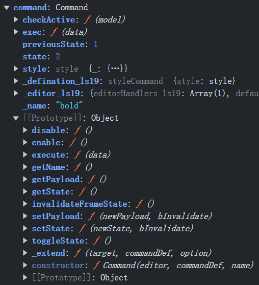
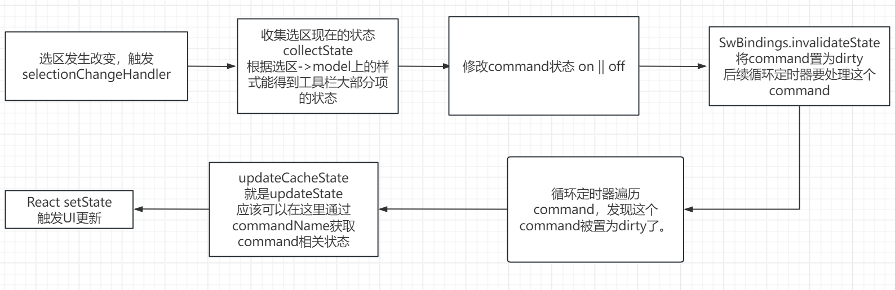

# 1. command数据结构



如果自己设计command

- name属性

- state属性

- bCtrlDirty属性？？？？是代表是否要更新UI吗？？？

- 是否需要previousState属性？？？

- setState(state: CMDSTATE)方法

  - ```typescript
    public static CMDSTATE = {
         TRISTATE_ON: 1, // 打开
         TRISTATE_OFF: 2, // 关闭
         TRISTATE_DISABLED: 0,
         TRISTATE_HIDDEN: 3,
     };
    
    setState(state: typeof constants.CMDSTATE[keyof typeof constants.CMDSTATE]){
        // xxx: 上面typeof写法太复杂了，读不懂。可以用enum来简化代码，如下。
    }
    ```

  - ```typescript
    enum CMDSTATE {
      TRISTATE_ON = 1,
      TRISTATE_OFF = 2,
      TRISTATE_DISABLED = 0,
      TRISTATE_HIDDEN = 3,
    }
    Command.prototype.setState(newState: CMDSTATE){
        if (this.state === newState){
            return
        }
    }
    ```

  - 

- getState方法

- Invalidate方法

  - ```
    this.bCtrlDirty = true;
    ```

  - 



