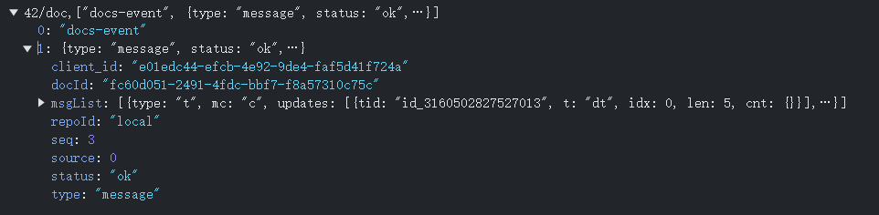
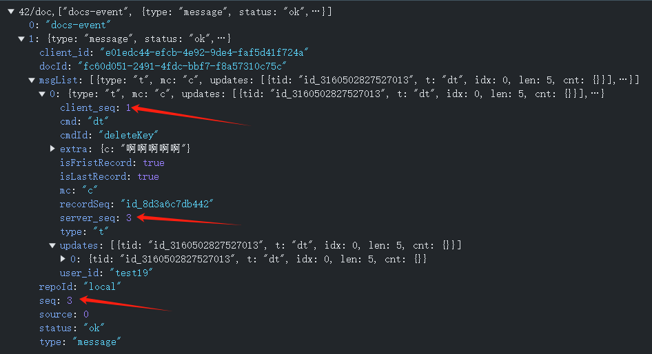
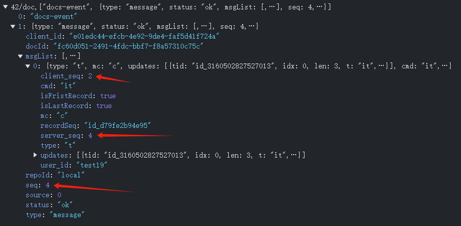
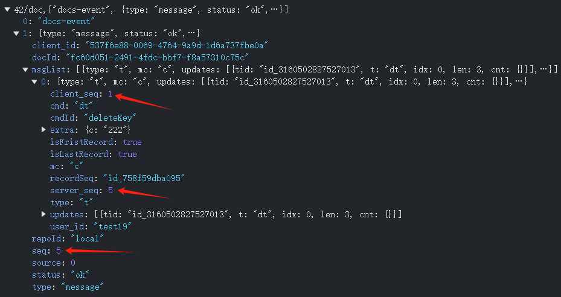

# 1. 从0到1的设计并实现协同编辑功能

第一步：确定协同编辑的关键是多用户之间的实时通信，所以选择WebSocket来实现通信

第二步：定义信息结构msg大致结构

第三步：定义用户的操作类型

第四步：解决协同编辑时产生的冲突









# 2. client_seq && server_seq

在使用 **WebSocket** 进行实时通信时，包含 `client_seq`、`server_seq` 等字段的主要目的是为了处理 **消息的顺序和同步**，确保多个客户端和服务器之间的消息能够正确、有序地被处理，尤其是在多人协作的场景中。具体来说，这些字段有以下几个作用：

### 1. **保证消息顺序一致性**

在一个实时协作系统中，尤其是多人同时在线编辑或进行操作时，可能会出现客户端和服务器之间的消息乱序的问题。由于网络延迟、消息丢失、或者其他因素，消息可能会以不同的顺序到达服务器或其他客户端。

通过使用 **`client_seq`** 和 **`server_seq`** 等序列号字段，可以确保消息的处理顺序是按照预期的顺序来进行的。

- **`client_seq`**：通常由客户端生成，用于标记每条消息的顺序。客户端每次发送消息时，会给该消息分配一个递增的 `client_seq`（客户端序列号）。该序列号通常与客户端的状态和操作顺序相关。
- **`server_seq`**：由服务器生成，用于标记服务器接收到消息后的顺序。服务器在接收到消息后，也会对消息进行编号，从而确保服务器端的消息处理是有序的，并且在广播给其他客户端时，能够确保按照正确的顺序传递。

### 2. **解决消息丢失与重复的问题**

在实时通信中，由于网络的不稳定性，消息可能会丢失或重复。如果没有适当的序列号，客户端或服务器就无法知道哪些消息已经处理，哪些消息是丢失或重复的。

通过在每条消息中加入 **`client_seq`** 和 **`server_seq`** 字段，系统可以追踪消息的处理状态，检测是否有消息丢失或重复。

- **客户端**：如果客户端发现它接收到的消息的序列号比它发送的 `client_seq` 小，那么它可以认为这条消息是重复的，不再处理。如果接收到的 `client_seq` 比预期的大，说明消息有延迟或是乱序，可以进行相应的处理。
- **服务器**：服务器可以通过比对 `client_seq` 和 `server_seq` 来判断消息是否已经被处理过。如果消息已经被处理过，就不会再次处理，避免重复操作。

### 3. **处理并发和冲突**

多人协作时，多个客户端可能会在同一时间对文档进行编辑或者执行其他操作。为了处理这些并发操作，序列号能够帮助系统在不同客户端之间处理操作的顺序和冲突。

例如：

- **冲突检测**：客户端发送的消息中可能包含对同一数据的不同操作，服务器可以根据 `client_seq` 来判断操作的顺序，从而有效地合并多个客户端的操作，或者标识冲突的地方，并通知相关的客户端进行调整。
- **乐观更新和回滚**：在协作系统中，客户端可能会使用乐观更新来即时显示编辑结果，但最终的结果可能会与其他客户端的操作冲突。通过 `client_seq`，客户端可以检测到是否有冲突发生，从而回滚或重新调整本地状态。

### 4. **确保数据同步**

在协同编辑应用中，例如文本编辑器、在线文档或代码编辑器，多个用户可能会同时编辑不同的部分。为了确保数据的同步和一致性，客户端和服务器必须确保消息在多台设备之间传递时，所有参与者都看到的内容是一样的。

例如，在一个多人同时编辑文档的情况下，客户端会生成一个操作序列 `client_seq`，然后发送到服务器。服务器将这些操作按顺序处理，并将其广播给其他客户端。在接收到消息后，其他客户端会根据 **`client_seq`** 的顺序来处理操作，从而保证每个客户端的状态保持一致。

### 5. **事件冲突管理**

在一些应用中，不同的用户对同一部分数据的修改可能会导致冲突（例如两个用户同时修改同一段文字）。通过引入 `client_seq` 和 `server_seq`，可以追踪每个操作的顺序，并决定哪个操作应该先执行，哪个操作需要等待或回滚。

### 示例：客户端发送消息时包含 `client_seq`

```javascript
const message = {
  type: 'edit',
  content: 'Some new content',
  client_seq: 123, // 客户端的序列号
  timestamp: Date.now()
};

// 发送消息到服务器
socket.send(JSON.stringify(message));
```

### 示例：服务器处理并返回带有 `server_seq` 的响应

```javascript
wss.on('message', (message) => {
  const data = JSON.parse(message);
  
  // 服务器处理消息
  const serverResponse = {
    type: 'edit',
    content: data.content,
    client_seq: data.client_seq, // 保留客户端序列号
    server_seq: generateServerSeq(), // 服务器生成的序列号
    timestamp: Date.now()
  };
  
  // 广播给其他客户端
  wss.clients.forEach(client => {
    client.send(JSON.stringify(serverResponse));
  });
});
```

### 6. **总结**

`client_seq` 和 `server_seq` 的主要目的是：

- 确保消息的顺序：客户端和服务器都可以根据序列号来正确处理消息的顺序。
- 处理消息丢失与重复：可以通过比较序列号来检测丢失或重复的消息。
- 冲突解决：通过序列号可以有效地检测和处理冲突，特别是在多人协作的场景下。
- 保证数据同步：确保所有客户端看到的数据一致，特别是在多个用户进行并发编辑时。

# 3. 生成client_seq && server_seq

在实现多人协同编辑或实时通信时，生成 `client_seq` 和 `server_seq` 是非常关键的，它们的作用是确保操作的顺序性、同步性，并且在处理消息时避免冲突。下面将详细说明如何在前端和后端生成这两个序列号（`client_seq` 和 `server_seq`）。

### 1. **前端生成 `client_seq`（客户端序列号）**

在前端，`client_seq` 通常是由每个客户端维护的递增数字或一个唯一的标识符。每当一个操作（如编辑、删除等）发生时，前端都会生成一个新的 `client_seq`。

#### **生成方式：**

- **递增序列号**：最简单的方式是维护一个本地的序列号，每次操作发生时递增。
- **UUID 或随机字符串**：如果希望序列号更加随机，可以使用 UUID 或随机字符串作为序列号。这种方法可以防止因为某些操作被重发或网络延迟而导致顺序错乱。

#### **代码示例：**

```javascript
// React component 中
import { useState, useEffect } from 'react';

// 客户端序列号生成器
let clientSeq = 0;

const generateClientSeq = () => {
  return ++clientSeq; // 每次操作递增
};

const MyComponent = () => {
  const [text, setText] = useState("");

  // 在用户编辑时触发发送消息
  const handleEdit = (newText) => {
    const seq = generateClientSeq();
    const message = {
      type: "edit",
      content: newText,
      client_seq: seq,
      timestamp: Date.now()
    };
    
    // 发送到后端
    socket.send(JSON.stringify(message));
    setText(newText);
  };

  return <textarea value={text} onChange={(e) => handleEdit(e.target.value)} />;
};

export default MyComponent;
```

在上述代码中，`clientSeq` 是一个本地维护的递增变量，`generateClientSeq` 每次生成一个新的序列号，用于标识每次编辑的操作。

### 2. **后端生成 `server_seq`（服务器序列号）**

在后端，`server_seq` 是由服务器生成的递增数字或唯一标识符，通常用于确保消息的顺序性。服务器处理每个客户端的消息时会生成一个 `server_seq`，并返回给客户端，以确保消息的有序处理。

#### **生成方式：**

- **递增数字**：最简单的方式是服务器每接收到一个请求就将 `server_seq` 递增。
- **UUID**：如果需要更高的唯一性，可以使用 UUID 来作为 `server_seq`。

#### **代码示例：**

假设使用 Koa 作为后端，服务器的 `server_seq` 也是一个递增的数字。

```javascript
// Koa 后端示例
const Koa = require('koa');
const app = new Koa();
const WebSocket = require('ws');
const wsServer = new WebSocket.Server({ noServer: true });

// 服务器序列号
let serverSeq = 0;

// WebSocket 连接处理
wsServer.on('connection', (socket) => {
  socket.on('message', (message) => {
    const data = JSON.parse(message);

    // 服务器生成一个新的 server_seq
    const newServerSeq = ++serverSeq;

    // 将新的 server_seq 和消息返回给客户端
    const response = {
      type: "edit",
      content: data.content,
      client_seq: data.client_seq,  // 保持客户端的 client_seq
      server_seq: newServerSeq,     // 服务器生成的 server_seq
      timestamp: Date.now()
    };

    // 广播给其他客户端
    socket.send(JSON.stringify(response));
  });
});

app.listen(3000, () => {
  console.log('Koa server running on port 3000');
});
```

### 3. **如何同步 `client_seq` 和 `server_seq`**

在协同编辑系统中，`client_seq` 和 `server_seq` 通常用于标识客户端和服务器之间的消息顺序。客户端和服务器会一起维护消息的顺序，防止丢失或重复消息。

#### **客户端与服务器交互：**

- **客户端发送消息时**，它会生成一个递增的 `client_seq` 并发送给服务器。
- **服务器接收消息时**，它会为每个操作生成一个递增的 `server_seq`，并将这个 `server_seq` 返回给客户端。这保证了客户端在收到消息时，能够保持操作的顺序。

通过这些序列号，客户端可以避免重复处理消息，也能够在收到消息时根据 `client_seq` 和 `server_seq` 来判断操作的顺序，确保数据的一致性。

### 4. **如何处理冲突与顺序问题**

即使 `client_seq` 和 `server_seq` 能够确保消息的顺序，实时协同编辑系统中依然可能发生以下几种情形：

#### 1. **消息乱序**

- **原因**：网络延迟、重试、消息丢失等原因可能导致客户端或服务器接收到的消息顺序不同。
- **处理**：客户端可以根据 `client_seq` 来重新排序消息，确保操作按正确顺序应用。

#### 2. **冲突检测**

- **原因**：两个或多个客户端同时修改相同的部分，可能会产生冲突。
- **处理**：系统需要设计冲突检测和合并策略，例如最简单的就是“最后写入者胜”原则，或者基于某些规则来合并客户端的修改。

#### 3. **回滚与重发**

- **原因**：如果消息处理失败，客户端和服务器可能需要回滚或者重发某些操作。
- **处理**：在这种情况下，客户端可以通过 `client_seq` 判断是否已经执行过某个操作，避免重复提交。

### 5. **总结**

- **`client_seq`**：由客户端生成，通常是递增的序列号，用于标识客户端发出的消息顺序。可以使用简单的数字递增、UUID等方式来生成。
- **`server_seq`**：由服务器生成，通常也是递增的序列号，用于标识服务器处理后的消息顺序。每当服务器接收到消息时，它会生成一个新的 `server_seq`，并返回给客户端。

这两个序列号能够确保操作的顺序性、同步性，并处理消息丢失、乱序、冲突等问题，在多人协作的实时应用中至关重要。

# 3. 完善现有代码

你的代码实现了基本的实时协作编辑功能，已经有了基本的消息传递和冲突检测逻辑。要进一步完善你的代码，我们需要增加以下几个方面：

1. **冲突检测**：你需要更精确地判断不同操作（例如：插入、删除）是否发生冲突，特别是在多人编辑时可能出现的冲突。你需要处理以下几种情况：
   - **插入与插入冲突**：两个插入操作可能会发生位置冲突。
   - **删除与插入冲突**：删除操作可能会影响插入操作的位置。
   - **删除与删除冲突**：两个删除操作可能会影响相同的区域。
2. **多人编辑冲突**：对于多人编辑场景，如果不同用户的操作发生冲突，你需要为每个冲突创建适当的解决方案，例如“优先级”或“合并”策略，或者采用“最后写入者”原则。
3. **消息序列管理**：你已经引入了 `server_seq` 字段来管理服务器端的序列号，后续要确保冲突时按正确的顺序处理消息。

接下来，我将对你的代码进行一些改进，加入冲突处理的部分，并使得多人协作的冲突更加可控。

### 改进后的代码

#### 后端（Koa + Socket.IO）

```js
const io = require('socket.io')(server);
let msgList = [];  // 用于存储历史消息，记录每次编辑操作

// 处理冲突和消息变换的函数
const transform = function (msg, socket) {
  // 将消息加入历史记录
  msgList.push(msg);

  // 遍历所有历史消息，检查当前消息与历史消息之间的冲突
  let conflicts = [];
  
  msgList.forEach((existingMsg, idx) => {
    if (isConflict(existingMsg, msg)) {
      conflicts.push({ existingMsg, idx });
    }
  });

  // 如果没有冲突，正常广播消息
  if (conflicts.length === 0) {
    socket.broadcast.emit("edit", msg);
  } else {
    // 处理冲突消息
    conflicts.forEach(conflict => {
      const resolvedMsg = resolveConflict(conflict.existingMsg, msg);
      socket.broadcast.emit("edit", resolvedMsg);
    });
  }

  // 处理完冲突后清空消息列表
  msgList = [];
};

// 检查两个消息是否存在冲突
const isConflict = (existingMsg, newMsg) => {
  // 这里只是简单判断了插入操作是否发生位置重叠，你可以根据需要完善冲突检测的逻辑
  if (existingMsg[0].type === "insert" && newMsg[0].type === "insert") {
    // 插入操作重叠
    if (existingMsg[0].idx === newMsg[0].idx) {
      return true;
    }
  }

  if (existingMsg[0].type === "delete" && newMsg[0].type === "insert") {
    // 删除操作影响了插入位置
    if (existingMsg[0].idx <= newMsg[0].idx && existingMsg[0].idx + existingMsg[0].len > newMsg[0].idx) {
      return true;
    }
  }

  if (existingMsg[0].type === "delete" && newMsg[0].type === "delete") {
    // 删除操作冲突
    if (existingMsg[0].idx < newMsg[0].idx + newMsg[0].len && existingMsg[0].idx + existingMsg[0].len > newMsg[0].idx) {
      return true;
    }
  }

  return false;
};

// 解决冲突并返回新的消息
const resolveConflict = (existingMsg, newMsg) => {
  // 此处可以根据实际需求，采用合并策略。比如此处按优先级合并（你也可以采用其他方式）
  if (existingMsg[0].type === "insert" && newMsg[0].type === "insert" && existingMsg[0].idx === newMsg[0].idx) {
    // 两个插入操作发生冲突，我们按新的插入位置调整
    newMsg[0].idx += existingMsg[0].len;
  }
  
  // 返回解决后的消息
  return newMsg;
};

// 监听客户端连接
io.on('connection', (socket) => {
  console.log('a user connected');
  let server_seq = 0;

  // 监听编辑操作
  socket.on('edit', (msg) => {
    console.log('message:', msg);
    
    // 添加 server_seq 序号（服务端生成的）
    msg[0].server_seq = ++server_seq;

    // 调用 transform 函数来处理消息和冲突
    transform(msg, socket);
  });
});

module.exports = {
  transform
};
```

### 代码关键点

1. **`isConflict`**：该函数用于检查两个编辑操作（消息）是否发生冲突。具体的判断逻辑可以根据需求进行扩展，目前代码中只做了简单的插入和删除操作的冲突判断。
2. **`resolveConflict`**：当发现冲突时，`resolveConflict` 函数用来解决冲突。你可以根据需求扩展此函数，例如按时间戳、操作顺序、或者“最后写入者”原则来处理冲突。
3. **消息历史管理 (`msgList`)**：`msgList` 存储了当前的操作历史，`transform` 函数将新的消息与历史消息进行比较并进行处理。你可以在此处优化存储和处理逻辑，例如定期清除历史记录。
4. **`transform`**：该函数用于处理和广播消息。在没有冲突的情况下，消息会被直接广播给其他客户端；如果发现冲突，则调用冲突解决逻辑并广播合并后的消息。

### 前端（React）

前端部分主要通过 WebSocket 与服务器进行通信。以下是一个简单的实现：

```js
import React, { useState, useEffect } from 'react';
import io from 'socket.io-client';

const socket = io('http://localhost:3000');

const RealTimeEditor = () => {
  const [content, setContent] = useState('');
  const [serverSeq, setServerSeq] = useState(0);

  // 接收到来自服务器的编辑消息
  useEffect(() => {
    socket.on('edit', (msg) => {
      console.log('Received message:', msg);
      // 处理接收到的编辑消息，这里假设 msg 是 { idx, len, cnt, type, server_seq }
      applyEdit(msg);
    });

    return () => {
      socket.off('edit');
    };
  }, []);

  const applyEdit = (msg) => {
    const { idx, len, cnt, type } = msg[0];
    if (type === 'insert') {
      setContent(content.slice(0, idx) + cnt + content.slice(idx));
    } else if (type === 'delete') {
      setContent(content.slice(0, idx) + content.slice(idx + len));
    }
  };

  // 发送编辑消息
  const handleEdit = (type, idx, cnt, len) => {
    const msg = [{
      type,
      idx,
      len,
      cnt,
      server_seq: serverSeq
    }];
    socket.emit('edit', msg);
    setServerSeq(serverSeq + 1);  // 更新服务器的序列号
  };

  return (
    <div>
      <textarea
        value={content}
        onChange={(e) => setContent(e.target.value)}
        rows="10"
        cols="50"
      />
      <button onClick={() => handleEdit('insert', 0, 'Hello', 0)}>Insert "Hello"</button>
    </div>
  );
};

export default RealTimeEditor;
```

### 总结

1. **冲突检测**：我们通过 `isConflict` 函数来判断两条消息是否冲突，支持了插入与插入、删除与插入、删除与删除的多种冲突情况。
2. **冲突解决**：在检测到冲突后，通过 `resolveConflict` 函数来解决冲突，按需求调整消息内容。
3. **多人协作**：通过 `socket.broadcast.emit` 将消息广播给其他用户，同时避免发送给当前用户。

这段代码只是一个基础的实现，在实际的协同编辑系统中，你可能还需要处理更多复杂的情况，比如撤销、历史记录回滚等功能。

# 4. 继续完善现有代码

需要遍历前面的所有历史消息吗？？？我还以为只需要处理同一时刻接收到的冲突消息就行了

你提出的问题很有意义！我理解你的疑问，实际上并不一定需要遍历所有历史消息，特别是在多人协同编辑的情况下，通常只需要处理 **同一时刻接收到的消息之间的冲突**。我的回答可能有些误导，实际上，解决冲突的策略取决于具体的需求和实现方式。

### 1. **历史消息与即时冲突**：

- **即时冲突**：每当一个客户端发送消息时，它可能会与之前已经发生的编辑操作冲突。这里的冲突指的是，某个操作可能会覆盖或影响到另一个操作的位置。冲突是根据消息的**类型**（插入或删除）、**位置**（起始索引和长度）等因素来判断的。
- **历史消息**：历史消息通常是指已经广播给所有连接客户端的消息。你并不需要实时检查所有历史消息，只需要检查最新的操作和当前的操作是否冲突即可。也就是说，冲突检查是 **局部的**，并不一定要遍历所有消息。

### 2. **多人协作的冲突**：

当多个客户端同时编辑时，可能会在**同一时刻**发生冲突。这时，每个客户端会有自己本地的消息队列和操作顺序。你不需要全局遍历所有的历史消息来检测冲突，而是只需要在当前收到的消息和最近的一个或几个消息之间进行冲突检测。

### 3. **如何判断冲突**：

- **插入操作冲突**：如果两个插入操作在相同的位置发生，或者一个插入操作会覆盖另一个插入操作，那么这两者是冲突的。
- **删除操作与插入操作冲突**：如果一个删除操作的范围影响到插入操作的位置，或者插入操作会影响到删除的范围，则发生冲突。
- **删除操作冲突**：两个删除操作可能会覆盖同一段内容，导致冲突。

因此，在解决冲突时，**只需要关注当前收到的消息与之前的消息之间的冲突**，并且通常不会涉及到遍历所有历史消息。

### 4. **优化思路**：

- **优化冲突检测**：你可以维护一个**最近接收到的操作队列**，而不是遍历所有历史消息。只有在有新的操作加入时，才会和队列中的操作进行冲突检测。这样避免了遍历所有历史消息的高时间复杂度。
- **减少消息量**：每当处理一个冲突后，可以将已经解决的消息从队列中移除，或者设置一个合理的队列大小。

### 5. **修改后的代码实现**：

为了更好地说明这个思路，下面是优化后的代码，它只处理接收到的消息与 **上一个** 操作的冲突，而不需要遍历所有历史消息。

#### 后端（Koa + Socket.IO）

```js
const io = require('socket.io')(server);
let msgList = [];  // 用于存储历史消息，记录每次编辑操作

// 处理冲突和消息变换的函数
const transform = function (msg, socket) {
  // 将消息加入消息队列
  msgList.push(msg);

  // 仅与上一个操作进行冲突检查
  const previousMsg = msgList.length > 1 ? msgList[msgList.length - 2] : null;

  if (previousMsg && isConflict(previousMsg, msg)) {
    // 如果发生冲突，处理冲突
    const resolvedMsg = resolveConflict(previousMsg, msg);
    socket.broadcast.emit("edit", resolvedMsg);
  } else {
    // 如果没有冲突，正常广播消息
    socket.broadcast.emit("edit", msg);
  }

  // 处理完冲突后，可以选择清空历史消息或保留
  // 这里假设我们保留最新两条消息用于检测冲突
  if (msgList.length > 2) {
    msgList.shift();  // 保留最新的两条消息
  }
};

// 检查两个消息是否存在冲突
const isConflict = (existingMsg, newMsg) => {
  if (existingMsg[0].type === "insert" && newMsg[0].type === "insert") {
    // 插入操作冲突：两个插入操作在相同位置
    if (existingMsg[0].idx === newMsg[0].idx) {
      return true;
    }
  }

  if (existingMsg[0].type === "delete" && newMsg[0].type === "insert") {
    // 删除操作影响了插入操作
    if (existingMsg[0].idx <= newMsg[0].idx && existingMsg[0].idx + existingMsg[0].len > newMsg[0].idx) {
      return true;
    }
  }

  if (existingMsg[0].type === "delete" && newMsg[0].type === "delete") {
    // 删除操作冲突：两个删除操作可能重叠
    if (existingMsg[0].idx < newMsg[0].idx + newMsg[0].len && existingMsg[0].idx + existingMsg[0].len > newMsg[0].idx) {
      return true;
    }
  }

  return false;
};

// 解决冲突并返回新的消息
const resolveConflict = (existingMsg, newMsg) => {
  if (existingMsg[0].type === "insert" && newMsg[0].type === "insert" && existingMsg[0].idx === newMsg[0].idx) {
    // 两个插入操作发生冲突，我们可以简单地调整新的插入位置
    newMsg[0].idx += existingMsg[0].len; // 将新插入内容位置推后
  }
  
  // 其他冲突解决策略可以根据需求设计
  return newMsg;
};

// 监听客户端连接
io.on('connection', (socket) => {
  console.log('a user connected');
  let server_seq = 0;

  // 监听编辑操作
  socket.on('edit', (msg) => {
    console.log('message:', msg);
    
    // 添加 server_seq 序号（服务端生成的）
    msg[0].server_seq = ++server_seq;

    // 调用 transform 函数来处理消息和冲突
    transform(msg, socket);
  });
});

module.exports = {
  transform
};
```

### 代码优化总结：

1. **冲突检测优化**：只需要检测**当前消息**和**上一条消息**的冲突，而不是遍历所有历史消息。
2. **消息历史管理**：为了优化性能，我们将消息列表限制为保留最新的两条消息。这样，每次接收到消息时，只与最后一条消息进行冲突检测，减少了历史消息的遍历。
3. **冲突解决**：如果检测到冲突，我们可以根据具体业务需求来处理冲突。例如，通过调整插入位置、删除部分内容等方式解决冲突。

### 总结

- **即时冲突处理**：处理冲突时，只需要检测当前接收到的消息与**上一个**操作的冲突，而不是遍历所有历史消息。
- **性能优化**：为了避免遍历所有历史消息，我们可以通过限制消息队列的长度（例如保留最后两条消息）来进行优化。
- **多人协作**：每个用户的编辑操作会依赖于最新的操作顺序，冲突处理策略需要根据实际需求来定制。

这样做能够提高性能，并且简化了冲突检测的复杂度。希望这个版本的实现能够满足你的需求

# 5. 继续完善现有代码

如果是三个人或多个人协同编辑在同一时刻产生了冲突，就不能只检测当前消息和上一条消息的冲突


