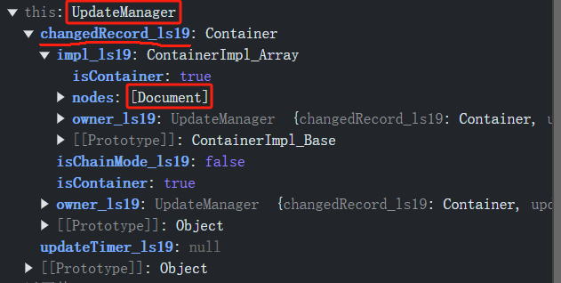

# 1. MVC

在前端开发中，MVC（Model-View-Controller）是一种常见的架构模式，旨在将应用的不同关注点分离，提高代码的可维护性和可扩展性。以下是 MVC 模型在前端的详细介绍：

------

## **MVC 模型的基本概念**

### **1. Model（模型）**

- **定义**：用于管理应用的数据、业务逻辑和状态。
- 职责：
  - 保存应用的状态和数据（例如用户信息、表单数据等）。
  - 定义业务逻辑（例如数据的验证和处理）。
  - 通知 `View` 数据的变化。
- 前端实现：
  - 使用 JavaScript 对象、状态管理库（如 Redux、MobX），或者框架内部提供的状态管理（如 React 的 `useState`、Vue 的 `data`）。

### **2. View（视图）**

- **定义**：用户界面，负责显示数据。
- 职责：
  - 订阅 `Model` 的变化并更新界面。
  - 负责与用户交互，通过事件（如点击、输入）触发操作。
- 前端实现：
  - 使用 HTML/CSS 和前端框架的模板语法（如 React 的 JSX、Vue 的模板、Angular 的模板）。

### **3. Controller（控制器）**

- **定义**：连接 `Model` 和 `View` 的桥梁，负责处理用户输入。
- 职责：
  - 接收用户输入事件并进行处理。
  - 调用 `Model` 更新数据。
  - 更新 `View` 以反映数据的变化。
- 前端实现：
  - 通常通过事件处理器或方法（如 React 中的事件处理函数，Vue 中的方法）实现。

------

## **MVC 的工作流程**

1. **用户与 View 交互**：用户在界面上进行操作（例如点击按钮、输入文字）。
2. **View 通知 Controller**：视图将用户的输入事件通知控制器。
3. **Controller 更新 Model**：控制器根据用户操作更新模型中的数据。
4. **Model 通知 View**：模型检测到数据变化后，通知视图进行更新。
5. **View 更新 UI**：视图重新渲染，以反映最新的数据状态。

------

## **MVC 在前端的实际应用**

以一个简单的 Todo 应用为例，展示 MVC 模式的实现：

### **代码示例**

```javascript
// Model
class TodoModel {
  constructor() {
    this.todos = [];
    this.listeners = [];
  }

  addTodo(todo) {
    this.todos.push(todo);
    this.notifyListeners();
  }

  removeTodo(index) {
    this.todos.splice(index, 1);
    this.notifyListeners();
  }

  subscribe(listener) {
    this.listeners.push(listener);
  }

  notifyListeners() {
    this.listeners.forEach(listener => listener(this.todos));
  }
}

// View
class TodoView {
  constructor(controller) {
    this.controller = controller;

    // 创建 UI 元素
    this.app = document.getElementById('app');
    this.input = document.createElement('input');
    this.button = document.createElement('button');
    this.todoList = document.createElement('ul');

    this.button.textContent = 'Add Todo';

    this.app.appendChild(this.input);
    this.app.appendChild(this.button);
    this.app.appendChild(this.todoList);

    this.button.addEventListener('click', () => this.controller.handleAddTodo());
  }

  render(todos) {
    this.todoList.innerHTML = '';
    todos.forEach((todo, index) => {
      const li = document.createElement('li');
      li.textContent = todo;
      const removeButton = document.createElement('button');
      removeButton.textContent = 'Remove';
      removeButton.addEventListener('click', () => this.controller.handleRemoveTodo(index));
      li.appendChild(removeButton);
      this.todoList.appendChild(li);
    });
  }
}

// Controller
class TodoController {
  constructor(model, view) {
    this.model = model;
    this.view = view;

    this.model.subscribe((todos) => this.view.render(todos));
  }

  handleAddTodo() {
    const todo = this.view.input.value.trim();
    if (todo) {
      this.model.addTodo(todo);
      this.view.input.value = '';
    }
  }

  handleRemoveTodo(index) {
    this.model.removeTodo(index);
  }
}

// 初始化应用
const appModel = new TodoModel();
const appController = new TodoController(appModel, new TodoView(appController));
```

------

### **优点**

1. 关注点分离：
   - 数据（`Model`）、用户界面（`View`）、逻辑（`Controller`）分离，代码更易于维护。
2. 扩展性强：
   - 可以轻松添加新的功能而不破坏现有结构。
3. 可复用性：
   - `View` 和 `Model` 可以独立复用。

------

### **缺点**

1. 复杂性：
   - 对于小型项目，MVC 模式可能显得过于复杂。
2. 事件传递成本：
   - 随着项目规模增长，`View` 和 `Model` 之间的通知可能变得复杂。
3. 双向依赖：
   - 如果实现不当，可能导致 `View` 和 `Controller` 耦合。

------

### **现代框架对 MVC 的演化**

现代前端框架在一定程度上演化了传统的 MVC 模式：

1. **React**：倾向于将 `View` 和部分 `Controller` 合并到组件中，数据管理依赖 Redux 或 Context（类似于 `Model`）。
2. **Vue**：将 `View` 和 `Controller` 合并，借助 Vuex 实现全局 `Model`。
3. **Angular**：遵循类似 MVC 的架构，但更多依赖其特定的服务和依赖注入。

------

### **总结**

MVC 是前端开发中经典的架构模式，通过分离数据、视图和逻辑，增强了代码的可维护性和扩展性。虽然现代框架在传统 MVC 的基础上有所演化，但其核心思想仍然深刻影响着前端架构设计。

# 2. docs-writer 怎么实现多次连续model变化只触发一次view更新

笑死，项目中根本就没有这样的机制

还是有一定机制的

是**延迟更新机制**，而不是**批量更新机制**！！！

|              |                                                              |
| ------------ | ------------------------------------------------------------ |
| 批量更新机制 | 引入一个批量更新的机制，将多次变化合并为一个通知<br />这块需要看一下React源码 |
| 延迟更新机制 | 使用一个定时器来延迟通知，确保短时间内的多次Model变化只会触发一次View更新 |
| 手动控制更新 |                                                              |


- delayUpdate
- forceExecu：强制更新，优先级很高，只要它为true，就更新
- suspendUpdate


- delayUpdate什么时候设置成false？


```js
public suspendUpdate_ls19(): void {
    let parent = this.parent || (this.getUpdateTrigger_ls19 && this.getUpdateTrigger_ls19());
    if (parent && parent.addSuspendedChild_ls19) {
        parent.addSuspendedChild_ls19(this);
    } else {
        AppAdaptor.GetSwModule().GetDocShell().updateManager.addChangedBlock_ls19(this);
    }
}
```



# 3. MVC架构中 怎么实现多次连续model变化只触发一次view更新

在 MVC 架构中，实现连续的多次 Model 变化只触发一次 View 更新，可以通过以下几种方式：

------

### 1. **批量更新机制**

#### 实现方式：

引入一个批量更新的机制，将多次变化合并为一次通知。

#### 具体步骤：

1. **引入一个批量更新标志**： 在 Model 中添加一个 `isBatching` 标志位，用于控制通知行为。
2. **收集变化**： 当标志位为 `true` 时，不立即通知 View，而是将变化记录下来。
3. **批量触发通知**： 当批量操作结束时，一次性触发 View 的更新。

#### 代码示例：

```javascript
class Model {
  constructor() {
    this.data = {};
    this.listeners = [];
    this.isBatching = false;
    this.pendingChanges = [];
  }

  set(key, value) {
    this.data[key] = value;
    if (this.isBatching) {
      this.pendingChanges.push({ key, value });
    } else {
      this.notify();
    }
  }

  batchUpdate(callback) {
    this.isBatching = true;
    callback();
    this.isBatching = false;
    if (this.pendingChanges.length > 0) {
      this.notify();
      this.pendingChanges = [];
    }
  }

  notify() {
    this.listeners.forEach((listener) => listener(this.data));
  }

  subscribe(listener) {
    this.listeners.push(listener);
  }
}

// 使用示例
const model = new Model();
model.subscribe((data) => {
  console.log('View updated:', data);
});

model.batchUpdate(() => {
  model.set('name', 'Alice');
  model.set('age', 25);
});
```

------

### 2. **延迟更新机制**

#### 实现方式：

使用一个定时器来延迟通知，确保短时间内的多次 Model 变化只会触发一次 View 更新。

#### 代码示例：

```javascript
class Model {
  constructor() {
    this.data = {};
    this.listeners = [];
    this.updateTimeout = null;
  }

  set(key, value) {
    this.data[key] = value;
    this.scheduleUpdate();
  }

  scheduleUpdate() {
    if (this.updateTimeout) return;
    this.updateTimeout = setTimeout(() => {
      this.notify();
      this.updateTimeout = null;
    }, 0); // 或者使用适当的延迟时间
  }

  notify() {
    this.listeners.forEach((listener) => listener(this.data));
  }

  subscribe(listener) {
    this.listeners.push(listener);
  }
}

// 使用示例
const model = new Model();
model.subscribe((data) => {
  console.log('View updated:', data);
});

model.set('name', 'Alice');
model.set('age', 25);
// 只会触发一次 View 更新
```

------

### 3. **手动控制更新**

#### 实现方式：

在 Controller 中集中管理 Model 的变化，并在操作完成后，手动触发 View 更新。

#### 代码示例：

```javascript
class Model {
  constructor() {
    this.data = {};
    this.listeners = [];
  }

  set(key, value) {
    this.data[key] = value;
  }

  notify() {
    this.listeners.forEach((listener) => listener(this.data));
  }

  subscribe(listener) {
    this.listeners.push(listener);
  }
}

// 使用示例
const model = new Model();
model.subscribe((data) => {
  console.log('View updated:', data);
});

function updateModel(controller) {
  controller(() => {
    model.set('name', 'Alice');
    model.set('age', 25);
  });
  model.notify();
}

updateModel((callback) => callback());
```

------

### 比较和选择

- **批量更新机制**：适用于明确知道操作范围的场景。
- **延迟更新机制**：适合用户频繁交互的场景（如输入框变化）。
- **手动控制更新**：适合需要精细控制更新时机的复杂业务场景。

根据项目的复杂程度和具体需求选择最适合的方案即可。

# 4. React 怎么实现的多次状态改变只触发一次视图更新

在 React 源码中，处理多次状态改变只触发一次视图更新的关键在于 **“批量更新”机制**。核心是将多个状态更新操作合并，等到事件循环或批处理完成后，再统一触发视图的重新渲染。

以下是 React 批量更新机制的实现方式及关键步骤：

------

## 1. **批量更新的触发条件**

React 中的批量更新在以下场景下会被触发：

- **React 生命周期**：在组件生命周期方法中调用 `setState` 会自动启用批量更新。
- **合成事件**：React 的事件系统（如 `onClick`）会自动启用批量更新。
- **异步更新环境**：如 `Promise.then` 或 `setTimeout` 中调用 `setState`，批量更新可能不会默认启用，但 React 18 中启用了 `Concurrent Mode` 后会优化处理这些情况。

------

## 2. **批量更新的核心实现**

React 的批量更新机制主要依赖以下几个关键点：

### **1) Transaction 模式**

React 内部使用事务管理更新过程，通过 “事务队列” 收集多次状态变更，并在事务结束后统一执行更新。

源码关键：

- **`batchedUpdates` 方法**：批量收集状态变更。
- **`flushSync` 方法**：在特定情况下强制同步执行更新。

代码示例：

```javascript
batchedUpdates(() => {
  instance.setState({ key1: value1 });
  instance.setState({ key2: value2 });
});
// 在事务结束后，一次性执行视图更新。
```

------

### **2) 更新队列（Update Queue）**

每次调用 `setState` 时，React 不会直接修改 `state`，而是将新的状态放入一个 **更新队列** 中。React 会将多次 `setState` 的操作合并成一次状态更新。

源码关键：

- **`enqueueSetState` 方法**：将状态变更放入队列。
- **`processUpdateQueue` 方法**：批量计算所有变更后生成最终的状态。

队列处理示意：

```javascript
// 多次 setState 依次进入队列
this.setState({ count: this.state.count + 1 });
this.setState({ count: this.state.count + 1 });

// 实际上最终只会触发一次更新，队列的合并结果为：
this.state.count += 2;
```

------

### **3) 调度器 (Scheduler)**

React 使用调度器控制更新的优先级和执行时机，避免多次无效渲染。

- **同步更新**（Synchronous Updates）：优先级最高，例如用户输入等事件。
- **异步更新**（Concurrent Mode）：低优先级更新被延迟到浏览器空闲时执行。

关键源码模块：

- **`ReactFiberWorkLoop`**：协调更新任务。
- **`ReactFiberLane`**：根据优先级分配任务。

示意图：

```
[高优先级更新] --> [中优先级更新] --> [低优先级更新]
```

------

## 3. **React 18 的优化：`useTransition` 和 `startTransition`**

在 React 18 中，新增了 `useTransition` 和 `startTransition`，允许开发者将某些更新标记为低优先级，从而提升批量更新的灵活性。

示例：

```javascript
import { startTransition } from 'react';

startTransition(() => {
  setStateA(valueA);
  setStateB(valueB);
});
// 标记为低优先级更新，等待空闲时批量更新视图。
```

------

## 4. **源码解析**

以下是 `setState` 的简化流程：

1. **enqueueSetState**: 每次调用 `setState` 时，将更新请求加入队列：

   ```javascript
   classInstance.updater.enqueueSetState(publicInstance, partialState);
   ```

2. **批量更新的入口**: 调用 `batchedUpdates`，收集所有更新：

   ```javascript
   ReactDOM.unstable_batchedUpdates(() => {
     instance.setState({ key1: value1 });
     instance.setState({ key2: value2 });
   });
   ```

3. **合并状态**: 队列中的更新被合并，生成最终的 `nextState`：

   ```javascript
   nextState = Object.assign({}, prevState, ...queuedUpdates);
   ```

4. **调度更新**: 调用 `scheduleUpdateOnFiber`，调度渲染任务：

   ```javascript
   scheduleUpdateOnFiber(fiber, lane, eventTime);
   ```

------

## 5. **实践总结**

- React 的批量更新主要通过更新队列、事务机制和调度器实现。

- 优点

  ：

  - 减少不必要的视图更新，提高性能。
  - 让开发者只需关注状态逻辑，不需手动控制渲染。

- 局限

  ：

  - 在一些非 React 环境（如原生 DOM 事件）中，需要手动启用 `batchedUpdates`。

通过这些机制，React 实现了多次状态更新只触发一次视图更新，同时兼顾了性能和开发体验。

# 5. 对4的补充说明示例

以下是对 React 源码中实现多次状态更新只触发一次视图更新机制的演示。包括 `setState` 的批量更新、更新队列合并和调度优先级处理。

------

### 1. **批量更新 (`batchedUpdates`) 示例**

React 默认会在**合成事件**和**生命周期方法**中批量处理 `setState`。

```javascript
import React, { Component } from 'react';
class App extends Component {
  constructor(props) {
    super(props);
    this.state = { count: 0 };
  }
  handleClick = () => {
    this.setState({ count: this.state.count + 1 });
    this.setState({ count: this.state.count + 1 });
    console.log(this.state.count); // 输出为 0，而不是 1
  };
  render() {
    console.log('Rendered with count:', this.state.count);
    return (
      <div>
        <p>Count: {this.state.count}</p>
        <button onClick={this.handleClick}>Increase</button>
      </div>
    );
  }
}
export default App;
```

#### 输出解释：

- `setState` 不会立即更新 `this.state`，而是将更新放入队列。
- 在 `handleClick` 中，`this.state` 仍是旧值。
- 最终视图只会更新一次，`Rendered with count` 输出的值是合并后的结果。

------

### 2. **异步环境中的状态更新（React 18 `Concurrent Mode`）**

在 React 18 中，批量更新扩展到异步环境，例如 `setTimeout` 或 `Promise` 中。

#### 示例代码：

```javascript
import React, { useState } from 'react';
export default function App() {
  const [count, setCount] = useState(0);
  const handleAsyncUpdate = () => {
    setTimeout(() => {
      setCount((prev) => prev + 1);
      setCount((prev) => prev + 1);
      console.log('Inside setTimeout:', count); // React 18: 0, React 17: 1
    }, 0);
  };
  return (
    <div>
      <p>Count: {count}</p>
      <button onClick={handleAsyncUpdate}>Increase Async</button>
    </div>
  );
}
```

#### React 18 的优化：

- 异步环境中，`setCount` 被批量处理为一次更新。
- `count` 在 `setTimeout` 内不会立即更新，最终视图更新值为 2。

------

### 3. **手动使用 `batchedUpdates`**

在原生事件中，React 默认不会启用批量更新，可以通过手动调用 `ReactDOM.unstable_batchedUpdates` 实现。

#### 示例代码：

```javascript
import React, { useState } from 'react';
import ReactDOM from 'react-dom';
export default function App() {
  const [count, setCount] = useState(0);
  const handleNativeEvent = () => {
    setCount(count + 1);
    setCount(count + 1);
    console.log('Count during native event:', count); // 不使用批量更新时，可能输出 1
  };
  const handleBatchedEvent = () => {
    ReactDOM.unstable_batchedUpdates(() => {
      setCount(count + 1);
      setCount(count + 1);
    });
    console.log('Count during batched event:', count); // 输出 0
  };
  return (
    <div>
      <p>Count: {count}</p>
      <button onClick={handleNativeEvent}>Native Event</button>
      <button onClick={handleBatchedEvent}>Batched Event</button>
    </div>
  );
}
```

#### 输出解释：

- **原生事件**：`setCount` 导致每次调用都会单独更新。
- **`unstable_batchedUpdates`**：手动启用批量更新，所有状态变更在事务完成后统一处理。

------

### 4. **调度优先级控制 (`startTransition`)**

React 18 新增的 `startTransition` 将某些更新标记为低优先级，延迟处理。

#### 示例代码：

```javascript
import React, { useState, startTransition } from 'react';

export default function App() {
  const [count, setCount] = useState(0);
  const [loading, setLoading] = useState(false);

  const handleClick = () => {
    setCount((prev) => prev + 1); // 高优先级更新
    startTransition(() => {
      setLoading(true); // 低优先级更新
      setTimeout(() => {
        setLoading(false);
      }, 2000);
    });
  };

  return (
    <div>
      <p>Count: {count}</p>
      {loading && <p>Loading...</p>}
      <button onClick={handleClick}>Increase</button>
    </div>
  );
}
```

#### 输出解释：

- `setCount` 是高优先级更新，立即反映在视图上。
- `startTransition` 内的 `setLoading` 被标记为低优先级，可能会延迟执行。

------

### 总结

这些示例展示了 React 批量更新的实现细节：

1. **批量更新队列**：默认在合成事件中合并更新。
2. **异步扩展**：React 18 在异步环境中启用批量更新。
3. **手动批量更新**：通过 `ReactDOM.unstable_batchedUpdates` 实现。
4. **调度优先级**：使用 `startTransition` 优化高低优先级任务。

# 6. React 批量更新 源码

React 的批量更新（Batch Updates）是通过一个协调机制实现的，用于优化渲染性能，减少不必要的渲染。这个机制在 React 源码中涉及多个模块和函数，以下是其核心设计和实现，以及相关源码函数名的解析。

------

### **1. 批量更新的设计背景**

在 React 中，状态更新（`setState`）可能触发多次，例如在事件处理程序或生命周期方法中。如果每次状态更新都导致一次渲染，将会极大影响性能。React 通过“批量更新”机制，将多次更新合并在同一个渲染周期中完成，从而减少渲染次数。

------

### **2. 批量更新的核心实现流程**

React 的批量更新主要依赖于两个关键概念：

#### 2.1 更新优先级（Update Priority）

React 使用任务调度机制（`Scheduler`），为每个更新赋予一个优先级，通过调度器控制何时执行这些更新。

#### 2.2 更新队列（Update Queue）

React 为每个组件维护了一个更新队列。新的状态更新会被加入队列，等到批量更新阶段统一处理。

------

### **3. 核心源码模块与关键函数**

#### 3.1 **调度任务：`Scheduler`**

`Scheduler` 是 React 中的任务调度模块，它决定何时执行更新，更新的优先级由 `Lane` 模块计算。

- **关键函数**：

  - `scheduleUpdateOnFiber`: 负责将状态更新调度到当前的 Fiber 节点。
  - `requestUpdateLane`: 确定更新的优先级（对应的 Lane）。

  **源码位置**：

  - `react-reconciler/src/ReactFiberWorkLoop.new.js`
  - `react-reconciler/src/ReactFiberLane.new.js`

#### 3.2 **更新队列管理**

每个 Fiber 节点有一个 `updateQueue` 属性，存储该节点的状态更新。

- **关键函数**：

  - `enqueueSetState`: 将 `setState` 调用加入到组件的更新队列中。
  - `processUpdateQueue`: 在批量更新时处理所有的状态更新。

  **源码位置**：

  - `react-reconciler/src/ReactUpdateQueue.new.js`

#### 3.3 **批量更新触发**

React 的批量更新由 `flushSync` 和 `batchedUpdates` 等方法管理。

- **关键函数**：

  - `batchedUpdates`: React 事件处理机制中批量更新的入口，确保在事件回调中批量更新。
  - `flushSync`: 用于立即触发更新，常用于非事件回调场景。
  - `performSyncWorkOnRoot`: 执行同步更新逻辑。
  - `performConcurrentWorkOnRoot`: 执行并发更新逻辑。

  **源码位置**：

  - `react-reconciler/src/ReactFiberWorkLoop.new.js`
  - `react-dom/src/events/ReactDOMUpdateBatching.js`

#### 3.4 **事件系统与批量更新集成**

React 的事件系统保证在同一个事件回调中，所有的状态更新会被批量处理。

- **关键函数**：

  - `batchedEventUpdates`: 确保事件处理中的批量更新。
  - `flushPassiveEffects`: 用于处理副作用，确保渲染的完成性。

  **源码位置**：

  - `react-dom/src/events/ReactDOMUpdateBatching.js`
  - `react-dom/src/react-dom/src/ReactFiberWorkLoop.new.js`

------

### **4. 批量更新机制的关键路径**

1. **状态更新触发**：
   - 调用 `setState` 或 `useState`。
   - 触发 `scheduleUpdateOnFiber`，将更新加入队列。
2. **任务调度**：
   - 调度器通过 `Scheduler` 将更新任务加入到任务队列，按优先级执行。
3. **更新处理**：
   - 批量更新逻辑通过 `batchedUpdates` 管理。
   - 调用 `processUpdateQueue` 处理组件的状态更新。
4. **渲染与提交**：
   - 调用 `performSyncWorkOnRoot` 或 `performConcurrentWorkOnRoot` 执行工作单元，更新 Fiber 树。
   - 提交阶段完成 DOM 更新。

------

### **5. 相关源码函数名总结**

以下是与批量更新机制直接相关的一些重要函数：

- `scheduleUpdateOnFiber`：调度更新到 Fiber 树。
- `enqueueSetState`：向组件更新队列中添加状态更新。
- `processUpdateQueue`：处理组件更新队列。
- `batchedUpdates`：批量更新的入口函数。
- `flushSync`：立即执行同步更新。
- `performSyncWorkOnRoot`：同步更新的执行逻辑。
- `performConcurrentWorkOnRoot`：并发更新的执行逻辑。
- `batchedEventUpdates`：事件回调中的批量更新。
- `flushPassiveEffects`：处理副作用。

# 7. React 批量更新 源码

React源码中实现批量更新到底是怎么做的？为什么多次状态更新只会导致一次渲染?

React 的批量更新机制是为了优化性能，避免不必要的多次渲染。在多个状态更新的场景下，React 将更新合并为一个批次处理，从而只触发一次渲染。以下是对 React 批量更新实现原理的详细分析。

------

### **1. 核心机制：批量更新的入口**

React 批量更新的实现依赖于 **调度机制** 和 **更新队列**。核心逻辑可以分为以下几个步骤：

#### **1.1 `batchedUpdates` 的作用**

`batchedUpdates` 是 React 内部的一个函数，用来开启一个批量更新的上下文，所有在这个上下文中发生的状态更新都会被暂存，而不会立即触发渲染。

疑问：那怎么知道需要结束暂存，开始触发渲染了呢？

源码实现（简化版）：

```javascript
export function batchedUpdates(fn, ...args) {
  const prevExecutionContext = executionContext;
  executionContext |= BatchedContext; // 设置批量更新上下文
  try {
    return fn(...args); // 执行传入的回调
  } finally {
    executionContext = prevExecutionContext; // 恢复上下文
    if (executionContext === NoContext) {
      flushSyncCallbackQueue(); // 在合适时机刷新更新队列
    }
  }
}
```

#### **1.2 `setState` 的行为**

`setState` 不会立即触发渲染，而是将更新加入队列。React 会根据当前的上下文来判断是立即更新还是将更新合并。

```javascript
class Component {
  setState(partialState, callback) {
    enqueueUpdate(this, partialState, callback); // 将更新加入队列
    scheduleUpdateOnFiber(this); // 调度更新
  }
}
```

#### **1.3 调度机制**

React 使用 **Scheduler 调度器** 来协调任务的优先级。批量更新会统一调度一次渲染，在一个批量更新的上下文中，无论有多少次状态更新，都只会触发一次渲染。

------

### **2. 为什么多次状态更新只会导致一次渲染？**

#### **2.1 更新队列**

每个 React 组件都有自己的 **更新队列**。当调用 `setState` 时，新的状态会被加入队列，但不会立即执行渲染。

- React 会将多个更新（`setState` 调用）合并成一个。
- 合并的逻辑是基于函数式更新的，比如：`this.setState((prevState) => ...)`。

#### **2.2 渲染时机**

在批量更新上下文（如事件处理函数、生命周期方法等）中，`setState` 不会立即触发渲染，而是等到事件循环结束或调度器调度时再进行渲染。

- **React 会在 `flushSyncCallbackQueue` 中统一执行更新**。
- 在 React 的 Reconciliation（协调）阶段，合并后的更新会作用到虚拟 DOM，最后触发一次真实 DOM 的更新。

------

### **3. 示例分析**

以下是一个典型的示例，展示多次状态更新如何导致一次渲染：

```javascript
import React, { useState } from 'react';

function App() {
  const [count, setCount] = useState(0);

  const handleClick = () => {
    setCount((prev) => prev + 1); // 第一次更新
    setCount((prev) => prev + 1); // 第二次更新
  };

  console.log("Rendered");

  return <button onClick={handleClick}>Count: {count}</button>;
}

export default App;
```

#### 执行逻辑

1. 用户点击按钮，`handleClick` 被触发。
2. `setCount` 被调用两次，每次都会将更新加入队列。
3. 在批量更新的上下文中，React 合并两次更新，并将最终状态设为 `count + 2`。
4. React 触发一次渲染，`console.log("Rendered")` 只执行一次。

------

### **4. 特殊情况：批量更新的边界**

在某些情况下，批量更新会失效，比如在异步代码（`setTimeout`、`Promise` 等）中，React 会立即处理状态更新，因为这些场景默认处于 **非批量更新上下文**。

```javascript
import React, { useState } from 'react';

function App() {
  const [count, setCount] = useState(0);

  const handleClick = () => {
    setTimeout(() => {
      setCount((prev) => prev + 1);
      setCount((prev) => prev + 1);
    }, 0);
  };

  console.log("Rendered");

  return <button onClick={handleClick}>Count: {count}</button>;
}

export default App;
```

**执行结果**：

- 点击按钮后，`setCount` 会触发两次独立渲染，因为 `setTimeout` 是异步的，更新不在批量上下文中。

**解决方法**：

- 从 React 18 开始，`createRoot` 默认启用 **自动批量更新**，即使在异步场景中，也会合并更新。

- React 18 示例：

  ```javascript
  import React from 'react';
  import { createRoot } from 'react-dom/client';
  
  const root = createRoot(document.getElementById('root'));
  root.render(<App />);
  ```

------

### **5. 总结**

React 的批量更新是通过 `batchedUpdates` 函数和调度器实现的。核心原理包括：

- 使用批量更新上下文标记，暂存状态更新。
- 合并同一批次的多次状态更新。
- 在协调阶段合并更新队列，触发一次渲染。

这种设计极大提高了性能，减少了不必要的渲染，同时确保状态更新的一致性。

# 8. 批量更新 结束暂存 开始渲染

`batchedUpdates` 是 React 内部的一个函数，用来开启一个批量更新的上下文，所有在这个上下文中发生的状态更新都会被暂存，而不会立即触发渲染。

疑问：那怎么知道需要结束暂存，开始触发渲染了呢？

React 知道 **何时结束暂存并触发渲染** 是通过以下两个关键点实现的：

------

### **1. 执行上下文（Execution Context）**

React 内部维护了一个全局的 `executionContext`，用于跟踪当前的执行状态。这个变量通过位运算表示不同的上下文，比如：

- **BatchedContext**: 表示批量更新上下文
- **RenderContext**: 表示当前正在执行渲染
- **NoContext**: 表示当前不在任何 React 特定的上下文中

#### **关键逻辑**

- 在批量更新的上下文中（例如事件处理函数），`executionContext` 会被设置为 **BatchedContext**。
- 当 `executionContext` 恢复为 **NoContext** 时，React 知道当前任务已经完成，需要检查是否存在暂存的更新队列，并执行渲染。

源码简化逻辑：

```javascript
export function batchedUpdates(fn, ...args) {
  const prevExecutionContext = executionContext;
  executionContext |= BatchedContext; // 进入批量更新上下文
  try {
    return fn(...args); // 执行任务
  } finally {
    executionContext = prevExecutionContext; // 恢复上下文
    if (executionContext === NoContext) {
      flushSyncCallbackQueue(); // 刷新同步任务队列
    }
  }
}
```

------

### **2. 更新队列刷新机制**

当 React 知道需要结束暂存时，它会检查是否存在需要处理的更新，并触发渲染。这通常通过以下两种方式完成：

#### **2.1 同步队列刷新**

在 React 事件或生命周期的批量更新上下文中，所有的更新都暂存到 **更新队列**。当上下文退出时（即 `executionContext === NoContext`），React 调用 `flushSyncCallbackQueue`，触发批量更新。

关键代码：

```javascript
function flushSyncCallbackQueue() {
  // 检查是否有需要执行的回调
  if (syncQueue !== null) {
    const queue = syncQueue;
    syncQueue = null;
    for (let i = 0; i < queue.length; i++) {
      const callback = queue[i];
      callback(); // 执行回调
    }
  }
}
```

#### **2.2 Scheduler 调度器**

React 使用调度器（`Scheduler`）来协调任务的优先级。对于异步更新（例如 `setTimeout` 或 `Promise` 中的更新），React 不立即渲染，而是将任务推入调度器中，根据优先级安排执行。

关键流程：

1. 更新被推入调度队列。
2. 调度器检查当前时间片内是否有足够时间处理任务。
3. 如果有，则执行更新；如果没有，则延迟到下一次空闲时间执行。

------

### **3. 示例解析：何时结束暂存？**

#### **场景 1: 同步更新（事件处理函数）**

在同步上下文中（如事件处理函数），React 知道任务完成后，所有更新需要立即渲染。

```javascript
import React, { useState } from 'react';

function App() {
  const [count, setCount] = useState(0);

  const handleClick = () => {
    setCount(count + 1); // 暂存更新
    setCount(count + 2); // 暂存更新
  };

  console.log('Rendered');

  return <button onClick={handleClick}>{count}</button>;
}
```

- `handleClick` 执行时，React 设置了批量更新上下文 `BatchedContext`。
- `setCount` 暂存到队列，不触发渲染。
- `executionContext` 恢复为 `NoContext`，React 触发 `flushSyncCallbackQueue`，执行合并后的更新队列，触发一次渲染。

#### **场景 2: 异步更新（`setTimeout`）**

在异步上下文中（如 `setTimeout`），React 默认不在批量更新上下文中，因此每次 `setState` 会立即处理。

```javascript
import React, { useState } from 'react';

function App() {
  const [count, setCount] = useState(0);

  const handleClick = () => {
    setTimeout(() => {
      setCount(count + 1); // 立即更新，触发渲染
      setCount(count + 2); // 再次更新，触发渲染
    }, 0);
  };

  console.log('Rendered');

  return <button onClick={handleClick}>{count}</button>;
}
```

- 在 `setTimeout` 中，`executionContext` 是 `NoContext`，每次 `setState` 都会触发独立的渲染。
- 如果使用 React 18 的自动批量更新机制，多个异步更新也会被合并。

解决方法：

```javascript
import React, { useState } from 'react';
import { flushSync } from 'react-dom';

function App() {
  const [count, setCount] = useState(0);

  const handleClick = () => {
    setTimeout(() => {
      flushSync(() => {
        setCount(count + 1);
        setCount(count + 2);
      });
    }, 0);
  };

  console.log('Rendered');

  return <button onClick={handleClick}>{count}</button>;
}
```

- `flushSync` 强制在同步上下文中执行更新，触发批量更新。

------

### **4. 总结**

React 知道需要结束暂存并开始渲染的时机主要依赖：

1. **执行上下文的恢复**：当 `executionContext` 恢复为 `NoContext`，React 触发更新队列。
2. **调度器的优先级检查**：对于异步任务，调度器根据任务优先级安排渲染。

React 通过这种机制最大化性能优化，同时保证状态更新的一致性和渲染的正确性。

# 9. processUpdateQueue

- `react-reconciler/src/ReactUpdateQueue.new.js`
- `processUpdateQueue` 是 React 源码中处理状态更新队列的核心方法之一，它主要用于在一次渲染过程中，将组件的状态更新队列中的所有更新按优先级进行处理，并最终计算出组件新的状态值
- 核心机制概述
  1. **优先级判断**：根据更新的 `expirationTime` 判断是否需要立即处理。
  2. **状态合并**：将多个更新合并成最终状态。
  3. **未处理保留**：优先级不足的更新会被保留在 `baseQueue` 中，等待下次渲染处理。
  4. **副作用处理**：如 `callback`，被添加到 `effects` 中，以便后续在 commit 阶段执行

```js
export function processUpdateQueue<State>(
  workInProgress: Fiber,
  props: any,
  instance: any,
  renderExpirationTime: ExpirationTime,
): void {
  // 1.获取更新队列和基础状态
  const queue: UpdateQueue<State> = (workInProgress.updateQueue: any);
  hasForceUpdate = false;
  let baseQueue = queue.baseQueue; // baseQueue 表示上一次渲染后剩下的未处理更新
  let pendingQueue = queue.shared.pending; // pendingQueue 是新添加的更新列表，在当前渲染过程中可能包含多个更新

  // 2.合并新旧更新队列 todo:去理解到底是什么合并的
  if (pendingQueue !== null) {
    if (baseQueue !== null) {
      let baseFirst = baseQueue.next;
      let pendingFirst = pendingQueue.next;
      baseQueue.next = pendingFirst;
      pendingQueue.next = baseFirst;
    }
    baseQueue = pendingQueue;
    queue.shared.pending = null;
    const current = workInProgress.alternate;
    if (current !== null) {
      const currentQueue = current.updateQueue;
      if (currentQueue !== null) {
        currentQueue.baseQueue = pendingQueue;
      }
    }
  }

  // 3.初始化状态处理变量 
  if (baseQueue !== null) {
    let first = baseQueue.next;
    let newState = queue.baseState; // newState：用于保存最终计算出的新状态
    let newExpirationTime = NoWork; // newExpirationTime：表示剩余更新的最高优先级

    let newBaseState = null; // newBaseState：未处理更新的最新基础状态
    let newBaseQueueFirst = null; // 指向未处理更新队列的头部
    let newBaseQueueLast = null; // 指向未处理更新队列的尾部

    // 4.遍历更新队列，对于每个更新：
    // 4.1如果优先级不足，保留到新的基础队列中
    // 4.2如果优先级足够，调用 getStateFromUpdate 计算新状态
    // 4.3如果更新有 callback，将其添加到 effects 中以便后续处理
    if (first !== null) {
      let update = first;
      do {
        const updateExpirationTime = update.expirationTime;
        if (updateExpirationTime < renderExpirationTime) {
          // 更新优先级不足，跳过
          const clone: Update<State> = {
            expirationTime: update.expirationTime,
            suspenseConfig: update.suspenseConfig,
            tag: update.tag,
            payload: update.payload,
            callback: update.callback,
            next: (null: any),
          };
          if (newBaseQueueLast === null) {
            newBaseQueueFirst = newBaseQueueLast = clone;
            newBaseState = newState;
          } else {
            newBaseQueueLast = newBaseQueueLast.next = clone;
          }
          if (updateExpirationTime > newExpirationTime) {
            newExpirationTime = updateExpirationTime;
          }
        } else {
          // 更新优先级足够，处理更新
          if (newBaseQueueLast !== null) {
            const clone: Update<State> = {
              expirationTime: Sync,
              suspenseConfig: update.suspenseConfig,
              tag: update.tag,
              payload: update.payload,
              callback: update.callback,
              next: (null: any),
            };
            newBaseQueueLast = newBaseQueueLast.next = clone;
          }

          markRenderEventTimeAndConfig(
            updateExpirationTime,
            update.suspenseConfig,
          );

          newState = getStateFromUpdate(
            workInProgress,
            queue,
            update,
            newState,
            props,
            instance,
          );
          const callback = update.callback;
          if (callback !== null) {
            workInProgress.effectTag |= Callback;
            let effects = queue.effects;
            if (effects === null) {
              queue.effects = [update];
            } else {
              effects.push(update);
            }
          }
        }
        update = update.next;
        if (update === null || update === first) {
          pendingQueue = queue.shared.pending;
          if (pendingQueue === null) {
            break;
          } else {
            update = baseQueue.next = pendingQueue.next;
            pendingQueue.next = first;
            queue.baseQueue = baseQueue = pendingQueue;
            queue.shared.pending = null;
          }
        }
      } while (true);
    }

    // 5.更新基础状态与队列
    // 5.1如果所有更新都处理完，则将 newBaseState 设置为最终状态。
    // 5.2如果有未处理更新，则更新 baseQueue，为下一次渲染提供基础状态
    if (newBaseQueueLast === null) {
      newBaseState = newState;
    } else {
      newBaseQueueLast.next = (newBaseQueueFirst: any);
    }

    queue.baseState = ((newBaseState: any): State);
    queue.baseQueue = newBaseQueueLast;

    // 6.标记更新优先级与最终状态
    // 6.1 markUnprocessedUpdateTime 标记队列中未处理的最高优先级。
    // 6.2 将计算出的新状态赋值给 workInProgress.memoizedState，完成状态更新
    markUnprocessedUpdateTime(newExpirationTime);
    workInProgress.expirationTime = newExpirationTime;
    workInProgress.memoizedState = newState;
  }
}
```

# 10. batchedUpdates

- **React 事件处理机制中批量更新的入口，确保在事件回调中批量更新**

- `react-reconciler/src/ReactFiberWorkLoop.new.js`

```js
// fn: 一个函数，表示要执行的操作
// a: 参数，传递给函数 fn 的数据
export function batchedUpdates<A, R>(fn: A => R, a: A): R {
  // executionContext：React 用于管理当前执行环境的全局变量。它是一个标志位，用来标记当前的上下文状态
  // 通过 executionContext 管理执行上下文，确保批量更新与普通操作互不干扰
  const prevExecutionContext = executionContext;
  // BatchedContext：一个标志，用来表示当前正在执行批量更新操作
  executionContext |= BatchedContext; // 将当前执行上下文与 BatchedContext 合并，开启批量更新模式
    
  try {
    return fn(a);
  } finally {
    executionContext = prevExecutionContext;
    if (executionContext === NoContext) { // NoContext：表示没有特殊上下文环境
      // 如果恢复上下文后发现当前没有特殊上下文环境，调用 flushSyncCallbackQueue 清空在此次批量更新中注册的同步回调队列
      flushSyncCallbackQueue(); // 负责执行在批量更新期间调度的同步任务，例如副作用处理
    }
  }
}
```

- executionContext:0
- BatchedContext:1
- LegacyUnbatchedContext:8
- NoContext:0

# 11. flushSync

用于立即触发更新，常用于非事件回调场景

- `react-reconciler/src/ReactFiberWorkLoop.new.js`
- `react-dom/src/events/ReactDOMUpdateBatching.js`

# 12. performSyncWorkOnRoot

- 执行同步更新逻辑


- `react-reconciler/src/ReactFiberWorkLoop.new.js`
- `react-dom/src/events/ReactDOMUpdateBatching.js`

# 13. performConcurrentWorkOnRoot

- 执行并发更新逻辑

- `react-reconciler/src/ReactFiberWorkLoop.new.js`

- `performConcurrentWorkOnRoot` 的核心职责是：

  1. **管理并发任务**：基于任务优先级，决定当前需要处理的 Fiber 树任务
  2. **调度 Fiber 树更新**：确保 Fiber 树在并发渲染中按预期执行
  3. **处理异常和任务恢复**：在并发任务中捕获错误并尝试恢复
  4. **触发后续调度**：在必要时重新调度未完成的任务

- `performConcurrentWorkOnRoot` 是 React 并发模式的核心调度函数。主要功能包括：

  1. **任务管理**：按优先级处理任务，支持中断与恢复。
  2. **Fiber 树构建**：调用 `workLoopConcurrent` 构建 Fiber 树。
  3. **异常恢复**：捕获渲染中的错误并尝试恢复。
  4. **任务调度**：在完成或中断时重新调度任务，确保用户交互的流畅性。

  这种机制使 React 能够在不阻塞主线程的情况下渲染复杂的用户界面，提升用户体验和性能

```js
// root：React Fiber 树的根节点。
// didTimeout：布尔值，表示任务是否超时。如果超时，则需要同步处理高优先级任务
function performConcurrentWorkOnRoot(root, didTimeout) {
  // 1. 清理当前事件时间
  // 设置为 NoWork 意味着清除当前的事件时间，下一次更新将重新计算
  currentEventTime = NoWork; // 当前事件的时间戳，代表正在处理的更新时间
  // 2. 处理超时的情况
  // 2.1 如果任务超时（未能在允许时间内完成），则标记当前任务为“过期”
  // 2.2 React 的调度模型支持在任务未及时完成时强制同步完成所有高优先级任务
  if (didTimeout) {
    const currentTime = requestCurrentTimeForUpdate(); // 记录当前时间
    markRootExpiredAtTime(root, currentTime); // 标记任务为过期
    ensureRootIsScheduled(root); // 强制调度同步任务
    return null; // 返回 null: 因为超时任务需要同步完成，此时并发渲染的流程中断
  }

  // 3. 获取下一个到期时间
  const expirationTime = getNextRootExpirationTimeToWorkOn(root);
  if (expirationTime !== NoWork) {
    const originalCallbackNode = root.callbackNode;
    // 4. 处理被动效果。清空之前任务中可能存在的被动副作用（如 useEffect 的清理函数）
    flushPassiveEffects(); // 保证新任务运行时环境干净

    // 5. 准备 Fiber 树。如果当前根节点或任务优先级改变，需要重新初始化 Fiber 树堆栈
    if ( root !== workInProgressRoot || expirationTime !== renderExpirationTime) {
      // 5.1 重置 Fiber 树：prepareFreshStack 清理旧堆栈，初始化新的渲染任务
      prepareFreshStack(root, expirationTime);
      // 5.2 启动交互追踪：startWorkOnPendingInteractions 用于调试和性能分析
      startWorkOnPendingInteractions(root, expirationTime);
    }
 
    // 6. 执行工作循环 
    if (workInProgress !== null) {
      const prevExecutionContext = executionContext;
      // 上下文切换: executionContext 临时设置为 RenderContext，表示正在执行渲染任务
      executionContext |= RenderContext;
      const prevDispatcher = pushDispatcher(root);
      const prevInteractions = pushInteractions(root);
      startWorkLoopTimer(workInProgress);
      do {
        try {
          workLoopConcurrent(); // 执行并发渲染的主要逻辑，逐步构建 Fiber 树
          break;
        } catch (thrownValue) {
          handleError(root, thrownValue);
        }
      } while (true);
      resetContextDependencies();
      executionContext = prevExecutionContext;
      popDispatcher(prevDispatcher);
      if (enableSchedulerTracing) {
        popInteractions(((prevInteractions: any): Set<Interaction>));
      }

      if (workInProgressRootExitStatus === RootFatalErrored) {
        const fatalError = workInProgressRootFatalError;
        stopInterruptedWorkLoopTimer();
        prepareFreshStack(root, expirationTime);
        markRootSuspendedAtTime(root, expirationTime);
        ensureRootIsScheduled(root);
        throw fatalError;
      }

      // 7. 处理渲染结果
      if (workInProgress !== null) {
        // 7.1 如果 workInProgress 不为 null，表示仍有剩余工作，需要继续调度
        stopInterruptedWorkLoopTimer();
      } else {
        // 7.2 任务完成
        stopFinishedWorkLoopTimer();

        // root.finishedWork：标记当前任务已完成
        const finishedWork: Fiber = ((root.finishedWork =
          root.current.alternate): any);
        root.finishedExpirationTime = expirationTime;
        // 调用 finishConcurrentRender 处理最终的提交阶段
        finishConcurrentRender(
          root,
          finishedWork,
          workInProgressRootExitStatus,
          expirationTime,
        );
      }

      // 8. 确保后续调度
      ensureRootIsScheduled(root); // 重新调度任务: nsureRootIsScheduled 确保未完成的任务被调度
      if (root.callbackNode === originalCallbackNode) {
        // 返回继续执行的函数: 如果当前回调节点未改变，返回绑定后的函数以继续执行
        return performConcurrentWorkOnRoot.bind(null, root);
      }
    }
  }
  return null;
}
```

# 14. batchedEventUpdates

- **源码位置**：ReactGenericBatching.js
- 它的主要目的是确保在事件处理过程中，React 的状态更新以批量的方式执行，从而提高性能和一致性

```js
export function batchedEventUpdates(fn, a, b) {
  // isBatchingEventUpdates:这是一个全局变量，用于标记当前是否正在批量处理事件更新
  // 避免嵌套的批量处理，防止重复包装已经在批量处理中执行的任务
  if (isBatchingEventUpdates) {
    // 如果当前已经在批量处理事件更新（isBatchingEventUpdates 为 true），直接执行传入的函数 fn
    // 避免嵌套批量处理，保持任务简单
    return fn(a, b);
  }
  // 将 isBatchingEventUpdates 设置为 true，表明开始进入批量事件更新的模式
  isBatchingEventUpdates = true;
  try {
    // 真正实现批量事件更新的内部逻辑
    return batchedEventUpdatesImpl(fn, a, b);
  } finally {
    isBatchingEventUpdates = false; // 重置批量处理标记
    finishEventHandler(); // 事件处理的后续清理工作
  }
}
```

当 React 监听事件时（例如 `onClick`），默认会将这些事件的处理逻辑封装在 `batchedEventUpdates` 中，使得事件处理中的所有状态更新都是批量的

# 15. batchedEventUpdates

- 确保事件处理中的批量更新


- 用于处理副作用，确保渲染的完成性。

- **源码位置**：`react-dom/src/react-dom/src/ReactFiberWorkLoop.new.js`
- `batchedEventUpdates` 是 React 源码中的一个重要函数，用于批量处理事件更新。它是 React 事件系统中的一个核心部分，目的是优化事件处理时的更新逻辑，确保更新被正确批量处理，从而减少不必要的渲染次数

```js
export function batchedEventUpdates<A, R>(fn: A => R, a: A): R {
  // executionContext：React 的全局变量，用于标记当前代码的执行上下文
  // React 通过上下文标记，可以区分不同的执行阶段（如事件处理、渲染、提交等）
  const prevExecutionContext = executionContext;
  // EventContext: 表示当前代码正在处理 React 事件
  // 使用位运算 |= 将 EventContext 添加到当前上下文中
  executionContext |= EventContext;
  try {
    return fn(a);
  } finally {
    // 还原上下文: 将executionContext恢复到之前的值，确保后续逻辑不会被错误的上下文状态影响
    executionContext = prevExecutionContext;
    if (executionContext === NoContext) {
      // 当executionContext恢复到NoContext(即没有其他上下文)时,立即清空同步任务队列
      // React 中有一些任务（如 useEffect 的 cleanup 或者某些调度函数）可能会在事件处理期间被调度。这些任务被放入同步回调队列中，而 flushSyncCallbackQueue 会在合适的时机执行它们
      flushSyncCallbackQueue();
    }
  }
}
```

### **关键点解析**

#### **1. 什么是 `executionContext`？**

- `executionContext` 是 React 内部用于标识当前代码执行上下文的全局变量。
- 它可以有多个标志（如 `EventContext`、`RenderContext` 等），用位运算管理。
- 在事件处理逻辑中，React 会标记 `EventContext`，表示代码处于事件处理阶段。

#### **2. 为什么使用批量更新？**

- **性能优化**：
  - 在 React 中，每次状态更新都会触发一次渲染。如果在事件处理中有多个状态更新，则会导致多次渲染。
  - 通过批量更新，React 可以将多个状态更新合并为一次渲染，减少 DOM 操作，提高性能。
- **事件系统的特点**：
  - React 的事件是合成事件，与真实的 DOM 事件不同。通过批量更新，可以更好地控制事件的执行顺序和更新逻辑。

#### **3. 为什么还原上下文后调用 `flushSyncCallbackQueue`？**

- React 的同步回调队列用于存储在事件处理过程中调度的同步任务。
- 如果不及时清空这些任务，可能会导致某些任务延迟执行或错过执行时机。
- 当事件处理完成且上下文清空时，说明当前任务已经完成，可以安全地执行这些回调。

------

### **函数的作用总结**

`batchedEventUpdates` 的主要功能是：

1. **标记事件处理阶段**：通过设置 `executionContext`，告诉 React 当前正在处理事件。
2. **批量处理更新**：确保在事件处理期间的状态更新不会立即触发渲染，而是批量合并后再触发。
3. **清理任务队列**：在事件处理结束后，执行事件期间调度的同步任务。
4. **错误安全**：通过 `try-finally`，即使事件处理过程中抛出异常，也能保证上下文的正确还原。

------

### **适用场景**

- 用户点击、输入等触发的 React 事件
- 确保这些事件中的状态更新被批量处理，避免多次不必要的渲染

# 16. handleTopLevel

- 源码位置: DOMLegacyEventPluginSystem.js
- `handleTopLevel`，用于处理顶级事件。这是 React 在事件代理机制中构建事件触发链的关键逻辑
- 核心功能
  1. **构建事件的祖先链**
     - React 通过遍历目标实例的祖先节点，找到事件可能传播的所有节点。
     - 在调用事件处理函数之前，需要完整地构建祖先链，以避免因 DOM 操作导致的不一致。
  2. **处理顶级事件**
     - 对于每个祖先节点，依次运行插件事件提取和分发逻辑
- `handleTopLevel` 是 React 事件系统的关键函数，主要功能包括：
  1. 遍历目标实例的祖先链，构建事件传播路径。
  2. 通过插件系统提取事件并触发事件处理程序

```js
// bookKeeping:包含与事件处理相关的信息，是一个临时存储的对象
// 包含以下关键属性：
//             targetInst: 触发事件的 React 实例
//             ancestors: 事件传播的祖先链，按顺序存储
//             nativeEvent: 原生 DOM 事件
//             topLevelType: 顶级事件的类型（如 click）
//             eventSystemFlags: 事件系统标志，用于标记事件状态
function handleTopLevel(bookKeeping: BookKeepingInstance) {
  let targetInst = bookKeeping.targetInst;
    
  // 构建祖先链
  let ancestor = targetInst;
  do {
    if (!ancestor) {
      const ancestors = bookKeeping.ancestors;
      ((ancestors: any): Array<Fiber | null>).push(ancestor);
      break;
    }
    const root = findRootContainerNode(ancestor);
    if (!root) { break; }
    const tag = ancestor.tag;
    if (tag === HostComponent || tag === HostText) {
      bookKeeping.ancestors.push(ancestor);
    }
    ancestor = getClosestInstanceFromNode(root);
  } while (ancestor);

  for (let i = 0; i < bookKeeping.ancestors.length; i++) {
    targetInst = bookKeeping.ancestors[i];
    const eventTarget = getEventTarget(bookKeeping.nativeEvent);
    const topLevelType = ((bookKeeping.topLevelType: any): DOMTopLevelEventType);
    const nativeEvent = ((bookKeeping.nativeEvent: any): AnyNativeEvent);
    let eventSystemFlags = bookKeeping.eventSystemFlags;

    // If this is the first ancestor, we mark it on the system flags
    if (i === 0) {
      eventSystemFlags |= IS_FIRST_ANCESTOR;
    }

    // 调用事件插件系统，提取并分发事件
    // 核心逻辑包括：
	//   1.提取事件（如 onClick）。
	//   触发事件处理程序（如用户定义的回调）
    runExtractedPluginEventsInBatch(
      topLevelType,
      targetInst,
      nativeEvent,
      eventTarget,
      eventSystemFlags,
    );
  }
}
```

# 17. runExtractedPluginEventsInBatch

- DOMLegacyEventPluginSystem.js
- 核心功能
  1. **提取插件事件**
     - 调用插件系统提取事件处理逻辑。
     - 通过 `extractPluginEvents` 函数，获取与当前事件相关的所有 React 合成事件。
  2. **批量运行事件**
     - 调用 `runEventsInBatch`，按照一定顺序批量触发所有提取的事件处理函数
- 

```js
// topLevelType:顶级事件类型（例如 click、keydown 等）。在 React 中表示 DOM 事件的类型。
// targetInst:目标节点对应的 React Fiber 实例。表示触发事件的组件实例。
// nativeEvent:原生 DOM 事件对象（如 MouseEvent、KeyboardEvent 等）。
// nativeEventTarget:原生事件目标（即 event.target），通常是触发事件的真实 DOM 节点。
// eventSystemFlags:事件系统标志，用于标识事件处理的状态（如捕获阶段或冒泡阶段）
function runExtractedPluginEventsInBatch(
  topLevelType: TopLevelType,
  targetInst: null | Fiber,
  nativeEvent: AnyNativeEvent,
  nativeEventTarget: null | EventTarget,
  eventSystemFlags: EventSystemFlags,
) {
  // extractPluginEvents: React 的插件系统入口，用于根据事件类型和上下文信息提取合成事件
  // 提取的事件可能包括捕获和冒泡阶段的事件，或者自定义合成事件
  // 返回一个数组，包含所有需要处理的事件
  // 工作原理:
  //  遍历所有注册的事件插件
  //  调用每个插件的 extractEvents 方法，提取与当前事件相关的合成事件
  const events = extractPluginEvents(
    topLevelType,
    targetInst,
    nativeEvent,
    nativeEventTarget,
    eventSystemFlags,
  );
  // 接收 extractPluginEvents 提取的事件数组，并按照事件的注册顺序依次执行
  // 遍历事件数组，依次调用事件处理函数
  runEventsInBatch(events);
}
```

# 18. runEventsInBatch

```js
export function runEventsInBatch(
  events: Array<ReactSyntheticEvent> | ReactSyntheticEvent | null,
) {
  if (events !== null) {
    eventQueue = accumulateInto(eventQueue, events);
  }

  // 将当前队列保存到 processingEventQueue，并清空 eventQueue
  // 清空队列是为了在处理当前队列时，仍能接收和存储新的事件
  const processingEventQueue = eventQueue;
  eventQueue = null;

  if (!processingEventQueue) { return; }

  // 遍历事件队列并执行事件处理
  // executeDispatchesAndReleaseTopLevel:
  //  1.对事件执行所有注册的分发逻辑，并释放事件（将其标记为可重用)
  //  2.这是事件执行的具体实现，负责调用每个事件的处理程序
  forEachAccumulated(processingEventQueue, executeDispatchesAndReleaseTopLevel);
  // This would be a good time to rethrow if any of the event handlers threw.
  rethrowCaughtError();
}
```

# 19. executeDispatchesInOrder

- EventPluginUtils.js

```js
export function executeDispatchesInOrder(event) {
  // onclick绑定的回调函数就存储在event._dispatchListeners里面
  const dispatchListeners = event._dispatchListeners;
  const dispatchInstances = event._dispatchInstances;
  if (Array.isArray(dispatchListeners)) {
    for (let i = 0; i < dispatchListeners.length; i++) {
      if (event.isPropagationStopped()) {
        break;
      }
      executeDispatch(event, dispatchListeners[i], dispatchInstances[i]);
    }
  } else if (dispatchListeners) {
    executeDispatch(event, dispatchListeners, dispatchInstances);
  }
  event._dispatchListeners = null;
  event._dispatchInstances = null;
}
```

# 20. finishEventHandler

- ReactGenericBatching.js

```js
function finishEventHandler() {
  // Here we wait until all updates have propagated, which is important
  // when using controlled components within layers:
  // https://github.com/facebook/react/issues/1698
  // Then we restore state of any controlled component.
  const controlledComponentsHavePendingUpdates = needsStateRestore();
  if (controlledComponentsHavePendingUpdates) {
    // If a controlled event was fired, we may need to restore the state of
    // the DOM node back to the controlled value. This is necessary when React
    // bails out of the update without touching the DOM.
    flushDiscreteUpdatesImpl();
    restoreStateIfNeeded();
  }
}
```

# 21. flushPassiveEffects

- 用于处理副作用，确保渲染的完成性。

- **源码位置**：`react-dom/src/react-dom/src/ReactFiberWorkLoop.new.js`
- `flushPassiveEffects` 是 React 源码中用于处理 **副作用队列** 的重要函数。它的主要作用是调度并执行 **被动副作用（passive effects）**，即在 `useEffect` 中定义的副作用

```js
export function flushPassiveEffects() {
  // pendingPassiveEffectsRenderPriority: 一个全局变量，记录当前待处理的副作用的优先级
  // 如果其值为 NoPriority，表示没有待处理的副作用，函数直接返回 undefined
    
  // NoPriority: 表示无优先级（数值为 0）
  // 这是 React 的优先级调度机制中的一个常量，表明当前没有需要立即处理的任务
  if (pendingPassiveEffectsRenderPriority !== NoPriority) {
    const priorityLevel =
      pendingPassiveEffectsRenderPriority > NormalPriority
        ? NormalPriority
        : pendingPassiveEffectsRenderPriority;
    pendingPassiveEffectsRenderPriority = NoPriority;
    return runWithPriority(priorityLevel, flushPassiveEffectsImpl);
  }
}
```

# 22. dispatchDiscreteEvent

- ReactDOMEventListener.js
- `dispatchDiscreteEvent` 的目的是处理离散事件，例如用户交互类事件（鼠标点击、按键等）。在 React 的事件系统中，离散事件需要特别处理以确保它们被高优先级地执行

```js
// topLevelType: 表示顶层事件类型，例如 click 或 keydown。
// eventSystemFlags: 表示事件系统的一些标志位，用于控制事件的行为，例如是否捕获等。
// container: 表示事件发生的容器 DOM 节点。
// nativeEvent: 原生浏览器事件对象，包含时间戳、目标等事件相关的信息
function dispatchDiscreteEvent(
  topLevelType,
  eventSystemFlags,
  container,
  nativeEvent,
) {
  // 确保在处理当前事件之前，所有未完成的离散更新都被清空
  // React 的调度系统基于任务优先级，在某些情况下，较低优先级任务可能需要暂停，以处理更高优先级任务（如用户交互事件）
  // flushDiscreteUpdatesIfNeeded 会检测当前事件的时间戳，判断是否有需要优先执行的更新任务
  flushDiscreteUpdatesIfNeeded(nativeEvent.timeStamp);
  // 包装并调用真正的事件分发逻辑 dispatchEvent
  // discreteUpdates 是 React 调度系统中的一个高优先级调度函数，确保传递的事件处理函数被赋予高优先级
  discreteUpdates(
    dispatchEvent,
    topLevelType,
    eventSystemFlags,
    container,
    nativeEvent,
  );
}
```

React 的调度系统（Scheduler）对事件的优先级进行了划分：

- 离散事件

  （Discrete Event）:

  - 例如点击、键盘输入等需要即时响应的交互事件，优先级较高。

- 连续事件

  （Continuous Event）:

  - 例如滚动、鼠标移动等可以被频繁触发的事件。

- 非紧急更新

  （Idle/Passive Updates）:

  - 例如动画、数据加载等可以延迟的任务。

`dispatchDiscreteEvent` 的主要任务是确保用户的交互事件能够及时响应

# 23. discreteUpdates

```js
export function discreteUpdates(fn, a, b, c, d) {
  const prevIsInsideEventHandler = isInsideEventHandler;
  isInsideEventHandler = true;
  try {
    return discreteUpdatesImpl(fn, a, b, c, d);
  } finally {
    isInsideEventHandler = prevIsInsideEventHandler;
    if (!isInsideEventHandler) {
      finishEventHandler();
    }
  }
}
```


```js
export function discreteUpdates<A, B, C, D, R>(
  fn: (A, B, C) => R,
  a: A,
  b: B,
  c: C,
  d: D,
): R {
  const prevExecutionContext = executionContext;
  executionContext |= DiscreteEventContext;
  try {
    // Should this
    return runWithPriority(UserBlockingPriority, fn.bind(null, a, b, c, d));
  } finally {
    executionContext = prevExecutionContext;
    if (executionContext === NoContext) {
      // Flush the immediate callbacks that were scheduled during this batch
      flushSyncCallbackQueue(); // 关键代码！
    }
  }
}
```

# 24. flushSyncCallbackQueue

```js
export function flushSyncCallbackQueue() {
  // immediateQueueCallbackNode 是指向调度器中的一个高优先级任务节点的引用，表示某个同步任务已计划但尚未执行
  if (immediateQueueCallbackNode !== null) {
    const node = immediateQueueCallbackNode;
    // 如果存在一个未处理的立即回调任务节点（immediateQueueCallbackNode），则取消它
    // 这是为了避免重复执行已计划的任务
    immediateQueueCallbackNode = null;
    // 调用调度器的方法，取消指定任务节点的执行
    Scheduler_cancelCallback(node);
  }
  // 进入同步回调队列的核心实现，执行所有同步回调
  // 在内部，这个方法会遍历并执行已收集的所有同步任务
  flushSyncCallbackQueueImpl();
}
```

# 25. flushSyncCallbackQueueImpl

```js
function flushSyncCallbackQueueImpl() {
  if (!isFlushingSyncQueue && syncQueue !== null) {
    // Prevent re-entrancy.
    isFlushingSyncQueue = true;
    let i = 0;
    try {
      const isSync = true;
      const queue = syncQueue;
      runWithPriority(ImmediatePriority, () => {
        for (; i < queue.length; i++) {
          let callback = queue[i];
          do {
            callback = callback(isSync);
          } while (callback !== null);
        }
      });
      syncQueue = null;
    } catch (error) {
      // If something throws, leave the remaining callbacks on the queue.
      if (syncQueue !== null) {
        syncQueue = syncQueue.slice(i + 1);
      }
      // Resume flushing in the next tick
      Scheduler_scheduleCallback(
        Scheduler_ImmediatePriority,
        flushSyncCallbackQueue,
      );
      throw error;
    } finally {
      isFlushingSyncQueue = false;
    }
  }
}
```

# 26. performSyncWorkOnRoot

- **同步任务入口点**
- **进入render阶段(要为每一个react元素构建fiber对象)**，构建workInProgress Fiber树
- `performSyncWorkOnRoot` 是 React Fiber 架构中核心的同步渲染函数，负责完成整个 Fiber 树的同步渲染流程。该函数的主要职责是从根开始执行任务，遍历 Fiber 树，完成更新，并确保最终的 DOM 提交过程。这是 React 同步更新机制的关键部分

```js
function performSyncWorkOnRoot(root) {
  // lastExpiredTime：表示当前 Fiber 树中最早的过期时间（即需要立即处理的任务）。如果存在过期任务，优先处理它
  const lastExpiredTime = root.lastExpiredTime;
  const expirationTime = lastExpiredTime !== NoWork ? lastExpiredTime : Sync;

  // 清理副作用（例如 useEffect 中的回调函数）
  // 在开始新的渲染任务前，确保不会遗留任何未处理的副作用
  flushPassiveEffects();

  if (root !== workInProgressRoot || expirationTime !== renderExpirationTime) {
    // 初始化或重置渲染栈
    // 如果根节点或过期时间发生变化，需要抛弃当前的任务栈，从头开始构建
    prepareFreshStack(root, expirationTime);
    // 追踪调度过程中的交互，用于调试和性能分析
    startWorkOnPendingInteractions(root, expirationTime);
  }

  // workInProgress:表示当前正在处理的 Fiber 节点。如果不为 null，说明有未完成的任务
  if (workInProgress !== null) {
    const prevExecutionContext = executionContext;
    executionContext |= RenderContext;
    const prevDispatcher = pushDispatcher(root);
    const prevInteractions = pushInteractions(root);
    startWorkLoopTimer(workInProgress);

    do {
      try {
        workLoopSync(); // 同步任务的核心循环，遍历 Fiber 树并执行更新
        break;
      } catch (thrownValue) {
        handleError(root, thrownValue);
      }
    } while (true);
    resetContextDependencies();
    executionContext = prevExecutionContext;
    popDispatcher(prevDispatcher);
    if (enableSchedulerTracing) {
      popInteractions(((prevInteractions: any): Set<Interaction>));
    }

    if (workInProgressRootExitStatus === RootFatalErrored) {
      const fatalError = workInProgressRootFatalError;
      stopInterruptedWorkLoopTimer();
      prepareFreshStack(root, expirationTime);
      markRootSuspendedAtTime(root, expirationTime);
      ensureRootIsScheduled(root);
      throw fatalError;
    }

    if (workInProgress !== null) {
      // This is a sync render, so we should have finished the whole tree.
    } else {
      // We now have a consistent tree. Because this is a sync render, we
      // will commit it even if something suspended.
      stopFinishedWorkLoopTimer();
      root.finishedWork = (root.current.alternate: any);
      root.finishedExpirationTime = expirationTime;
      finishSyncRender(root);
    }

    // Before exiting, make sure there's a callback scheduled for the next
    // pending level.
    ensureRootIsScheduled(root);
  }

  return null;
}
```

# 27. 在react源码中，是哪个函数在消费updateQueue里面的任务去进行更新

在 React 源码中，负责消费 `updateQueue` 并执行更新的函数是 **`processUpdateQueue`**。这个函数的作用是在更新过程中，根据 `updateQueue` 中的更新任务，计算最新的状态 (`state`) 和更新后的 `memoizedState`。

### 关键点解析

1. **`processUpdateQueue` 的核心作用**：

   - 处理组件的 `updateQueue`，包括所有的更新任务（如 `setState` 的调用）。
   - 根据更新任务和当前状态计算组件的最新状态。
   - 最后，将计算得到的新状态存储在 `memoizedState` 上。

2. **函数调用链**：

   - `processUpdateQueue` 通常被调用于 **Fiber** 的更新阶段，主要在 **`beginWork`** 和 **`performUnitOfWork`** 函数中处理。
   - 具体来说，当 React 正在处理一个类组件（如 `class Component`），会调用 `beginWork`，而 `beginWork` 内部会调用 `processUpdateQueue`。

3. **`processUpdateQueue` 源码分析**： 它位于 `ReactFiberClassUpdateQueue.js` 文件中，其简化版代码如下：

   ```javascript
   export function processUpdateQueue(
     workInProgress,
     props,
     instance,
     renderLanes,
   ) {
     const queue = workInProgress.updateQueue;
     let firstBaseUpdate = queue.firstBaseUpdate;
     let lastBaseUpdate = queue.lastBaseUpdate;
   
     let pendingQueue = queue.shared.pending;
     if (pendingQueue !== null) {
       queue.shared.pending = null;
   
       const lastPendingUpdate = pendingQueue;
       const firstPendingUpdate = lastPendingUpdate.next;
       lastPendingUpdate.next = null;
   
       if (lastBaseUpdate === null) {
         firstBaseUpdate = firstPendingUpdate;
       } else {
         lastBaseUpdate.next = firstPendingUpdate;
       }
       lastBaseUpdate = lastPendingUpdate;
     }
   
     if (firstBaseUpdate !== null) {
       let newState = queue.baseState;
       let update = firstBaseUpdate;
       do {
         newState = getStateFromUpdate(update, newState, props, instance);
         update = update.next;
       } while (update !== null);
       queue.baseState = newState;
       workInProgress.memoizedState = newState;
     }
   }
   ```

4. **工作原理**：

   - React 会将所有的更新任务存储在 `updateQueue` 中，按照链表的形式组织。
   - `processUpdateQueue` 负责消费这些更新任务，并通过 `getStateFromUpdate` 方法计算出最新的状态。
   - 更新完成后，将新的状态赋值给 Fiber 节点的 `memoizedState` 属性。

### 简化流程图

1. `setState` 触发更新，新的更新任务被存入 `updateQueue`。
2. `beginWork` 开始工作，检查 `updateQueue`。
3. `processUpdateQueue` 消费任务，并计算最新的 `state`。
4. 更新后的 `state` 存储在 `memoizedState`，供组件后续渲染使用。

------

**总结**：`processUpdateQueue` 是 React 中关键的任务处理函数，负责将存储在 `updateQueue` 中的更新任务逐一消费，并计算最终的状态，确保组件按照预期重新渲染。

# 28. RAF

**RAF** 是 **`requestAnimationFrame`** 的缩写，它是一个浏览器 API，用于在浏览器的下一次重绘之前执行动画。`requestAnimationFrame` 允许开发者进行高效的动画渲染，并提供一种方式，使得动画在浏览器的刷新频率下平滑进行。

### 1. **基本概念**

`requestAnimationFrame` 是一个浏览器内置的 JavaScript 方法，它会在浏览器即将重绘之前调用指定的回调函数。这个方法的目的是让开发者可以更流畅、效率更高地更新动画，而不必依赖于 `setTimeout` 或 `setInterval` 这些定时器来控制动画帧数。

### 2. **如何使用**

```javascript
function animate() {
    // 更新动画元素的状态
    // 例如，更新位置、旋转等

    // 再次请求下一帧
    requestAnimationFrame(animate);
}

// 启动动画
requestAnimationFrame(animate);
```

### 3. **工作原理**

- `requestAnimationFrame(callback)` 会告诉浏览器在下一次重绘时执行 `callback` 回调函数。
- 浏览器会根据显示器的刷新频率（通常是 60 Hz，即每秒 60 帧）来调用该函数。
- 在回调函数中，你可以执行与动画相关的操作（例如修改元素的样式），然后调用 `requestAnimationFrame` 使动画继续执行，直到停止。

### 4. **与 `setTimeout` / `setInterval` 的比较**

在没有 `requestAnimationFrame` 的情况下，开发者可能会使用 `setTimeout` 或 `setInterval` 来创建动画：

```javascript
// 使用 setTimeout 创建动画
setTimeout(function animate() {
    // 更新动画内容
    setTimeout(animate, 1000 / 60); // 控制动画帧率
}, 1000 / 60);
```

但是，`setTimeout` 和 `setInterval` 不是专门为动画设计的，可能会造成以下问题：

- **不精准的帧率**：`setTimeout` 和 `setInterval` 是基于时间间隔的，可能会受到其他 JavaScript 代码的执行影响，导致不精确的动画更新频率。
- **性能问题**：这些方法不会考虑浏览器的刷新率，可能会导致帧数过多或过少，影响性能。

相对而言，`requestAnimationFrame` 的优势在于：

- **自动适应显示器刷新率**：它会自动与屏幕的刷新率同步，通常是每秒 60 次（60Hz），因此可以实现更平滑的动画。
- **节能**：当页面不在当前视口时，`requestAnimationFrame` 会停止动画执行，这避免了浪费资源进行无效的计算。

### 5. **`requestAnimationFrame` 的优点**

- **性能优化**：它与浏览器的刷新率同步，使动画更加流畅，减少了卡顿的现象。
- **节省资源**：当页面不可见时，浏览器会自动停止动画的执行，减少了不必要的计算。
- **减少回流和重绘的次数**：通过与浏览器的渲染周期结合，`requestAnimationFrame` 使得 DOM 更新和动画操作能够在渲染前优化。

### 6. **回调参数**

`requestAnimationFrame` 的回调函数会接收一个参数——**`timestamp`**，它表示当前帧的时间戳。这个时间戳表示从文档加载到当前时间的毫秒数，可以用来控制动画的时间进度。

```javascript
function animate(timestamp) {
    // timestamp 代表当前帧的时间戳
    console.log(timestamp);

    // 更新动画
    requestAnimationFrame(animate);
}

requestAnimationFrame(animate);
```

### 7. **`cancelAnimationFrame`**

如果需要取消已经请求的动画帧，可以使用 `cancelAnimationFrame` 方法。你可以通过保存 `requestAnimationFrame` 返回的 ID 来取消特定的动画帧请求。

```javascript
const animationId = requestAnimationFrame(animate);

// 如果要取消动画
cancelAnimationFrame(animationId);
```

### 8. **总结**

`requestAnimationFrame` 是现代浏览器提供的用于高效执行动画的 API。相比 `setTimeout` 和 `setInterval`，它提供了更流畅的动画表现和更好的性能，尤其在图形密集型应用和网页动画中非常重要。

# 29. React与RAF

在 React 中，`requestAnimationFrame` (RAF) 并不是直接由 React 自身使用的，但在某些情况下，React 会间接依赖类似的机制来处理动画或更新 UI。React 主要使用 **虚拟 DOM** 和 **调度机制** 来管理渲染过程，而对于动画或与浏览器的渲染周期同步的工作，通常会用到 `requestAnimationFrame` 或类似的机制。

### 1. **React 中没有直接使用 RAF**

React 本身并不会直接调用 `requestAnimationFrame`。React 更关注的是通过虚拟 DOM 和调度机制优化渲染过程，而 RAF 更多是用于动画渲染和性能优化。

然而，开发者在使用 React 时，如果需要执行高效的动画或频繁更新某些 UI 状态，可以使用 `requestAnimationFrame` 来确保动画流畅性和性能。

### 2. **React 中如何处理动画和渲染更新**

React 使用了以下几种机制来处理更新和渲染：

- **虚拟 DOM 和调度机制**：React 通过虚拟 DOM 和调度算法来决定什么时候更新组件。这些更新并不会立即影响页面的真实 DOM，而是会先更新虚拟 DOM，然后与真实 DOM 比较并执行必要的 DOM 操作。这些更新会被批量处理，在合适的时机进行批量渲染。
- **`ReactDOM.render` 和 `ReactDOM.createRoot`**：React 使用这两个 API 来渲染组件，它们负责将组件的虚拟 DOM 转换为实际的 HTML 元素。React 会在合适的时间自动进行更新，而无需开发者手动调用 RAF。
- **`useEffect` 和 `useLayoutEffect`**：这两个钩子可以用来在组件渲染后执行副作用操作。`useEffect` 会在所有 DOM 更新完成后异步执行，而 `useLayoutEffect` 会在 DOM 更新前同步执行。通过这些钩子，开发者可以根据需要优化动画或 DOM 操作。

### 3. **开发者如何使用 `requestAnimationFrame` 与 React 配合**

虽然 React 不直接调用 `requestAnimationFrame`，开发者可以自己在需要的地方使用它来优化动画的执行。下面是一个 React 中使用 `requestAnimationFrame` 的示例：

#### 示例：使用 `requestAnimationFrame` 实现平滑动画

```javascript
import React, { useEffect, useState } from 'react';

function SmoothAnimation() {
  const [position, setPosition] = useState(0);
  
  useEffect(() => {
    let frameId;
    const animate = () => {
      setPosition(prev => prev + 1);  // 每帧更新位置
      frameId = requestAnimationFrame(animate);  // 请求下一帧
    };
    
    frameId = requestAnimationFrame(animate);  // 启动动画
    
    // 清理函数，停止动画
    return () => cancelAnimationFrame(frameId);
  }, []);
  
  return (
    <div style={{ transform: `translateX(${position}px)` }}>
      Moving Box
    </div>
  );
}

export default SmoothAnimation;
```

在这个示例中，`requestAnimationFrame` 被用来实现一个平滑的水平移动动画。每一帧会更新组件的 `position` 状态，并请求下一帧。通过这种方式，动画更新与浏览器的渲染周期同步，从而获得流畅的效果。

### 4. **替代 `requestAnimationFrame` 的方式**

React 本身并不依赖于 `requestAnimationFrame`，但它通过以下方式来优化渲染过程，尤其在需要批量更新和性能优化时：

- **React 调度机制（Concurrent Mode）**：React 通过 Concurrent Mode 来优化渲染，使得 UI 更新能够更高效、流畅地执行。React 会尽量将更新分配到浏览器的空闲时间，从而避免阻塞渲染。这种机制有点类似于 `requestAnimationFrame` 的作用，它使得 UI 更新与浏览器的刷新率同步。
- **`setState` 和 事件处理**：React 会通过事件处理（如 `onClick`）触发组件更新，并利用批量更新和虚拟 DOM 来减少不必要的渲染。
- **`useEffect` 和 `useLayoutEffect`**：这些钩子可以被用来优化组件的副作用执行，比如在组件渲染后更新某些状态，或执行动画等。

### 5. **总结**

- **React 并不直接使用 `requestAnimationFrame`**，而是通过自己的调度机制（例如虚拟 DOM、Concurrent Mode）来优化渲染。
- 开发者可以在 React 中手动使用 `requestAnimationFrame` 来处理动画或需要与浏览器刷新率同步的任务。
- React 的调度机制通过优化渲染过程和批量更新，提供了一种类似于 `requestAnimationFrame` 的优化效果。

在实际应用中，如果你需要创建复杂的动画或平滑的更新，可以结合 `requestAnimationFrame` 和 React 进行高效的动画渲染。