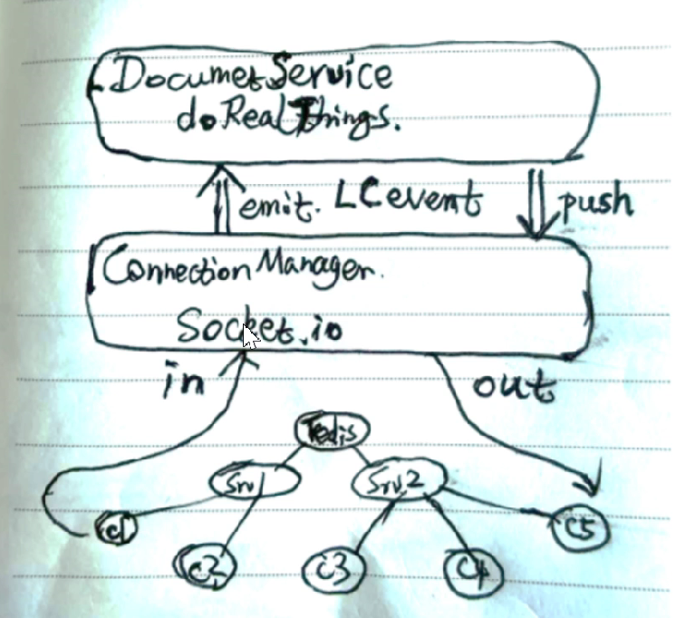

# 一： 产品架构——洛书的分层

https://console.box.lenovo.com/v/preview/ent/1811649837?language=zh&other=%7B%22path_type%22%3A%22ent%22,%22sort%22%3A%22desc%22,%22orderby%22%3A%22mtime%22,%22limit%22%3A50,%22offset%22%3A0,%22include_deleted%22%3Afalse,%22neid%22%3A%221811188773%22,%22nsid%22%3A122953,%22neid_dir%22%3A%221811188773%22%7D

[洛书的分层](https://console.box.lenovo.com/v/preview/ent/1811649837?self_nsid=122953&language=zh&other=%7B%22path_type%22%3A%22ent%22,%22sort%22%3A%22asc%22,%22orderby%22%3A%22mtime%22,%22limit%22%3A50,%22offset%22%3A0,%22include_deleted%22%3Afalse,%22neid%22%3A%221811188773%22,%22nsid%22%3A122953,%22prefix_neid%22%3A%22%22,%22neid_dir%22%3A%221811188773%22%7D)

只有上层可以import下层的什么东西

一般分层：**上层调用下层**。例如：docsserver/apigateway——所有客户端请求过来的入口。apigateway后面是真正的一些有逻辑的service。比如：DocumentService的getDraft()。DocumentService 这一层 对上面是没有编译依赖的。是不知道有apigateway这个东西的存在的。将来server端负载到一定程度的时候，把apigateway这一层变成一个单独的microservice，而DocumentService这一层几乎不用怎么改代码

另一种分层：**下层调用上层**（下层是不知道上层的，但是下层对上层有调用）。ConnectionManager层是一个通讯层，管理一系列从客户端过来的connection以及server之间互相的connection。一旦有通讯过来，唯一最终要做的就是要对上层emit一个事件出来。

event emit后会发生什么？

 GUI控件的分层：必须是下层（通用控件层）调用上层（业务逻辑层）。因为所有的入口都在下层那控制。

framework层：

* SfxApplication：对整个应用程序的一个抽象
* SfxModule
* SfxViewFrame：整个程序的主窗口
* SfxObjectShell：model ScDocShell/SwDocShell
* SfxViewShell：view
* **SfxDispatcher**：react.onClick / api call --> sid&&payload(要做什么事情 && 参数) --> **shell in stack（这一步是最关键的步骤：SID和payload发出去之后，由framework层来帮你找到是哪个shell，去响应整个sid。有可能一个sid被一系列的shell同时能响应）** --> execute。写代码的时候千万不要再在controller里面直接去调用某个shell的方法。
* **SfxBindings**：sid --> shell in stack --> getstate in payload --> update UIController --> react.setState
  * 通过binding去invalidate一个sid，开始触发，framework去shell stack里面找合适的shell，找到以后就会调用shell的getState()，获得payload，根据获得到的payload去update具体的UI元素
* LayoutManager

什么情况下会去invalidate一个sid？

# 二 async和await

# 三 hosts文件

[hosts文件相关](https://blog.csdn.net/qq_35246620/article/details/66970211)

ubuntu系统中的hosts文件位置：/etc/hosts

怎么快捷打开hosts文件？C：\Windows\System32\drivers\etc

云桌面外ip：192.168.31.53

云桌面内ip：172.16.22.149

# 四 npm run xxx

# 五 mongodb数据库启动报错

[MoongoDB数据库启动报错&#39;exception in initAndListen: NonExistentPath: Data directory /data/db not found., terminating&#39; - 人生多风雨 - 博客园 (cnblogs.com)](https://www.cnblogs.com/on-the-way-w/p/10547581.html)

# 六 父子系统文件互传

https://blog.csdn.net/weixin_38883338/article/details/109825845
