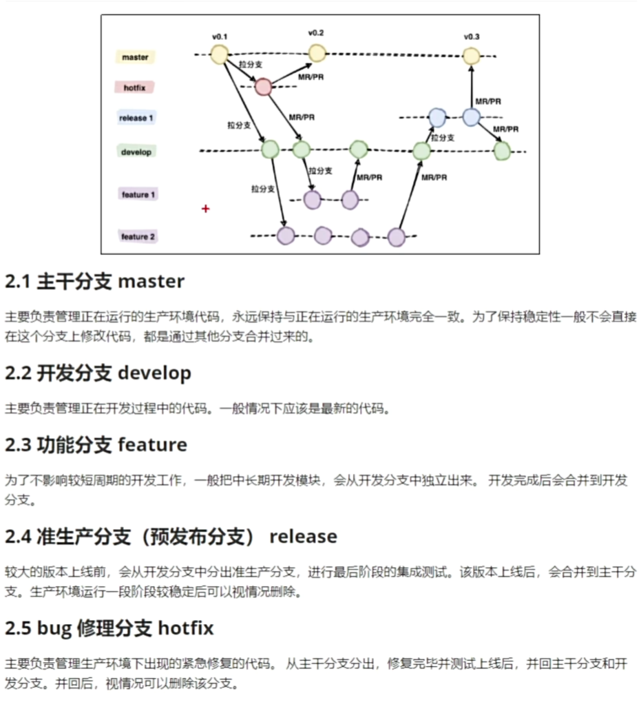

# [19. gitlab的安装部署](https://www.bilibili.com/video/BV1NK421Y7XZ?p=20&vd_source=a7089a0e007e4167b4a61ef53acc6f7e)

# [20. gitlab的登录使用与页面修改](https://www.bilibili.com/video/BV1NK421Y7XZ?p=21&spm_id_from=pageDriver&vd_source=a7089a0e007e4167b4a61ef53acc6f7e)

# [21. gitlab的人员创建](https://www.bilibili.com/video/BV1NK421Y7XZ?p=22&spm_id_from=pageDriver&vd_source=a7089a0e007e4167b4a61ef53acc6f7e)

# [22. gitlab的群组介绍](https://www.bilibili.com/video/BV1NK421Y7XZ?p=23&spm_id_from=pageDriver&vd_source=a7089a0e007e4167b4a61ef53acc6f7e)

# [23. gitlab推送代码创建仓库](https://www.bilibili.com/video/BV1NK421Y7XZ?p=24&spm_id_from=pageDriver&vd_source=a7089a0e007e4167b4a61ef53acc6f7e)

# 24. gitlab网站创建项目及成员权限管理

# [26. git企业开发工作流介绍](https://www.bilibili.com/video/BV1NK421Y7XZ?p=27&spm_id_from=pageDriver&vd_source=a7089a0e007e4167b4a61ef53acc6f7e)

# [27. gitlab完成企业项目的初始化](https://www.bilibili.com/video/BV1NK421Y7XZ?p=28&spm_id_from=pageDriver&vd_source=a7089a0e007e4167b4a61ef53acc6f7e)

# [28. gitlab完成不同分支的提交与合并请求](https://www.bilibili.com/video/BV1NK421Y7XZ?p=29&spm_id_from=pageDriver&vd_source=a7089a0e007e4167b4a61ef53acc6f7e)

# 29. gitlab冲突提交 不同的人修改不同的文件

# 
