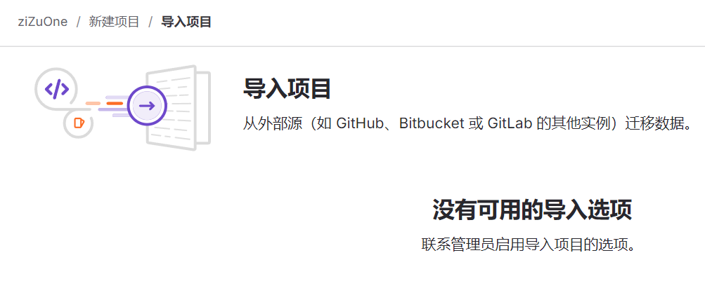
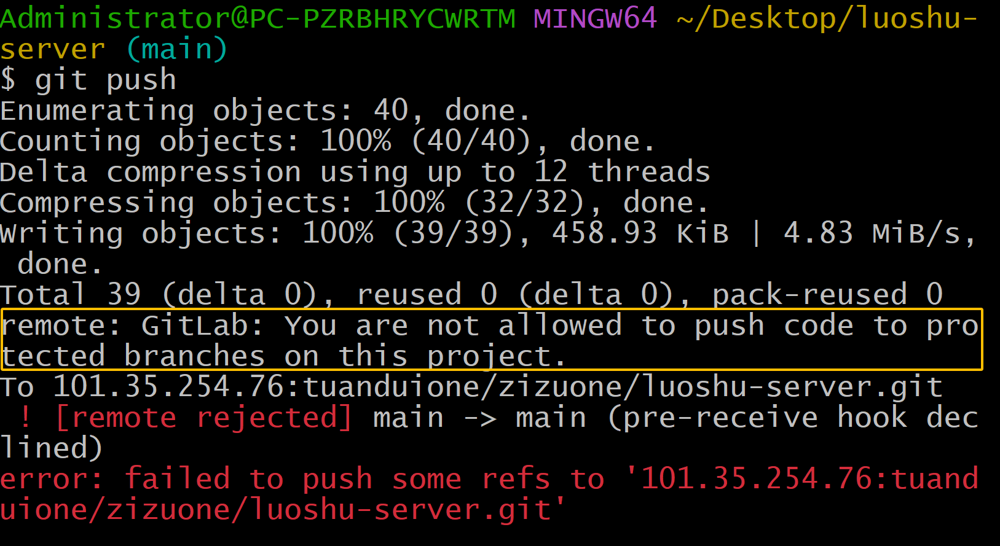
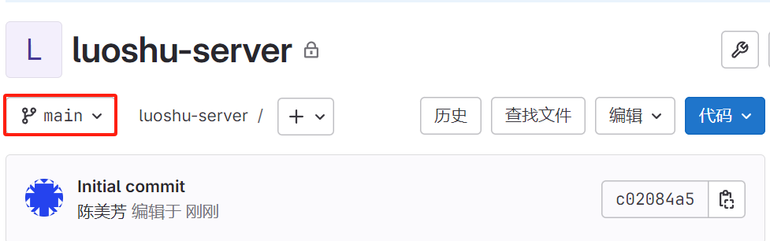
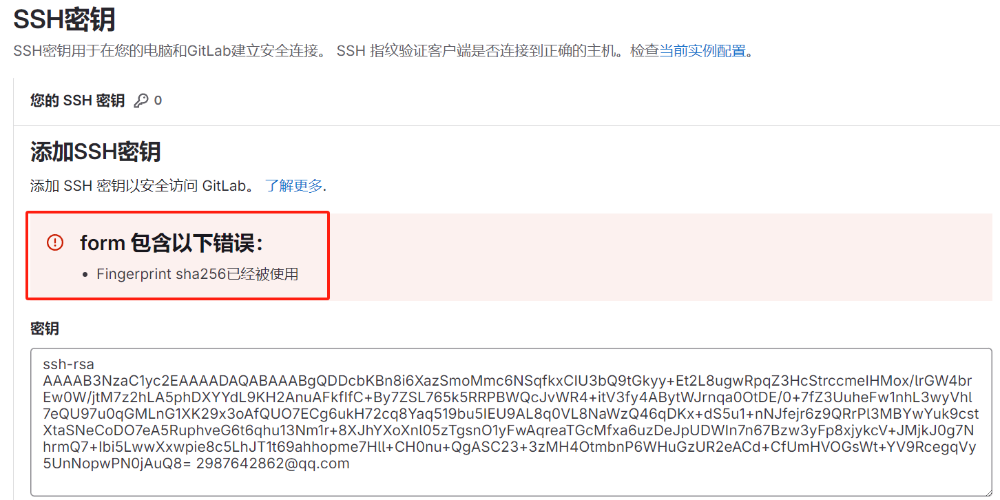

# 1. 官方文档定义的字段

GitLab CI/CD 官方文档定义的字段包括：
- `stages`: 定义流水线中的阶段。
- `before_script`、`after_script`: 定义在每个任务之前或之后要执行的脚本。
- `script`: 定义任务中要执行的具体步骤。
- `only`、`except`: 用于限制任务的执行条件。
- `interruptible` 等任务级别的配置选项。

`envMr` 在你的配置中作为任务的名称，它是在 GitLab 的 `stages` 配置下的一个任务名，完全由用户根据需要自定义。

# 2. vscode中与gitlab相关的插件

在 VS Code 中，有许多插件可以与 GitLab 集成，以帮助你在开发过程中更加便捷地管理 GitLab 仓库、代码审查和 CI/CD 流程。以下是一些与 GitLab 相关的常用插件：

### 1. **GitLab Workflow**
   - **插件功能**: GitLab Workflow 是最常用的 VS Code 插件之一，提供对 GitLab 项目、合并请求、问题、CI/CD 状态等的管理功能。它可以让你直接在 VS Code 中查看和管理 GitLab 仓库，而无需离开编辑器。
   - **主要功能**:
     - 直接查看和创建 GitLab issues、merge requests。
     - 检查当前 CI/CD 流程状态。
     - 触发管道（pipelines）重跑或取消。
     - 代码审查和合并请求。
     - 打开远程仓库中的代码文件或行。
     - 支持 GitLab Self-hosted 实例。
   - **插件地址**: [GitLab Workflow](https://marketplace.visualstudio.com/items?itemName=GitLab.gitlab-workflow)

### 2. **GitLens — Git supercharged**
   - **插件功能**: GitLens 是一个非常强大的 Git 扩展工具，它不仅支持 GitHub 和 Bitbucket，还完美支持 GitLab。它可以帮助你更好地理解代码的历史，查看提交者信息、代码行的历史等。
   - **主要功能**:
     - 查看 Git blame 信息。
     - 追踪代码片段的更改历史。
     - 提供文件变更对比。
     - 与 GitLab 集成，查看合并请求和分支历史。
   - **插件地址**: [GitLens](https://marketplace.visualstudio.com/items?itemName=eamodio.gitlens)

### 3. **GitLab Issues**
   - **插件功能**: 这个插件专门用于管理 GitLab 中的 issues，你可以从 VS Code 中直接创建、分配、更新和关闭 GitLab issues。
   - **主要功能**:
     - 查看和管理 GitLab issues。
     - 在 VS Code 中直接打开与 issue 相关的代码文件。
     - 支持搜索和过滤 issues。
   - **插件地址**: [GitLab Issues](https://marketplace.visualstudio.com/items?itemName=gitlab.gitlab-issues)

### 4. **GitLab Snippets**
   - **插件功能**: GitLab Snippets 插件让你可以直接在 VS Code 中查看和管理 GitLab Snippets（代码片段），无需打开 GitLab 网页端。
   - **主要功能**:
     - 创建、查看、更新 GitLab 代码片段（Snippets）。
     - 支持 Snippet 搜索。
     - 快速复制 Snippet 内容到你的项目中。
   - **插件地址**: [GitLab Snippets](https://marketplace.visualstudio.com/items?itemName=gitlab.gitlab-snippets)

### 5. **GitLab Markdown**
   - **插件功能**: 这个插件为 GitLab Markdown 提供语法支持和渲染功能，特别适合在 VS Code 中编写 GitLab README 文件、Merge Request 描述或 Issues 评论时使用。
   - **主要功能**:
     - GitLab 特定的 Markdown 语法支持。
     - 实时预览 GitLab Markdown 渲染效果。
   - **插件地址**: [GitLab Markdown](https://marketplace.visualstudio.com/items?itemName=tonybaloney.vscode-gitlab-markdown)

### 6. **GitHub & GitLab Auth**
   - **插件功能**: 这个插件支持通过 GitLab 进行 OAuth 身份验证，从而更方便地管理 GitLab 项目，特别是当你需要频繁切换不同的 GitLab 项目时非常有用。
   - **主要功能**:
     - 通过 GitLab OAuth 快速登录。
     - 便于访问私有仓库。
   - **插件地址**: [GitHub & GitLab Auth](https://marketplace.visualstudio.com/items?itemName=chrisdias.vscode-openapi)

### 7. **Remote Repositories**
   - **插件功能**: Remote Repositories 允许你无需将 GitLab 仓库克隆到本地即可在 VS Code 中浏览和编辑 GitLab 上的代码。非常适合浏览远程代码或快速编辑远程文件。
   - **主要功能**:
     - 在 VS Code 中打开远程 GitLab 仓库。
     - 无需克隆仓库即可快速查看和编辑文件。
     - 与 GitLab 无缝集成，支持 Git 操作。
   - **插件地址**: [Remote Repositories](https://marketplace.visualstudio.com/items?itemName=GitHub.remotehub)

### 总结
通过这些插件，VS Code 可以与 GitLab 进行深度集成，简化了日常的代码管理、合并请求、代码审查以及 CI/CD 相关操作。如果你主要使用 GitLab 进行项目管理，推荐安装 `GitLab Workflow` 和 `GitLens` 来增强 VS Code 的功能。

# 3. GitLab开启导入选项



GitLab 管理员可以通过以下步骤启用项目导入选项：

### 1. **登录 GitLab 管理员账户**
   管理员首先需要登录到 GitLab 的 Web 界面。

### 2. **进入管理区域**
   - 点击页面右上角的头像，选择 **"Admin Area"（管理员区域）**。

### 3. **启用导入功能**
   在管理员界面中，按照以下步骤启用导入项目功能：
   - 在左侧菜单中，找到 **"Settings"（设置）**，然后选择 **"General"（常规设置）**。
   - 滑动到 **"Visibility and Access Controls"** 部分。
   - 在这里找到 **"Import sources"**，并确保你需要的导入选项（例如 GitHub、Bitbucket 等）已经被勾选启用。
   - 完成后，点击 **"Save changes"（保存更改）** 按钮。

### 4. **检查项目设置**
   - 进入你想要导入的项目设置页面，查看是否已经有了项目导入的选项。

这将允许用户在创建或管理项目时，使用管理员启用的导入功能从其他平台导入项目。

如果项目导入选项仍未显示，可能需要检查 GitLab 版本是否支持该功能或重新启动服务。

# 4. 设置项目master分支后续不能被直接push代码


开发者可以将初始提交推送到仓库，但之后不可以。之后对于master分支所有的代码操作都只能在gitlab上面去执行分支合并的操作



# 5. 新建项目的初始分支

为什么新建项目的初始分支是main不是master？



GitLab默认将新项目的初始分支命名为 **`main`** 而不是 **`master`**，是为了与软件开发界更广泛的命名变化保持一致。这一改变主要源于以下几个原因：

### 1. **消除不必要的语言歧视**
   术语“master”被认为有潜在的歧视性含义，可能让人联想到主仆关系（master-slave）。为了避免这种不必要的联想，多个开源项目和开发平台（如 GitLab、GitHub 等）开始使用中立的词汇 **`main`** 来代替 **`master`**，以支持更具包容性的语言。

### 2. **行业标准化**
   随着 GitHub 在 2020 年宣布将默认分支从 **`master`** 改为 **`main`**，其他工具和平台也逐渐跟进，以保持一致的标准。GitLab 也在这一变化中做出了相应调整，以促进团队合作和跨平台项目管理的一致性。

### 3. **技术支持**
   Git 在 2.28.0 版本开始，允许用户在创建仓库时自定义默认分支名称。这为各个平台切换到 **`main`** 提供了技术基础。GitLab 顺应了这一趋势，默认采用 **`main`** 作为新项目的初始分支。

这种命名变化虽然是一个小调整，但在开发环境中有着广泛的象征意义，支持多样性和包容性的同时，提升了工具间的兼容性。 

如果你希望更改默认分支名称，GitLab 允许管理员自定义项目的初始分支名称。

# 6. Gitlab删除项目

在 GitLab 中删除一个项目的步骤如下：

### 步骤：
1. **登录到 GitLab**：使用管理员或项目所有者的账号登录 GitLab 实例。
  
2. **导航到项目**：找到并进入你想要删除的项目页面。

3. **进入项目设置**：
   - 在项目页面的左侧栏，点击 **“Settings”**（设置）。
   - 然后，在下拉菜单中选择 **“General”**（通用设置）。

4. **滚动到“Advanced”部分**：
   - 在通用设置页面，向下滚动到 **“Advanced”** 部分。
   - 在这里，你会看到 **“Remove project”**（删除项目）选项。

5. **确认删除**：
   - 点击 **“Remove project”** 按钮。
   - 系统会弹出一个确认框，提示你再次确认删除操作。输入项目名称或确认提示，然后点击 **“Confirm”**。

### 注意事项：
- **权限要求**：删除项目需要具备项目所有者或管理员权限。
- **不可逆**：删除操作一旦确认，项目及其所有关联的数据（包括代码、Issues、Merge Requests 等）都会被永久删除，无法恢复。所以在删除之前务必确保有必要的备份。

如果你遇到权限或设置问题，可以联系 GitLab 管理员寻求帮助。

# 7. Gitlab ssh秘钥重复



GitLab 报错 "Fingerprint sha256已经被使用" 意味着该 SSH 密钥的指纹（`fingerprint`）已经被 GitLab 识别并与某个账户绑定，导致无法再次使用。这通常发生在以下几种场景：

### 可能的原因：
1. **密钥已被其他账户或同一账户绑定**：如果你已经将该 SSH 密钥添加到 GitLab 中的某个账户，GitLab 会阻止重复添加。
2. **重复使用密钥**：你可能在尝试将同一 SSH 密钥添加到不同的 GitLab 账户中，而 GitLab 不允许一个密钥被多个账户使用。
3. **密钥已添加到项目部署密钥中**：该 SSH 密钥可能已经作为部署密钥添加到项目中，而非个人账户中。

### 解决方法：
1. **检查是否已添加密钥**：
   - 登录 GitLab，进入 “**User Settings**” -> “**SSH Keys**”，查看当前已绑定的 SSH 密钥。如果该密钥已存在，就不需要再次添加。
   
2. **删除或更换现有的 SSH 密钥**：
   - 如果你不需要使用该密钥，删除它，并生成新的 SSH 密钥。执行以下命令来生成新密钥：
     ```bash
     ssh-keygen -t rsa -b 4096 -C "new_email@example.com"
     ```
   - 将新生成的密钥添加到 GitLab 中。

3. **查看项目的部署密钥**：
   - 如果该密钥已被添加为部署密钥，转到项目的 “**Deploy Keys**” 设置，查看并删除不再需要的密钥。

4. **使用不同的 GitLab 账户**：
   - 如果你正在尝试在不同的 GitLab 账户中使用同一个 SSH 密钥，请为每个账户生成独立的 SSH 密钥。

### 检查指纹：
你可以通过以下命令检查 SSH 密钥的指纹：
```bash
ssh-keygen -lf ~/.ssh/id_rsa.pub
```
这样你可以确认该指纹是否已在 GitLab 绑定。

### 总结
- GitLab 不允许同一 SSH 密钥在多个账户或多个地方同时使用。
- 你可以生成新的 SSH 密钥，或检查现有密钥的绑定情况并做适当的调整。

# 8. 尝试在不同的 GitLab 账户中使用同一个 SSH 密钥报错，如何为每个账户生成独立的 SSH 密钥

要为每个 GitLab 账户生成独立的 SSH 密钥，按照以下步骤操作：

### 1. **生成新的 SSH 密钥**
为每个账户创建不同的 SSH 密钥对。你可以通过指定不同的文件名来保存多个密钥。

```bash
ssh-keygen -t rsa -b 4096 -C "email@example.com"
```

`-t rsa`: 选项 `-t` 指定要生成的密钥类型，这里是 `rsa`（Rivest-Shamir-Adleman）加密算法。RSA 是一种常见的非对称加密算法，在 SSH 密钥对中使用

`-b 4096`: 选项 `-b` 指定密钥的大小（以位为单位）。这里指定了 `4096` 位，这意味着生成的 RSA 密钥将有 4096 位长，增强了其安全性（比默认的 2048 位更加安全）

`-C "email@example.com"`: 选项 `-C` 用于在密钥文件中添加一个注释（通常是邮箱地址或其他标识信息）。这个注释有助于识别密钥的用途或关联的用户，但不影响密钥的安全性

在生成ssh秘钥的时候不指定邮箱地址可以吗——可以

在提示输入文件保存位置时，为不同账户的密钥设置唯一文件名。例如：

```bash
Enter file in which to save the key (/home/user/.ssh/id_rsa): /home/user/.ssh/id_rsa_gitlab_account1
```

然后按 Enter，继续设置密码（可选）。

为第二个 GitLab 账户生成新密钥时，使用不同的文件名：

```bash
ssh-keygen -t rsa -b 4096 -C "email@example.com"
Enter file in which to save the key (/home/user/.ssh/id_rsa): /home/user/.ssh/id_rsa_gitlab_account2
```

### 2. **配置 SSH Config 文件**
为了让 SSH 在不同的 GitLab 账户之间正确路由不同的密钥，需要编辑 SSH 的配置文件 (`~/.ssh/config`)。如果文件不存在，可以创建它。

```bash
nano ~/.ssh/config
```

在文件中添加以下内容：

```bash
# GitLab Account 1
Host gitlab-account1
    HostName gitlab.com
    User git
    IdentityFile ~/.ssh/id_rsa_gitlab_account1

# GitLab Account 2
Host gitlab-account2
    HostName gitlab.com
    User git
    IdentityFile ~/.ssh/id_rsa_gitlab_account2
```

这里，你可以用 `gitlab-account1` 和 `gitlab-account2` 来区分两个账户。当你在使用不同账户时，Git 会根据配置文件自动选择正确的 SSH 密钥。

### 3. **将 SSH 密钥添加到 GitLab**
将生成的 SSH 公钥添加到对应的 GitLab 账户中：

- 复制公钥内容：
  ```bash
  cat ~/.ssh/id_rsa_gitlab_account1.pub
  ```

- 进入 GitLab，在 "Settings" -> "SSH Keys" 中，添加该公钥。为其他账户重复此操作。

### 4. **克隆和推送代码**
当克隆或推送项目时，使用配置文件中的 `Host` 来指定账户。例如：

```bash
git clone git@gitlab-account1:username/repo.git
```

或者

```bash
git clone git@gitlab-account2:username/repo.git
```

这样 Git 会根据 `~/.ssh/config` 自动使用正确的 SSH 密钥。

### 总结
通过为每个 GitLab 账户生成独立的 SSH 密钥，并在 SSH 配置文件中进行正确的设置，你可以无缝地在多个账户之间切换。

# 9. 为什么要fork远程中心仓库

在项目开发中，派生（或称为"fork"）远程中心仓库的主要原因有几个：

1. **独立开发和实验**：派生仓库允许开发者在自己的副本上进行独立的开发和实验，而不会影响到原始中心仓库。这对于尝试新功能或改进项目非常有用。

2. **开源项目贡献**：对于开源项目，派生仓库使得贡献者可以在自己的副本上进行修改，然后通过拉取请求（Pull Request）将更改提议合并回中心仓库。这是一种常见的开源开发模式，确保主项目的稳定性，同时允许外部贡献者参与开发。

3. **权限管理**：在一些情况下，开发者可能没有对原始中心仓库的写权限。通过派生一个自己的仓库，他们可以进行更改和测试，然后请求合并到原始仓库。

4. **团队协作**：在团队开发中，团队成员可以派生中心仓库以便在各自的副本中进行开发。这样可以避免多人直接对同一个中心仓库进行修改，减少冲突和混乱。

5. **版本控制和回滚**：派生仓库使得开发者能够更好地管理不同版本的代码。如果某些更改不符合预期，可以轻松地回到原始状态或其他稳定的版本。

6. **分支策略**：有时候，派生仓库用于管理和维护多个版本或分支的代码，尤其是在需要长期维护多个版本的项目中。

这些理由使得派生远程中心仓库成为一个有效的开发和协作策略。