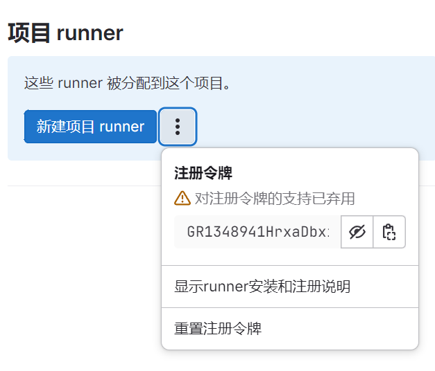

# 1. Gitlab限制Developer合并代码的权限

在 GitLab 中，可以通过配置项目的 **保护分支（Protected Branches）** 来限制开发者（Developer）对特定分支的合并权限。以下是具体步骤：

### 1. **保护分支（Protected Branches）设置**
通过保护分支，可以指定哪些用户角色（如 Maintainer、Developer）有权限推送（push）、合并（merge）或强制推送（force push）到某个分支。

#### 步骤：
1. 登录到 GitLab 并进入你的项目页面。
2. 在项目的左侧菜单中，点击 **Settings（设置）** > **Repository（仓库）**。
3. 滚动到 **Protected Branches（保护分支）** 部分。
4. 在 "Protected Branches" 中选择你要保护的分支（如 `master` 或 `main`）。
5. 点击旁边的 **Expand（展开）** 按钮，看到可选的设置：
    - **Allowed to merge（允许合并）**：可以选择哪些角色有权限合并代码。
    - **Allowed to push（允许推送）**：可以选择哪些角色有权限推送代码。

#### 设置示例：
- 如果你希望只允许 **Maintainers** 合并代码，可以将 "Allowed to merge" 设置为 **Maintainers**。
- 你还可以将 "Allowed to push" 设置为 **Maintainers**，以防止开发者直接推送代码到该分支。

### 2. **通过合并请求（Merge Request）管理合并**
GitLab 推荐使用合并请求（Merge Request, MR）进行代码合并，这样可以对代码更改进行代码审查和自动化测试。

1. 开发者可以提交合并请求（MR），请求将他们的代码合并到受保护的分支。
2. 只有有合并权限的角色（如 Maintainer）才能批准并合并 MR。

### 3. **CI/CD 配合保护分支**
可以进一步结合 GitLab CI/CD，对受保护分支进行更严格的代码质量检查。可以通过在 CI/CD 流水线中配置不同的作业（job），强制在代码合并前通过所有测试和检查。

### 总结：
要限制 Developer 合并代码的权限，可以通过 GitLab 的 **Protected Branches** 功能实现，只允许 Maintainers 合并代码，并要求开发者通过合并请求来进行代码的审查和合并操作。

# 2. 版本

> 您当前使用的是 17.3.2 版本！我们强烈建议您立即升级到以下版本之一：17.4.0, 17.3.3

GitLab 17.3.2 和 17.3.3 版本的主要区别在于安全补丁和漏洞修复：

1. **安全修复**：GitLab 每个版本都会修复一些安全漏洞，确保系统的安全性。17.3.3 版本针对多个漏洞进行了修复，例如防止拒绝服务（DoS）攻击等问题。
   
2. **漏洞修补**：17.3.3 包括针对用户权限和某些功能的不当行为的修复，确保未授权用户无法利用 GraphQL 等进行潜在的恶意操作。

升级到最新版本通常能更好地保护系统安全，建议尽快更新到 17.3.3 以避免潜在安全风险【23†source】。

# 3. GitLab Runner作用

GitLab Runner 是 GitLab 的一个重要组件，专门用于执行 GitLab CI/CD（持续集成/持续交付）流水线中的任务。它是一个可以在不同平台上运行的轻量级代理，负责从 GitLab 实例获取作业任务并在配置好的环境中执行这些任务。

### 主要功能：
1. **执行CI/CD流水线任务**：GitLab Runner 用于执行项目中的 CI/CD 工作，如代码编译、测试、部署等。它能够自动运行开发人员配置的任务。
   
2. **多平台支持**：它可以在多个平台上运行，包括 Windows、Linux、macOS，甚至可以在 Docker 容器或 Kubernetes 集群中运行。

3. **不同的执行器（Executors）**：
   - **Shell**：直接在主机的 shell 中执行任务。
   - **Docker**：通过 Docker 容器化环境来隔离和执行任务。
   - **Kubernetes**：通过 Kubernetes 集群来执行任务，适用于大规模的自动化流水线。

4. **并行和分布式执行**：GitLab Runner 可以并行执行多个作业，并且可以在多个服务器或虚拟环境中分布运行，提升效率。

### 使用场景：
- 自动化代码测试：开发人员提交代码后，GitLab Runner 自动运行预配置的测试用例。
- 自动化部署：配合 CI/CD 流水线，GitLab Runner 可以将应用程序部署到指定环境中，如生产服务器或云平台。

总结来说，GitLab Runner 是 GitLab CI/CD 自动化流程的核心执行工具，负责从 GitLab 获取任务并在配置的执行环境中完成这些任务。

# 4. GitLab Runner安装

要使用 GitLab Runner，需要在你要执行 CI/CD 流水线任务的机器或云服务器上进行安装。

GitLab Runner 是独立于 GitLab 主服务器的，它在不同的服务器或虚拟机中运行任务，从而实现代码测试、构建、部署等自动化流程

在 Ubuntu Server 20.04 LTS 64bit 上安装 GitLab Runner:

### 1. **更新系统包**
在安装之前，建议先更新系统上的包：
```bash
sudo apt-get update && sudo apt-get upgrade -y
```

### 2. **安装 GitLab Runner**
按照官方推荐，使用 GitLab 提供的脚本来安装 GitLab Runner。

#### 添加 GitLab Runner 仓库：
首先，添加 GitLab 的官方 Runner 仓库和 GPG 密钥：
```bash
curl -fsSL https://packages.gitlab.com/install/repositories/runner/gitlab-runner/script.deb.sh | sudo bash
```

- curl：这是一个命令行工具，用于向指定的URL发起HTTP请求并下载内容
- -f：在curl命令中，表示如果请求失败则不输出错误信息
- -s：表示静默模式，不显示进度条或者错误信息
- -S：与-s一起使用时，如果发生错误则显示错误信息
- -L：如果目标URL返回重定向，curl将遵循重定向

`curl -fsSL https://packages.gitlab.com/install/repositories/runner/gitlab-runner/script.deb.sh`：从GItLab的官方包管理库中下载名为script.deb.sh的安装脚本

- |：管道符号，将前一个命令的输出作为下一个命令的输入
- bash：使用bash命令解释器来执行从前一个命令下载的脚本

#### 安装 GitLab Runner：

接下来，执行以下命令安装 GitLab Runner：
```bash
sudo apt-get install gitlab-runner
```

### 3. **注册 GitLab Runner**
安装完成后，需要将 GitLab Runner 注册到 GitLab 项目中。

- 使用以下命令开始注册：
  ```bash
  sudo gitlab-runner register
  ```

- 系统会提示输入以下信息：
  - **GitLab 实例的 URL**（例如：https://gitlab.com 或你自己托管的 GitLab 实例的 URL）http://101.35.254.76:8989/
  - **项目的注册令牌**（可以在项目的 **Settings > CI/CD > Runners** 页面中找到GR1348941HrxaDbxiT96YLU_xxDTy GR1348941HrxaDbxiT96YLU_xxDTy
  - **Runner 描述**（可以随意命名，便于区分）
  - **Runner 标签**（可选，但可以为 Runner 打上特定标签）
  - **执行器类型**（选择你想要的执行器，比如 `docker` 或 `shell`）

Please enter the executor: docker, parallels, shell, ssh, docker-ssh+machine, kubernetes, docker-ssh, virtualbox, docker+machine

### 4. **启动 GitLab Runner**
注册完成后，启动并确保 GitLab Runner 处于运行状态：
```bash
sudo gitlab-runner start
```

### 5. **检查 GitLab Runner 状态**
你可以使用以下命令检查 GitLab Runner 是否正常工作：
```bash
sudo gitlab-runner status
```

```
Runtime platform                                    arch=amd64 os=linux pid=965302 revision=b92ee590 version=17.4.0
gitlab-runner: Service is running
```

### 总结

1. 更新系统包并添加 GitLab Runner 仓库。
2. 安装 GitLab Runner。
3. 使用注册令牌将 Runner 注册到 GitLab 项目中。
4. 启动并确认 Runner 正常工作。

这样，你就可以在 Ubuntu Server 20.04 LTS 上成功安装和配置 GitLab Runner【23†source】。

# 5. 项目的注册令牌

可以在项目的 **Settings > CI/CD > Runners** 页面中找到

GR1348941HrxaDbxiT96YLU_xxDTy



GitLab Runner 中对注册令牌的支持被弃用，意味着 GitLab 官方逐渐移除了某些以前用于注册 Runner 的机制或方法。这里的“注册令牌”通常指的是 GitLab 提供的令牌，用于在 GitLab 实例（如 GitLab CI/CD）中注册新的 Runner。

弃用的情况可能是以下几种之一：

### 1. **全局注册令牌弃用**
   以前，GitLab 提供了一个全局的注册令牌，用于注册 Runner 并让它们可以服务于整个 GitLab 实例或组。这种全局令牌可能带来安全风险，因为它可以允许不受控制的 Runner 被注册并接入系统。所以，GitLab 可能转向了一种更加细化的注册令牌机制，只允许特定项目、特定用户或组内的特定权限持有者注册 Runner。

### 2. **项目级或组级令牌的更改**
   注册令牌弃用可能意味着旧的项目级或组级的 Runner 注册机制被替换为更加安全或更加复杂的机制。新机制可能要求使用其他认证方式，或者将注册流程改为通过 API 或用户界面进行的认证方式，而不是依赖单一的注册令牌。

### 3. **Runner 注册流程的增强**
   随着 GitLab 版本的演进，GitLab Runner 的注册流程可能变得更为安全，弃用了简单的注册令牌认证，转而依赖 OAuth、SSH 密钥、API 密钥等更加安全的认证方式，以防止 Runner 注册时被滥用。

### 应对措施：
- **使用 API 注册 Runner**：弃用后，GitLab 可能更推荐使用 API 或 UI 来管理 Runner 的注册。通过 GitLab 提供的 API，管理员可以使用更安全的方式注册 Runner，而不依赖于全局的注册令牌。
- **细化权限**：GitLab 会更加倾向于为不同的用户、组或者项目分配更细粒度的权限，从而控制谁可以注册新的 Runner，防止过多的 Runner 被注册。
  
### 总结：
注册令牌的弃用是 GitLab 强化 Runner 安全管理的一步，它可能已经替代为更加安全的注册方式，如通过 API 认证或更严格的权限控制。如果你依赖旧的注册方式，建议参考最新的 GitLab 文档，了解新的 Runner 注册方法。

# 6. GitLab Runner 执行器类型

Please enter the executor: docker, parallels, shell, ssh, docker-ssh+machine, kubernetes, docker-ssh, virtualbox, docker+machine

在注册 GitLab Runner 时，你需要选择适合你项目和运行环境的执行器（Executor）。GitLab Runner 支持多种执行器类型，以下是常见执行器的介绍及使用场景：

### 1. **Docker**
   - **适用场景**：如果你的项目需要运行在隔离的容器环境中，推荐使用 Docker 执行器。它允许你为每次作业运行一个独立的 Docker 容器，确保环境的可复现性。
   - **优点**：易于管理依赖和环境隔离，支持多种语言和框架。
   - **推荐使用**：当你的 CI/CD 流水线依赖多个环境，或者你需要保证环境一致时。

### 2. **Parallels**
   - **适用场景**：如果你使用 Parallels Desktop 作为虚拟化平台（通常是 macOS 用户），可以选择此执行器。
   - **优点**：可以在 macOS 虚拟机中执行任务。
   - **推荐使用**：适用于 macOS 环境下的开发和测试。

### 3. **Shell**
   - **适用场景**：如果你希望在 Runner 主机的操作系统上直接运行命令（如 bash、zsh），可以选择 Shell 执行器。
   - **优点**：配置简单，适合没有复杂环境需求的项目。
   - **推荐使用**：适用于开发环境简单、没有隔离需求的场景。

### 4. **SSH**
   - **适用场景**：允许你通过 SSH 连接到远程服务器并在远程主机上执行 CI 任务。
   - **优点**：适合需要在远程机器（如生产环境或其他物理服务器）上执行任务的场景。
   - **推荐使用**：适用于需要在远程机器上构建、部署或测试的项目。

### 5. **Docker+machine**
   - **适用场景**：这个执行器允许你使用 Docker 并且自动管理 Docker Machine 来创建、销毁虚拟机。
   - **优点**：自动化管理虚拟机资源，适合需要动态创建环境的场景。
   - **推荐使用**：适用于需要大规模并行执行任务且动态扩展资源的场景。

### 6. **Docker-ssh**
   - **适用场景**：这个执行器与 Docker 执行器类似，但通过 SSH 协议连接到 Docker 容器。
   - **优点**：可以通过 SSH 进行连接，适合对 Docker 容器有特殊连接需求的场景。
   - **推荐使用**：适用于需要通过 SSH 管理 Docker 容器的特殊情况。

### 7. **Docker-ssh+machine**
   - **适用场景**：结合了 Docker-ssh 和 Docker+machine 的功能，既可以通过 SSH 连接容器，又可以动态管理虚拟机。
   - **推荐使用**：适用于对 Docker 容器和动态虚拟机有双重需求的复杂场景。

### 8. **Kubernetes**
   - **适用场景**：如果你使用 Kubernetes 集群来运行 CI/CD 任务，选择 Kubernetes 执行器。
   - **优点**：可以在 Kubernetes 集群中启动 Pod 来执行任务，适合需要大规模任务调度的项目。
   - **推荐使用**：适合已经使用或计划使用 Kubernetes 作为容器编排工具的项目。

### 9. **VirtualBox**
   - **适用场景**：如果你使用 VirtualBox 虚拟机来运行任务，可以选择这个执行器。
   - **优点**：可以在虚拟机中运行 CI/CD 任务，适合需要多操作系统兼容的环境。
   - **推荐使用**：适用于本地虚拟化环境下的开发。

### 如何选择：
- **Docker**：如果你需要隔离环境并且使用 Docker 是最佳选择。
- **Shell**：如果你只需要在 Runner 主机上运行简单命令，选 Shell。
- **Kubernetes**：如果你在 Kubernetes 集群中运行任务，可以选这个。
- **SSH**：需要在远程机器上执行任务时选择。

根据你的项目和部署环境，**Docker** 或 **Shell** 是最常见的选择。

# 7. sudo gitlab-runner start报错

```shell
ERRO[0000] Docker executor: prebuilt image helpers will be loaded from /var/lib/gitlab-runner. 
```

https://stackoverflow.com/questions/65206569/getting-docker-error-while-using-shell-gitlab-runner-erro0000

Using this command `apt-cache policy gitlab-runner`, you will notice that only version 11.2.0 of `gitlab-runner` is available on the repositories, which is not [supported](https://gitlab.com/gitlab-org/gitlab-runner/-/issues/4773) by Gitlab.

Follow the [official documentation](https://docs.gitlab.com/runner/install/linux-manually.html) to install the latest version 14.2.0

```shell
$ sudo curl -L --output /usr/local/bin/gitlab-runner "https://gitlab-runner-downloads.s3.amazonaws.com/latest/binaries/gitlab-runner-linux-amd64"
$ sudo chmod +x /usr/local/bin/gitlab-runner
$ sudo useradd --comment 'GitLab Runner' --create-home gitlab-runner --shell /bin/bash
$ # Optional sudo rm /etc/systemd/system/gitlab-runner.service
$ sudo gitlab-runner install --user=gitlab-runner --working-directory=/home/gitlab-runner
```

`apt-cache policy gitlab-runner`

- `apt-cache`: 这是一个用于访问本地软件包缓存的命令，允许用户查询已安装软件包的信息以及可用软件包的版本
- `policy`：policy子命令用于显示软件包的版本信息，优先级和来源
- `gitlab-runner`：这是要查询的软件包的名称

输出：

```shell
gitlab-runner:
  Installed: 11.2.0+dfsg-2ubuntu1
  Candidate: 11.2.0+dfsg-2ubuntu1
  Version table:
 *** 11.2.0+dfsg-2ubuntu1 500
        500 http://mirrors.tencentyun.com/ubuntu focal/universe amd64 Packages
        100 /var/lib/dpkg/status
```

- **Installed**：当前安装的版本
- **Candidate**：可用的最新版本
- **Version table**：显示了可用版本的来源和优先级信息

`11.2.0+dfsg-2ubuntu1`:

- 这是软件包的版本号。格式中的`+dfsg`表示该版本是Debian Free Software Guidelines符合版本，通常指的是去掉了某些非自由软件的内容
- `-2ubuntu1`：表示这是Ubuntu版本的第二次打包
- `500`：这是版本的优先级。数值越大，表示在安装或升级时被选择的可能性越大。`500` 是常见的优先级，通常表示这是从官方源获得的标准版本

`http://mirrors.tencentyun.com/ubuntu focal/universe amd64 Packages`:

- 这一行指示了该版本的来源
- **URL**：指向镜像源地址，这里是腾讯云的 Ubuntu 镜像。
- **发行版**：`focal` 表示这是为 Ubuntu 20.04 LTS（Focal Fossa）准备的包。
- **分支**：`universe` 指示这是来自社区维护的软件包，而不是由 Ubuntu 官方团队直接维护的。
- **架构**：`amd64` 表示这个包适用于 64 位架构。

`100 /var/lib/dpkg/status`:

- 这一行显示了当前安装版本的状态来源，指向本地的 dpkg 状态文件
- **`100`**：这是该版本的优先级，表示这个版本是通过直接安装的方式获得的，而不是从外部源下载的。

```shell
$ sudo curl -L --output /usr/local/bin/gitlab-runner "https://gitlab-runner-downloads.s3.amazonaws.com/latest/binaries/gitlab-runner-linux-amd64"
# 用第二个，不用第一个，第二个是官方文档上最新的
# Simply download one of the binaries for your system:
$ sudo curl -L --output /usr/local/bin/gitlab-runner "https://s3.dualstack.us-east-1.amazonaws.com/gitlab-runner-downloads/latest/binaries/gitlab-runner-linux-amd64"
# Give it permissions to execute:
$ sudo chmod +x /usr/local/bin/gitlab-runner
# Create a GitLab CI user:
$ sudo useradd --comment 'GitLab Runner' --create-home gitlab-runner --shell /bin/bash
# Install and run as service
$ sudo gitlab-runner install --user=gitlab-runner --working-directory=/home/gitlab-runner
$ sudo gitlab-runner start
```

# 8. GitLab Runner卸载

在 Ubuntu Server 20.04 LTS 64bit 上卸载 GitLab Runner，可以按照以下步骤操作：

1. **停止 GitLab Runner 服务**：
   ```bash
   sudo gitlab-runner stop
   ```

2. **卸载 GitLab Runner**：
   如果是通过包管理器安装的，可以使用以下命令卸载：
   ```bash
   sudo apt-get remove --purge gitlab-runner
   ```

3. **删除 GitLab Runner 的所有配置文件和数据**（可选）：
   ```bash
   sudo rm -rf /etc/gitlab-runner
   sudo rm -rf /var/lib/gitlab-runner
   ```

4. **清理未使用的依赖**（可选）：
   ```bash
   sudo apt-get autoremove
   ```

# 9. 查看Gitlab Runner是否已register

要查看 GitLab Runner 是否已注册，可以使用以下命令：

```bash
sudo gitlab-runner list
```

如果 GitLab Runner 已注册，命令会显示已注册的 Runner 列表，包括它们的名称、地址和其他相关信息。输出类似于：

```
Listing configured runners                             
   runner1 (token: xxx)                               
   runner2 (token: yyy)
```

如果没有注册的 Runner，输出将显示为空。

另外，你也可以在 GitLab 的 Web 界面中查看已注册的 Runner：

1. 登录到你的 GitLab 实例。
2. 进入项目或组的设置页面。
3. 在左侧菜单中选择 "CI/CD"，然后展开 "Runners" 部分。
4. 你将看到已注册的 Runner 列表。

输出：

```shell
Runtime platform          arch=amd64 os=linux pid=967133 revision=b92ee590 version=17.4.0
Created missing unique system ID             system_id=s_796d1faddcae
Listing configured runners                   ConfigFile=/etc/gitlab-runner/config.toml
```

这个输出表明：

1. **运行时平台**：显示了 GitLab Runner 正在运行的系统信息（如架构、操作系统等）。
2. **创建了唯一系统 ID**：表示系统 ID 已生成，但这并不代表有已注册的 Runner。
3. **列出配置的 Runner**：这行显示了配置文件的位置，但没有显示任何已注册的 Runner。

从这个输出来看，**GitLab Runner 并没有已注册的 Runner**。要注册一个新的 Runner，你需要使用以下命令：

```bash
sudo gitlab-runner register
```

register后的输出：

```shell
Runtime platform          arch=amd64 os=linux pid=969225 revision=b92ee590 version=17.4.0
Listing configured runners                      ConfigFile=/etc/gitlab-runner/config.toml
第一个Runner      Executor=shell Token=PhF17rQbLzQVSxHRj49z URL=http://101.35.254.76:8989/
```

# 10. 删除register的runner

要在云服务器上删除已注册的 GitLab Runner，可以按照以下步骤操作：

1. **SSH 登录到云服务器**: 使用 SSH 登录到运行 GitLab Runner 的云服务器。

2. **查找 Runner 配置**: 找到 Runner 的配置文件，通常在 `/etc/gitlab-runner/config.toml`。

3. **查看已注册的 Runner**: 使用文本编辑器（如 `nano` 或 `vim`）打开 `config.toml` 文件，查看已注册的 Runner 列表。

   ```bash
   sudo nano /etc/gitlab-runner/config.toml
   ```

4. **删除指定的 Runner**: 在 `config.toml` 中，找到你要删除的 Runner 配置，直接删除该 Runner 的相关配置段落。

5. **重启 GitLab Runner**: 删除 Runner 后，重启 GitLab Runner 以使更改生效。

   ```bash
   sudo gitlab-runner restart
   ```

6. **验证**: 你可以通过 GitLab 的 Web 界面或命令行工具检查 Runner 是否已成功删除。

如果需要，也可以使用 GitLab 的 API 来删除 Runner，但上述方法是最直接的方式。

`sudo cat /etc/gitlab-runner/config.toml`

```
concurrent = 1
check_interval = 0
connection_max_age = "15m0s"
shutdown_timeout = 0

[session_server]
  session_timeout = 1800

[[runners]]
  name = "第一个Runner"
  url = "http://101.35.254.76:8989/"
  id = 2
  token = "PhF17rQbLzQVSxHRj49z"
  token_obtained_at = 2024-09-20T06:16:28Z
  token_expires_at = 0001-01-01T00:00:00Z
  executor = "shell"
  [runners.custom_build_dir]
  [runners.cache]
    MaxUploadedArchiveSize = 0
    [runners.cache.s3]
    [runners.cache.gcs]
    [runners.cache.azure]
```

# 11. 为什么服务器上gitLab Runner的状态是running，但gitlab上runner却未显示在线

服务器上 GitLab Runner 状态显示为 "running"，但 GitLab 上 Runner 未显示在线，这种情况通常可能是以下几个原因造成的：

### 1. **GitLab Runner 未正确注册到 GitLab**
   即使 Runner 服务在服务器上正在运行，它也需要通过特定的 token 正确注册到 GitLab 才能在 GitLab 上显示在线。你可以检查以下步骤来确保注册过程正确：

   - 确保你使用正确的注册命令，例如：
     ```bash
     sudo gitlab-runner register
     ```
     然后正确输入 GitLab URL、token 以及 Runner 名称等信息。

   - 检查 `/etc/gitlab-runner/config.toml` 文件，确认 Runner 的 token、GitLab URL 等信息是否正确无误。

### 2. **Token 错误或已失效**
   在注册时使用的 token 错误或失效，GitLab 将无法识别该 Runner。你可以到 GitLab 的 **Admin Area -> CI / CD -> Runners** 页面重新生成一个 token，或检查该 token 是否仍有效。

### 3. **Runner 配置了错误的 GitLab URL**
   注册 Runner 时，输入的 GitLab 实例 URL 错误（比如协议不对，或者地址拼写错误）。确认你在注册 Runner 时使用了正确的 URL，确保它与你访问 GitLab 网页的地址一致。

### 4. **防火墙或网络问题**
   服务器可能因为网络问题无法连接到 GitLab，或是防火墙配置阻止了与 GitLab 实例的通信。你可以尝试以下操作：
   - 检查服务器是否能够成功访问 GitLab 实例，运行命令：
     ```bash
     curl http://your-gitlab-url/
     ```
   - 确认服务器和 GitLab 之间没有被防火墙或网络策略阻挡。
   - 检查 GitLab Runner 的日志文件，通常位于 `/var/log/gitlab-runner/`，查看是否有连接失败的错误。

### 5. **Runner 被禁用或处于特定的分组**
   确认 Runner 并没有被禁用，并且它是否只允许特定项目或分组使用。你可以在 GitLab 中查看 Runner 的设置，确保它配置为允许全局使用（如果需要）。

### 6. **版本不兼容**
   如果 GitLab Runner 的版本和 GitLab 实例的版本不兼容，可能会导致 Runner 无法显示在线。你可以尝试更新 GitLab Runner 到最新版本，或查看 GitLab 的兼容性要求。

确认这些设置是否正确可以帮助你排查问题，确保 Runner 正常显示为在线。

# 12. 查看gitlab-runner日志

要查看 GitLab Runner 的相关日志，可以通过以下方式在不同系统中进行操作：

### 1. **Linux 系统**

GitLab Runner 的日志文件通常位于 `/var/log/gitlab-runner/` 目录下，你可以使用 `cat`、`tail`、`less` 等命令查看这些日志。

- 查看最新日志：
  ```bash
  sudo tail -f /var/log/gitlab-runner/gitlab-runner.log
  ```

- 查看所有日志内容：
  ```bash
  sudo less /var/log/gitlab-runner/gitlab-runner.log
  ```

如果没有在这个目录下找到日志文件，GitLab Runner 的服务可能是通过 `systemd` 管理的，你可以通过 `journalctl` 查看运行时的日志：

- 查看 GitLab Runner 服务日志：
  ```bash
  sudo journalctl -u gitlab-runner
  ```

- 实时查看日志输出：
  ```bash
  sudo journalctl -u gitlab-runner -f
  ```

关键报错信息：

```shell
Sep 20 16:30:38 VM-16-9-ubuntu gitlab-runner[1016226]: FATAL: Service run failed                           error=chdir /home/gitlab-runner: no such file or directory
Sep 20 16:30:38 VM-16-9-ubuntu systemd[1]: gitlab-runner.service: Main process exited, code=exited, status=1/FAILURE
Sep 20 16:30:38 VM-16-9-ubuntu systemd[1]: gitlab-runner.service: Failed with result 'exit-code'.
```

根据你提供的错误信息，`gitlab-runner` 服务在启动时出现了问题，具体是由于找不到 `/home/gitlab-runner` 目录导致的。以下是解决此问题的步骤：

1. **检查目录是否存在**：
   运行以下命令，检查 `/home/gitlab-runner` 目录是否存在：
   ```bash
   ls /home/gitlab-runner
   ```
   如果该目录不存在，你需要创建它。

2. **创建目录**：
   如果目录不存在，可以通过以下命令创建：
   ```bash
   sudo mkdir -p /home/gitlab-runner
   ```

3. **设置权限**：
   确保 `gitlab-runner` 用户对该目录有访问权限：
   ```bash
   sudo chown -R gitlab-runner:gitlab-runner /home/gitlab-runner
   ```

4. **重启 GitLab Runner 服务**：
   完成上述步骤后，重启 `gitlab-runner` 服务：
   ```bash
   sudo systemctl restart gitlab-runner
   ```

5. **检查服务状态**：
   查看服务状态以确保没有其他错误：
   ```bash
   sudo systemctl status gitlab-runner
   ```

