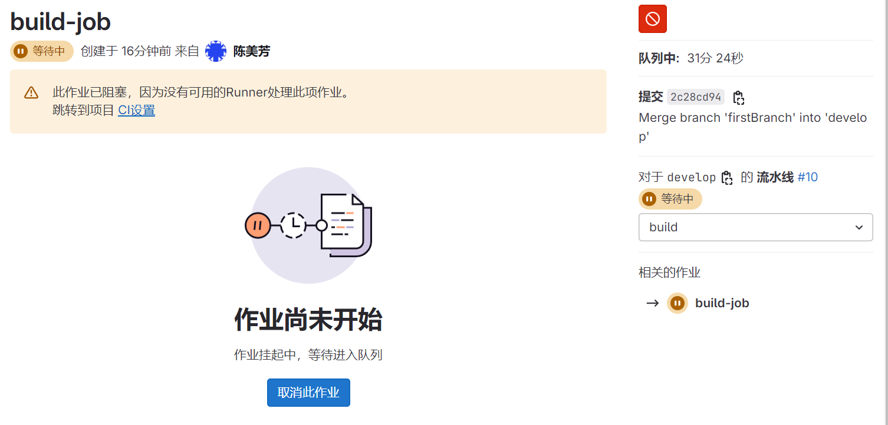
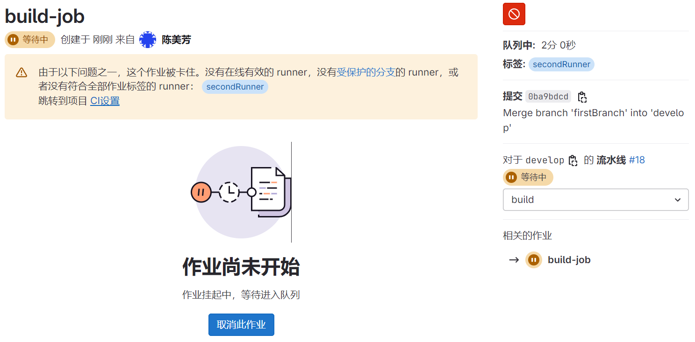
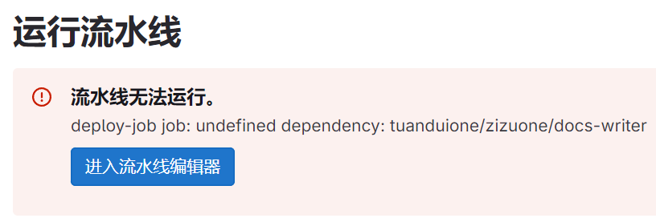

https://www.bilibili.com/video/BV1NK421Y7XZ?p=37&spm_id_from=pageDriver&vd_source=a7089a0e007e4167b4a61ef53acc6f7e

https://www.cnblogs.com/cangqinglang/p/15232869.html

# 1. 分析Pipeline阶段

在编写.gitlab-ci.yml之前，首先需考虑的是Pipeline分几个阶段处理。

从前端工程师的角度出发，一个前端项目的Pipeline处理包括以下阶段：

1. install阶段：执行npm install命令，根据package.json安装node_modules依赖包
2. eslint阶段：执行eslint检查，判断代码格式是否符合规范，如果不符合则Pipeline终止
3. build阶段：编译生成生产代码，可以用webpack之类的打包工具执行编译
4. deploy阶段：部署阶段。将刚才build阶段生成的生产代码，部署到生产访问的服务器上

```yml
stages: # 分段
  - install
  - eslint
  - build
  - deploy

cache: # 缓存
  paths:
    - node_modules
    - build

install-job:
  tags:
    - sss
  stage: install
  script:
    - npm install

eslint-job:
  tags:
    - sss
  stage: eslint
  script:
    - npm run eslint

build-job:
  tags:
    - sss
  stage: build
  script:
    - npm run build

deploy-job:
  tags:
    - sss
  stage: deploy
  script:
    - sshpass -p $PASSWORD scp -r ./build $CUSTOM_USERNAME@$CUSTOM_IP:/var/www/html
```

# 2. Koa和React的.gitlab-ci.yml

要实现自动化部署前端（React）和后端（Koa）项目到同一服务器，并将 React 打包后的静态文件集成到 Koa 中，两个项目的 `.gitlab-ci.yml` 文件应该各自配置成适合自己的构建和部署流程。可以通过 CI/CD 将前后端同时部署到服务器上。

### 1. 前端 (React) 项目的 `.gitlab-ci.yml`
前端的 `.gitlab-ci.yml` 文件需要进行以下配置：
- 安装依赖
- 运行构建（build）
- 将打包好的静态文件放到 Koa 项目的相应静态资源目录
- 如果需要，可以通过 SSH 将文件部署到服务器

```yaml
stages:
  - build
  - deploy

variables:
  NODE_ENV: production

cache:
  paths:
    - node_modules/

before_script:
  - npm install

build-job:
  stage: build
  script:
    - npm run build
  # artifacts用于保存和共享job执行过程中生成的文件，artifacts允许将这些文件从一个job传递到下一个job，也可以在job完成后下载或审查这些文件。
  # 具体作用：指定在React项目的构建过程中，生成的build/目录作为构建的产物被保存和共享
  artifacts:
    paths:
      - build/

deploy-job:
  stage: deploy
  script:
    - echo "Deploying React static files to Koa project..."
    - scp -r build/* user@server:/path-to-koa-project/public/
  only:
    - master  # 部署只在 master 分支进行
```

### 2. 后端 (Koa) 项目的 `.gitlab-ci.yml`
Koa 项目的 `.gitlab-ci.yml`  需要进行以下配置：
- 安装依赖
- 构建和启动服务（如果需要）
- 将 Koa 项目部署到服务器

```yaml
stages:
  - build
  - deploy

variables:
  NODE_ENV: production

cache:
  paths:
    - node_modules/

before_script:
  - npm install

build-job:
  stage: build
  script:
    - echo "Building Koa project..."

deploy-job:
  stage: deploy
  script:
    - echo "Deploying Koa project to the server..."
    - scp -r ./* user@server:/path-to-koa-project/
    - ssh user@server "cd /path-to-koa-project && pm2 reload all"  # 使用PM2重新启动项目
  only:
    - master  # 部署只在 master 分支进行
```

### 整体思路
1. **React 项目**完成打包后，会将 `build/` 目录中的静态文件复制到 Koa 项目的 `public/` 目录下。
2. **Koa 项目**会在部署时重新加载，确保服务器能够提供新的静态文件和 API 服务。
3. 你可以通过 `scp` 和 `ssh` 这些命令来将文件部署到服务器上。如果你的部署涉及 Docker 容器化，你也可以在 `.gitlab-ci.yml` 中加入 Docker 镜像的构建和发布过程。

# 3. artifacts:    paths:      - build/ 

在 GitLab CI/CD 中，`artifacts` 是用于保存和共享 job 执行过程中生成的文件，`artifacts` 允许将这些文件从一个 job 传递到下一个 job，也可以在 job 完成后下载或审查这些文件。

具体到你提到的 `.gitlab-ci.yml` 文件中的 `artifacts: paths: - build/`，它的作用是指定在 React 项目的构建过程中，生成的 `build/` 目录作为构建的产物被保存和共享。这里我们详细分析它的几个主要作用和机制：

### 1. **`artifacts` 的基本概念**
在 GitLab CI 中，`artifacts` 是指构建、测试或部署 job 生成的文件，比如编译生成的二进制文件、打包好的静态文件、测试报告等。`artifacts` 的作用主要有两个：
- **传递构建产物**：在 CI/CD pipeline 中，把某个 job 生成的构建产物传递给下一个 job。
- **保存产物**：将构建产物保存在 GitLab 服务器上，以便在 pipeline 结束后可以下载和查看。

#### 示例解释：
```yaml
artifacts:
  paths:
    - build/
```
这行配置表示：
- GitLab 会将当前 job 中生成的 `build/` 目录内容作为构建产物进行保存。
- 保存的文件可以在当前 pipeline 的其他 job 中使用，也可以在 CI 完成后下载这些文件。

### 2. **React 项目中的 `build/` 目录**
在 React 项目中，`npm run build` 会将源代码编译、打包成适合生产环境使用的静态文件，并将这些文件输出到 `build/` 目录。这个 `build/` 目录是 React 项目打包后的生产版本，通常包含：
- 压缩过的 JavaScript 文件（例如 `main.xxx.js`）
- CSS 文件
- 图片、字体等资源
- `index.html` 文件

这些文件是应用程序在生产环境中运行时需要的，能够直接部署到服务器，并通过 HTTP 提供给用户。

### 3. **GitLab 中 `artifacts` 的具体作用**
通过在 `.gitlab-ci.yml` 中使用 `artifacts: paths: - build/`，你可以确保：
1. **保存打包结果**：当 React 项目在 GitLab CI 中执行构建 job 时，生成的 `build/` 目录被保存下来，成为构建产物。这些文件将被 GitLab 临时存储。
2. **共享文件给后续 job**：如果 pipeline 中后续的 job 需要这些打包后的静态文件，比如部署 job，需要将 `build/` 目录中的文件复制到服务器的某个目录中，`artifacts` 会自动传递这些文件，不需要重新构建。
3. **下载与调试**：GitLab 在 job 完成后，允许用户下载这些 `artifacts`，方便调试或审查。比如，如果你想查看打包后的文件，检查是否有问题，可以直接下载 `build/` 目录中的内容。

#### 举个例子：
假设你有一个 CI/CD pipeline，有两个 job：
- **Job 1**：构建 React 项目，生成 `build/` 目录。
- **Job 2**：部署 React 项目，将 `build/` 中的文件复制到服务器上。

`artifacts` 在两个 job 之间共享构建产物的过程如下：
```yaml
stages:
  - build
  - deploy

build-job:
  stage: build
  script:
    - npm install
    - npm run build
  artifacts:
    paths:
      - build/  # 将 build 目录保存为构建产物

deploy-job:
  stage: deploy
  script:
    - scp -r build/* user@server:/path-to-koa-project/public/  # 部署到服务器
```
在这个 pipeline 中：
1. **`build-job`**：执行 React 项目的构建，生成 `build/` 目录，并通过 `artifacts` 保存。
2. **`deploy-job`**：直接使用 `build-job` 生成的 `build/` 目录中的文件，将它们部署到服务器，而无需重新构建。

### 4. **GitLab `artifacts` 的配置选项**
`artifacts` 有一些常用的选项，用于控制其行为：
- **`paths`**：指定哪些文件或目录作为构建产物。比如：`paths: - build/`。
- **`expire_in`**：指定构建产物在 GitLab 中的存储时间，过期后会自动删除。比如：`expire_in: 1 week`。
- **`when`**：定义何时保存构建产物。可以是 `on_success`（默认，job 成功时保存）、`on_failure`（job 失败时保存）、`always`（无论成功失败都保存）。
- **`exclude`**：排除某些文件或目录不保存为构建产物。
- **`reports`**：用于保存测试报告、代码覆盖率报告等。

#### 示例：
```yaml
artifacts:
  paths:
    - build/
  expire_in: 1 week  # 产物保存一周后自动删除
  when: on_success   # 只有 job 成功时才保存
```

### 5. **在实际 CI/CD 过程中为什么需要 `artifacts`**
在 CI/CD pipeline 中，如果你不使用 `artifacts`，每个 job 都是独立执行的，彼此之间不能共享文件。这意味着，如果你的后续 job 需要前面 job 生成的文件，而你没有通过 `artifacts` 来保存这些文件，你可能需要在每个 job 中重新执行构建过程，这样会非常浪费资源，降低效率。

使用 `artifacts` 可以：
- **避免重复构建**：前面的构建 job 执行一次后，后续的部署 job 直接使用生成的文件，节省时间和资源。
- **保证文件一致性**：确保所有后续的 job 使用相同的构建产物，不会因为环境不同导致构建结果不一致。

### 总结
在 GitLab CI/CD 中，`artifacts: paths: - build/` 是用于保存 React 项目构建后的 `build/` 目录，并允许后续的 job 访问这些构建产物。它的主要作用是确保在 CI/CD pipeline 中能够高效地共享和传递构建产物，避免重复构建，同时为调试和文件下载提供了便利。

# 4. 云服务器搭建的gitlab上的项目存储在云服务器哪个位置

GitLab 的项目文件通常存储在 `/var/opt/gitlab/git-data/repositories` 目录下。这个路径包含了 Git 仓库的实际数据。

你可以使用以下命令查看 GitLab 项目存储的具体位置：

```bash
sudo gitlab-ctl status
```

或者通过查看 GitLab 的配置文件找到项目存储路径：

```bash
sudo cat /etc/gitlab/gitlab.rb | grep 'git_data_dirs'
```

默认情况下，GitLab 将仓库存储在 `/var/opt/gitlab/git-data/repositories`，如果你在 `gitlab.rb` 配置文件中修改了 `git_data_dirs`，则需要根据修改后的路径查找项目存储位置。

# 5. 为什么gitLab中创建了项目，但是在git-data/repositories中却找不到相关项目文件夹

在自己云服务器上搭建的 GitLab 实例中，每个仓库的代码文件存储在 GitLab 安装目录的某个子目录下。默认情况下，GitLab 使用 `/var/opt/gitlab/git-data` 作为代码库的存储路径，但具体的存储路径取决于你在安装 GitLab 时的配置。

### 默认的代码存储位置
GitLab 在默认配置下，将仓库的数据存储在以下路径：
```
/var/opt/gitlab/git-data/repositories/
```
在这个目录下，你可以找到以 GitLab 项目命名的子目录，项目文件会按以下结构存储：
```
/var/opt/gitlab/git-data/repositories/<namespace>/<project-name>.git
```
- **`<namespace>`**：GitLab 中的项目组（或用户）名称。
- **`<project-name>.git`**：对应项目的 Git 仓库，包含所有的 Git 数据。

#### 举个例子：
如果你在 GitLab 中创建了一个名为 `my-project` 的项目，且这个项目属于 `my-group` 项目组，那么该项目的代码会存储在以下路径：
```
/var/opt/gitlab/git-data/repositories/my-group/my-project.git
```

### 如何确认存储路径
你可以通过以下几种方式确认 GitLab 实际的仓库存储路径：

1. **查看 GitLab 配置文件**：
   GitLab 的配置文件位于 `/etc/gitlab/gitlab.rb`。你可以通过编辑或查看该文件，找到 `git_data_dirs` 这一项，它定义了代码存储的目录：
   ```bash
   sudo cat /etc/gitlab/gitlab.rb | grep git_data_dirs
   ```

   如果有类似这样的设置：
   ```ruby
   git_data_dirs({
     "default" => {
       "path" => "/var/opt/gitlab/git-data"
     }
   })
   ```
   那么代码库会存储在 `/var/opt/gitlab/git-data/repositories/`。

2. **通过 GitLab 命令行工具查看**：
   使用以下命令来检查 GitLab 的存储设置：
   ```bash
   sudo gitlab-ctl show-config | grep repositories
   ```
   这将显示 GitLab 当前存储仓库的实际路径。

### 结论
在你的云服务器上，GitLab 项目代码的默认存储位置是 `/var/opt/gitlab/git-data/repositories/`，但具体位置可能根据你安装和配置时的设定有所不同，建议通过查看 GitLab 配置文件来确认。

在 GitLab 的 `git-data/repositories` 目录中，出现 `+gitaly` 和 `@hashed` 两个文件夹是正常现象。这两个文件夹分别有特定的用途，主要与 GitLab 的存储管理和哈希存储机制有关。

### 1. **`+gitaly` 文件夹**
   - **用途**：`+gitaly` 文件夹与 GitLab 的 Gitaly 服务相关。
   - **Gitaly 介绍**：Gitaly 是 GitLab 中管理 Git 仓库的服务，负责处理 Git 操作请求，比如拉取（pull）、推送（push）、克隆（clone）等。它在 GitLab 的架构中代替了直接调用 Git 二进制文件的方式，使得 Git 操作的扩展性、性能和可靠性得以提升。
   - **内容**：`+gitaly` 目录通常包含与 Gitaly 服务相关的元数据，或者指向实际存储仓库的符号链接（symlink）。它本身并不是项目仓库的实际存储目录，但可能在特定的 Git 操作中起作用。

### 2. **`@hashed` 文件夹**
   - **用途**：`@hashed` 是 GitLab 用于存储项目仓库的目录，采用哈希结构存储每个项目的仓库。
   - **哈希存储机制**：自 GitLab 12.0 版本起，默认启用了哈希存储机制。这种机制下，项目的仓库会以其存储库 ID 的 SHA-256 哈希值存储，而不是传统的基于命名的目录结构。这种方式能够避免因项目名称或命名冲突导致的路径问题，同时提升了文件系统的性能和稳定性。
   - **内容**：`@hashed` 文件夹下的子目录会根据哈希值分配，仓库的具体文件存储在这些目录中。虽然这些子目录的名字看起来像一串随机字符（哈希值），但它们对应的是 GitLab 中的实际项目。

#### `@hashed` 示例：
假设某个项目的哈希值为 `2f/3e/4a...`，那么对应的仓库可能会存储在 `git-data/repositories/@hashed/2f/3e/4a...` 这样的路径下。

---

### 总结
- **`+gitaly`**：与 Gitaly 服务相关，管理 Git 操作。
- **`@hashed`**：采用哈希机制存储项目仓库，哈希值对应项目的实际存储路径。

如果你找不到某个项目的文件夹，实际上它可能存储在 `@hashed` 目录下的子目录中，而不是直接以项目名命名的文件夹。

# 6. 在写.gitlab-ci.yml文件的时候如何获取项目的路径

在编写 `.gitlab-ci.yml` 文件时，你可以通过 GitLab CI/CD 提供的环境变量来获取项目的路径。通常，Koa 项目的路径可以通过以下方式获取：

### 使用 GitLab 提供的环境变量

GitLab CI/CD 提供了几个环境变量，其中 `CI_PROJECT_DIR` 是最常用的，它代表了当前项目的工作目录路径。

### 示例 `.gitlab-ci.yml`

```yaml
stages:
  - build
  - test

build:
  stage: build
  script:
    - echo "Building the Koa project..."
    - cd $CI_PROJECT_DIR
    - npm install

test:
  stage: test
  script:
    - echo "Running tests..."
    - cd $CI_PROJECT_DIR
    - npm test
```

### 解释

- **`$CI_PROJECT_DIR`**: 这个变量自动包含了当前项目的路径，你可以直接使用它来切换到项目目录。
- **`cd $CI_PROJECT_DIR`**: 这个命令将当前工作目录切换到项目目录，然后你可以执行 `npm install`、`npm test` 或其他相关的构建和测试命令。

### 其他相关变量

- **`$CI_REPOSITORY_URL`**: 项目的 Git 仓库 URL。
- **`$CI_COMMIT_SHA`**: 当前提交的 SHA。
- **`$CI_JOB_NAME`**: 当前 job 的名称。

你可以根据需要使用这些变量来管理构建和测试过程。

# 7. 要将React中生成的dist放到Koa的public下，如何在React .gitlab-ci.yml中获取Koa路径

要在 React 项目的 `.gitlab-ci.yml` 文件中将生成的 `dist` 文件夹放到 Koa 项目的 `public` 目录下，可以使用 `CI_PROJECT_DIR` 变量来定位项目路径，并通过相对路径获取 Koa 项目的路径。假设你的 Koa 项目与 React 项目在同一 GitLab 仓库下，通常你可以这样设置：

### 示例 `.gitlab-ci.yml`

```yaml
stages:
  - build
  - deploy

build:
  stage: build
  script:
    - echo "Building the React project..."
    - npm install
    - npm run build  # 假设你使用 create-react-app，生成的文件会在 ./build

deploy:
  stage: deploy
  script:
    - echo "Deploying to Koa public directory..."
    - cp -R $CI_PROJECT_DIR/build/* $CI_PROJECT_DIR/../koa-project/public/  # 根据你的文件结构调整路径
```

### 说明

1. **构建阶段** (`build`):
   - 在这个阶段，使用 `npm run build` 生成 React 应用的静态文件，默认会生成到 `build` 文件夹。

2. **部署阶段** (`deploy`):
   - 使用 `cp -R` 命令将 `build` 目录中的内容复制到 Koa 项目的 `public` 目录。 
   - 假设 Koa 项目位于 React 项目上级目录（即 `../koa-project`），你需要根据你的具体项目结构调整路径。

### 确保路径正确

- **项目结构**：确保你的 GitLab 项目结构是这样的：
  ```
  ├── react-project/
  │   ├── .gitlab-ci.yml
  │   ├── build/  (构建后生成的文件)
  │   └── ...
  └── koa-project/
      ├── public/  (需要放置 React 静态文件的地方)
      └── ...
  ```
- **路径调整**：如果你的 Koa 项目路径不同，请相应调整 `cp` 命令中的路径。

### 其他提示

- 确保 GitLab CI/CD 有足够的权限进行文件操作。
- 在 CI/CD 中，路径是相对于工作目录的，因此使用相对路径时要小心。

# 8. 若React和Koa项目是两个库怎么处理

如果你的 React 项目和 Koa 项目是两个独立的库，可以通过 GitLab CI/CD 的多项目管道功能来处理，将构建后的 React 项目文件部署到 Koa 项目中。以下是一些常用的方法：

### 方法 1：使用 GitLab CI/CD 的 Artifacts

你可以在 React 项目的 `.gitlab-ci.yml` 中使用 artifacts 将构建后的文件存储，并在 Koa 项目的 CI/CD 流程中下载这些文件。

#### React 项目的 `.gitlab-ci.yml`

```yaml
stages:
  - build

build:
  stage: build
  script:
    - npm install
    - npm run build  # 生成静态文件
  artifacts:
    paths:
      - build/  # 将 build 文件夹作为 artifacts 上传
```

#### Koa 项目的 `.gitlab-ci.yml`

```yaml
stages:
  - deploy

deploy:
  stage: deploy
  dependencies:
    - react-project  # 假设 React 项目在 GitLab CI/CD 中被命名为 react-project
  script:
    - echo "Deploying to Koa public directory..."
    - cp -R react-project/build/* public/  # 将构建的文件复制到 Koa 的 public 目录
```

如果项目 A 和项目 B 是**不同仓库**，`dependencies` 是无法直接跨仓库共享 `artifacts` 的

### 方法 2：使用 GitLab 的多项目管道（Multi-Project Pipeline）

你也可以设置一个父项目，作为两个库的管理者。通过定义 CI/CD 流程，使得 React 项目的构建触发 Koa 项目的部署。

#### 示例配置

1. **React 项目的 CI/CD**
   - 在构建完成后，触发 Koa 项目的 CI/CD。

2. **Koa 项目的 CI/CD**
   - 在构建过程中拉取 React 项目的构建文件。

### 方法 3：使用 GitHub Packages 或 npm Registry

如果你愿意将构建后的文件发布为一个 npm 包，可以将 React 项目打包并发布到 npm Registry（或 GitLab Packages），然后在 Koa 项目中作为依赖引入。

### 总结

- **Artifacts** 是简单有效的方式，适用于两者之间没有复杂依赖的情况。
- **多项目管道** 适用于更复杂的场景，可以通过 CI/CD 流程更好地管理。
- **npm 包** 发布方式可以更方便地管理版本和依赖，但需要额外的配置。

根据你的需求和项目结构选择最合适的方法。

# 9. 查看React项目在GitLab CI/CD中被命名为什么

在 GitLab CI/CD 中查看 React 项目的命名，可以通过以下几个步骤来确认：

### 1. **查看项目名称**

在 GitLab 的项目页面中，项目的名称通常位于页面的顶部。你可以直接在浏览器中查看该名称，它通常是你的仓库名称。

### 2. **查看 CI/CD 配置**

如果你在 `.gitlab-ci.yml` 文件中使用了 `project` 名称（例如在多项目管道中引用其他项目），可以直接打开 `.gitlab-ci.yml` 文件，查看项目是如何被引用的。

### 3. **查看 CI/CD Pipeline**

1. 登录到你的 GitLab 账号。
2. 进入你要查看的 React 项目的页面。
3. 在左侧菜单中，点击 **CI/CD** > **Pipelines**。
4. 在此页面，你可以看到所有的 CI/CD Pipeline 运行记录。点击具体的 Pipeline，可以查看详细的构建信息。

### 4. **查看环境变量**

在 CI/CD 运行的过程中，可以打印出一些环境变量，帮助确认项目名称。

你可以在 `.gitlab-ci.yml` 中添加一个临时 job 来输出环境变量：

```yaml
print-env:
  script:
    - echo "Project Name: $CI_PROJECT_NAME"
    - echo "Project Path: $CI_PROJECT_PATH"
```

### 5. **通过 GitLab API**

如果你熟悉 API，可以使用 GitLab 的 API 查询项目的信息。可以发送一个 GET 请求到以下 URL（替换 `{your-gitlab-instance}` 和 `{your-project-id}`）：

```
GET https://{your-gitlab-instance}/api/v4/projects/{your-project-id}
```

返回的 JSON 数据中会包含项目的名称和其他相关信息。

通过以上方法，你可以确定 React 项目在 GitLab CI/CD 中的命名以及相关配置。

# 10. 需要带上命名空间吗

在 GitLab CI/CD 中查看 React 项目的命名，可以通过以下几个步骤来确认：

### 1. **查看项目名称**

在 GitLab 的项目页面中，项目的名称通常位于页面的顶部。你可以直接在浏览器中查看该名称，它通常是你的仓库名称。

### 2. **查看 CI/CD 配置**

如果你在 `.gitlab-ci.yml` 文件中使用了 `project` 名称（例如在多项目管道中引用其他项目），可以直接打开 `.gitlab-ci.yml` 文件，查看项目是如何被引用的。

### 3. **查看 CI/CD Pipeline**

1. 登录到你的 GitLab 账号。
2. 进入你要查看的 React 项目的页面。
3. 在左侧菜单中，点击 **CI/CD** > **Pipelines**。
4. 在此页面，你可以看到所有的 CI/CD Pipeline 运行记录。点击具体的 Pipeline，可以查看详细的构建信息。

### 4. **查看环境变量**

在 CI/CD 运行的过程中，可以打印出一些环境变量，帮助确认项目名称。

你可以在 `.gitlab-ci.yml` 中添加一个临时 job 来输出环境变量：

```yaml
print-env:
  script:
    - echo "Project Name: $CI_PROJECT_NAME"
    - echo "Project Path: $CI_PROJECT_PATH"
```

### 5. **通过 GitLab API**

如果你熟悉 API，可以使用 GitLab 的 API 查询项目的信息。可以发送一个 GET 请求到以下 URL（替换 `{your-gitlab-instance}` 和 `{your-project-id}`）：

```
GET https://{your-gitlab-instance}/api/v4/projects/{your-project-id}
```

返回的 JSON 数据中会包含项目的名称和其他相关信息。

通过以上方法，你可以确定 React 项目在 GitLab CI/CD 中的命名以及相关配置。

# 11. .gitlab-ci.yml文件是在发起合并请求的时候执行还是mr被merge的时候执行

`.gitlab-ci.yml` 文件的执行时机取决于你在 GitLab CI/CD 中定义的流水线（pipeline）触发条件。通常，GitLab 会在以下几种情况下触发 CI/CD 流程：

### 1. **发起合并请求（Merge Request）时**
   - 当你发起一个合并请求（MR）时，CI/CD 会针对源分支运行流水线，来验证分支的代码是否通过了构建、测试等流程。这用于检查在合并前，代码是否符合质量标准。
   - 这种情况下，GitLab CI/CD 会基于源分支的 `.gitlab-ci.yml` 文件执行。

### 2. **合并请求被合并时**
   - 当合并请求（MR）被批准并合并到目标分支时，通常会触发一个新的流水线，针对目标分支运行。这可以确保合并后的代码继续通过 CI/CD 流程。
   - 合并后，CI/CD 会基于目标分支的 `.gitlab-ci.yml` 文件执行。

### 3. **其他触发情况**
   - **Push 到分支时**：每当代码推送到某个分支时，GitLab CI/CD 通常会自动运行流水线。具体触发的分支可以通过 `only` 和 `except` 规则在 `.gitlab-ci.yml` 中配置。
   - **标签创建时**：可以配置 CI/CD 流程在新标签被创建时执行。
   - **定时任务**：你也可以通过 GitLab 的定时触发器来定期运行 CI/CD 流程。

### 配置触发条件

你可以在 `.gitlab-ci.yml` 中通过 `only` 和 `except` 来控制 CI/CD 流水线的触发时机。例如：

```yaml
stages:
  - test
  - deploy

test:
  stage: test
  script:
    - npm test
  only:
    - merge_requests  # 仅在 MR 发起时执行

deploy:
  stage: deploy
  script:
    - echo "Deploying to production..."
  only:
    - master  # 仅在合并到 master 分支时执行
```

### 主要环境变量
- **`CI_MERGE_REQUEST_ID`**：CI 流水线在合并请求触发时，会包含这个变量，表示该流水线是为某个合并请求触发的。
- **`CI_PIPELINE_SOURCE`**：你可以通过此变量来区分不同的触发源，常见的值有 `merge_request_event`（MR 发起时） 和 `push`（推送时）。

### 总结
- `.gitlab-ci.yml` 文件会在**发起合并请求**和**合并请求被合并**时执行，具体执行时机可以通过配置 `only` 和 `except` 来控制。

# 12. 如何在gitlab查看流水线的运行情况

在 GitLab 中查看流水线（Pipeline）的运行情况非常简单，以下是具体步骤：

### 1. **进入项目的 CI/CD 页面**
   - 登录到你的 GitLab 账户。
   - 进入你想查看的项目页面。
   - 在项目的左侧菜单中，点击 **CI/CD**，然后选择 **Pipelines**。

### 2. **查看 Pipelines 列表**
   - 在 **Pipelines** 页面，你会看到所有流水线的运行历史。每一行表示一个流水线的运行记录，显示了以下信息：
     - **Pipeline ID**：每个流水线都有唯一的 ID。
     - **Commit 信息**：显示触发该流水线的提交信息。
     - **分支**：触发流水线的分支名称。
     - **状态**：流水线的当前状态（如：成功、失败、运行中、取消）。
     - **触发方式**：显示流水线是如何被触发的（例如：push、merge request、定时触发等）。

### 3. **查看流水线的详细信息**
   - 点击某个流水线的条目，进入该流水线的详情页面。
   - 在详情页面，你可以看到：
     - **各个阶段（Stages）**：流水线分为多个阶段（如 build、test、deploy），可以看到每个阶段的运行状态。
     - **各个 Job**：每个阶段下的具体 Job 列表，显示每个 Job 的状态和日志。
     - **Job 运行日志**：点击某个 Job，可以查看它的运行日志，了解执行情况和错误信息。

### 4. **流水线的状态说明**
   - **成功 (Passed)**：流水线成功完成。
   - **失败 (Failed)**：流水线中的某个 Job 失败。
   - **进行中 (Running)**：流水线正在执行。
   - **已取消 (Canceled)**：流水线被手动取消。
   - **等待中 (Pending)**：流水线在排队等待执行。
   - **手动执行 (Manual)**：某些 Job 需要手动触发。

### 5. **手动触发流水线**
   - 在有些情况下，某些 Job 可能需要手动触发（Manual）。如果流水线中包含手动触发的 Job，会在 Pipeline 页面显示 "Play" 按钮，你可以点击该按钮手动触发这些 Job。

### 6. **查看合并请求中的流水线**
   - 如果流水线是通过合并请求（Merge Request）触发的，可以在合并请求的页面中查看流水线的运行状态：
     1. 进入合并请求页面。
     2. 在合并请求的页面顶部，会显示该合并请求相关的流水线信息。
     3. 点击流水线 ID 或状态图标，可以查看详细的流水线运行情况。

### 7. **定时触发器**
   - 如果你有定时触发的流水线，可以在 **CI/CD** > **Schedules** 中查看定时触发器的配置及执行情况。

通过这些步骤，你可以方便地在 GitLab 中查看流水线的运行状态、诊断问题、手动触发流程等。

# 13. GitLab Runner一直在等待中



当 GitLab 流水线提示 **"此作业已阻塞，因为没有可用的Runner处理此项作业"** 时，意味着你的项目没有配置任何可用的 **GitLab Runner** 来执行 CI/CD 作业。你需要配置 GitLab Runner 才能让流水线正常执行。

以下是排查和解决该问题的步骤：

### 1. **检查 GitLab Runner 是否已安装和配置**

GitLab Runner 是负责执行 CI/CD 任务的组件。如果你的 GitLab 项目没有与任何 Runner 关联，流水线将无法执行。

#### 检查是否有可用的 Runner：
1. 在你的项目页面中，点击左侧菜单中的 **Settings（设置）** > **CI / CD**。
2. 在 **Runners** 部分，检查是否有已注册的 Runner。如果显示 **No runners available** 或 **No active runners**, 说明没有可用的 Runner。

#### 如果没有 Runner：
- 你需要注册一个新的 GitLab Runner。你可以选择使用以下几种 Runner 类型：
  - **共享 Runner（Shared Runner）**：由 GitLab 管理员配置并用于所有项目。
  - **特定 Runner（Specific Runner）**：只用于特定项目。

### 2. **如何注册一个新的 GitLab Runner**

#### （1）**安装 GitLab Runner**
- 如果你需要注册一个新的 Runner，可以在服务器或本地机器上安装并配置 GitLab Runner。运行以下命令来安装：

  ```bash
  # For Ubuntu/Debian
  curl -L --output /usr/local/bin/gitlab-runner https://gitlab-runner-downloads.s3.amazonaws.com/latest/binaries/gitlab-runner-linux-amd64
  chmod +x /usr/local/bin/gitlab-runner
  
  # Register Runner
  gitlab-runner register
  ```

#### （2）**注册 Runner**
1. 运行 `gitlab-runner register` 命令，按照提示输入以下信息：
   - GitLab 实例 URL：例如 `https://gitlab.com` 或你的私有 GitLab 服务器地址。
   - 项目的 Runner Token：在项目 **Settings** > **CI / CD** > **Runners** 页面中可以找到。
   - Runner 描述：可以是任何描述文本。
   - Runner 标签：如果你想让 Runner 仅运行带有特定标签的任务，可以设置标签。

2. 完成注册后，Runner 应该会自动出现在项目的 **CI / CD** > **Runners** 设置页面下。

### 3. **使用共享 Runner**

如果你不想自己设置 Runner，可以使用 GitLab 提供的 **共享 Runner**。共享 Runner 通常是 GitLab 管理员配置的，可以为所有项目运行 CI/CD。

- 如果没有共享 Runner可用，可能需要联系 GitLab 管理员启用。

### 4. **检查 Runner 标签**

GitLab CI 作业可以根据 Runner 标签分配任务。如果 CI/CD 作业指定了某些标签，而没有 Runner 具备这些标签，流水线也会阻塞。

1. 在 `.gitlab-ci.yml` 文件中检查是否指定了标签：
   ```yaml
   job_name:
     script:
       - echo "Running job"
     tags:
       - specific-tag
   ```

2. 确保 Runner 配置时也包含相同的标签。否则，你可以删除标签限制，使所有 Runner 都能运行该作业。

### 5. **检查 Runner 状态**

- 如果 Runner 已注册但仍然阻塞，检查 Runner 的状态是否 **"Active"** 和 **"Online"**。
- 如果 Runner 处于 **Offline** 状态，可能需要重新启动 Runner 服务：
  ```bash
  sudo gitlab-runner restart
  ```

### 6. **排查特定项目或分支限制**

确保 Runner 没有被限制为只运行某些项目或分支。如果 Runner 是为特定项目、分支或路径配置的，它可能不会执行当前作业。

### 总结

- 检查项目的 GitLab Runner 是否已注册。
- 如果没有可用 Runner，安装并注册新的 GitLab Runner。
- 检查是否使用了标签来限制作业的运行。
- 确保 Runner 处于 **Active** 状态并能正常运行作业。

# 14. Runner问题



由于以下问题之一，这个作业被卡住。没有在线有效的 runner，没有[受保护的分支](https://docs.gitlab.com/runner/security/index.html#reduce-the-security-risk-of-using-privileged-containers)的 runner，或者没有符合全部作业标签的 runner： secondRunner

跳转到项目 [CI设置](http://101.35.254.76:8989/tuanduione/zizuone/docs-writer/-/runners#js-runners-settings)


从错误信息来看，当前 GitLab CI/CD 任务被卡住的原因可能是没有可用的 Runner 来执行作业。这个问题通常与 GitLab CI/CD 的 Runner 设置有关。可以通过以下几个步骤进行排查和解决：

### 1. 检查 Runner 是否在线
- **跳转到项目的 Runner 设置页面**：
  - 进入项目的 GitLab 仪表盘。
  - 转到 `Settings` > `CI / CD`。
  - 展开 **Runners** 区块，检查是否有在线的 Runner 列表。如果 `secondRunner` 不在线，可能是因为该 Runner 没有正确安装或启动。

### 2. 确保 Runner 的标签匹配
- 如果你的 `.gitlab-ci.yml` 文件中配置了特定的标签（如 `secondRunner`），请确保该标签已被正确地分配给一个在线的 Runner。
  - 进入 `Settings` > `CI / CD` > `Runners`，查看是否有 Runner 带有这些标签。
  - 如果没有匹配的标签，可以尝试移除 `.gitlab-ci.yml` 中的标签限制，或者给 Runner 分配正确的标签。

### 3. 检查 Runner 是否分配给受保护的分支
- **查看是否存在受保护分支设置**：
  - 如果你有受保护分支的 Runner，确保当前的 CI 作业正在运行的分支也是受保护的，否则该 Runner 可能不会被分配作业。
  - 可以进入 `Settings` > `Repository` > `Protected Branches`，确认分支的设置。

### 4. 确认共享 Runner 是否可用
- 如果项目没有配置特定的 Runner，你可以使用 **共享 Runner**（GitLab 提供的共享 Runner）。请确保共享 Runner 可用，且项目没有关闭共享 Runner 的使用。

### 解决方案：
1. 如果是标签问题，确保 Runner 和 `.gitlab-ci.yml` 中的标签一致。
2. 如果 Runner 不在线，重新启动该 Runner 或排查服务器上的问题。
3. 确保分支的 Runner 受保护设置没有问题。

这样做应该能够解决 CI 作业被卡住的问题。你可以按照以上步骤逐一检查，确保 Runner 的配置与项目需求匹配。

实际原因：runner只配置了luoshu-server，没有配置docs-writer项目

# 15. 流水线报错

```shell
Running with gitlab-runner 17.4.0 (b92ee590)
  on 第二个测试Runner e5eKw__y, system ID: s_796d1faddcae
Preparing the "shell" executor
00:00
Using Shell (bash) executor...
Preparing environment
00:00
Running on VM-16-9-ubuntu...
Getting source from Git repository
00:01
Fetching changes with git depth set to 20...
Reinitialized existing Git repository in /home/gitlab-runner/builds/e5eKw__y/0/tuanduione/zizuone/docs-writer/.git/
Checking out 0ba9bdcd as detached HEAD (ref is develop)...
Skipping Git submodules setup
Executing "step_script" stage of the job script
00:07
$ npm install
npm WARN EBADENGINE Unsupported engine {
npm WARN EBADENGINE   package: 'bundle-name@4.1.0',
npm WARN EBADENGINE   required: { node: '>=18' },
npm WARN EBADENGINE   current: { node: 'v16.20.2', npm: '8.19.4' }
npm WARN EBADENGINE }
npm WARN EBADENGINE Unsupported engine {
npm WARN EBADENGINE   package: 'css-loader@7.1.2',
npm WARN EBADENGINE   required: { node: '>= 18.12.0' },
npm WARN EBADENGINE   current: { node: 'v16.20.2', npm: '8.19.4' }
npm WARN EBADENGINE }
npm WARN EBADENGINE Unsupported engine {
npm WARN EBADENGINE   package: 'default-browser@5.2.1',
npm WARN EBADENGINE   required: { node: '>=18' },
npm WARN EBADENGINE   current: { node: 'v16.20.2', npm: '8.19.4' }
npm WARN EBADENGINE }
npm WARN EBADENGINE Unsupported engine {
npm WARN EBADENGINE   package: 'default-browser-id@5.0.0',
npm WARN EBADENGINE   required: { node: '>=18' },
npm WARN EBADENGINE   current: { node: 'v16.20.2', npm: '8.19.4' }
npm WARN EBADENGINE }
npm WARN EBADENGINE Unsupported engine {
npm WARN EBADENGINE   package: 'open@10.1.0',
npm WARN EBADENGINE   required: { node: '>=18' },
npm WARN EBADENGINE   current: { node: 'v16.20.2', npm: '8.19.4' }
npm WARN EBADENGINE }
npm WARN EBADENGINE Unsupported engine {
npm WARN EBADENGINE   package: 'run-applescript@7.0.0',
npm WARN EBADENGINE   required: { node: '>=18' },
npm WARN EBADENGINE   current: { node: 'v16.20.2', npm: '8.19.4' }
npm WARN EBADENGINE }
npm WARN EBADENGINE Unsupported engine {
npm WARN EBADENGINE   package: 'style-loader@4.0.0',
npm WARN EBADENGINE   required: { node: '>= 18.12.0' },
npm WARN EBADENGINE   current: { node: 'v16.20.2', npm: '8.19.4' }
npm WARN EBADENGINE }
npm WARN EBADENGINE Unsupported engine {
npm WARN EBADENGINE   package: 'webpack-dev-middleware@7.2.1',
npm WARN EBADENGINE   required: { node: '>= 18.12.0' },
npm WARN EBADENGINE   current: { node: 'v16.20.2', npm: '8.19.4' }
npm WARN EBADENGINE }
npm WARN EBADENGINE Unsupported engine {
npm WARN EBADENGINE   package: 'webpack-dev-server@5.0.4',
npm WARN EBADENGINE   required: { node: '>= 18.12.0' },
npm WARN EBADENGINE   current: { node: 'v16.20.2', npm: '8.19.4' }
npm WARN EBADENGINE }
npm ERR! code EACCES
npm ERR! syscall mkdir
npm ERR! path /var/lib/gitlab-runner
npm ERR! errno -13
npm ERR! Error: EACCES: permission denied, mkdir '/var/lib/gitlab-runner'
npm ERR!  [Error: EACCES: permission denied, mkdir '/var/lib/gitlab-runner'] {
npm ERR!   errno: -13,
npm ERR!   code: 'EACCES',
npm ERR!   syscall: 'mkdir',
npm ERR!   path: '/var/lib/gitlab-runner'
npm ERR! }
npm ERR! 
npm ERR! The operation was rejected by your operating system.
npm ERR! It is likely you do not have the permissions to access this file as the current user
npm ERR! 
npm ERR! If you believe this might be a permissions issue, please double-check the
npm ERR! permissions of the file and its containing directories, or try running
npm ERR! the command again as root/Administrator.
npm ERR! Log files were not written due to an error writing to the directory: /var/lib/gitlab-runner/.npm/_logs
npm ERR! You can rerun the command with `--loglevel=verbose` to see the logs in your terminal
ERROR: Job failed: exit status 1
```

`EACCES: permission denied, mkdir '/var/lib/gitlab-runner'` 错误意味着 `gitlab-runner` 尝试在 `/var/lib/gitlab-runner` 目录中创建文件夹或文件时，由于权限问题被拒绝。这通常发生在以下几种情况：

1. GitLab Runner 没有足够的权限访问 `/var/lib/gitlab-runner` 目录。
2. 该目录的所有者或权限配置不正确，导致无法创建必要的文件或文件夹。

### 解决步骤：

#### 1. 检查目录权限
- 检查 `/var/lib/gitlab-runner` 目录的所有者和权限。
  
  ```bash
  ls -ld /var/lib/gitlab-runner
  ```

  看一下这个目录的所有者是否为 `gitlab-runner` 用户（或者运行 Runner 的用户），如果不是，则需要修改所有者。

#### 2. 更改目录所有者
- 如果所有者不是 `gitlab-runner` 用户，可以将其更改为该用户。

  ```bash
  sudo chown -R gitlab-runner:gitlab-runner /var/lib/gitlab-runner
  ```

  这会将 `/var/lib/gitlab-runner` 目录及其子目录的所有权更改为 `gitlab-runner` 用户。

#### 3. 检查目录权限设置
- 确保目录的权限允许 `gitlab-runner` 用户读写。

  ```bash
  sudo chmod -R 755 /var/lib/gitlab-runner
  ```

  这会确保该目录对所有用户是可读的，并且对目录所有者是可写的。

#### 4. 运行 `gitlab-runner` 容器时添加 `--user` 选项（适用于 Docker 容器）
- 如果你在 Docker 容器中运行 GitLab Runner，可能需要指定用户权限。如果没有正确设置用户权限，GitLab Runner 可能会在容器中使用 `root` 或错误的用户。
  
  启动 GitLab Runner 容器时，可以使用 `--user gitlab-runner` 来指定用户。

  ```bash
  docker run -d --name gitlab-runner --user gitlab-runner -v /var/run/docker.sock:/var/run/docker.sock gitlab/gitlab-runner:latest
  ```

#### 5. 确保 `gitlab-runner` 服务拥有写权限
- 如果仍然有权限问题，可能是 `gitlab-runner` 服务本身没有足够的权限。你可以通过以下方式检查：

  ```bash
  sudo systemctl status gitlab-runner
  ```

  - 如果服务未以 `gitlab-runner` 用户运行，可以修改 `gitlab-runner` 的服务文件，使其以正确的用户身份运行。

#### 6. 重新启动 GitLab Runner
- 确保修改权限后，重启 `gitlab-runner` 服务以应用新的设置。

  ```bash
  sudo systemctl restart gitlab-runner
  ```

#### 7. 清理缓存
- 如果问题仍然存在，尝试清理 GitLab Runner 的缓存，这可能会解决缓存导致的权限问题。

  ```bash
  gitlab-runner cache-cleanup
  ```

### 总结
该错误是由权限问题导致的，可以通过确保 `/var/lib/gitlab-runner` 目录的所有者和权限正确来解决。同时，如果你使用 Docker 来运行 GitLab Runner，确保容器内的用户有合适的权限。如果问题仍然存在，检查 GitLab Runner 服务是否以正确的用户运行并重启服务。

# 16. /var/lib/gitlab-runner文件夹

`/var/lib/gitlab-runner` 目录通常用于存储与 GitLab Runner 相关的文件和数据。这个文件夹的内容取决于 Runner 的配置和使用场景。以下是该文件夹中可能包含的一些内容：

### 1. **GitLab Runner 缓存**
   - GitLab Runner 可能会在运行过程中创建一些缓存文件，以提高构建速度。比如依赖包的缓存或构建中间产物。
   - 缓存数据通常用于后续构建中避免重复下载或重新构建，存储在此目录中。

### 2. **GitLab Runner 工作目录**
   - GitLab Runner 在执行每个任务时，会在 `/var/lib/gitlab-runner` 中创建子目录作为 Runner 的工作目录，存储拉取的代码仓库、生成的构建文件、以及 CI 作业中间产生的任何文件。
   - 这些目录会根据每次构建的任务名称或编号自动生成。

### 3. **CI 任务临时文件**
   - 临时文件包括下载的构建依赖、测试报告、运行时产生的日志等内容。

### 4. **配置文件**
   - 如果你配置了 GitLab Runner 并选择在该目录下保存配置文件，`config.toml` 等 Runner 的配置文件可能会位于此处。配置文件包含了 Runner 的行为、执行方式、标签等信息。

### 是否可以手动创建 `/var/lib/gitlab-runner` 空文件夹？
是的，你可以手动创建一个名为 `gitlab-runner` 的空文件夹。但是，仅创建空文件夹本身不足以让 GitLab Runner 正常工作，因为该文件夹还需要正确的权限以及一些必须的子目录和配置文件。具体步骤如下：

### 手动创建并设置文件夹权限

1. **创建空文件夹**：
   如果该文件夹不存在，可以使用以下命令手动创建：

   ```bash
   sudo mkdir -p /var/lib/gitlab-runner
   ```

2. **设置文件夹的所有者**：
   将该文件夹的所有者设置为 `gitlab-runner` 用户（通常 GitLab Runner 使用 `gitlab-runner` 用户来执行任务）。

   ```bash
   sudo chown -R gitlab-runner:gitlab-runner /var/lib/gitlab-runner
   ```

3. **设置文件夹权限**：
   为了确保 Runner 有足够的权限访问这个文件夹，通常设置权限为 `755`，即文件夹的所有者可以读写，其他用户可以读取。

   ```bash
   sudo chmod -R 755 /var/lib/gitlab-runner
   ```

### 注意事项
- **手动创建的空文件夹** 没有任何内容，GitLab Runner 运行时会根据需要自动创建必要的缓存、工作目录和临时文件。
- 确保 GitLab Runner 用户有权限访问并写入此文件夹，否则构建任务会失败。

手动创建一个空的 `/var/lib/gitlab-runner` 目录是可以的，但确保该目录的所有者和权限配置正确，且 GitLab Runner 服务能正常使用它。

# 17. 建好文件夹后继续报错

```shell
npm ERR! code EACCES
npm ERR! syscall mkdir
npm ERR! path /var/lib/gitlab-runner/.npm
npm ERR! errno -13
npm ERR! 
npm ERR! Your cache folder contains root-owned files, due to a bug in
npm ERR! previous versions of npm which has since been addressed.
npm ERR! 
npm ERR! To permanently fix this problem, please run:
npm ERR!   sudo chown -R 121:125 "/var/lib/gitlab-runner/.npm"
npm ERR! Log files were not written due to an error writing to the directory: /var/lib/gitlab-runner/.npm/_logs
npm ERR! You can rerun the command with `--loglevel=verbose` to see the logs in your terminal
ERROR: Job failed: exit status 1
```

从错误信息来看，GitLab Runner 在执行 `npm` 命令时遇到了权限问题，特别是在访问或创建 `/var/lib/gitlab-runner/.npm` 目录时出现了 `EACCES` 错误。这种错误是因为该目录中的文件或文件夹是由 `root` 用户创建的，而当前运行的 `gitlab-runner` 用户没有权限访问或写入这些文件。

### 1. **问题分析**：
- 错误提示的核心是 `npm` 的缓存目录 `/var/lib/gitlab-runner/.npm` 中存在一些文件由 `root` 用户拥有，而 `gitlab-runner` 用户在运行 `npm` 时没有权限访问或修改这些文件。
- 这可能是由于以前运行 `npm` 时，某些操作是以 `root` 身份执行的，导致这些文件夹和文件的所有权属于 `root`。

### 2. **解决方案**：
我们可以通过更改文件夹及其内容的所有者来解决此问题。

#### **步骤 1：更改 `.npm` 文件夹的所有权**
按照错误提示的建议，更改 `/var/lib/gitlab-runner/.npm` 及其子目录和文件的所有者，使其属于 `gitlab-runner` 用户。

运行以下命令：

```bash
sudo chown -R gitlab-runner:gitlab-runner /var/lib/gitlab-runner/.npm
```

#### **步骤 2：检查 GitLab Runner 的用户权限**
确保 GitLab Runner 是以 `gitlab-runner` 用户的身份运行的，而不是 `root` 用户。你可以通过以下命令查看 GitLab Runner 的服务状态：

```bash
sudo systemctl status gitlab-runner
```

检查服务是否是以 `gitlab-runner` 用户运行。如果不是，可以修改 `gitlab-runner` 的配置文件，让它以正确的用户身份运行。

#### **步骤 3：清理 npm 缓存（可选）**
为了确保缓存目录没有其他问题，可以清理 npm 缓存：

```bash
npm cache clean --force
```

这将清理 npm 的缓存文件，防止旧缓存文件引起的权限问题。

#### **步骤 4：重新运行 GitLab Runner**
修改完成后，重新运行 CI 作业，确保权限问题已经解决。

```bash
sudo systemctl restart gitlab-runner
```

### 3. **预防措施**：
- **避免以 `root` 身份运行 npm 命令**：确保在所有 GitLab CI/CD 作业中使用非 `root` 用户来运行 `npm` 相关操作。
- **正确设置缓存目录**：可以在 CI 配置文件中显式设置一个非 root 访问的缓存目录，防止以后再次发生类似权限问题。

通过这些步骤，权限问题应该能够得到解决。如果问题依然存在，可以进一步检查 `npm` 的缓存目录是否有其他权限错误。

# 18. Gitlab Runner报错

```shell
npm ERR! code ERR_SOCKET_TIMEOUT
npm ERR! network Socket timeout
npm ERR! network This is a problem related to network connectivity.
npm ERR! network In most cases you are behind a proxy or have bad network settings.
npm ERR! network 
npm ERR! network If you are behind a proxy, please make sure that the
npm ERR! network 'proxy' config is set properly.  See: 'npm help config'
npm ERR! A complete log of this run can be found in:
npm ERR!     /var/lib/gitlab-runner/.npm/_logs/2024-09-20T16_02_42_896Z-debug-0.log
ERROR: Job failed: exit status 1
```

# 19. 修改镜像源后继续报错

```
npm ERR! code ETIMEDOUT
npm ERR! syscall connect
npm ERR! errno ETIMEDOUT
npm ERR! network request to https://registry.npmjs.org/yocto-queue/-/yocto-queue-1.1.1.tgz failed, reason: connect ETIMEDOUT 104.16.25.34:443
npm ERR! network This is a problem related to network connectivity.
npm ERR! network In most cases you are behind a proxy or have bad network settings.
npm ERR! network 
npm ERR! network If you are behind a proxy, please make sure that the
npm ERR! network 'proxy' config is set properly.  See: 'npm help config'
npm ERR! A complete log of this run can be found in:
npm ERR!     /var/lib/gitlab-runner/.npm/_logs/2024-09-21T09_45_38_533Z-debug-0.log
ERROR: Job failed: exit status 1
```

这个 GitLab Runner 报错与网络连接问题有关，具体分析如下：

### 1. **错误核心分析**
   - **`npm ERR! code ETIMEDOUT`**：这是连接超时的错误代码，表示 npm 尝试连接到 `https://registry.npmjs.org/yocto-queue/-/yocto-queue-1.1.1.tgz` 时超时。
   - **`syscall connect` 和 `errno ETIMEDOUT`**：进一步说明这是在尝试连接 `104.16.25.34:443`（NPM 注册服务器）时，发生了连接超时。
   - **`network request failed`**：这是一个网络连接问题，通常与代理设置、网络配置、DNS问题或目标服务器的访问权限有关。

### 2. **问题的可能原因**
   - **网络问题**：GitLab Runner 所在的服务器与 npm 官方镜像源之间的网络不稳定，可能是因为带宽受限、DNS问题或防火墙设置阻挡了访问。
   - **代理设置**：如果 GitLab Runner 运行环境在代理后面，npm 需要正确配置代理才能访问外部网络。如果代理未正确配置，会导致超时问题。
   - **防火墙或网络规则**：防火墙可能阻止了服务器与外部 npm registry 的通信。特别是在某些公司或云服务提供商环境中，可能存在访问外部服务的限制。
   - **NPM Registry 不可达**：在特定时间段，npm registry 的服务器可能出现故障或被临时封锁（比如由于IP黑名单等原因）。

### 3. **解决方案**

#### 3.1 **检查网络连接**
   - 在 Runner 的服务器上手动测试与 `npmjs.org` 的连通性：
     ```bash
     ping registry.npmjs.org
     curl https://registry.npmjs.org
     ```
     这可以帮助确认 Runner 服务器是否能够正常访问 NPM 的 registry。

#### 3.2 **使用国内镜像**
   如果网络连接不稳定，可以尝试使用国内的 NPM 镜像（例如淘宝镜像）来加速下载，并减少超时错误：
   ```bash
   npm config set registry https://registry.npmmirror.com
   ```
   或者在 GitLab CI 配置中为该任务临时使用镜像：
   ```yaml
   script:
     - npm config set registry https://registry.npmmirror.com
     - npm install
   ```

#### 3.3 **配置代理（如果在代理后面）**
   如果 GitLab Runner 服务器在代理后面运行，需要配置 npm 使用正确的代理：
   ```bash
   npm config set proxy http://your-proxy-url:port
   npm config set https-proxy http://your-proxy-url:port
   ```
   然后再次尝试运行 CI 任务。

#### 3.4 **增加超时时间**
   如果网络连接较慢，可以增加 npm 的网络超时时间：
   ```bash
   npm config set fetch-retry-maxtimeout 120000
   npm config set fetch-timeout 120000
   ```
   这将把超时时间增加到 2 分钟。

#### 3.5 **检查防火墙与DNS设置**
   - 检查 GitLab Runner 服务器的防火墙，确保允许访问 `registry.npmjs.org` 或者相关的 IP 地址（如 `104.16.25.34`）。
   - 也可以尝试更改 DNS 服务器，使用公共 DNS（如 Google 的 8.8.8.8 或 Cloudflare 的 1.1.1.1）来替代默认的 DNS。

#### 3.6 **查看详细日志**
   - 查看 ` ` 日志文件，获取更多详细的错误信息，可能有助于诊断问题。

### 4. **总结**
   这个错误主要与 GitLab Runner 所在的服务器与 npm registry 的连接问题有关，解决办法包括：检查网络连通性、代理配置、使用镜像源、增加超时设置以及检查防火墙和 DNS 设置。

# 20. 为什么明明云服务器上将npm镜像设置成了 https://registry.npmmirror.com，但是gitlab runner中的报错却跟https://registry.npmjs.org有关

尽管你已经在云服务器上将 npm 镜像设置为 `https://registry.npmmirror.com`，但 GitLab Runner 可能使用的是不同的环境或配置，导致它仍然使用默认的 npm 官方源 `https://registry.npmjs.org`。出现这种情况的原因和解决方法如下：

### 1. **GitLab Runner 使用独立环境**
   GitLab Runner 通常在独立的环境中执行任务，它的环境变量和配置文件与云服务器的全局配置可能不同。具体而言，Runner 可能没有继承你在云服务器全局环境中设置的 npm 镜像源。

### 2. **解决方法**

   - **在 GitLab CI 中设置 npm 镜像源**：你可以在 `.gitlab-ci.yml` 中显式地为每个 CI 任务配置 npm 镜像源，以确保它在运行时使用正确的镜像源。示例：
     ```yaml
     before_script:
       - npm config set registry https://registry.npmmirror.com
     
     script:
       - npm install
     ```

   - **检查 Runner 的环境配置**：确保 GitLab Runner 使用的环境中也设置了正确的 npm 镜像源。你可以通过以下方式验证：
     - 进入 Runner 的执行环境中，手动运行以下命令，确保配置正确：
       ```bash
       npm config get registry
       ```
       如果仍然显示为 `https://registry.npmjs.org`，需要在 Runner 的环境中重新设置。

   - **全局设置镜像源**：你可以在 GitLab Runner 的启动脚本中设置 npm 的全局镜像源，或者通过环境变量设置镜像源：
     ```yaml
     variables:
       NPM_CONFIG_REGISTRY: "https://registry.npmmirror.com"
     ```

   这样可以确保 GitLab Runner 在任务中始终使用正确的 npm 镜像源，而不会回退到默认的 npm 官方源。

# 21. 如何在GitlabRunner的启动脚本中设置npm的全局镜像源

在 GitLab Runner 的启动脚本中设置 npm 的全局镜像源，可以通过多种方式实现，具体取决于你使用的 Runner 类型（如 Docker、Shell 等）。以下是一些常见的做法：

### 1. **使用 `.gitlab-ci.yml` 配置环境变量**
   你可以在 `.gitlab-ci.yml` 文件中为每个 CI 任务设置全局的 npm 镜像源。通过 `before_script` 或环境变量来设置全局的 npm 镜像源。

   ```yaml
   variables:
     NPM_CONFIG_REGISTRY: "https://registry.npmmirror.com"  # 设置 npm 镜像源为 npmmirror

   before_script:
     - npm config set registry $NPM_CONFIG_REGISTRY         # 使用设置的镜像源

   script:
     - npm install
   ```

   **解释**：
   - `variables`: 通过 GitLab CI 配置全局变量。在这里我们设置 `NPM_CONFIG_REGISTRY`。
   - `before_script`: 这个步骤会在每个任务的 `script` 之前执行，用来确保 npm 镜像源被正确设置。

### 2. **直接在 Runner 环境中设置**
   如果你想永久性设置 GitLab Runner 的全局 npm 镜像源，可以在 Runner 启动脚本中进行设置。

#### 2.1 **修改 Docker Runner 的启动脚本**
   如果你使用的是 Docker GitLab Runner，可以通过以下方式配置：

   - **Dockerfile 中配置 npm 镜像源**：
     如果你基于自定义的 Docker 镜像运行 Runner，可以在 Dockerfile 中设置 npm 镜像源：
     ```dockerfile
     FROM node:latest
     
     # 设置 npm 镜像源为 https://registry.npmmirror.com
     RUN npm config set registry https://registry.npmmirror.com
     
     # 其他 Dockerfile 配置...
     ```

   - **在 `.gitlab-ci.yml` 中使用特定 Docker 镜像**：
     在 `.gitlab-ci.yml` 中指定你自定义的 Docker 镜像，这样在 Runner 启动时自动使用指定的 npm 镜像源：
     ```yaml
     image: my-custom-node-image:latest
     
     script:
       - npm install
     ```

#### 2.2 **Shell Runner 启动脚本中设置**
   如果你使用的是 Shell Runner，可以修改 Runner 启动脚本（通常是 `/etc/systemd/system/gitlab-runner.service` 或 `gitlab-runner` 的启动文件）来设置 npm 镜像源：

   - **编辑 GitLab Runner 的启动服务**：
     打开 GitLab Runner 的启动脚本文件，加入 npm 镜像源配置。
     ```bash
     sudo nano /etc/systemd/system/gitlab-runner.service
     ```

     在 `ExecStart` 行之前，加入以下内容：
     ```bash
     Environment="NPM_CONFIG_REGISTRY=https://registry.npmmirror.com"
     ```

   - **重启 GitLab Runner**：
     保存文件后，重启 GitLab Runner 服务：
     ```bash
     sudo systemctl daemon-reload
     sudo systemctl restart gitlab-runner
     ```

     这会确保 GitLab Runner 在启动时使用 `https://registry.npmmirror.com` 作为全局 npm 镜像源。

---

### 3. **通过 GitLab Runner 的配置文件设置**
   GitLab Runner 也有自己的配置文件，可以编辑该文件来全局设置环境变量。

   - **打开配置文件**：
     GitLab Runner 的配置文件通常位于 `/etc/gitlab-runner/config.toml`。你可以在其中添加全局环境变量：
     ```bash
     sudo nano /etc/gitlab-runner/config.toml
     ```

   - **添加 `NPM_CONFIG_REGISTRY` 环境变量**：
     在 `[runners]` 下的 `environment` 部分，添加 npm 镜像源设置：
     ```toml
     [[runners]]
       environment = ["NPM_CONFIG_REGISTRY=https://registry.npmmirror.com"]
     ```

   - **重启 Runner**：
     修改配置文件后，重启 Runner 以使更改生效：
     ```bash
     sudo gitlab-runner restart
     ```

---

通过这些方法，你可以在 GitLab Runner 启动时自动设置 npm 镜像源，确保所有 CI 任务都使用正确的 npm 源。

# 22. 怎么手动开启一个流水线任务

在没有 Merge Request 的情况下，你仍然可以手动启动一个 GitLab Pipeline。以下是具体步骤：

### 1. **从分支或标签启动 Pipeline**
   在 GitLab 中，Pipeline 可以从任意分支或标签启动，无需依赖 Merge Request。手动启动的步骤如下：

   #### Step 1: 进入项目页面
   - 登录到你的 GitLab 账号，并进入你想要启动 Pipeline 的项目页面。

   #### Step 2: 进入 CI/CD Pipeline 页面
   - 点击左侧导航栏的 **CI/CD**，然后选择 **Pipelines**。

   #### Step 3: 手动触发 Pipeline
   - 在 **Pipelines** 页面右上角，点击 **Run Pipeline** 按钮。
     

   #### Step 4: 选择分支或标签
   - 你会进入一个页面，显示项目的所有分支和标签。在 `Run for` 下拉框中，选择你想要运行 Pipeline 的分支或标签。
   - **可选参数**：如果你的 `.gitlab-ci.yml` 文件中有 `parameters`，你可以在这里输入相关参数。

   #### Step 5: 启动 Pipeline
   - 确定选择的分支或标签后，点击 **Run Pipeline** 按钮。Pipeline 将会开始运行。

### 2. **使用 API 触发 Pipeline**
   GitLab 还提供了通过 API 手动触发 Pipeline 的功能。如果你想从外部触发一个 Pipeline，或者通过脚本自动化操作，你可以使用 GitLab 的 API。

   - **API Endpoint**:
     ```bash
     POST /projects/:id/pipeline
     ```
   - **请求参数**:
     - `id`: 项目的 ID 或 URL 编码的项目路径。
     - `ref`: 分支名称或标签名称。

   - 示例：
     ```bash
     curl --request POST \
       --header "PRIVATE-TOKEN: <your_access_token>" \
       --form "ref=<branch_or_tag_name>" \
       https://gitlab.example.com/api/v4/projects/<project_id>/pipeline
     ```

### 3. **通过 Commit 或 Push 启动 Pipeline**
   如果你在 `.gitlab-ci.yml` 中配置了 `on: push` 的触发条件，你也可以通过向目标分支提交代码或推送代码来启动 Pipeline。

   - **操作步骤**：
     - 提交代码到目标分支：
       ```bash
       git commit -m "Your commit message"
       git push origin <branch_name>
       ```
     - 提交之后，GitLab 会自动根据 `.gitlab-ci.yml` 的配置启动 Pipeline。

### 4. **手动运行特定的 Job**
   如果你在 `.gitlab-ci.yml` 文件中有一些 Job 设置了 `when: manual`，你可以在某些条件下手动运行这些 Job。

   - 在 GitLab Pipeline 页面找到该 Job，点击 `Play` 按钮来手动启动它。

# 23. luoshu-server流水线报错



# 24. .gitlab-ci.yml如果要用到另一个仓库项目中打包输出的文件，要怎么写

在 GitLab CI/CD 流程中，如果你想在一个项目的 CI 中使用另一个仓库中的打包输出文件，通常可以通过以下几种方式实现：

1. **使用 GitLab CI 的 `artifacts` 和 `dependencies`**：  
   如果两个仓库在同一个 GitLab 实例上，并且前一个项目已经将构建文件存储为 `artifacts`，你可以在后续项目的 CI 配置中通过 `dependencies` 或下载 `artifacts` 使用它们。

2. **使用 Git 子模块 (Git Submodules)**：  
   将另一个项目作为子模块添加到当前仓库，然后在 CI 中对其进行操作。这种方法适用于共享代码库和打包结果。

3. **使用 GitLab 的 API 或预编译包**：  
   通过 GitLab API 从另一个项目下载文件或构建包。也可以将另一个项目的构建结果发布到一个存储仓库（如 GitLab 的 Package Registry），然后通过下载这些包在 CI 中使用。

### 示例 1：使用 Artifacts
如果你的第一个仓库（项目 A）生成了构建文件并存储为 `artifacts`，你可以在第二个仓库（项目 B）的 `.gitlab-ci.yml` 中下载这些 `artifacts` 来使用。

项目 A 的 `.gitlab-ci.yml`：
```yaml
stages:
  - build

build_job:
  stage: build
  script:
    - echo "Building project A"
    - mkdir dist && echo "Build output" > dist/output.txt
  artifacts:
    paths:
      - dist/
```

项目 B 的 `.gitlab-ci.yml`：
```yaml
stages:
  - download

download_artifacts:
  stage: download
  script:
    - echo "Downloading artifacts from project A"
  dependencies:
    - build_job  # 这里引用项目 A 的 job
```

项目 B 可以通过 `dependencies` 引用项目 A 的 `artifacts`，但这种方式要求两个项目在同一个 GitLab CI pipeline 中定义。

### 示例 2：使用 Git 子模块
如果你使用的是 Git 子模块，可以在 `.gitlab-ci.yml` 中先克隆并初始化子模块，然后执行相关操作。

```yaml
stages:
  - prepare
  - build

prepare_job:
  stage: prepare
  script:
    - git submodule init
    - git submodule update
    - cd path/to/submodule
    - echo "Building submodule"
    - npm install
    - npm run build
  artifacts:
    paths:
      - path/to/submodule/dist/
```

### 示例 3：使用 GitLab API 下载另一个仓库的构建结果
```yaml
stages:
  - download

download_from_other_repo:
  stage: download
  script:
    - curl --header "PRIVATE-TOKEN: <your_access_token>" "https://gitlab.com/api/v4/projects/<project_id>/jobs/artifacts/master/download?job=build" --output build_artifacts.zip
    - unzip build_artifacts.zip
```

这个方法通过 GitLab API 获取另一个项目的 `artifacts`，需要你有访问该项目的权限以及项目的 ID 和构建 `job` 的名称。

### 示例 4：使用 Docker 镜像共享构建结果
你也可以将项目 A 打包成 Docker 镜像，并在项目 B 中直接使用该镜像。


# 25 . 共享文件

在 GitLab CI 中，你可以使用 `dependencies` 来实现项目之间共享构建产物的需求，但有一些限制条件。`dependencies` 主要用于同一 GitLab pipeline 内的不同 jobs 之间共享 `artifacts`，而不适用于跨仓库项目之间直接共享。

如果你想在**同一个仓库的不同 jobs** 中使用 `dependencies` 来共享构建产物，可以使用如下方式：

### **方案：使用 `dependencies` 共享构建产物**
如果项目 A 和项目 B 的构建在**同一个 GitLab CI pipeline** 内（例如，它们是同一个仓库的不同 jobs），你可以使用 `dependencies` 在不同的 jobs 之间共享项目 A 的打包输出文件。

#### 示例 1：同一仓库中的不同 jobs 使用 `dependencies`
假设在同一个项目中，`build_job` 负责打包，`move_job` 负责移动构建产物，你可以通过 `dependencies` 共享 `artifacts`。

```yaml
stages:
  - build
  - move

build_job:
  stage: build
  script:
    - echo "Building project"
    - mkdir -p dist && echo "Build output" > dist/output.txt  # 模拟打包
  artifacts:
    paths:
      - dist/  # 存储打包产物

move_job:
  stage: move
  dependencies:
    - build_job  # 引用 build_job 的 artifacts
  script:
    - mkdir -p new_directory
    - mv dist/output.txt new_directory/  # 将打包文件移动到新目录
```

在这个例子中：
- `build_job` 会生成构建产物，并将其存储在 `dist/` 目录中。
- `move_job` 使用 `dependencies` 从 `build_job` 中获取 `artifacts`，并将文件移动到 `new_directory/`。

#### 示例 2：跨仓库之间不能直接使用 `dependencies`
如果项目 A 和项目 B 是**不同仓库**，`dependencies` 是无法直接跨仓库共享 `artifacts` 的。对于跨仓库的场景，建议使用以下替代方案：
- **GitLab API 下载 `artifacts`**：从另一个项目的 pipeline 中下载 `artifacts`。
- **Git 子模块或 Git 子仓库**：将项目 A 作为子模块引用到项目 B 中。
- **通过 Package Registry 共享**：将项目 A 打包输出上传到 GitLab Package Registry，项目 B 在 CI 中下载并使用。

### **跨仓库场景示例：使用 GitLab API**
如果项目 A 和项目 B 是**不同仓库**，你可以通过 GitLab API 下载项目 A 的构建产物，并在项目 B 的 CI 中使用它们。

项目 B 的 `.gitlab-ci.yml` 示例：
```yaml
stages:
  - download
  - move

download_from_project_a:
  stage: download
  script:
    - echo "Downloading artifacts from project A"
    - curl --header "PRIVATE-TOKEN: <your_access_token>" "https://gitlab.com/api/v4/projects/<project_id>/jobs/artifacts/master/download?job=build_job" --output artifacts.zip
    - unzip artifacts.zip

move_files:
  stage: move
  script:
    - mkdir -p new_directory
    - mv dist/output.txt new_directory/  # 将打包文件移动到新目录
```

### 总结
- **`dependencies`** 适用于同一仓库的不同 jobs 之间共享 `artifacts`。
- 对于跨仓库的项目，`dependencies` 无法直接使用，你需要使用 GitLab API、Git 子模块或者 Package Registry 等其他方式来实现。

# 26. 使用 GitLab API 下载另一个仓库的构建结果

要通过 GitLab API 下载另一个仓库的构建结果（`artifacts`），你可以按照以下步骤操作。我们将通过 GitLab 的 `jobs/artifacts` API 下载另一个项目的构建文件。

### **步骤概述**
1. 获取 GitLab 访问 Token，用于授权下载 `artifacts`。
2. 找到目标项目的 `project_id` 和构建的 `job_name`。
3. 使用 GitLab API 下载该项目的 `artifacts`。
4. 在 `.gitlab-ci.yml` 文件中解压并使用下载的 `artifacts`。

### **前置准备**
1. **GitLab Personal Access Token**：  
   你需要生成一个 GitLab Personal Access Token，并确保其具有 API 权限。你可以通过 GitLab 用户设置页面生成：
   - GitLab 页面：`Settings > Access Tokens`
   - 选择必要的权限：`api` 和 `read_api`。
   - glft-AZxMPJnPZqfkUjzN9Sds
   
2. **目标项目的 `project_id` 和 `job_name`**：  3  build-job
   你需要获取目标项目的 `project_id`，以及在目标项目中生成 `artifacts` 的 `job_name`。

### **下载 `artifacts` 的 API 格式**
GitLab 提供的 API 用于获取指定项目的构建产物（`artifacts`）。API 格式如下：

```bash
GET /projects/:id/jobs/artifacts/:ref_name/download?job=:job_name
```

- `:id` 是目标项目的 ID。
- `:ref_name` 是代码分支或标签，例如 `master`。
- `:job_name` 是生成 `artifacts` 的 job 名称。

### **GitLab API 调用示例**

假设你要从项目 `project_id=12345` 的 `master` 分支下载 job 名为 `build_job` 的构建产物，可以使用 `curl` 命令：

```bash
curl --header "PRIVATE-TOKEN: <your_access_token>" "https://gitlab.com/api/v4/projects/12345/jobs/artifacts/master/download?job=build_job" --output artifacts.zip
```

这个命令将下载 `artifacts.zip` 到当前目录。

### **在 `.gitlab-ci.yml` 中下载和使用 `artifacts`**

在项目 B 的 `.gitlab-ci.yml` 文件中，可以通过 `curl` 下载项目 A 的构建产物，并在 CI 中解压和使用。

#### 示例 `.gitlab-ci.yml`
```yaml
stages:
  - download
  - move

download_from_project_a:
  stage: download
  script:
    - echo "Downloading artifacts from project A"
    - curl --header "PRIVATE-TOKEN: $CI_API_TOKEN" "https://gitlab.com/api/v4/projects/12345/jobs/artifacts/master/download?job=build_job" --output artifacts.zip
    - unzip artifacts.zip

move_files:
  stage: move
  script:
    - mkdir -p new_directory
    - mv dist/output.txt new_directory/  # 将打包文件移动到新目录
```

### **说明**
1. **`CI_API_TOKEN`**：  
   将 `PRIVATE-TOKEN` 替换为 GitLab CI/CD 环境变量 `$CI_API_TOKEN`。你可以在 GitLab CI/CD 中设置此变量以安全地传递 API token。它可以在项目的 `Settings > CI/CD > Variables` 中添加。

2. **`curl` 下载 API**：  
   通过 `curl` 命令下载另一个项目的构建产物到本地，并将其存储为 `artifacts.zip`。

3. **解压和使用 `artifacts`**：  
   解压下载的文件，并将你需要的文件（如 `dist/output.txt`）移动到目标目录。

### **完整流程示例**

- **项目 A**：  
   项目 A 会在某个 job 中生成 `artifacts`。
   
   项目 A 的 `.gitlab-ci.yml`：
   ```yaml
   stages:
     - build
   
   build_job:
     stage: build
     script:
       - mkdir -p dist && echo "Build output" > dist/output.txt
     artifacts:
       paths:
         - dist/
   ```

- **项目 B**：  
   项目 B 会通过 API 下载项目 A 的 `artifacts`，然后解压并将文件移动到指定目录。

   项目 B 的 `.gitlab-ci.yml`：
   ```yaml
   stages:
     - download
     - move
   
   download_from_project_a:
     stage: download
     script:
       - echo "Downloading artifacts from project A"
       - curl --header "PRIVATE-TOKEN: $CI_API_TOKEN" "https://gitlab.com/api/v4/projects/12345/jobs/artifacts/master/download?job=build_job" --output artifacts.zip
       - unzip artifacts.zip
   
   move_files:
     stage: move
     script:
       - mkdir -p new_directory
       - mv dist/output.txt new_directory/
   ```

### **总结**
通过 GitLab API，你可以轻松地从另一个项目下载构建产物，并在 CI 中使用它们。确保你有正确的 API 访问权限，并合理配置 GitLab CI/CD 中的 `CI_API_TOKEN` 环境变量，以安全地处理下载操作。

# 27. 通过GitLab API获取时gitlab.com需不需要替换成自己云服务器的ip

需要，还需要加上端口号

# 28. curl: (35) error:1408F10B:SSL routines:ssl3_get_record:wrong version number

这个错误通常与 `curl` 请求中的 SSL/TLS 协议版本不匹配或不兼容有关。以下是一些可能的解决方案：

### 1. **检查 GitLab URL**
确保你在 GitLab Runner 中配置的 GitLab URL 是正确的，并且使用的是 HTTPS。如果你在自己的云服务器上搭建了 GitLab 并且没有启用 HTTPS，那么可以使用 HTTP 协议进行连接。比如：

```plaintext
http://<your-server-ip>:<port>
```

### 2. **禁用 SSL 校验**
如果你在本地开发环境中使用自签名证书或不打算使用 SSL，可以在 GitLab Runner 的配置中禁用 SSL 校验。

在 `.gitlab-ci.yml` 文件或 Runner 配置中添加：

```yml
variables:
  GIT_SSL_NO_VERIFY: "1"
```

或者可以直接在 `curl` 命令中添加 `-k` 选项来忽略证书验证。

### 3. **更新 `curl` 版本**
有时，老版本的 `curl` 可能与 SSL 协议不兼容，建议你更新 `curl` 和 OpenSSL：

```bash
sudo apt-get update
sudo apt-get install curl openssl
```

### 4. **确保服务器支持正确的 SSL/TLS 版本**
检查你服务器上的 GitLab 实例是否配置了正确的 SSL/TLS 版本。如果你启用了 SSL，请确保服务器配置支持现代的 TLS 版本（TLS 1.2 或 TLS 1.3），并禁用旧的 SSLv3 或 TLS 1.0。

可以通过 `nginx` 或其他反向代理（如 `apache`）配置来确保服务器支持正确的 SSL 版本。

### 5. **检查 GitLab Runner 的配置**
确保 GitLab Runner 的 `config.toml` 文件中配置的 GitLab 地址是正确的，并且使用的是 `https://` 前缀。如果服务器没有配置 SSL，使用 `http://`。

如果问题依旧存在，建议查看 GitLab Runner 和 GitLab 的日志，可能会提供更多的错误细节。

# variables:  GIT_SSL_NO_VERIFY: "1"添加完后还是报相同的错

如果在 `.gitlab-ci.yml` 文件中添加了 `GIT_SSL_NO_VERIFY: "1"` 之后，依然遇到相同的 SSL 错误，可能有以下几种情况需要进一步排查：

### 1. **检查 Runner 是否正确应用了变量**
确保 GitLab Runner 已正确读取并应用 `.gitlab-ci.yml` 文件中的环境变量。你可以通过查看 CI/CD pipeline 的日志，确认 `GIT_SSL_NO_VERIFY` 是否在执行时生效。

可以在 `script` 中加入以下命令来确认变量是否正确生效：

```yaml
script:
  - echo $GIT_SSL_NO_VERIFY
  - curl -V
```

如果输出为 `1`，说明环境变量已经生效。如果没有输出，可能需要检查 GitLab Runner 的配置或 `.gitlab-ci.yml` 的编写格式。

### 2. **检查 `curl` 是否使用了正确的 URL**
确认你在 `.gitlab-ci.yml` 文件中使用的 `curl` 命令是否使用了正确的 URL。如果 GitLab 实例使用的是 HTTP 协议，确保 `curl` 使用了 `http://` 而不是 `https://`，因为错误的协议可能导致 SSL 版本不匹配。

```yaml
script:
  - curl -k http://<your-server-ip>:<port>/api/v4/
```

`-k` 参数告诉 `curl` 忽略 SSL 证书验证。确认 URL 使用了正确的协议和端口。

### 3. **更新 Runner 的 `config.toml`**
你可以尝试在 GitLab Runner 的 `config.toml` 文件中手动配置忽略 SSL 校验。在 Runner 的配置文件中找到 `[runners]` 部分，并添加以下配置：

```toml
[runners.custom_build_dir]
  GIT_SSL_NO_VERIFY = "1"
```

重启 GitLab Runner 来应用此更改：

```bash
sudo gitlab-runner restart
```

### 4. **GitLab 实例的 SSL 证书问题**
如果你在自己的云服务器上使用 GitLab，并且启用了 SSL，确保服务器的 SSL 证书配置正确。如果使用自签名证书，可以考虑将证书导入到 Runner 的信任存储中，或者在 `curl` 命令中使用 `-k` 忽略证书验证。

```yaml
script:
  - curl -k https://<your-server-ip>:<port>/api/v4/
```

### 5. **尝试禁用 `HTTP/2`**
某些环境下，`HTTP/2` 的支持可能导致 SSL 错误。你可以尝试通过 `curl` 禁用 `HTTP/2` 来进行测试：

```yaml
script:
  - curl --http1.1 https://<your-server-ip>:<port>/api/v4/
```

这个命令会强制 `curl` 使用 HTTP/1.1 协议而不是 HTTP/2。

如果依然不能解决问题，可能需要更详细的日志或配置来进一步分析。

# # .zip的问题

```shell
echo $CI_API_TOKEN
$ curl -k --header "PRIVATE-TOKEN:$CI_API_TOKEN" "http://101.35.254.76:8989/api/v4/projects/3/jobs/artifacts/develop/download?job=build-job" --output artifacts.zip
  % Total    % Received % Xferd  Average Speed   Time    Time     Time  Current
                                 Dload  Upload   Total   Spent    Left  Speed
100    35  100    35    0     0    833      0 --:--:-- --:--:-- --:--:--   833
$ unzip artifacts.zip
Archive:  artifacts.zip
  End-of-central-directory signature not found.  Either this file is not
  a zipfile, or it constitutes one disk of a multi-part archive.  In the
  latter case the central directory and zipfile comment will be found on
  the last disk(s) of this archive.
unzip:  cannot find zipfile directory in one of artifacts.zip or
        artifacts.zip.zip, and cannot find artifacts.zip.ZIP, period.
ERROR: Job failed: exit status 1
```

### 问题分析：

从 `curl` 下载的 `artifacts.zip` 文件大小只有 35 字节，这表明 `curl` 并没有正确下载工件，可能返回的是错误信息（例如 HTML 错误页面或重定向），而不是 ZIP 文件。解压时报错也验证了这一点。

以下是可能的原因及其分析：

1. **API 请求失败**：
   - 下载的文件可能并不是有效的 ZIP 文件，而是 HTML 错误页面，表明 API 请求失败。
   - 原因可能是 API Token 无效、项目或分支不存在，或者工件并没有正确生成。

2. **工件未生成或不存在**：
   - 如果你请求的工件在 `develop` 分支的 `build-job` 任务中不存在，GitLab 会返回错误页面，导致下载的文件不正确。

3. **权限问题**：
   - 可能是用于 API 的 `CI_API_TOKEN` 没有权限访问该项目或下载工件，导致请求失败。

### 解决步骤：

#### 1. **验证 `CI_API_TOKEN` 是否有效**
   - 确保 `CI_API_TOKEN` 是正确的，并且拥有下载工件的权限。你可以通过以下命令验证它的值：
     ```bash
     echo $CI_API_TOKEN
     ```
   - 确保它是项目访问的 `Private Token` 或者是 GitLab CI 配置的有效 Token。

#### 2. **检查工件是否存在**
   - 确保 `build-job` 任务在 `develop` 分支中成功执行，并且确实生成了工件。你可以通过 GitLab 的 Web 界面查看是否存在工件，或者直接通过 API 来列出所有工件：
     ```bash
     curl -k --header "PRIVATE-TOKEN:$CI_API_TOKEN" "http://101.35.254.76:8989/api/v4/projects/3/jobs?scope=success"
     ```
   - 这个请求会列出项目中成功构建的所有任务，并确认 `build-job` 是否生成了工件。

#### 3. **检查 API 请求 URL 是否正确**
   - 确保你请求的 URL 正确，包括项目 ID、分支名称和工件所属的 job 名称：
     - 项目 ID：确认 `3` 是你 GitLab 中的实际项目 ID。
     - 分支名称：确认 `develop` 是正确的分支名。
     - 任务名称：确认 `build-job` 是在 CI pipeline 中实际存在的任务名称。
   - 你可以手动在浏览器中访问类似的 URL 来确认 API 是否返回正确的数据。

#### 4. **使用 `curl` 检查请求状态**
   - 检查 `curl` 请求返回的 HTTP 状态码，确保请求成功返回工件：
     ```bash
     curl -k -I --header "PRIVATE-TOKEN:$CI_API_TOKEN" "http://101.35.254.76:8989/api/v4/projects/3/jobs/artifacts/develop/download?job=build-job"
     ```
   - 如果返回的状态码不是 `200 OK`，则可能是请求有问题，原因可能是 Token 权限不足、项目不存在或工件未生成。

#### 5. **查看下载的文件内容**
   - 下载文件大小为 35 字节，这明显不像一个有效的工件。你可以查看该文件内容：
     ```bash
     cat artifacts.zip
     ```
   - 如果文件内容是 HTML（通常是 GitLab 的错误或登录页面），说明 API 请求失败，导致没有下载到 ZIP 文件。

#### 6. **验证工件生成和下载流程**
   - 确保 `build-job` 任务配置了正确的工件输出目录，并且工件成功上传到 GitLab。在 `.gitlab-ci.yml` 中的 job 任务里，确保有类似如下的配置：
     ```yaml
     artifacts:
       paths:
         - path/to/artifact.zip
     ```

#### 7. **解决方案：**
   - **检查 Token 权限**：确保 `CI_API_TOKEN` 有访问项目的权限。
   - **检查 API 请求 URL**：确保 URL 中的项目 ID、分支名和 job 名称都正确。
   - **检查工件生成**：确保 `build-job` 成功生成了工件，并且在 GitLab 中存在。
   - **查看下载文件内容**：通过 `cat` 检查下载文件的内容，排除是 HTML 错误页面的情况。
   - **查看 HTTP 状态码**：通过 `curl` 的 `-I` 选项检查返回的状态码，确保请求成功。

这几个步骤可以帮助你找出问题的根本原因并解决这个报错。

实际解决：更改Token后就解决了

# gitlab runner中 echo $ CI\_API\_TOKEN 语句并不会输出$CI_API_TOKEN 变量，是要给$CI_API_TOKEN添加上引号吗

在 GitLab Runner 中，`CI_API_TOKEN` 是一个环境变量，它通常应该能直接通过 `echo $CI_API_TOKEN` 来输出。不过，在 CI/CD 中，GitLab 会默认隐藏敏感信息（比如 API token、密码等）以保护安全，因此即使你使用 `echo $CI_API_TOKEN`，输出可能为空。这不是因为语法问题，而是 GitLab 的安全机制。

### 解决方法：

1. **不要使用 `echo $CI_API_TOKEN` 来调试**：
   - 即使你正确使用了 `$CI_API_TOKEN`，它的值也不会被直接输出到日志中。
   
2. **检查环境变量的使用**：
   - 尽管不能通过 `echo` 输出，你仍可以使用 `CI_API_TOKEN` 在 `curl` 或其他命令中。例如：
     ```bash
     curl --header "PRIVATE-TOKEN: $CI_API_TOKEN" "http://your-gitlab-instance/api/v4/projects"
     ```
   - 如果命令执行成功，说明 `CI_API_TOKEN` 是正确传递的。

3. **手动测试 API token**：
   - 如果你需要确认 `CI_API_TOKEN` 是否正确，你可以手动将它打印为某个不敏感的值，或者在 GitLab 中创建一个调试 Job 专门用于调试 CI 变量。例如，可以在 `.gitlab-ci.yml` 中写一个临时 Job 来调试 API Token。
   
4. **使用 Debug 模式**：
   - 你可以启用 GitLab CI 的 `CI_DEBUG_TRACE` 变量，这将输出 CI/CD 的详细执行日志，帮助你了解所有命令的执行状态：
     ```yaml
     variables:
       CI_DEBUG_TRACE: "true"
     ```

启用 `CI_DEBUG_TRACE` 后，虽然环境变量值依旧不会直接显示，但会有更详细的输出，方便你确认命令执行的流程。

### 总结：
即使不需要引号，GitLab 会默认隐藏敏感的环境变量，因此 `echo $CI_API_TOKEN` 不会直接显示其值。如果你要确认它是否被正确使用，最好通过实际的 `curl` 请求或其他相关操作来验证，而不是尝试直接输出变量。

# pm2相关报错

```shell
$ cp -R dist/* public/
++ echo '$ cp -R dist/* public/'
++ cp -R dist/css dist/index.html dist/js public/
++ echo '$ pm2 bin/www'
++ pm2 bin/www
$ pm2 bin/www
[PM2][ERROR] Command not found
usage: pm2 [options] <command>
pm2 -h, --help             all available commands and options
pm2 examples               display pm2 usage examples
pm2 <command> -h           help on a specific command
Access pm2 files in ~/.pm2
ERROR: Job failed: exit status 1
```


```
pm2 bin/www 改成
pm2 start bin/www
```

