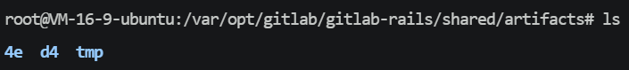
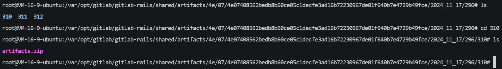

# 1. Artifacts在云服务器上的存储位置

pipeline产物中的log如下：

```bash
Uploading artifacts as "archive" to coordinator... 201 Created id=296 responseStatus=201 Created token=glcbt-64
```

表明 artifacts 被上传到了 GitLab 的 **协调器(coordinator)**

**id=296: 是Job的ID**

artifacts 的实际存储路径通常由 GitLab 配置决定，默认情况下，它会被存储在 GitLab 的 **本地存储（artifact storage）** 中，具体的文件路径可能类似于 `/var/opt/gitlab/gitlab-rails/shared/artifacts`（对于默认安装的 GitLab）



不确定接下来要进入哪个目录，可使用`find` 命令查找 Job ID 相关目录：

```bash
find . -type d -name "296"
```

输出：

```bash
./4e/07/4e07408562bedb8b60ce05c1decfe3ad16b72230967de01f640b7e4729b49fce/2024_11_17/296
./4e/07/4e07408562bedb8b60ce05c1decfe3ad16b72230967de01f640b7e4729b49fce/2024_11_17/289/296
```



如果发现 `.zip` 文件，可以解压查看内容：

```bash
unzip artifact.zip -d /path/to/extract
```

- `-d`：选项，指定解压目标路径
- `/path/to/extract`：目标路径，解压后的文件将存放在此处

里面的内容是“登录页面222333”是正确的

**注意**：

- 在 GitLab CI/CD 中，获取 **artifacts** 只能在 **同一项目** 内进行，而 **不能跨项目** 直接获取 artifacts

- 在同一个 GitLab 实例下，**不同仓库之间** 是不能直接通过 GitLab API 获取 artifacts 的

**为什么不能跨项目或者说跨仓库获取artifacts？**

todo：验证前面文档中可以跨仓库获取artifacts的部分，可能都是错误的

# 2. Artifacts官方文档

1. **GitLab API - Artifacts 下载**（关于通过 GitLab API 获取 artifacts）:
   - [GitLab API - Artifacts 下载](https://docs.gitlab.com/ee/api/job_artifacts.html)
2. **GitLab API - 获取项目 Pipelines 和 Artifacts**（关于跨不同项目间访问 artifacts 的限制）:
   - [GitLab API - Pipelines](https://docs.gitlab.com/ee/api/pipelines.html)


# 3. `$CI_JOB_TOKEN`

`$CI_JOB_TOKEN` 是 GitLab CI/CD 中的一个预定义变量，用于在 CI/CD 流水线中进行身份验证。它是一个临时的、唯一的令牌，主要用于跨项目的访问或触发其他项目的流水线时作为身份验证手段。

### 主要用途：
- **跨项目触发**：当一个项目的流水线需要触发另一个项目的流水线时，可以使用 `$CI_JOB_TOKEN` 进行身份验证。
- **访问 GitLab API**：它可以用于通过 GitLab API 进行身份验证，允许作业在 CI/CD 流水线中访问受保护的资源。

### 查看 `$CI_JOB_TOKEN`：
`$CI_JOB_TOKEN` 是 GitLab 自动生成的，并且只在 CI/CD 作业运行时有效，因此它无法在 GitLab 的 UI 中查看。它是由 GitLab 在每次流水线运行时自动分配的，并且仅在流水线作业内部可用。

如果想在流水线中使用 `$CI_JOB_TOKEN`，你可以在 `.gitlab-ci.yml` 中通过环境变量访问它。例如：

```yaml
stages:
  - deploy

deploy:
  script:
    - echo "Deploying with job token: $CI_JOB_TOKEN"
```

此值在流水线运行时由 GitLab 自动赋予，无需手动配置。