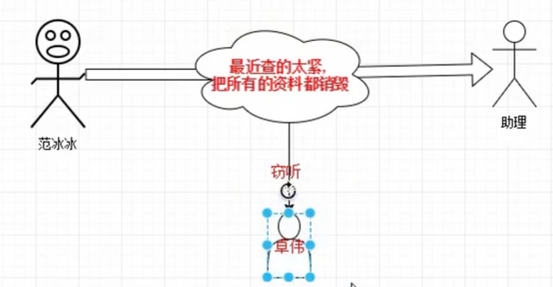
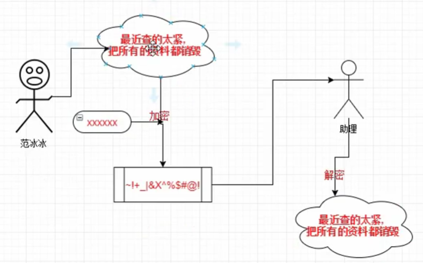
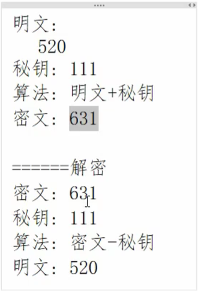

# 1. 非对称加密

https://www.bilibili.com/video/BV134411r7Kt?from=search&seid=8809898301026014150

# 2. 加密

https://www.bilibili.com/video/BV1q7411E7oa?from=search&seid=8809898301026014150# 

# 2. 加密三要素

https://www.bilibili.com/video/BV1QU4y1t7g4?p=2&vd_source=a7089a0e007e4167b4a61ef53acc6f7e

- 在进行网络通信的时候，为什么要加密？
- 
- 
- 加密三要素：
  - 明文/密文
  - 秘钥——定长的字符串
  - 加密算法/解密算法
- 

# [3. 对称和非对称加密的特点](https://www.bilibili.com/video/BV1QU4y1t7g4?p=3&spm_id_from=pageDriver&vd_source=a7089a0e007e4167b4a61ef53acc6f7e)

## 3.1 对称加密

- 秘钥：加密和解密的时候用的是同一个秘钥

## 3.2 非对称加密

- 秘钥：加密和解密的时候用的不是同一个秘钥，秘钥有两个，需要使用秘钥生成算法，得到密钥对
  - 公钥——可以公开
    - 公钥加密数据，私钥解密数据
  - 私钥——需要妥善保管
    - 私钥加密数据，公钥解密

- 

- 非对称加密是**单向加密**
  - ABC给右侧小人发数据，卓伟拦截数据后解不出来
  - 右侧小人给ABC发数据，卓伟拦截数据后，能篡改数据

# 4. 非对称加密的原理

https://www.bilibili.com/video/BV1Tg411f7mB/?spm_id_from=333.337.search-card.all.click&vd_source=a7089a0e007e4167b4a61ef53acc6f7e

- 为了保证每个人创建出不同的密钥对，密钥对的创建算法需要一个非常大的随机数作为输入
-                    
-                        

- 
- 当Alice需要和Bob发消息时，Alice首先要得到Bob的公钥，然后将文件用Bob的公钥进行加密，发送给Bob；Bob用自己的私钥对密文进行解密，得到Alice发来的文件。
  - 因为只有Bob有自己的私钥，所有只有Bob能解密信息
- 第二个应用：身份鉴定

# 5. 对非对称加密进行攻击——中间人攻击（重看 信息量较大）

https://www.bilibili.com/video/BV1mj421d7VE/?spm_id_from=333.788&vd_source=a7089a0e007e4167b4a61ef53acc6f7e

- 当网站要把公钥发送给你的时候，中间人拿到了网站的公钥后，不直接发给你，中间人此时要生成自己的一对公钥和私钥，并且将自己的公钥发送给你
- **我们不能确认收到的这把公钥是网站的，还是中间人的**
- **所以我们需要一个‘第三方’来解决公钥的信任问题**——Certificate Authority(CA 证书颁发机构)
- 

- 于是刚才的流程就发生了变化

  - 网站先把要发送给你的公钥放到大家都信任的第三方CA那里，CA根据这把公钥以及其他信息生成了**数字证书**，数字证书相当于让这把公钥和该网站绑定起来了
    - 当CA在收到网站的信息以及公钥以后，会对这些信息以及公钥进行**哈希运算**，得到一串较短的哈希字符
    - 哈希运算：就是把一段内容变成特定的很短的字符
    - 在哈希运算后，CA自己也生成一对专门用于数字证书的公钥和私钥，然后用私钥给哈希字符加密，这串加密后的字符就是**数字签名**了

  - 网站在与你进行加密协商之前，先把数字证书发给你，你看到数字证书是属于信任的CA，于是从数字证书里面取出公钥，生成最后的会话密钥（用于对称加密）

- 我们如何相信**数字证书**就是由信任的CA颁发的呢？
  - 数字证书上有CA的签名就可以了
  - 用**数字签名**给**数字证书**签名

