# [1. HTTPS](https://www.bilibili.com/video/BV1KY411x7Jp/?spm_id_from=333.337.search-card.all.click&vd_source=a7089a0e007e4167b4a61ef53acc6f7e)

- HTTP协议：请求和响应报文都是明文
- HTTPS协议：并不是一个单独的协议，在HTTP的基础上用`TLS/SSL`进行加密，这样通信就不容易受到拦截和攻击

## 1.1 TLS/SSL

- SSL是TLS的前身，都是加密安全协议
- 现在绝大部分浏览器都不支持SSL，而是支持TLS
- SSL：`Secure Sockets Layer` 安全套接字层
- TLS：`Transport Layer Security`  传输层安全协议。用到对称和非对称两种加密

## 1.2 对称加密

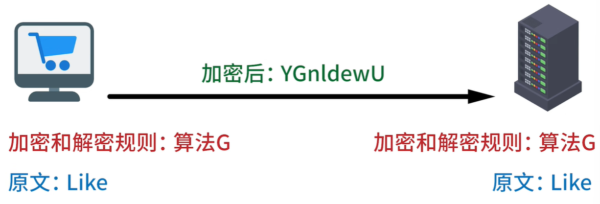

## 1.3 非对称加密

> 核心：用两个密钥来进行加密和解密


- `公开密钥`：所有人都知道的密钥
- `私有密钥`：仅仅是持有方才有的密钥
- 一般来说私钥就放在服务器里

| 数据经过公钥加密就只能被私钥解密<br>数据经过私钥加密就只能被公钥解密 |  |
| :----------------------------------------------------------: | :----------------------------------------------------------: |

- 服务端拥有成对的私钥和公钥，然后公布自己的公钥让客户端知道
- 客户端用公钥把自己的数据进行加密（加密后用公钥反而无法解密这段数据，一定要用服务端的私钥才能解密）。这样的`非对称加密`也叫`公钥加密`

## 1.4 SSL证书

- 服务端需要申请SSL证书来证明这个域名就是大家所熟知的B站
- SSL证书是保存在源服务器的数据文件
- 要让SSL证书生效，需要向CA（`Certificate Authority` 证书授权中心）申请
- CA是第三方的机构，这样大家都来信任这个机构颁发的证书
- 这个证书除了表明域名是属于谁的，日期等等信息以外，重要的是这个证书里面还包括了特定的公钥和私钥
- 简单来说，**服务器安装了SSL证书以后，用户就可以通过HTTPS来访问服务器了**。当然浏览器也会把HTTP的默认端口80改成HTTPS的默认端口443
- certificate：n 证明，证明书，文凭，结业证书，合格证书
  - an official document that may be used to prove that the facts it states are true

- authority：

## 1.5 TLS握手过程

|  | 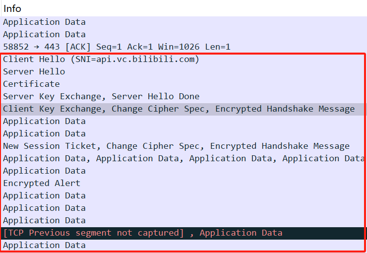 |
| ------------------------------------------------------------ | ------------------------------------------------------------ |


| 1. TCP三次握手后，client发`Client Hello`给服务端。客户端tell服务端支持TLS 1.2版本和支持的加密套件（这里16个加密套件可理解为不同的加密算法组合）。还发送一个随机数给服务端 |  |
| ------------------------------------------------------------ | ------------------------------------------------------------ |
| 2. server收到client打招呼，向客户端发`Server Hello`，在响应报文里tell client，服务端确认支持的TLS版本及选择的加密套件。且服务器也发送一个随机数给客户端 |  |
| 3. 服务器再发一个响应，出示自己的**证书**。这样浏览器就可根据自己的证书信任列表来确认服务器是否可信 |  |
| 4. 服务器把公钥发送给客户端（注：不会把私钥发送出去）        |  |
| 5. 服务器一下子发了这么多响应，最后还要告诉客户端发送完了。（注：截至到目前，这些请求和响应还未进行加密） |  |
| 6. 客户端生成第三个随机数（**预主密钥**），第三个随机数用收到的**公钥**进行加密，并把加密后的随机数发送给服务器 |  |
| 7. 客户端告诉服务器往后的数据就用商议好的算法和密钥来加密    |  |
| 8. Encrypted Handshake Message 表示客户端这边的TLS协商已经没有问题了，加密开始 |  |
| 9. 服务器发来`Encrypted Handshake Message`，表示服务器这边准备好了，也表示TLS的握手已经成功，可以给数据加密进行交换了 |  |

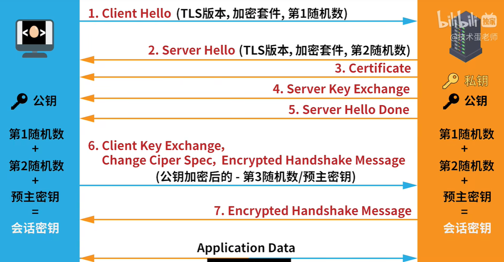

服务端收到加密后的预主秘钥后，用自己的私钥进行解密得到预主秘钥

最后客户端用预主密钥，第1随机数，第2随机数计算出会话秘钥

服务端也用预主密钥，第1随机数，第2随机数计算出会话秘钥

各自得到的会话秘钥是相同的

为了得到会话秘钥，前面的步骤都是非对称加密

后面的会话大家都只使用这个会话秘钥对数据进行加密（对称加密）

# [2. 数字签名和CA数字证书的核心原理和作用](https://www.bilibili.com/video/BV1mj421d7VE/?spm_id_from=333.788&vd_source=a7089a0e007e4167b4a61ef53acc6f7e)

## 第一阶段

需要巧妙的协商或者发送“会话密钥”给对方，如下：

| 1. 服务端有公钥和私钥（用公钥加密的内容，只能用私钥解密）    | 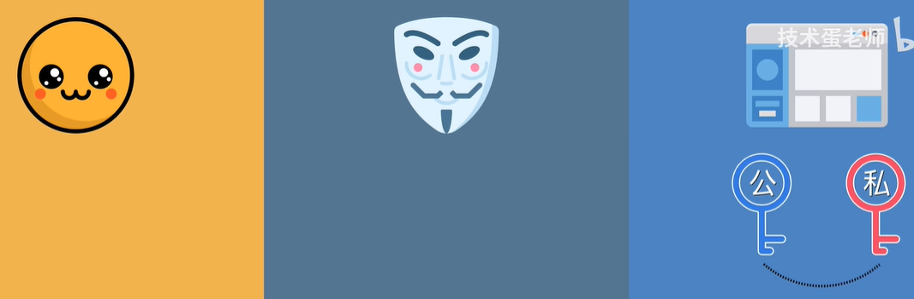 |
| ------------------------------------------------------------ | ------------------------------------------------------------ |
| 2. 服务端发送公钥给客户端                                    | 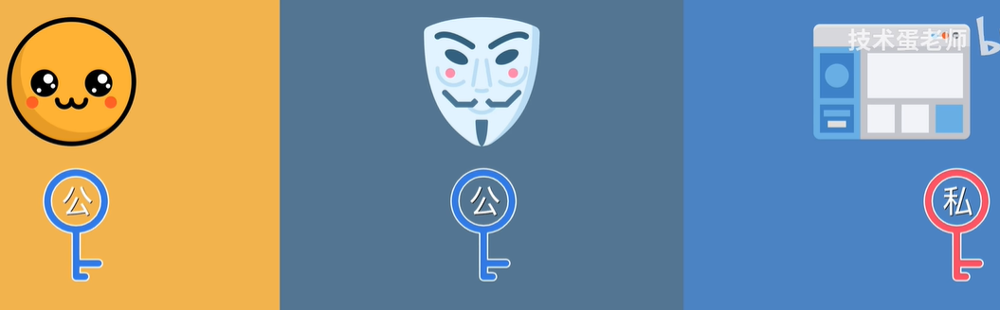 |
| 3. 客户端生成随机数(随机字符)，并用收到的公钥加密，得到`加密后的神秘字符` | 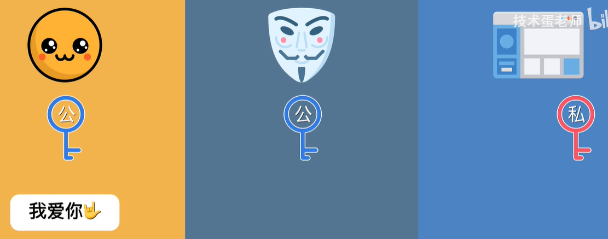<br>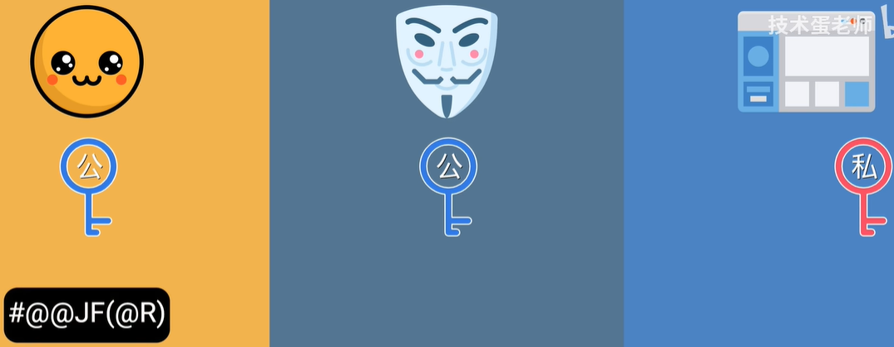 |
| 4. 将`加密后的神秘字符`发送给服务端                          | 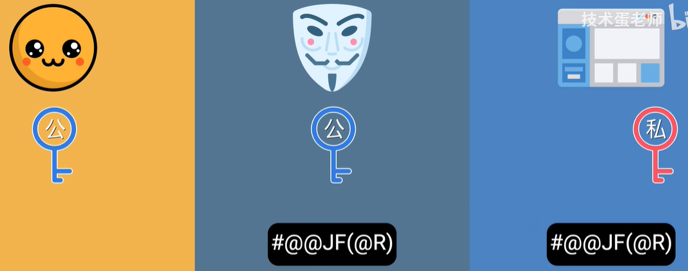 |
| 5. 服务端用私钥解密，得到神秘字符。现在两边都可用神秘字符生成只有两边知道的“会话密钥” | 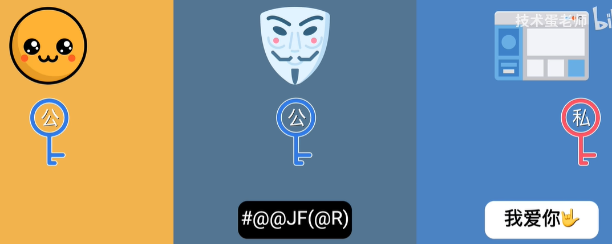 |

## 第一阶段存在的问题

在通信过程中，中间人可得到`公钥`以及`加密后的神秘字符`

| 1. 中间人拿到服务端的公钥后，不直接发送给客户端<br>中间人生成自己的一对公钥和私钥，并把公钥发送给客户端 | 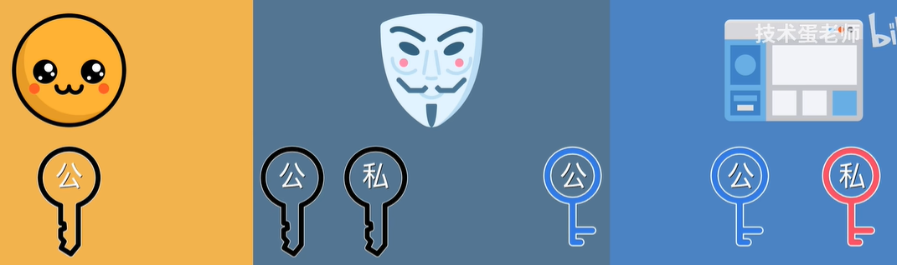 |
| ------------------------------------------------------------ | ------------------------------------------------------------ |
| 2. 客户端用中间人的公钥加密生成`加密后的神秘字符`，中间人再次截获，并用私钥破解了客户端的`加密后的神秘字符`。<br>破解后不直接发给服务端，而是修改`神秘字符`的内容，并且用服务端给的公钥加密修改后的`神秘字符`，再发送给服务端 | 3. 服务端收到`加密后的神秘字符`后用私钥解密得到`神秘字符`    |

通信在神不知鬼不觉的情况下被篡改了，如果在这种情况下，还要继续生成会话秘钥，其实会生成不同的会话秘钥。客户端和中间人的 && 中间人和服务端的

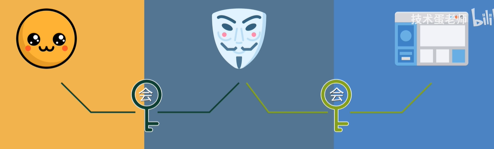

客户端和服务端之间并未直接生成任何“会话密钥”，中间人可以随意修改通信内容。因此前面非对称和对称加密 加了个寂寞。

上面的问题在于：**客户端不能确定收到的公钥是服务端的还是中间人的**

网络通信需要“第三方(CA)”来解决**公钥的信任问题**

CA：Certificate Authority 证书颁发机构

## 第二阶段

| 1. 服务端先把公钥放到大家都信任的第三方CA那，CA根据这把公钥以及其他信息生成了`数字证书`。`数字证书`相当于让这把公钥和该网站绑定起来了 | 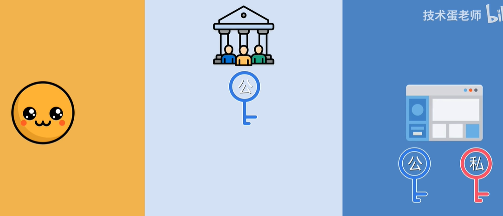<br />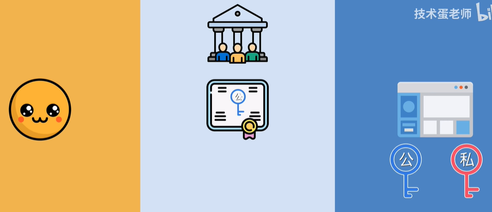 |
| ------------------------------------------------------------ | ------------------------------------------------------------ |
| 2. 服务端将`数字证书`发送给客户端，客户端看到`数字证书`是属于信任的CA，于是从`数字证书`里取出公钥，........，生成会话密钥 |                                                              |

## 第二阶段存在的问题

客户端如何相信`数字证书`是由信任的CA颁发的呢？

- `数字证书`上有CA的签名就可

在网络通信中，并不是用签字笔来签名，而是用`数字签名`给`数字证书`签名

## 第三阶段


1. CA收到服务端的信息及公钥后，对其进行`哈希运算`，得到一串较短的哈希字符（注：哈希运算不等于加密运算）
2. 哈希运算后，CA生成一对专门用于`数字证书`的C公钥和C私钥
3. 用`C私钥`给`哈希字符`加密，得到`数字签名`
4. CA把含有CA`数字签名`的`数字证书`发送给服务端
4. 虽然`数字证书`里的服务端信息都是明文，但核心在于CA的`数字签名`（若证书里的内容被篡改或服务端的公钥被修改了，生成的哈希值会不一样，最终的`数字签名`会变成另外一串字符）

## 第四阶段


1. 当客户端访问服务端，服务端把含有CA`数字签名`的`数字证书`发给客户端
2. 为证明服务端的公钥未被中间人更改，客户端需要用CA签名时候生成的`C公钥`（？？CA公钥传给客户端了？？什么时候传的）给`数字证书`里面的`数字签名`解密，得到一串哈希字符（`数字签名`加密前就是一串哈希字符）
3. 客户端对收到的`数字证书`内容进行同样的哈希运算，得到一串哈希字符(????)
4. 若前后两串哈希字符一致，说明`数字证书`是靠谱的，没有被篡改

假设中间人修改了`数字证书`的内容，但是由于中间人没有原本生成`数字签名`的私钥，因此收到的数字签名和数字证书不匹配

## 第四阶段存在的问题

客户端如何安全地拿到信任CA的公钥呢？

| 服务端向第三方CA申请证书时，CA会生成专门给这个服务端颁发证书的一对公钥和私钥，并用私钥给证书签名 |  |
| ------------------------------------------------------------ | ------------------------------------------------------------ |
| 其实CA也需要`数字证书`来证明自己的身份，因此CA会把自己的公钥放在自己的`数字证书`里面 |  |
| 按照`数字证书`生成原理，这份`数字证书`同样需要另一把私钥来进行签名。这就需再加一层，即`根CA`。 | 网站申请证书的这个CA则是`中间CA`                             |
| `根CA`同样需要生成一对专用的公钥和私钥，并且用这把私钥为中间CA的证书签名 | 根CA既然有这把公钥，也就是说：根CA也有自己的证书。但是根CA的证书由谁来签名呢？ |
| 根CA需要为自己的证书签名，然后**在用户的操作系统和浏览器里面预先安装根CA的证书** | 这样就可以闭合这一条证书链了                                 |

**核心：用顶层的私钥给下层的证书签名，验证的时候用顶层的公钥来验证下层的签名**

## 第五阶段

| 浏览器在进行加密之前，收到网站服务器发来的证书。证书上面有颁发者 | 浏览器查看这份中间证书的颁发者                               |
| ------------------------------------------------------------ | ------------------------------------------------------------ |
| 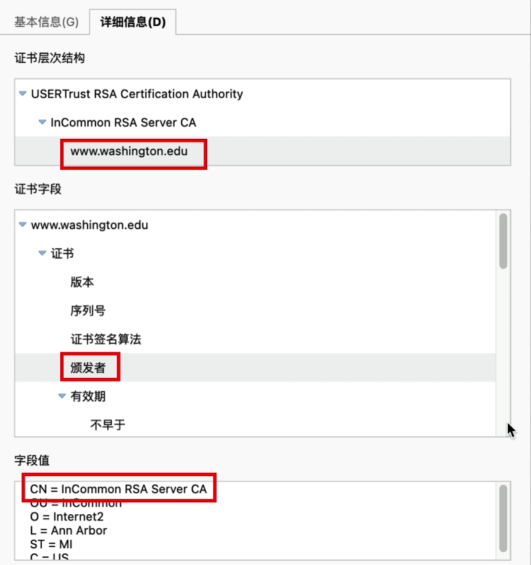 | 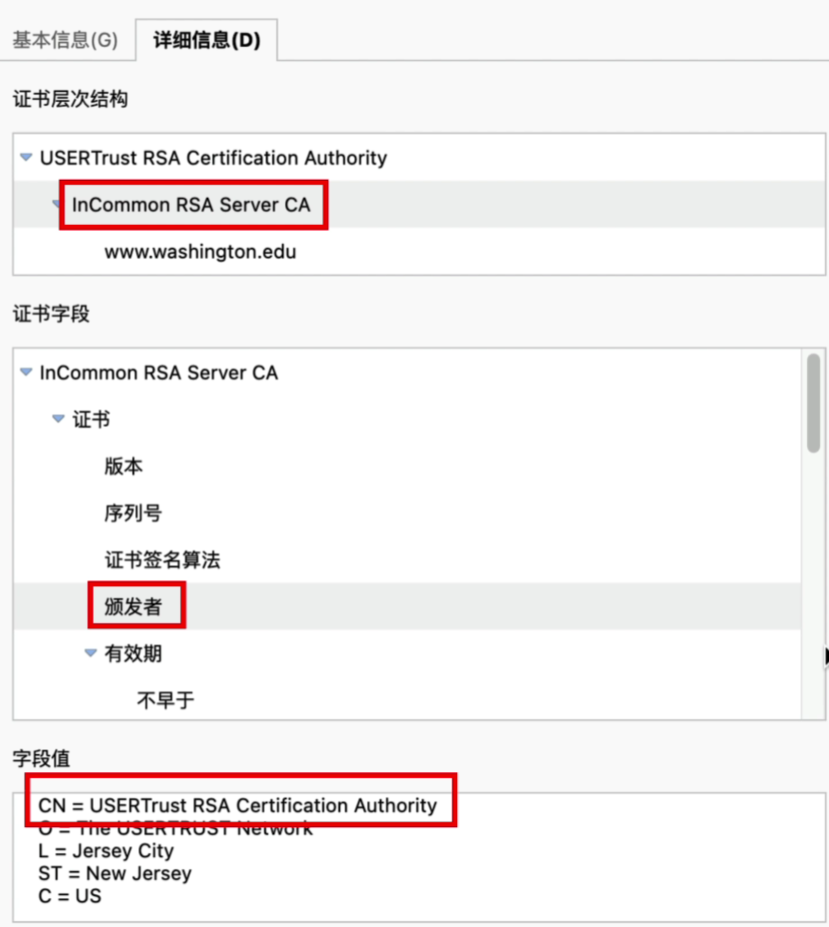 |
| 在电脑里面找到根证书                                         | 提取根证书里面的公钥来验证中间证书的签名<br />没问题再用中间证书的公钥来验证网站证书的数字签名。<br />都没问题说明网站证书没有被篡改。<br />但是没有被篡改，也还是证明不了这份证书就是属于该网站的。我们可以在“扩展程序”的“CRL分发点”里查看，访问这个网址可以下载这份文件 |
| 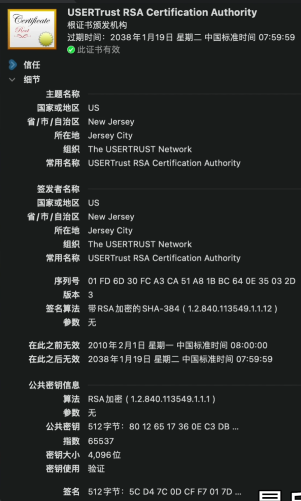 | 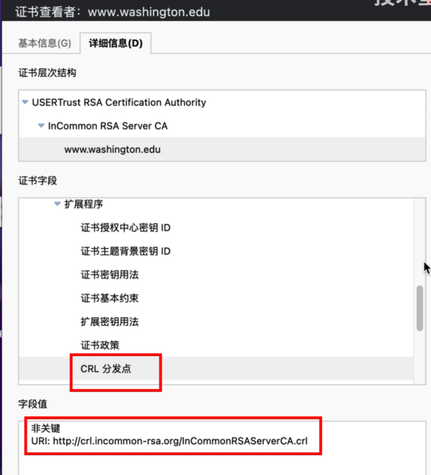 |

假设中间人修改了`数字证书`的内容（修改了server的公钥）：（这里需要自己画图想想！！！！）

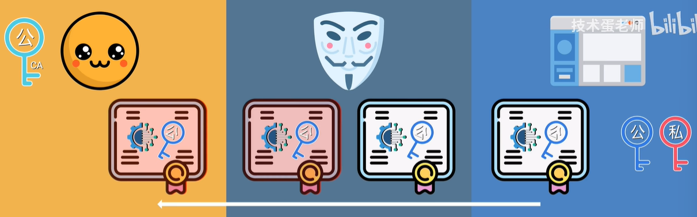

1. 由于中间人没有原本生成`数字签名`的私钥，因此客户端收到的`数字签名`和`数字证书`不匹配
1. 除非中间人把`数字证书`和`数字签名`同时改的匹配才行（这种情况也只能是拥有私钥才行）？？？

# [3. 申请15年SSL免费证书](https://www.bilibili.com/video/BV13X4y127gL/?spm_id_from=333.337.search-card.all.click&vd_source=a7089a0e007e4167b4a61ef53acc6f7e)

1. 将域名托管到cloudflare.com
2. 解析域名，并申请15年免费证书


为什么要给自己的网站申请SSL证书？

申请 SSL 证书有以下几个重要原因：

1. **数据加密**：SSL/TLS 加密数据传输，保护用户信息（如登录凭证、支付信息等）不被窃取。

2. **增强信任**：带有 HTTPS 的网站更容易赢得用户的信任，用户在输入敏感信息时会感到更安全。

3. **SEO 优势**：搜索引擎（如 Google）更倾向于将 HTTPS 网站排在更高的位置，可能对网站的搜索排名有积极影响。

4. **防止数据篡改**：SSL/TLS 可以防止数据在传输过程中被篡改或伪造。

5. **合规要求**：一些行业（如金融、医疗）对数据传输的安全性有严格的合规要求，使用 SSL 是符合这些要求的方式之一。

6. **浏览器警告**：许多现代浏览器对不使用 HTTPS 的网站发出警告，可能会影响用户体验和网站流量。

总之，申请 SSL 证书是提高网站安全性和可信度的重要步骤。

# 3. 申请SSL证书时可以不使用域名，直接使用IP吗

申请SSL证书时，通常推荐使用域名而不是IP地址。虽然某些证书颁发机构（CA）可能允许使用IP地址，但这并不常见，而且可能会面临一些限制和兼容性问题。

使用IP地址申请SSL证书时，以下几点需要注意：

1. **CA限制**：大部分CA会优先支持域名，对于IP地址的支持可能有限。
2. **验证过程**：证书颁发时的验证过程可能会更加复杂。
3. **浏览器兼容性**：并不是所有的浏览器都对IP地址的SSL证书有良好的支持，可能会导致用户访问时出现安全警告。

如果可能的话，建议使用域名来申请SSL证书，这样更容易管理和维护。

# 3. 如何申请SSL证书

购买域名ing：https://console.cloud.tencent.com/domain/template/detail/tmpl-ot0pb5kg

申请 SSL 证书的详细步骤如下：

### 步骤 1：选择证书类型

1. **单域名证书**：仅保护一个域名（如 example.com）。
2. **多域名证书**：保护多个不同域名。
3. **通配符证书**：保护一个主域名及其所有子域名（如 *.example.com）。

### 步骤 2：选择证书颁发机构（CA）

- 选择一个可信的 CA，如：
  - **Let's Encrypt**（免费）：提供免费的SSL证书 https://letsencrypt.org/
  - **Comodo**：提供多种类型的SSL证书，适合不同需求
  - **DigiCert**：提供高安全性的SSL证书，适合企业使用
  - **GlobalSign**：提供多种SSL解决方案和支持

### 步骤 3：生成证书签名请求（CSR）

1. 在你的服务器上打开命令行（如 Linux 服务器）。

2. 运行以下命令生成私钥和 CSR：
   ```bash
   openssl req -new -newkey rsa:2048 -nodes -keyout private.key -out request.csr
   ```
   
3. 在提示时输入相关信息，如：
   - 国家
   - 省/市
   - 城市
   - 组织名
   - 组织单位名
   - 域名（必须是你要申请证书的域名）（申请SSL证书时可以不使用域名，直接使用IP吗）
   - 电子邮件地址

4. **保存私钥**（private.key），这非常重要，不要丢失。

### 步骤 4：提交申请

1. 登录所选 CA 的网站。
2. 找到 SSL 证书申请页面。
3. 提交 CSR（request.csr）和其他所需信息。
4. 支付费用（如果申请的是付费证书）。

### 步骤 5：验证身份

CA 会进行验证，具体步骤可能包括：

1. **域名验证**：
   - 通过电子邮件（CA 会发送邮件到域名注册邮箱）。
   - 通过 DNS TXT 记录（在 DNS 中添加特定 TXT 记录）。
   - 通过 HTTP 文件（在网站根目录放置特定文件）。

2. **组织验证**（对于某些类型的证书）：
   - 提供营业执照或其他法律文件以证明组织的合法性。

### 步骤 6：下载证书

- 一旦验证通过，CA 会发送你 SSL 证书（通常包括主证书和中间证书）。
- 下载这些文件，通常包括：
  - 主证书文件（如 example_com.crt）
  - 中间证书文件（如 intermediate.crt）

### 步骤 7：安装证书

1. **根据你的服务器类型**，选择合适的安装方式：
   - **Apache**：
     - 编辑配置文件（如 `httpd.conf` 或 `ssl.conf`）。
     - 添加如下内容：
       ```apache
       SSLEngine on
       SSLCertificateFile /path/to/example_com.crt
       SSLCertificateKeyFile /path/to/private.key
       SSLCertificateChainFile /path/to/intermediate.crt
       ```
     - 重启 Apache：
       ```bash
       sudo service apache2 restart
       ```

   - **Nginx**：
     - 编辑配置文件（如 `nginx.conf`）。
     - 添加如下内容：
       ```nginx
       server {
           listen 443 ssl;
           server_name example.com;
       
           ssl_certificate /path/to/example_com.crt;
           ssl_certificate_key /path/to/private.key;
           ssl_trusted_certificate /path/to/intermediate.crt;
       
           # 其他配置
       }
       ```
     - 重启 Nginx：
       ```bash
       sudo service nginx restart
       ```

2. **测试 SSL 配置**：
   - 使用工具（如 SSL Labs 的 SSL Test）检查你的证书是否正确安装，是否存在安全问题。

### 步骤 8：维护和续期

- **定期检查证书**，确保证书在有效期内。
- **续期**：大多数证书在 1 年后需要续期，具体步骤类似于初次申请。

通过这些步骤，你就可以成功申请并安装 SSL 证书，确保网站的安全性。

# [4. SSL连接过程](https://www.bilibili.com/video/BV1Jp4y1T7NQ/?spm_id_from=333.337.search-card.all.click&vd_source=a7089a0e007e4167b4a61ef53acc6f7e)


# [5. 浏览器是如何验证https证书合法性的](https://blog.csdn.net/WoTrusCA/article/details/108253548)


# [6. HTTPS的加密原理](https://zhuanlan.zhihu.com/p/43789231)

Q: HTTPS 为什么安全？ 

* HTTPS 保证了传输安全，防止传输过程被监听、防止数据被窃取
* 可以确认网站的真实性

Q: 为什么需要证书？ 

*  防止”中间人“攻击，同时可以为网站提供身份证明。

Q: 使用 HTTPS 会被抓包吗？ 

* 会被抓包，HTTPS 只防止用户在不知情的情况下通信被监听，如果用户主动授信，是可以构建“中间人”网络，代理软件可以对传输内容进行解密。

Q: 什么是“中间人”攻击？

* https://www.sohu.com/a/441390545_185201

中间人攻击分为五种类型：

* Wi-Fi欺骗：攻击者可以创建与本地免费Wi-Fi同名的虚假Wi-Fi接入点(AP)。例如，在上例的咖啡馆中，攻击者会模仿创建一个和墙上贴着Wi-Fi信息同名“Guest Wi-Fi”。一旦您连接上去，您的一切在线网络行为，将尽在攻击者的监控和掌握之中。
* HTTPS欺骗：攻击者通过欺骗您的浏览器，使您认为自己访问的是可信任站点。当您输入与该站点相关的登录凭据时，您的流量将被重定向到攻击者自建的非安全站点处。
* SSL劫持：通常，当您尝试连接或访问不安全的HTTP://站点时，您的浏览器会自己将您重定向到安全的HTTPS://处。此时，攻击者则可以劫持该重定向的过程，将指向其自建服务器的链接植入其中，进而窃取您的敏感数据、以及输入的所有信任凭据。
* DNS欺骗：为了准确地浏览到目标网站，域名系统会将地址栏中的URL，从人类易于识别的文本格式，转换为计算机易于识别的IP地址。然而，DNS欺骗则会迫使您的浏览器，在攻击者的控制下，发生转换异常，而去访问那些被伪造的地址。
* 电子邮件劫持：如果攻击者获得了受信任机构(例如银行)的邮箱、甚至是邮件服务器的访问权限，那么他们就能够拦截包含敏感信息的客户电子邮件，甚至以该机构的身份发送各种电子邮件。

# [6. TLS/1.2 && TLS/1.3](https://www.bilibili.com/video/BV12X4y197Pr/?spm_id_from=333.788&vd_source=a7089a0e007e4167b4a61ef53acc6f7e)


