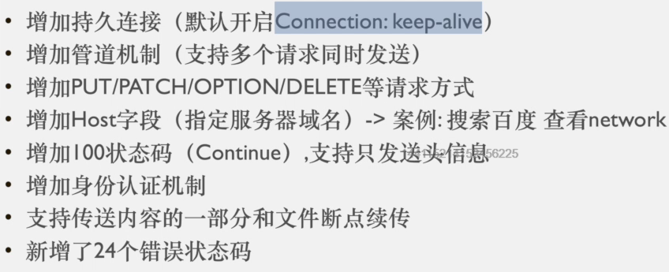
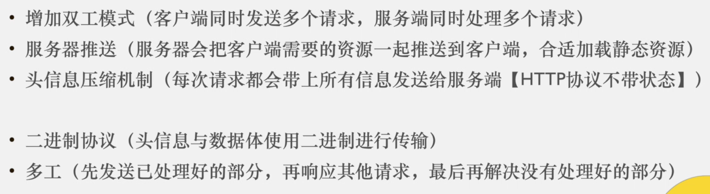
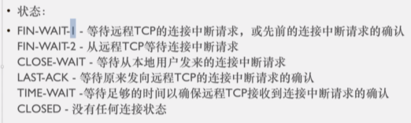
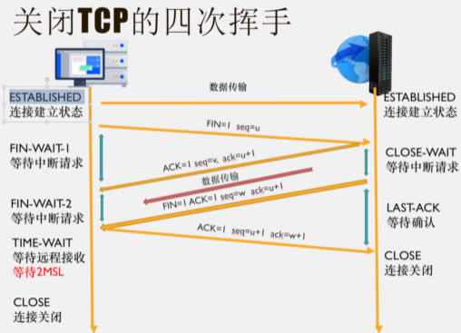

https://www.bilibili.com/video/BV1bk4y1m7zC

https://ke.qq.com/user/index/index.html#/plan/cid=2837895&term_id=102948532 买的课程

# 1. 服务器搭建与相关操作

wampServer

xampp

14min处

# [2. 网络初探 URL 客户端与服务端 域名操作](https://ke.qq.com/webcourse/2837895/102948532#taid=10038614178876807&vid=5285890787800102052)

5min开始

## 2.1 浏览器请求网页的流程

即输入网址，敲回车，发生了什么

1. DNS解析（将网址转成IP地址）
2. TCP/IP三次握手，建立TCP连接
3. 发起HTTP请求
4. 浏览器得到HTML代码，并解析HTML代码

5. 请求下载HTML中的静态资源，渲染页面
6. 四次挥手，中断连接请求


## 2.2 URI Uniform Resource Identifer

28min处

**统一资源标识符**

用来唯一的标识一个资源

- URI只是资源标识

## 2.3 URL Uniform Resource Locator

**统一资源定位符**

URL可以用来标识一个资源，而且还指明了如何定位这个资源

用地址定义一个资源

- URL 是资源标识
- URL 具有定位资源的功能
- URL 指明了获取资源所采用的协议

URL：协议名称 + 主机名称 + 端口 + 路径 + 文件 + 查询所需字符串


## 2.4 URN Uniform Resource Name

**统一资源命名**

用名称定位一个资源

URN：主机名称 + 端口 + 路径 + 文件 + 查询所需字符串

==URL肯定是一个URI，URI并不一定是URL，也可能是URN==


## 2.5 CS架构与BS架构


## 2.6 域名

1小时26min处


# [3. DNS IP TCP/UDP HTTP/HTTPS 三次握手](https://ke.qq.com/webcourse/2837895/102948532#taid=10038618473844103&vid=5285890788393511851)

## 3.1 www World Wide Web 万维网


## 3.2 DNS解析 Domain Name Server

18min处

Domain Name Server 域名服务器


- DNS本地服务器：运营商。例如：电信，移动，长城等

https://www.sfn.cn/news/technology/detail/222.html?navId=22

## [3.2 DNS解析 Domain Name Server](https://www.bilibili.com/video/BV19e4y1M7tf?p=8&vd_source=a7089a0e007e4167b4a61ef53acc6f7e)

yahoo.com

1. if web browser or operating system cannot find the IP address in its own cache memory, then 2
2. it will send the query to the next level to what is called the **resolver server**. The resolver is basically your **ISP** or **Internet Service Provider(互联网服务提供商)** 
3. When the resolver receives the query, it will check its own cache memory to find an IP Address; and if it cannot find it will send the query to the next level which is the **root server**
4. The root server are the top or the root of a DNS hierarchy. There are 13 sets of these root servers and they are strategically placed around the world. and they are operated by 12 different organizations and each set of these root servers has their own unique IP address. So when the root server receives the query for the IP address, the  root server is not going to know what the IP address is, but the root server does know where to send the resolver to help it find the IP address
5. So the root server will direct the resolver to the **TLD** or **Top Level Domain Server(顶级域名服务器)** for the dot com domain
6.  So the resolver will now ask the **TLD server** for the IP address for yahoo.com
7. The top level domain server stores the address information for a top level domains,such as .com, .net, .org and so on
8. This particular TLD server manages the dot-com domain which yahoo.com is a part of.
9. So when a TLD server receives the query for the IP address for yahoo.com, the TLD server is not going to know what the IP address for yahoo.com. So the TLD will direct the resolver to the next and final level, which are the **Authoritative Name Server(权威名称服务器)**
10.  **The Authoritative Name Servers** are responsible for knowing everything about the domain which includes the IP address. They are the final authority

## 3.3 IP  Internet Protocol Address

38min处

互联网协议地址

IP又称为互联网协议

什么协议呢？——是分配给用户上网使用的互联网协议

为什么说IP是协议呢？——也就是说IP是有一定的规范的


## 3.4 IP端口号PORT

47min处


## 3.5 TCP Transmission Control Protocol

52min处

传输控制协议


## 3.6 UDP User Data Protocol

1h2min处

用户数据报协议


## 3.7 HTTP与HTTPS Hyper Text Transfer Protocol

- HTML：超文本标记语言 Hyper Text Mark Language
- HTTP：超文本传输协议 Hyper Text Transfer Protocol——客户端和服务器端请求和应答的标准，**用于从WEB服务器传输超文本到本地浏览器的传输协议**
- HTTPS：超文本传输安全协议 Hyper Text Transfer Protocol Secure


- HTTP与HTTPS本质上是一样的， HTTPS在HTTP的基础上加了一层安全层。  HTTPS是HTTP的安全版。（安全基础是SSL/TLS）

- http不安全的原因是什么？

  - 是由于http在请求的过程中，很多东西是明文的，比如http请求头

   

- **SSL**： 安全套接层 Secure Sockets Layer

- **TLS**： 传输层安全 Transport Layer Security（对SSL进行了升级）


- http与https的区别：

  - 

  - 第二点中：客户端和服务器都无法验证对方身份。 只能靠标识位。 但是标识位有可能被篡改


---

## 3.8 建立TCP连接的前奏

1h25min处

标志位：即数据包

- SYN：Synchronize Sequence Numbers 同步序列编号
- ACK：Acknowledgement 确认字符

状态：

- LISTEN：监听TCP端口的连接请求（我等着你发送连接请求呢）
- SYN-SENT：发送了标识位。在发送连接请求后，等待匹配的连接请求（我发送了连接请求，我等你回复哈）
- SYN-RECEIVED：接收了标识位。在收到和发送一个连接请求后，等待对连接请求的确认（我收到你的连接请求了哈，我等你回复我）
- ESTABLISHED：代表一个打开的连接，数据可以传送给用户

## 3.9 三次握手


- 发送序号是上一次的确认序号


- 确认序号是上一次发送序号加1


# [4. www历史，HTTP报文，请求方式，GET与POST](https://ke.qq.com/webcourse/2837895/102948532#taid=10038622768811399&vid=5285890788031352464)

## 4.1 www （没太听懂）

 30mins～

World Wide Web 万维网

- www以前是一个协议，并不是一个二级域名，是**网页传输协议（网页服务协议）**


## 4.2 HTTP报文前言

57mins～

- 报文：客户端和服务端之间的数据传递
- **HTTP基于TCP/IP通信协议来传递数据**
- 一次请求 服务端要知道 你是什么样的请求

- “限制每次连接只处理一个请求”——这是传统的TCP/IP连接。服务器处理完客户的请求，并收到客户的应答后，即断开连接。采用这种方式可以节省传输时间

## 4.3 HTTP报文


- 一般来说，用post请求的时候，请求体是Form Data——表单数据
- get请求的时候请求体是查询字符串参数——Query String Parameters
- 

  ## 4.4 HTTP报文请求方式 

1h41min~

http 1.1版本中有八种请求方式：

- GET
- POST
- OPTIONS
- HEAD
- PUT：上传资源
- DELETE
- TRACE
- CONNECT

持久化连接 connection: keep-alive

管道化持久连接：

# [5. http状态码，accept，Content-Type](https://ke.qq.com/webcourse/2837895/102948532#taid=10038627063778695&vid=5285890787895797556)

## 5.1 状态码


### 5.1.1 304——重定向


- 什么是重定向
  - 重定向有点像跳转页面
  - Response Headers    **ETag**：是服务器返回回来的你这个**资源的唯一标识**
  - Response Headers    **Last-Modified**：最后一次修正的时间
  - Request Headers       **If-Modified-Since**
  - Request Headers       **If-None-Match**

### 5.1.2 302——重定向

### 5.1.3 400——WebSocket相关

在 WebSocket 协议中，状态码 `400` 表示 "Bad Request"（错误请求）。这通常指示客户端发送了一个不符合 WebSocket 协议要求的请求。可能的原因包括：

- 请求中缺少必要的头部字段。
- 请求中的头部字段格式不正确。
- 请求中的数据格式不符合 WebSocket 协议的要求。

这个状态码告诉客户端，服务器无法理解或处理其发送的请求，因此连接无法建立。

可以使用 JavaScript 和 Node.js 中的 `http` 模块模拟一个返回 `400 Bad Request` 状态码的服务器。在这里，我们将创建一个简单的 HTTP 服务器，如果接收到的请求不符合预期的格式，则返回 `400` 状态码。

### 示例代码

1. **创建服务器**

```javascript
const http = require('http');

const server = http.createServer((req, res) => {
    // 模拟请求头部缺少特定字段的场景
    if (!req.headers['sec-websocket-key']) {
        // 如果请求头部缺少 'sec-websocket-key'
        res.writeHead(400, { 'Content-Type': 'text/plain' });
        res.end('400 Bad Request: Missing Sec-WebSocket-Key');
    } else {
        // 正常情况下返回 200 OK
        res.writeHead(200, { 'Content-Type': 'text/plain' });
        res.end('Request received');
    }
});

server.listen(8080, () => {
    console.log('Server is listening on port 8080');
});
```

2. **发送请求**

你可以使用 `curl` 命令行工具或其他 HTTP 客户端来发送请求。例如，使用 `curl`：

```bash
curl -i -X GET http://localhost:8080 -H "Connection: Upgrade" -H "Upgrade: WebSocket" -H "Sec-WebSocket-Version: 13"
```

这个请求缺少 `Sec-WebSocket-Key` 头部，因此应该会收到 `400 Bad Request` 响应。

### 说明

- **服务器部分**：
  - 创建一个 HTTP 服务器，它检查请求头部是否包含 `Sec-WebSocket-Key`。
  - 如果缺少该头部，服务器返回 `400 Bad Request`。
  - 否则，返回 `200 OK`。

- **客户端部分**：
  - 发送一个没有 `Sec-WebSocket-Key` 头部的请求，这将导致服务器返回 `400` 状态码。

这样可以模拟和测试服务器对请求头部不正确时的响应行为。

### 5.1.3 404——页面错误

页面不存在（找不到页面或者资源）

### 5.1.4 403——服务器拒绝请求forbidden

服务器不给你权限进入

### 5.1.5 500——内部服务器错误

### 5.1.6 503——服务器当前不能处理客户端请求

## 5.2 Accept

- 代表客户端希望接收的数据类型


在HTTP请求中，`Accept`头字段用于告知服务器客户端能够处理的内容类型。以下是对 `Accept: application/json, text/plain, */*` 的解释：

### 解释

- **`application/json`**：客户端首选的内容类型是JSON格式。服务器应优先返回JSON格式的数据。
- **`text/plain`**：如果服务器不能提供JSON格式的响应，客户端也能够接受纯文本格式的数据。
- **`*/*`**：这是一个通配符，表示客户端接受所有其他类型的内容。这种类型的优先级最低，通常用于作为后备选项。

### 优先级

- `application/json` 的优先级最高。客户端首选返回JSON格式的内容。
- `text/plain` 的优先级次之。客户端接受文本格式的内容。
- `*/*` 表示客户端接受任何类型的响应，但它的优先级最低。

### 服务器的处理

服务器会根据客户端的`Accept`头字段返回最合适的内容类型。例如：

- 如果服务器能够返回`application/json`，它会优先返回JSON格式的响应。
- 如果服务器不能返回JSON格式的数据，但能够返回`text/plain`格式的数据，服务器将返回纯文本响应。
- 如果服务器不能提供上述两种格式的数据，它将返回任何其他类型的内容，或根据需要返回一个错误响应（如`406 Not Acceptable`）。

### 示例代码（Node.js）

以下是一个在Node.js的Express框架中根据`Accept`头处理请求的示例：

```javascript
const express = require('express');
const app = express();

app.get('/resource', (req, res) => {
  const acceptHeader = req.headers.accept;

  if (acceptHeader.includes('application/json')) {
    res.json({ message: 'This is JSON' });
  } else if (acceptHeader.includes('text/plain')) {
    res.send('This is plain text');
  } else {
    res.status(406).send('Not Acceptable');
  }
});

app.listen(3000, () => {
  console.log('Server running on port 3000');
});
```

### 实际应用

这种`Accept`头的使用场景包括：

- **API**：在设计RESTful API时，使用`Accept`头来实现内容协商，确保客户端可以接受并正确处理服务器返回的数据格式。
- **多格式支持**：允许客户端根据自身需要请求不同的数据格式，例如JSON用于程序处理，文本用于人类阅读等。

### 总结

`Accept: application/json, text/plain, */*` 头字段表示客户端希望优先获得JSON格式的响应，如果无法提供JSON格式的数据，客户端也可以接受纯文本格式的响应，或者接受任何其他格式的数据。

## 5.3 Content-Type

在响应头里面


## 5.4 Accept-Encoding

在请求头里面


## 5.5 Content-Encoding

在响应头里面


# [6. 浏览器缓存，长短连接，Content-Length，referrer](https://ke.qq.com/webcourse/2837895/102948532#taid=10038635653713287&vid=5285890788266905342)

## 6.1 浏览器缓存


## 6.2 Cache-Control

- 缓存控制（响应头）
- 为什么Cache-Control这个字段在请求头和响应头里面都有？
- 
- 
- 

## 6.3 Expires

在响应头里面


## 6.4 浏览器缓存机制


==感觉这个图是错的！缓存已经过期了为什么还能304读取缓存呢？？==

## 6.5 Connection：keep-alive

38min处

在请求头里面

http有两种连接：

- 长连接：只建立一次连接，多次资源请求都复用该连接，完成后关闭
  - 
- 短连接：每次请求一个资源就建立连接，请求完成就立马关闭
  - 


- 早期的HTTP1.0：每个HTTP请求都要创建一个TCP/IP连接，也就是串行连接
- 后期的HTTP1.0：在请求头增加：**Connection：keep-alive**
- HTTP1.1：默认开启：Connection：keep-alive，如需关闭：Connection：close

## 6.6 content-length

1.GET请求：请求头没有content-length，响应头带content-length

2.POST请求：请求头与响应头都带content-length

## 6.7 Referrer

referer

在请求头里面

来源域名


- referrer是可以在html中设置的
- 
- 
- 

# [7. http版本，关闭TCP，四次挥手，同源策略，CORS](https://ke.qq.com/webcourse/2837895/102948532#taid=10038639948680583&vid=5285890787804243247)

## 7.1 HTTP版本

### 7.1.1 HTTP/0.9


所以最初的网页是没有图片和视频的，只有文字

### 7.1.2 HTTP/1.0

- 增加POST请求方式
- 支持多种数据格式（图片，视频等）的请求和访问
- 支持cache缓存功能
- 新增状态码

 

- 早期的HTTP/1.0不支持keep-alive长连接，只支持串行链接
- 后期的HTTP/1.0增加Connection：keep-alive字段（非标准字段），开始支持长连接

### 7.1.3 HTTP/1.1



### 7.1.4 HTTP/2.0



## 7.2 关闭TCP连接的前奏

31min处

- SYN：synchronize sequence numbers 同步序列编号

- FIN：finish 关闭连接



- FIN-WAIT-1：客户端发送请求，然后等待着服务端的回应
- FIN-WAIT-1：客户端发送请求，然后等待着服务端的回应
- CLOSE-WAIT：服务端确认了请求，等待着客户端的回应
- LAST-ACK：最后一次确认
- TIME-WAIT：客户端要等待一段时间

## 7.3 四次挥手

36min处



- CLOSE-WAIT只要这个状态开始了，服务端在做事情
  - 服务端在做一个确认，确认我是否跟客户端发送响应发送完成了（确认客户端所需要的信息我是否都传给它了，如果没有，继续数据传输）

1h处

https://ke.qq.com/webcourse/2837895/102948532#taid=10038639948680583&vid=5285890787804243247

## 7.4 同源策略

> **同源策略（same-origin policy）**是一种安全措施，用于防止恶意网站读取其他网站的敏感信息。根据同源策略，只有当**协议、域名和端口号**都相同时，浏览器才允许 JavaScript 进行跨域请求。


```
// 处理跨域
npm i koa2-cors --save
```

## 7.5 CORS

> **跨域资源共享（Cross-origin resource sharing）**是一种浏览器安全机制，用于控制跨域请求。它允许服务器告诉浏览器允许来自其他域（源）的请求，从而**解决同源策略（Same-Origin Policy）带来的限制**。

CORS 主要通过以下几个 HTTP 头部来实现：

1. **`Access-Control-Allow-Origin`**：指定哪些域名可以访问资源。例如，`Access-Control-Allow-Origin: *` 表示允许任何域名访问资源，`Access-Control-Allow-Origin: https://example.com` 仅允许指定的域名访问资源。

2. **`Access-Control-Allow-Methods`**：指定允许的 HTTP 请求方法（如 GET、POST、PUT、DELETE）。例如，`Access-Control-Allow-Methods: GET, POST, PUT`。

3. **`Access-Control-Allow-Headers`**：指定哪些 HTTP 头部可以用于实际请求。例如，`Access-Control-Allow-Headers: Content-Type, Authorization`。

4. **`Access-Control-Allow-Credentials`**：指示是否允许发送凭据（如 Cookies 和 HTTP 认证信息）。例如，`Access-Control-Allow-Credentials: true`。

5. **`Access-Control-Expose-Headers`**：指定哪些头部可以公开给浏览器，以便 JavaScript 代码访问。例如，`Access-Control-Expose-Headers: Content-Length, X-Kuma-Revision`。

### 7.5.1 工作原理

1. **简单请求**：
   - 浏览器直接发送请求，附加 `Origin` 头部，指明请求来源。
   - 服务器根据请求头中的 `Origin` 判断是否允许请求，并在响应头中设置相应的 CORS 头部。
   - **浏览器根据响应头中的 CORS 信息决定是否允许前端 JavaScript 访问响应数据**。

2. **预检请求**：
   - 对于复杂请求（如使用非简单方法或自定义头部），浏览器会在发送实际请求之前，先发送一个 OPTIONS 请求，称为“预检请求”。
   - 服务器在响应预检请求时，返回允许的 CORS 头部。
   - **浏览器根据预检响应决定是否发送实际请求**。

### 7.5.2 不使用CORS中间件，使用NodeJS的原生http模块配置CORS

```js
const http = require('http');

const server = http.createServer((req, res) => {
  // 设置 CORS 头部
  res.setHeader('Access-Control-Allow-Origin', '*'); // 允许所有域名
  res.setHeader('Access-Control-Allow-Methods', 'GET, POST, PUT, DELETE, OPTIONS'); // 允许的 HTTP 方法
  res.setHeader('Access-Control-Allow-Headers', 'Content-Type, Authorization'); // 允许的请求头
  res.setHeader('Access-Control-Allow-Credentials', 'true'); // 允许发送凭证（如 Cookies）

  if (req.method === 'OPTIONS') {
    // 处理预检请求
    res.writeHead(204);
    res.end();
    return;
  }

  res.writeHead(200, {'Content-Type': 'text/plain'});
  res.end('Hello World');
});

server.listen(3000, () => {
  console.log('Server running on http://localhost:3000');
});
```

### 7.5.3 使用CORS中间件，在Koa中配置 CORS

```javascript
// 处理跨域
// npm i koa2-cors --save
const Koa = require("koa");
const cors = require('koa2-cors');
const app = new Koa();

app.use(cors({
  origin: '*', // 允许所有域名
  methods: ['GET', 'POST', 'PUT', 'DELETE', 'OPTIONS'], // 允许的 HTTP 方法
  headers: ['Content-Type', 'Authorization'], // 允许的请求头
  credentials: true, // 允许发送凭证
  maxAge: 3600 // 预检请求的缓存时间为 1 小时
}));

app.use(async ctx => {
  ctx.body = 'Hello World';
});

app.listen(3000, () => {
  console.log('Server running on http://localhost:3000');
});
```

### 7.5.4 不使用CORS中间件，在 Koa 中手动设置 CORS

#### 手动设置 CORS 头部

1. **设置 CORS 头部**

   使用 Koa 的中间件机制，你可以手动添加 CORS 相关的头部。

   ```javascript
   const Koa = require('koa');
   const app = new Koa();
   
   app.use(async (ctx, next) => {
     // 设置 CORS 头部
     ctx.set('Access-Control-Allow-Origin', '*'); // 允许所有域名
     ctx.set('Access-Control-Allow-Methods', 'GET, POST, PUT, DELETE, OPTIONS'); // 允许的 HTTP 方法
     ctx.set('Access-Control-Allow-Headers', 'Content-Type, Authorization'); // 允许的请求头
     ctx.set('Access-Control-Allow-Credentials', 'true'); // 允许发送凭证（如 Cookies）
   
     // 处理预检请求
     if (ctx.method === 'OPTIONS') {
       ctx.status = 204; // 预检请求的响应状态码
       return;
     }
   
     // 调用下一个中间件
     await next();
   });
   
   app.use(async ctx => {
     ctx.body = 'Hello World';
   });
   
   app.listen(3000, () => {
     console.log('Server running on http://localhost:3000');
   });
   ```


#### 解释

1. **`Access-Control-Allow-Origin`**: 允许的源。可以是特定的域名，或使用 `*` 允许所有域名。

2. **`Access-Control-Allow-Methods`**: 允许的 HTTP 方法，例如 `GET`, `POST`, `PUT`, `DELETE`, `OPTIONS`。

3. **`Access-Control-Allow-Headers`**: 允许的请求头部。

4. **`Access-Control-Allow-Credentials`**: 是否允许发送凭证（如 Cookies）。如果设置为 `true`，则 `Access-Control-Allow-Origin` 不能是 `*`，必须是特定的域名。

5. **处理预检请求**: 当浏览器发送跨域请求时，如果请求类型或头部不简单，浏览器会先发送一个 `OPTIONS` 请求来预检 CORS 配置。需要对这些请求返回 `204 No Content` 响应。

#### 示例：更详细的配置

你可以根据需要自定义 CORS 配置。例如，只允许某些特定的域名：

```javascript
app.use(async (ctx, next) => {
  const allowedOrigins = ['https://example.com', 'https://anotherdomain.com'];
  const origin = ctx.request.headers.origin;

  if (allowedOrigins.includes(origin) || !origin) {
    ctx.set('Access-Control-Allow-Origin', origin);
  } else {
    ctx.set('Access-Control-Allow-Origin', '');
  }

  ctx.set('Access-Control-Allow-Methods', 'GET, POST, PUT, DELETE, OPTIONS');
  ctx.set('Access-Control-Allow-Headers', 'Content-Type, Authorization');
  ctx.set('Access-Control-Allow-Credentials', 'true');

  if (ctx.method === 'OPTIONS') {
    ctx.status = 204;
    return;
  }

  await next();
});
```

# 7.6 同源策略和CORS的关系

> cors不是同源策略，cors是cors，同源策略是同源策略

- cors——Cross-origin resource sharing——跨域资源共享
- same-origin policy 同源策略


- **同源策略**是一种安全措施，用于防止恶意网站读取其他网站的敏感信息。根据同源策略，只有当**协议、域名和端口号**都相同时，浏览器才允许 JavaScript 进行跨域请求。
- **跨域资源共享**是一种浏览器安全机制，用于控制跨域请求。它允许服务器告诉浏览器允许来自其他域（源）的请求，从而**解决同源策略（Same-Origin Policy）带来的限制**。


