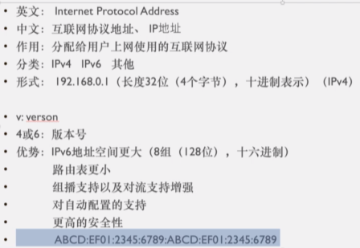
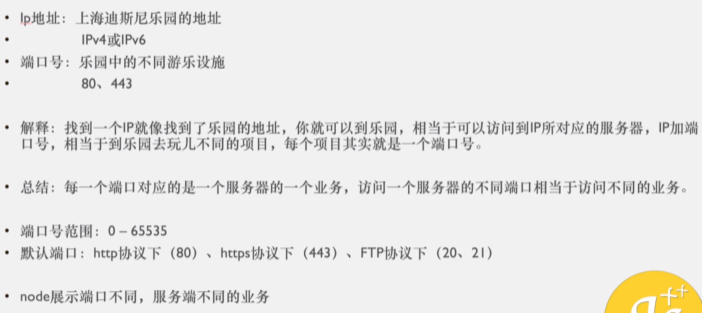

https://www.bilibili.com/video/BV1bk4y1m7zC

https://ke.qq.com/user/index/index.html#/plan/cid=2837895&term_id=102948532 买的课程

# 1. 服务器搭建与相关操作

wampServer

xampp

14min处

# [2. 网络初探 URL 客户端与服务端 域名操作](https://ke.qq.com/webcourse/2837895/102948532#taid=10038614178876807&vid=5285890787800102052)

5min开始

## 2.1 浏览器请求网页的流程

即输入网址，敲回车，发生了什么

1. DNS解析（将网址转成IP地址）
2. TCP/IP三次握手，建立TCP连接
3. 发起HTTP请求
4. 浏览器得到HTML代码，并解析HTML代码

5. 请求下载HTML中的静态资源，渲染页面
6. 四次挥手，中断连接请求


## 2.2 URI Uniform Resource Identifer

28min处

**统一资源标识符**

用来唯一的标识一个资源

- URI只是资源标识

## 2.3 URL Uniform Resource Locator

**统一资源定位符**

URL可以用来标识一个资源，而且还指明了如何定位这个资源

用地址定义一个资源

- URL 是资源标识
- URL 具有定位资源的功能
- URL 指明了获取资源所采用的协议

URL：协议名称 + 主机名称 + 端口 + 路径 + 文件 + 查询所需字符串


## 2.4 URN Uniform Resource Name

**统一资源命名**

用名称定位一个资源

URN：主机名称 + 端口 + 路径 + 文件 + 查询所需字符串

==URL肯定是一个URI，URI并不一定是URL，也可能是URN==


## 2.5 CS架构与BS架构


## 2.6 域名

1小时26min处


# [3. DNS IP TCP/UDP HTTP/HTTPS 三次握手](https://ke.qq.com/webcourse/2837895/102948532#taid=10038618473844103&vid=5285890788393511851)

## 3.1 www World Wide Web 万维网


## 3.2 DNS解析 Domain Name Server

18min处

Domain Name Server 域名服务器


- DNS本地服务器：运营商。例如：电信，移动，长城等

https://www.sfn.cn/news/technology/detail/222.html?navId=22

## [3.2 DNS解析 Domain Name Server](https://www.bilibili.com/video/BV19e4y1M7tf?p=8&vd_source=a7089a0e007e4167b4a61ef53acc6f7e)

yahoo.com

1. if web browser or operating system cannot find the IP address in its own cache memory, then 2
2. it will send the query to the next level to what is called the **resolver server**. The resolver is basically your **ISP** or **Internet Service Provider(互联网服务提供商)** 
3. When the resolver receives the query, it will check its own cache memory to find an IP Address; and if it cannot find it will send the query to the next level which is the **root server(根域名服务器)**
4. The root server are the top or the root of a DNS hierarchy. There are 13 sets of these root servers and they are strategically placed around the world. and they are operated by 12 different organizations and each set of these root servers has their own unique IP address. So when the root server receives the query for the IP address, the  root server is not going to know what the IP address is, but the root server does know where to send the resolver to help it find the IP address
5. So the root server will direct the resolver to the **TLD** or **Top Level Domain Server(顶级域名服务器)** for the dot com domain
6.  So the resolver will now ask the **TLD server** for the IP address for yahoo.com
7. The top level domain server stores the address information for a top level domains,such as .com, .net, .org and so on
8. This particular TLD server manages the dot-com domain which yahoo.com is a part of.
9. So when a TLD server receives the query for the IP address for yahoo.com, the TLD server is not going to know what the IP address for yahoo.com. So the TLD will direct the resolver to the next and final level, which are the **Authoritative Name Server(权威名称服务器)**
10.  **The Authoritative Name Servers** are responsible for knowing everything about the domain which includes the IP address. They are the final authority

## 3.3 IP  Internet Protocol Address

38min处

互联网协议地址

IP又称为互联网协议

什么协议呢？——是分配给用户上网使用的互联网协议

为什么说IP是协议呢？——也就是说IP是有一定的规范的



## 3.4 IP端口号PORT

47min处



## 3.5 TCP Transmission Control Protocol

52min处

传输控制协议


## 3.6 UDP User Data Protocol

1h2min处

用户数据报协议


## 3.7 HTTP与HTTPS Hyper Text Transfer Protocol

- HTML：超文本标记语言 Hyper Text Mark Language
- HTTP：超文本传输协议 Hyper Text Transfer Protocol——客户端和服务器端请求和应答的标准，**用于从WEB服务器传输超文本到本地浏览器的传输协议**
- HTTPS：超文本传输安全协议 Hyper Text Transfer Protocol Secure


- HTTP与HTTPS本质上是一样的， HTTPS在HTTP的基础上加了一层安全层。  HTTPS是HTTP的安全版。（安全基础是SSL/TLS）

- http不安全的原因是什么？

  - 是由于http在请求的过程中，很多东西是明文的，比如http请求头

   

- **SSL**： 安全套接层 Secure Sockets Layer

- **TLS**： 传输层安全 Transport Layer Security（对SSL进行了升级）


- http与https的区别：

  - 

  - 第二点中：客户端和服务器都无法验证对方身份。 只能靠标识位。 但是标识位有可能被篡改


---

## 3.8 建立TCP连接的前奏

1h25min处

标志位：即数据包

- SYN：Synchronize Sequence Numbers 同步序列编号
- ACK：Acknowledgement 确认字符

状态：

- LISTEN：监听TCP端口的连接请求（我等着你发送连接请求呢）
- SYN-SENT：发送了标识位。在发送连接请求后，等待匹配的连接请求（我发送了连接请求，我等你回复哈）
- SYN-RECEIVED：接收了标识位。在收到和发送一个连接请求后，等待对连接请求的确认（我收到你的连接请求了哈，我等你回复我）
- ESTABLISHED：代表一个打开的连接，数据可以传送给用户

## 3.9 三次握手


- 发送序号是上一次的确认序号


- 确认序号是上一次发送序号加1


# [4. www历史，HTTP报文，请求方式，GET与POST](https://ke.qq.com/webcourse/2837895/102948532#taid=10038622768811399&vid=5285890788031352464)

## 4.1 www （没太听懂）

 30mins～

World Wide Web 万维网

- www以前是一个协议，并不是一个二级域名，是**网页传输协议（网页服务协议）**


## 4.2 HTTP报文前言

57mins～

- 报文：客户端和服务端之间的数据传递
- **HTTP基于TCP/IP通信协议来传递数据**
- 一次请求 服务端要知道 你是什么样的请求

- “限制每次连接只处理一个请求”——这是传统的TCP/IP连接。服务器处理完客户的请求，并收到客户的应答后，即断开连接。采用这种方式可以节省传输时间

## 4.3 HTTP报文


- 一般来说，用post请求的时候，请求体是Form Data——表单数据
- get请求的时候请求体是查询字符串参数——Query String Parameters
- 

  ## 4.4 HTTP报文请求方式 

1h41min~

http 1.1版本中有八种请求方式：

- GET
- POST
- OPTIONS
- HEAD
- PUT：上传资源
- DELETE
- TRACE
- CONNECT

持久化连接 connection: keep-alive

管道化持久连接：

# [5. http状态码，accept，Content-Type](https://ke.qq.com/webcourse/2837895/102948532#taid=10038627063778695&vid=5285890787895797556)

## 5.1 状态码


### 204——无内容

HTTP 204 状态码表示“**No Content**”，即“无内容”。当服务器成功处理了请求，但没有返回任何内容时，会使用这个状态码。

#### 204 状态码的特点：
- **没有响应体**：服务器不会返回任何响应体内容，仅返回头部信息。
- **常见场景**：
  - **DELETE 请求**：删除资源后，服务器可能返回 204，表示资源已成功删除，但没有其他内容需要返回。
  - **PUT 或 POST 请求**：有时在更新资源或提交数据后，服务器可能返回 204，表示操作成功，但不需要返回任何新内容。
  - **表单提交后**：在某些场景下，当你提交表单但不需要刷新或改变页面时，可以使用 204 状态码。

#### 注意：
- 当返回 204 状态码时，浏览器不会刷新页面，也不会改变当前页面内容。
- 返回 204 状态码时，不应包含任何响应体内容，否则客户端会忽略这些内容。

#### 使用示例：
假设你发送一个 `DELETE` 请求来删除一个资源，服务器处理成功但没有额外信息需要返回，服务器可能会返回 `HTTP/1.1 204 No Content`。

#### 适用场景：
204 状态码非常适用于那些不需要返回任何数据的成功请求，能有效减少网络流量。

### 304——重定向


- 什么是重定向
  - 重定向有点像跳转页面
  - Response Headers    **ETag**：是服务器返回回来的你这个**资源的唯一标识**
  - Response Headers    **Last-Modified**：最后一次修正的时间
  - Request Headers       **If-Modified-Since**
  - Request Headers       **If-None-Match**

### 302——重定向

### 400——WebSocket相关

在 WebSocket 协议中，状态码 `400` 表示 "Bad Request"（错误请求）。这通常指示客户端发送了一个不符合 WebSocket 协议要求的请求。可能的原因包括：

- 请求中缺少必要的头部字段。
- 请求中的头部字段格式不正确。
- 请求中的数据格式不符合 WebSocket 协议的要求。

这个状态码告诉客户端，服务器无法理解或处理其发送的请求，因此连接无法建立。

可以使用 JavaScript 和 Node.js 中的 `http` 模块模拟一个返回 `400 Bad Request` 状态码的服务器。在这里，我们将创建一个简单的 HTTP 服务器，如果接收到的请求不符合预期的格式，则返回 `400` 状态码。

#### 示例代码

1. **创建服务器**

```javascript
const http = require('http');

const server = http.createServer((req, res) => {
    // 模拟请求头部缺少特定字段的场景
    if (!req.headers['sec-websocket-key']) {
        // 如果请求头部缺少 'sec-websocket-key'
        res.writeHead(400, { 'Content-Type': 'text/plain' });
        res.end('400 Bad Request: Missing Sec-WebSocket-Key');
    } else {
        // 正常情况下返回 200 OK
        res.writeHead(200, { 'Content-Type': 'text/plain' });
        res.end('Request received');
    }
});

server.listen(8080, () => {
    console.log('Server is listening on port 8080');
});
```

2. **发送请求**

你可以使用 `curl` 命令行工具或其他 HTTP 客户端来发送请求。例如，使用 `curl`：

```bash
curl -i -X GET http://localhost:8080 -H "Connection: Upgrade" -H "Upgrade: WebSocket" -H "Sec-WebSocket-Version: 13"
```

这个请求缺少 `Sec-WebSocket-Key` 头部，因此应该会收到 `400 Bad Request` 响应。

#### 说明

- **服务器部分**：
  - 创建一个 HTTP 服务器，它检查请求头部是否包含 `Sec-WebSocket-Key`。
  - 如果缺少该头部，服务器返回 `400 Bad Request`。
  - 否则，返回 `200 OK`。

- **客户端部分**：
  - 发送一个没有 `Sec-WebSocket-Key` 头部的请求，这将导致服务器返回 `400` 状态码。

这样可以模拟和测试服务器对请求头部不正确时的响应行为。

### 404——页面错误

页面不存在（找不到页面或者资源）

### 403——服务器拒绝请求forbidden

服务器不给你权限进入

### 500——内部服务器错误

### 503——服务器当前不能处理客户端请求

### 504——网关超时

HTTP 504 状态码表示“**Gateway Timeout**”（网关超时）。它通常由网关或代理服务器返回，表示在等待上游服务器（如另一个服务器或外部服务）响应时超时。

#### 504 状态码的特点：
- **网关或代理超时**：当网关或代理服务器无法在规定时间内从上游服务器获取响应时，会返回 504 状态码。这可能意味着上游服务器过载、无响应或存在网络问题。
- **与客户端无关**：504 错误通常不是由客户端引起的，而是由于服务器之间的通信问题导致的。

#### 常见场景：
- **反向代理服务器**：如果你使用 Nginx 或 Apache 作为反向代理服务器，它们在等待后端服务器（如应用服务器、数据库）响应时，如果超过设定的超时时间，就会返回 504 错误。
- **API 网关**：在微服务架构中，如果 API 网关在请求后端服务时等待时间过长，也可能会返回 504 错误。

#### 原因分析：
- **上游服务器过载**：上游服务器可能由于负载过高而无法及时响应。
- **网络延迟或中断**：服务器之间的网络连接可能存在延迟或中断，导致响应超时。
- **配置问题**：网关或代理服务器的超时时间设置过短。

#### 解决方法：
- **检查上游服务器的状态**：确认上游服务器是否正常工作，是否过载或出现故障。
- **增加超时时间**：如果超时设置过短，可能需要调整网关或代理服务器的超时时间。
- **优化服务器性能**：如果上游服务器响应缓慢，可能需要优化性能或增加服务器资源。
- **检查网络连接**：确保服务器之间的网络连接稳定，没有中断或严重延迟。

#### 总结
504 状态码表示网关或代理服务器在等待上游服务器响应时超时。这个问题通常需要从服务器配置、上游服务器状态和网络连接等方面排查和解决。

## 5.2 Accept 请求头

> Accept请求头用于告诉服务器，客户端能够接收的数据类型
>
> 代表客户端希望接收的数据类型


在HTTP请求中，`Accept`头字段用于告知服务器客户端能够处理的内容类型。以下是对 `Accept: application/json, text/plain, */*` 的解释：

### 解释

- **`application/json`**：客户端首选的内容类型是JSON格式。服务器应优先返回JSON格式的数据。
- **`text/plain`**：如果服务器不能提供JSON格式的响应，客户端也能够接受纯文本格式的数据。
- **`*/*`**：这是一个通配符，表示客户端接受所有其他类型的内容。这种类型的优先级最低，通常用于作为后备选项。

### 优先级

- `application/json` 的优先级最高。客户端首选返回JSON格式的内容。
- `text/plain` 的优先级次之。客户端接受文本格式的内容。
- `*/*` 表示客户端接受任何类型的响应，但它的优先级最低。

### 服务器的处理

服务器会根据客户端的`Accept`头字段返回最合适的内容类型。例如：

- 如果服务器能够返回`application/json`，它会优先返回JSON格式的响应。
- 如果服务器不能返回JSON格式的数据，但能够返回`text/plain`格式的数据，服务器将返回纯文本响应。
- 如果服务器不能提供上述两种格式的数据，它将返回任何其他类型的内容，或根据需要返回一个错误响应（如`406 Not Acceptable`）。

### 示例代码（Node.js）

以下是一个在Node.js的Express框架中根据`Accept`头处理请求的示例：

```javascript
const express = require('express');
const app = express();

app.get('/resource', (req, res) => {
  const acceptHeader = req.headers.accept;

  if (acceptHeader.includes('application/json')) {
    res.json({ message: 'This is JSON' });
  } else if (acceptHeader.includes('text/plain')) {
    res.send('This is plain text');
  } else {
    res.status(406).send('Not Acceptable');
  }
});

app.listen(3000, () => {
  console.log('Server running on port 3000');
});
```

### 实际应用

这种`Accept`头的使用场景包括：

- **API**：在设计RESTful API时，使用`Accept`头来实现内容协商，确保客户端可以接受并正确处理服务器返回的数据格式。
- **多格式支持**：允许客户端根据自身需要请求不同的数据格式，例如JSON用于程序处理，文本用于人类阅读等。

### 总结

`Accept: application/json, text/plain, */*` 头字段表示客户端希望优先获得JSON格式的响应，如果无法提供JSON格式的数据，客户端也可以接受纯文本格式的响应，或者接受任何其他格式的数据。

## 5.3 Content-Type 请求头|响应头

~~在响应头里面~~

`Content-Type` 可以在请求头和响应头中都出现

- **请求头信息**中的 `Content-Type` 用于告诉服务器客户端发送的数据类型。例如，当你提交一个表单或发送 JSON 数据时，`Content-Type` 会标记这些数据的类型，如 `application/json` 或 `application/x-www-form-urlencoded`。

- **响应头信息**中的 `Content-Type` 用于告知客户端服务器返回的数据类型。比如，当服务器返回 HTML 内容时，响应头中会包含 `Content-Type: text/html`，当返回 JSON 数据时则会是 `Content-Type: application/json`。


### 5.3.1 Content-Type的常见取值

1. **文本类型**:
   - `text/plain`：纯文本格式，没有格式化。
   - `text/html`：HTML 格式，用于网页内容。
   - `text/css`：CSS 样式表，用于样式设计。
   - `text/javascript` 或 `application/javascript`：JavaScript 代码。

2. **JSON 类型**:
   - `application/json`：JSON 格式的数据，常用于 API 数据交换。

3. **表单数据类型**:
   - `application/x-www-form-urlencoded`：表单数据以 URL 编码的格式提交，常见于 HTML 表单。
   - `multipart/form-data`：表单数据用于文件上传，允许提交文件和其他数据。

4. **XML 类型**:
   - `application/xml`：XML 格式的数据。
   - `text/xml`：XML 格式的文本。

5. **二进制数据类型**:
   - `application/octet-stream`：通用的二进制数据类型，通常用于文件传输。

6. **其他类型**:
   - `image/jpeg`：JPEG 图像格式。
   - `image/png`：PNG 图像格式。
   - `audio/mpeg`：MP3 音频格式。
   - `video/mp4`：MP4 视频格式。

## 5.4 Accept-Encoding

在请求头里面


## 5.5 Content-Encoding

在响应头里面


# [6. 浏览器缓存，长短连接，Content-Length，referrer](https://ke.qq.com/webcourse/2837895/102948532#taid=10038635653713287&vid=5285890788266905342)

## 6.1 浏览器缓存


## 6.2 Cache-Control

- 缓存控制（响应头）
- 为什么Cache-Control这个字段在请求头和响应头里面都有？
- 
- 
- 

### 6.2.1 cache-control: max-age=0

- **`max-age=0`**：表示资源的最大存储时间为 0 秒。这意味着浏览器或其他缓存代理在接收到该响应后，不能将其存储在缓存中，而是必须立即将其视为过期。

#### 具体含义
- **立即过期**：`max-age=0` 告诉浏览器每次请求该资源时都必须从服务器获取新版本，不能使用缓存的版本。
- **重新验证**：通常，`max-age=0` 会促使浏览器向服务器发送一个条件请求（例如使用 `If-Modified-Since` 或 `If-None-Match`），以确认缓存的版本是否仍然有效。如果服务器返回 304 Not Modified 响应，浏览器可以继续使用缓存版本，否则会获取新的内容。

#### 常见使用场景
- **确保数据最新**：当你希望用户总是获取最新的数据或内容（如实时数据、动态内容）时，可以使用 `max-age=0`，以避免浏览器缓存导致的内容过时。
- **调试和开发**：在开发过程中使用 `max-age=0` 可以确保每次页面加载时都从服务器获取最新版本的资源，而不是使用缓存版本。

#### 例子
如果服务器响应头包含以下内容：

```http
Cache-Control: max-age=0
```

那么浏览器在接收到这个响应后，缓存中的资源会立即失效，在接下来的请求中，浏览器会直接从服务器重新获取该资源，而不是从缓存中读取。

## 6.3 Expires

在响应头里面


## 6.4 浏览器缓存机制


==感觉这个图是错的！缓存已经过期了为什么还能304读取缓存呢？？==

## 6.5 Connection：keep-alive

38min处

在请求头里面

http有两种连接：

- 长连接：只建立一次连接，多次资源请求都复用该连接，完成后关闭
  - 
- 短连接：每次请求一个资源就建立连接，请求完成就立马关闭
  - 


- 早期的HTTP1.0：每个HTTP请求都要创建一个TCP/IP连接，也就是串行连接
- 后期的HTTP1.0：在请求头增加：**Connection：keep-alive**
- HTTP1.1：默认开启：Connection：keep-alive，如需关闭：Connection：close

## 6.6 content-length

1.GET请求：请求头没有content-length，响应头带content-length

2.POST请求：请求头与响应头都带content-length

## 6.7 Referrer

referer

在请求头里面

来源域名


- referrer是可以在html中设置的
- 
- 
- 

# 关闭TCP连接的前奏

https://ke.qq.com/webcourse/2837895/102948532#taid=10038639948680583&vid=5285890787804243247

31min处

- SYN：synchronize sequence numbers 同步序列编号

- FIN：finish 关闭连接


- FIN-WAIT-1：客户端发送请求，然后等待着服务端的回应
- FIN-WAIT-1：客户端发送请求，然后等待着服务端的回应
- CLOSE-WAIT：服务端确认了请求，等待着客户端的回应
- LAST-ACK：最后一次确认
- TIME-WAIT：客户端要等待一段时间

# 四次挥手

https://ke.qq.com/webcourse/2837895/102948532#taid=10038639948680583&vid=5285890787804243247

36min处


- CLOSE-WAIT只要这个状态开始了，服务端在做事情
  - 服务端在做一个确认，确认我是否跟客户端发送响应发送完成了（确认客户端所需要的信息我是否都传给它了，如果没有，继续数据传输）

1h处

https://ke.qq.com/webcourse/2837895/102948532#taid=10038639948680583&vid=5285890787804243247

# 同源策略

https://ke.qq.com/webcourse/2837895/102948532#taid=10038639948680583&vid=5285890787804243247

> **同源策略（same-origin policy）**是一种安全措施，用于防止恶意网站读取其他网站的敏感信息。根据同源策略，只有当**协议、域名和端口号**都相同时，浏览器才允许 JavaScript 进行跨域请求。


```
// 处理跨域
npm i koa2-cors --save
```

# 8. CORS 跨域资源共享

> CORS是一个W3C标准
>
> **跨域资源共享（Cross-origin resource sharing）**是一种浏览器安全机制，用于控制跨域请求
>
> 它允许服务器告诉浏览器允许来自其他域（源）的请求，从而**解决同源策略（Same-Origin Policy）带来的限制**

CORS 主要通过以下几个 HTTP 头部来实现：

1. **`Access-Control-Allow-Origin`**：指定哪些域名可以访问资源。例如，`Access-Control-Allow-Origin: *` 表示允许任何域名访问资源，`Access-Control-Allow-Origin: https://example.com` 仅允许指定的域名访问资源。

2. **`Access-Control-Allow-Methods`**：指定允许的 HTTP 请求方法（如 GET、POST、PUT、DELETE）。例如，`Access-Control-Allow-Methods: GET, POST, PUT`。

3. **`Access-Control-Allow-Headers`**：指定哪些 HTTP 头部可以用于实际请求。例如，`Access-Control-Allow-Headers: Content-Type, Authorization`。

4. **`Access-Control-Allow-Credentials`**：指示是否允许发送凭据（如 Cookies 和 HTTP 认证信息）。例如，`Access-Control-Allow-Credentials: true`。

5. **`Access-Control-Expose-Headers`**：指定哪些头部可以公开给浏览器，以便 JavaScript 代码访问。例如，`Access-Control-Expose-Headers: Content-Length, X-Kuma-Revision`。

## 8.1 工作原理

1. **简单请求**：
   - 浏览器直接发送请求，附加 `Origin` 头部，指明请求来源。
   - 服务器根据请求头中的 `Origin` 判断是否允许请求，并在响应头中设置相应的 CORS 头部。
   - **浏览器根据响应头中的 CORS 信息决定是否允许前端 JavaScript 访问响应数据**。

2. **预检请求**：
   - 对于复杂请求（如使用非简单方法或自定义头部），浏览器会在发送实际请求之前，先发送一个 OPTIONS 请求，称为“预检请求”。
   - 服务器在响应预检请求时，返回允许的 CORS 头部。
   - **浏览器根据预检响应决定是否发送实际请求**。

## 8.2 不使用CORS中间件，使用NodeJS的原生http模块配置CORS

```js
const http = require('http');

const server = http.createServer((req, res) => {
  // 设置 CORS 头部
  res.setHeader('Access-Control-Allow-Origin', '*'); // 允许所有域名
  res.setHeader('Access-Control-Allow-Methods', 'GET, POST, PUT, DELETE, OPTIONS'); // 允许的 HTTP 方法
  res.setHeader('Access-Control-Allow-Headers', 'Content-Type, Authorization'); // 允许的请求头
  res.setHeader('Access-Control-Allow-Credentials', 'true'); // 允许发送凭证（如 Cookies）

  if (req.method === 'OPTIONS') {
    // 处理预检请求
    res.writeHead(204);
    res.end();
    return;
  }

  res.writeHead(200, {'Content-Type': 'text/plain'});
  res.end('Hello World');
});

server.listen(3000, () => {
  console.log('Server running on http://localhost:3000');
});
```

## 8.3 使用CORS中间件，在Koa中配置 CORS

```javascript
// 处理跨域
// npm i koa2-cors --save
const Koa = require("koa");
const cors = require('koa2-cors');
const app = new Koa();

app.use(cors({
  origin: '*', // 允许所有域名
  methods: ['GET', 'POST', 'PUT', 'DELETE', 'OPTIONS'], // 允许的 HTTP 方法
  headers: ['Content-Type', 'Authorization'], // 允许的请求头
  credentials: true, // 允许发送凭证
  maxAge: 3600 // 预检请求的缓存时间为 1 小时
}));

app.use(async ctx => {
  ctx.body = 'Hello World';
});

app.listen(3000, () => {
  console.log('Server running on http://localhost:3000');
});
```

## 8.4 不使用CORS中间件，在 Koa 中手动设置 CORS

#### 手动设置 CORS 头部

1. **设置 CORS 头部**

   使用 Koa 的中间件机制，你可以手动添加 CORS 相关的头部。

   ```javascript
   const Koa = require('koa');
   const app = new Koa();
   
   app.use(async (ctx, next) => {
     // 设置 CORS 头部
     ctx.set('Access-Control-Allow-Origin', '*'); // 允许所有域名
     ctx.set('Access-Control-Allow-Methods', 'GET, POST, PUT, DELETE, OPTIONS'); // 允许的 HTTP 方法
     ctx.set('Access-Control-Allow-Headers', 'Content-Type, Authorization'); // 允许的请求头
     ctx.set('Access-Control-Allow-Credentials', 'true'); // 允许发送凭证（如 Cookies）
   
     // 处理预检请求
     if (ctx.method === 'OPTIONS') {
       ctx.status = 204; // 预检请求的响应状态码
       return;
     }
   
     // 调用下一个中间件
     await next();
   });
   
   app.use(async ctx => {
     ctx.body = 'Hello World';
   });
   
   app.listen(3000, () => {
     console.log('Server running on http://localhost:3000');
   });
   ```


#### 解释

1. **`Access-Control-Allow-Origin`**: 允许的源。可以是特定的域名，或使用 `*` 允许所有域名。

2. **`Access-Control-Allow-Methods`**: 允许的 HTTP 方法，例如 `GET`, `POST`, `PUT`, `DELETE`, `OPTIONS`。

3. **`Access-Control-Allow-Headers`**: 允许的请求头部。

4. **`Access-Control-Allow-Credentials`**: 是否允许发送凭证（如 Cookies）。如果设置为 `true`，则 `Access-Control-Allow-Origin` 不能是 `*`，必须是特定的域名。

5. **处理预检请求**: 当浏览器发送跨域请求时，如果请求类型或头部不简单，浏览器会先发送一个 `OPTIONS` 请求来预检 CORS 配置。需要对这些请求返回 `204 No Content` 响应。

#### 示例：更详细的配置

你可以根据需要自定义 CORS 配置。例如，只允许某些特定的域名：

```javascript
app.use(async (ctx, next) => {
  const allowedOrigins = ['https://example.com', 'https://anotherdomain.com'];
  const origin = ctx.request.headers.origin;

  if (allowedOrigins.includes(origin) || !origin) {
    ctx.set('Access-Control-Allow-Origin', origin);
  } else {
    ctx.set('Access-Control-Allow-Origin', '');
  }

  ctx.set('Access-Control-Allow-Methods', 'GET, POST, PUT, DELETE, OPTIONS');
  ctx.set('Access-Control-Allow-Headers', 'Content-Type, Authorization');
  ctx.set('Access-Control-Allow-Credentials', 'true');

  if (ctx.method === 'OPTIONS') {
    ctx.status = 204;
    return;
  }

  await next();
});
```

# [9. CORS 跨域资源共享](http://www.ruanyifeng.com/blog/2016/04/cors.html)

## 5.1 简介

- 它允许浏览器向跨源服务器，发出[`XMLHttpRequest`](http://www.ruanyifeng.com/blog/2012/09/xmlhttprequest_level_2.html)请求，从而克服了AJAX只能[同源](http://www.ruanyifeng.com/blog/2016/04/same-origin-policy.html)使用的限制

- CORS需要浏览器和服务器同时支持。目前，所有浏览器都支持该功能，IE浏览器不能低于IE10

- 整个CORS通信过程，都是浏览器自动完成，不需要用户参与。**对于开发者来说，CORS通信与同源的AJAX通信没有差别，代码完全一样**。**浏览器一旦发现AJAX请求跨源，就会自动添加一些附加的头信息，有时还会多出一次附加的请求，但用户不会有感觉**

- 因此，实现CORS通信的关键是服务器。只要服务器实现了CORS接口，就可以跨源通信


## 5.2 两种请求

浏览器将CORS请求分成两类：

* 简单请求（simple request）

* 非简单请求（not-so-simple request）

只要同时满足以下两大条件，就属于简单请求。

（1) 请求方法是以下三种方法之一：

- HEAD，GET，POST

（2）HTTP的头信息不超出以下几种字段：

```json
// 用于告诉服务器，客户端能够处理的内容类型
Accept：application/json, text/plain, */*
Accept-Language
Content-Language
Last-Event-ID
Content-Type：只限于三个值`application/x-www-form-urlencoded`、`multipart/form-data`、`text/plain`
```

-  `application/x-www-form-urlencoded`: 表单数据以URL编码的格式提交，常见于HTML表单
-  `multipart/form-data`: 表单数据用于文件上传，允许提交文件和其他数据
-  `text/plain`: 纯文本格式，没有格式化

凡是不同时满足上面两个条件，就属于非简单请求

浏览器对这两种请求的处理，是不一样的

### 1. 简单请求基本流程

对于简单请求，浏览器直接发出CORS请求。具体来说，就是在头信息之中，增加一个`Origin`字段。

下面是一个例子，浏览器发现这次跨源AJAX请求是简单请求，就自动在头信息之中，添加一个`Origin`字段。

```http
GET /cors HTTP/1.1
Origin: http://api.bob.com
Host: api.alice.com
Accept-Language: en-US
Connection: keep-alive
User-Agent: Mozilla/5.0...
```

上面的头信息中，`Origin`字段用来说明，本次请求来自哪个源（协议 + 域名 + 端口）。服务器根据这个值，决定是否同意这次请求

如果`Origin`指定的源，不在许可范围内，服务器会返回一个正常的HTTP回应。浏览器发现，这个回应的头信息没有包含**Access-Control-Allow-Origin**字段（详见下文），就知道出错了，从而抛出一个错误，被`XMLHttpRequest`的`onerror`回调函数捕获。注意，这种错误无法通过状态码识别，因为HTTP回应的状态码有可能是200。

如果`Origin`指定的域名在许可范围内，服务器返回的响应，会多出几个头信息字段。

```http
Access-Control-Allow-Origin: http://api.bob.com
Access-Control-Allow-Credentials: true
Access-Control-Expose-Headers: FooBar
Content-Type: text/html; charset=utf-8
```

上面的头信息之中，有三个与CORS请求相关的字段，都以`Access-Control-`开头

**（1）Access-Control-Allow-Origin**

该字段是必须的。它的值要么是请求时`Origin`字段的值，要么是一个`*`，表示接受任意域名的请求。

**（2）Access-Control-Allow-Credentials**

该字段可选。它的值是一个布尔值，表示是否允许发送Cookie。**默认情况下，Cookie不包括在CORS请求之中**。设为`true`，即表示服务器明确许可，Cookie可以包含在请求中，一起发给服务器。这个值也只能设为`true`，如果服务器不要浏览器发送Cookie，删除该字段即可。

**（3）Access-Control-Expose-Headers**

该字段可选。CORS请求时，`XMLHttpRequest`对象的`getResponseHeader()`方法只能拿到6个基本字段：`Cache-Control`、`Content-Language`、`Content-Type`、`Expires`、`Last-Modified`、`Pragma`。如果想拿到其他字段，就必须在`Access-Control-Expose-Headers`里面指定。上面的例子指定，`getResponseHeader('FooBar')`可以返回`FooBar`字段的值。

### 2. withCredentials 属性

上面说到，**CORS请求默认不发送Cookie和HTTP认证信息**。如果要把Cookie发到服务器，一方面要服务器同意，指定`Access-Control-Allow-Credentials`字段。

> ```http
> Access-Control-Allow-Credentials: true
> ```

另一方面，开发者必须在AJAX请求中打开`withCredentials`属性。

> ```javascript
> var xhr = new XMLHttpRequest();
> xhr.withCredentials = true;
> ```

否则，即使服务器同意发送Cookie，浏览器也不会发送。或者，服务器要求设置Cookie，浏览器也不会处理。

但是，如果省略`withCredentials`设置，有的浏览器还是会一起发送Cookie。这时，可以显式关闭`withCredentials`。

> ```javascript
> xhr.withCredentials = false;
> ```

**需要注意的是，如果要发送Cookie，`Access-Control-Allow-Origin`就不能设为星号，必须指定明确的、与请求网页一致的域名**，否则报错如下

> Access to XMLHttpRequest at 'http://localhost:3000/file/myList' from origin 'http://localhost:8080' has been blocked by CORS policy: Response to preflight request doesn't pass access control check: The value of the 'Access-Control-Allow-Origin' header in the response must not be the wildcard '*' when the request's credentials mode is 'include'. The credentials mode of requests initiated by the XMLHttpRequest is controlled by the withCredentials attribute.

同时，Cookie依然遵循同源政策，只有用服务器域名设置的Cookie才会上传，其他域名的Cookie并不会上传，且（跨源）原网页代码中的`document.cookie`也无法读取服务器域名下的Cookie。

### 3. 非简单请求预检请求

非简单请求是那种对服务器有特殊要求的请求，比如请求方法是`PUT`或`DELETE`，或者`Content-Type`字段的类型是`application/json`

非简单请求的CORS请求，会在正式通信之前，增加一次HTTP查询请求，称为"预检"请求（preflight）。

浏览器先询问服务器，当前网页所在的域名是否在服务器的许可名单之中，以及可以使用哪些HTTP动词和头信息字段。只有得到肯定答复，浏览器才会发出正式的`XMLHttpRequest`请求，否则就报错。

下面是一段浏览器的JavaScript脚本。

> ```javascript
> var url = 'http://api.alice.com/cors';
> var xhr = new XMLHttpRequest();
> xhr.open('PUT', url, true);
> xhr.setRequestHeader('X-Custom-Header', 'value');
> xhr.send();
> ```

上面代码中，HTTP请求的方法是`PUT`，并且发送一个自定义头信息`X-Custom-Header`

浏览器发现，这是一个非简单请求，就自动发出一个"预检"请求，要求服务器确认可以这样请求。下面是这个"预检"请求的HTTP头信息。

```http
OPTIONS /cors HTTP/1.1
Origin: http://api.bob.com
Access-Control-Request-Method: PUT
Access-Control-Request-Headers: X-Custom-Header
Host: api.alice.com
Accept-Language: en-US
Connection: keep-alive
User-Agent: Mozilla/5.0...
```

**"预检"请求用的请求方法是`OPTIONS`**，表示这个请求是用来询问的。头信息里面，关键字段是`Origin`，表示请求来自哪个源。

除了`Origin`字段，"预检"请求的头信息包括两个特殊字段。

**（1）Access-Control-Request-Method**

该字段是必须的，用来列出浏览器的CORS请求会用到哪些HTTP方法，上例是`PUT`。

**（2）Access-Control-Request-Headers**

该字段是一个逗号分隔的字符串，指定浏览器CORS请求会额外发送的头信息字段，上例是`X-Custom-Header`。

### 4. 预检请求的回应

服务器收到"预检"请求以后，检查了`Origin`、`Access-Control-Request-Method`和`Access-Control-Request-Headers`字段以后，确认允许跨源请求，就可以做出回应。

```http
HTTP/1.1 200 OK
Date: Mon, 01 Dec 2008 01:15:39 GMT
Server: Apache/2.0.61 (Unix)
Access-Control-Allow-Origin: http://api.bob.com
Access-Control-Allow-Methods: GET, POST, PUT
Access-Control-Allow-Headers: X-Custom-Header
Content-Type: text/html; charset=utf-8
Content-Encoding: gzip
Content-Length: 0
Keep-Alive: timeout=2, max=100
Connection: Keep-Alive
Content-Type: text/plain
```

上面的HTTP回应中，关键的是`Access-Control-Allow-Origin`字段，表示`http://api.bob.com`可以请求数据。该字段也可以设为星号，表示同意任意跨源请求。

> ```http
> Access-Control-Allow-Origin: *
> ```

如果服务器否定了"预检"请求，会返回一个正常的HTTP回应，但是没有任何CORS相关的头信息字段。这时，浏览器就会认定，服务器不同意预检请求，因此触发一个错误，被`XMLHttpRequest`对象的`onerror`回调函数捕获。控制台会打印出如下的报错信息。

```bash
XMLHttpRequest cannot load http://api.alice.com.
Origin http://api.bob.com is not allowed by Access-Control-Allow-Origin.
```

服务器回应的其他CORS相关字段如下。

> ```http
> Access-Control-Allow-Methods: GET, POST, PUT
> Access-Control-Allow-Headers: X-Custom-Header
> Access-Control-Allow-Credentials: true
> Access-Control-Max-Age: 1728000
> ```

**（1）Access-Control-Allow-Methods**

该字段必需，它的值是逗号分隔的一个字符串，表明服务器支持的所有跨域请求的方法。注意，返回的是所有支持的方法，而不单是浏览器请求的那个方法。这是为了避免多次"预检"请求。

**（2）Access-Control-Allow-Headers**

如果浏览器请求包括`Access-Control-Request-Headers`字段，则`Access-Control-Allow-Headers`字段是必需的。它也是一个逗号分隔的字符串，表明服务器支持的所有头信息字段，不限于浏览器在"预检"中请求的字段。

**（3）Access-Control-Allow-Credentials**

该字段与简单请求时的含义相同。

**（4）Access-Control-Max-Age**

该字段可选，用来指定本次预检请求的有效期，单位为秒。上面结果中，有效期是20天（1728000秒），即允许缓存该条回应1728000秒（即20天），在此期间，不用发出另一条预检请求。

### 5. 浏览器的正常请求和回应

一旦服务器通过了"预检"请求，以后每次浏览器正常的CORS请求，就都跟简单请求一样，会有一个`Origin`头信息字段。服务器的回应，也都会有一个`Access-Control-Allow-Origin`头信息字段。

下面是"预检"请求之后，浏览器的正常CORS请求。

> ```http
> PUT /cors HTTP/1.1
> Origin: http://api.bob.com
> Host: api.alice.com
> X-Custom-Header: value
> Accept-Language: en-US
> Connection: keep-alive
> User-Agent: Mozilla/5.0...
> ```

上面头信息的`Origin`字段是浏览器自动添加的。

下面是服务器正常的回应。

> ```http
> Access-Control-Allow-Origin: http://api.bob.com
> Content-Type: text/html; charset=utf-8
> ```

上面头信息中，`Access-Control-Allow-Origin`字段是每次回应都必定包含的。

# 9. 同源策略和CORS的关系

> cors不是同源策略，cors是cors，同源策略是同源策略

- cors——Cross-origin resource sharing——跨域资源共享
- same-origin policy 同源策略


- **同源策略**是一种安全措施，用于防止恶意网站读取其他网站的敏感信息。根据同源策略，只有当**协议、域名和端口号**都相同时，浏览器才允许 JavaScript 进行跨域请求。
- **跨域资源共享**是一种浏览器安全机制，用于控制跨域请求。它允许服务器告诉浏览器允许来自其他域（源）的请求，从而**解决同源策略（Same-Origin Policy）带来的限制**。

# 10. 跨域相关报错

```shell
localhost/:1 Access to XMLHttpRequest at 'http://localhost:4000/socket.io/?EIO=4&transport=polling&t=P64WKgm' from origin 'http://localhost:3000' has been blocked by CORS policy: The 'Access-Control-Allow-Origin' header has a value 'http://localhost:8080' that is not equal to the supplied origin.
```

这个错误是由 CORS（跨源资源共享）策略引起的，表明你的前端（运行在 `http://localhost:3000`）尝试从后端服务器（运行在 `http://localhost:4000`）获取资源时，服务器返回的 `Access-Control-Allow-Origin` 头与请求来源不匹配。

具体来说，后端服务器返回的 `Access-Control-Allow-Origin` 头的值是 `http://localhost:8080`，但你的请求来自 `http://localhost:3000`。这会导致浏览器阻止该请求，因为浏览器只允许 CORS 头中的值与请求的来源一致

### 解决方法

#### 1. **修复后端的 CORS 配置**

在你的 Koa 应用中配置 CORS，确保 `Access-Control-Allow-Origin` 头与实际请求的来源匹配，或者允许多个来源。

如果你使用了 `koa-cors` 或 `@koa/cors` 中间件，可以如下配置：

```javascript
const Koa = require('koa');
const cors = require('@koa/cors');

const app = new Koa();

app.use(cors({
  origin: (ctx) => {
    if (ctx.request.header.origin === 'http://localhost:3000') {
      return 'http://localhost:3000'; // 允许来自 http://localhost:3000 的请求
    }
    return 'http://localhost:8080'; // 或其他你希望允许的来源
  },
  credentials: true, // 如果需要传递 Cookie
}));

app.listen(4000, () => {
  console.log('Server running on http://localhost:4000');
});
```

#### 2. **使用通配符 `*`（不推荐用于生产环境）**

如果你想允许任何来源访问，可以将 `origin` 设置为 `*`。但这通常不推荐在生产环境中使用，因为它允许任何网站访问你的 API。

```javascript
app.use(cors({
  origin: '*',
}));
```

#### 3. **正确配置 Socket.IO 的 CORS**

如果你使用的是 `Socket.IO`，它有自己的 CORS 配置，可以如下设置：

```javascript
const io = require('socket.io')(server, {
  cors: {
    origin: 'http://localhost:3000',
    methods: ['GET', 'POST'],
    credentials: true, // 如果需要传递 Cookie
  },
});
```

如果你的服务器在 `http://localhost:4000` 上运行，并且你希望允许 `http://localhost:3000` 访问，则需要将 `origin` 设置为 `http://localhost:3000`。

### 总结

- 确保后端服务器的 `Access-Control-Allow-Origin` 头与前端应用的来源匹配。
- 如果你允许多个来源，可以根据请求来源动态设置 `Access-Control-Allow-Origin`。
- 检查 `Socket.IO` 的 CORS 配置，并确保它与前端的请求来源一致。

通过这些调整，你应该能够解决 CORS 错误，并使前端能够正确访问后端资源。

# 11. 跨域相关报错

```shell
Access to XMLHttpRequest at 'http://localhost:3000/users/login' from origin 'http://localhost:8080' has been blocked by CORS policy: Response to preflight request doesn't pass access control check: The 'Access-Control-Allow-Origin' header contains multiple values 'http://localhost:8080, http://localhost:4000, http://localhost:3000', but only one is allowed.
```

这个报错信息表明，当你尝试从 `http://localhost:8080` 访问 `http://localhost:3000/users/login` 这个 API 时，浏览器拦截了请求，因为服务器返回了不正确的 CORS 配置。

### 报错原因

- **CORS (Cross-Origin Resource Sharing)**：浏览器的安全机制，阻止来自不同源（如域名、协议、端口）的请求。如果前端应用（`http://localhost:8080`）向不同源（`http://localhost:3000`）发送请求，服务器需要在响应中设置正确的 `Access-Control-Allow-Origin` 头，指定允许的来源。
  
- **多值 `Access-Control-Allow-Origin`**：错误的 CORS 配置可能导致服务器返回多个 `Access-Control-Allow-Origin` 值（例如 `http://localhost:8080, http://localhost:4000, http://localhost:3000`），但浏览器只接受单个值，因此请求会被阻止。

### 解决方案

1. **确保只返回一个 `Access-Control-Allow-Origin` 值**：
   - 检查服务器端 CORS 配置，确保仅返回一个允许的源。如果你确实需要支持多个源，可以动态设置 `Access-Control-Allow-Origin`，根据请求的来源（`Origin`）返回正确的值。

2. **动态设置 CORS**：
   - 使用下面的代码示例，在 Koa 中根据请求的来源动态设置 `Access-Control-Allow-Origin`：

   ```javascript
   const Koa = require('koa');
   const cors = require('@koa/cors');
   
   const app = new Koa();
   
   const allowedOrigins = ['http://localhost:8080', 'http://localhost:4000', 'http://localhost:3000'];
   
   app.use(cors({
     origin: (ctx) => {
       const origin = ctx.request.header.origin;
       if (allowedOrigins.includes(origin)) {
         return origin;
       }
       return 'http://localhost:8080';  // 默认的允许的 Origin
     },
     credentials: true,  // 如果你需要处理 Cookies
   }));
   
   // 其他中间件和路由配置
   ```

3. **避免返回多个 `Access-Control-Allow-Origin`**：
   - 如果你在应用中手动设置了 CORS 头，检查是否存在重复的设置，导致多个值被返回。确保代码中只有一个地方设置了 `Access-Control-Allow-Origin`。

4. **在后端调整设置**：
   
   - 如果你使用了反向代理或其他中间件来处理 CORS，请确保这些配置不会互相冲突。

### 总结

浏览器只接受一个 `Access-Control-Allow-Origin` 值。如果服务器返回了多个值，CORS 校验将失败，导致请求被阻止。通过确保服务器只返回一个 `Access-Control-Allow-Origin` 值，并根据请求的 `Origin` 动态设置该值，可以解决这个问题。


