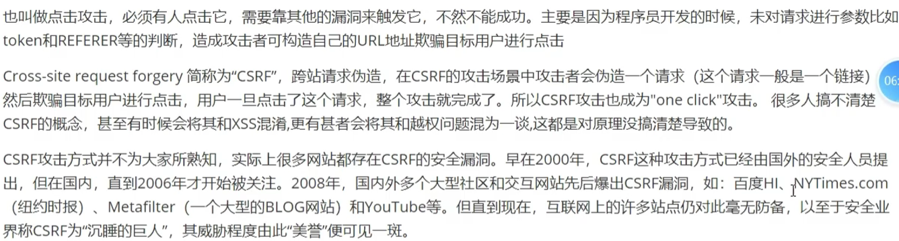
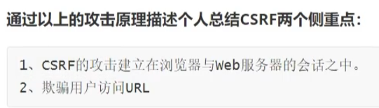
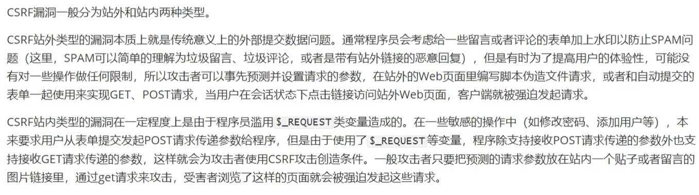
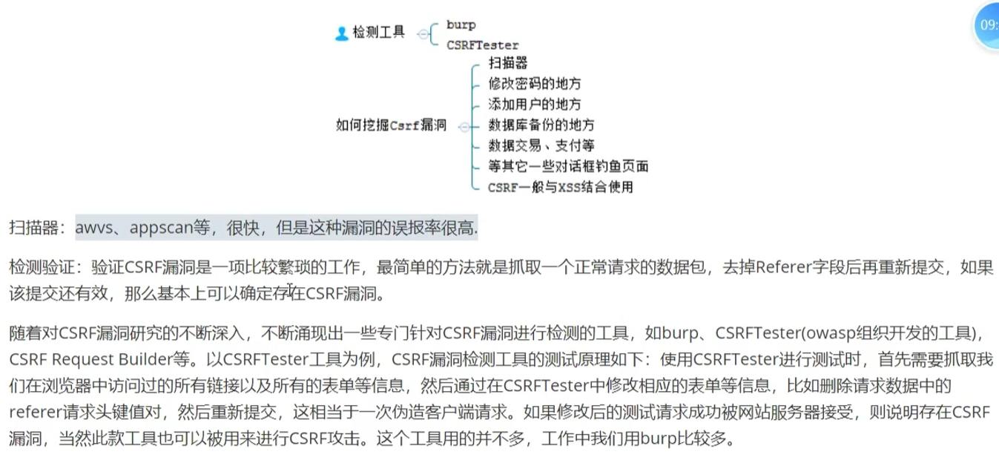
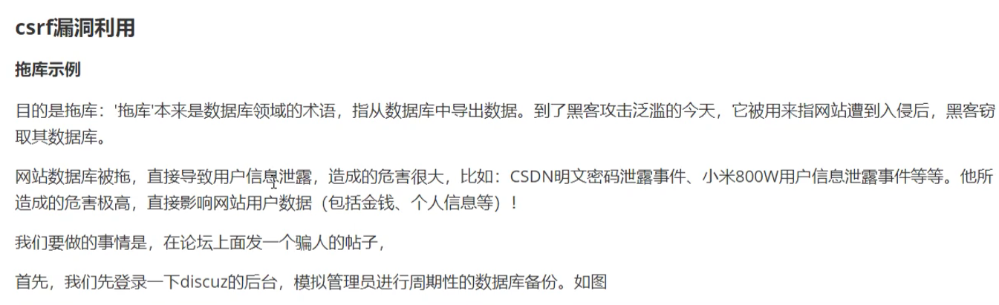

# [1. csrf介绍--跨站请求伪造](https://www.bilibili.com/video/BV1HE421N79e/?spm_id_from=333.337.search-card.all.click&vd_source=a7089a0e007e4167b4a61ef53acc6f7e)

> cross-site request forgery 跨站请求伪造
>
> forgery: 伪造

# 2. csrf原理






# 3. csrf分类



# 4. csrf漏洞检测



# [5. csrf攻击实验](https://www.bilibili.com/video/BV1HE421N79e/?p=2&spm_id_from=pageDriver&vd_source=a7089a0e007e4167b4a61ef53acc6f7e)

## 5.1 利用自解压包删除网络数据


## [5.2 dz数据库备份](https://www.bilibili.com/video/BV1HE421N79e/?p=3&spm_id_from=pageDriver&vd_source=a7089a0e007e4167b4a61ef53acc6f7e)



## [5.3 通过crsf漏洞添加账号](https://www.bilibili.com/video/BV1HE421N79e/?p=5&spm_id_from=pageDriver&vd_source=a7089a0e007e4167b4a61ef53acc6f7e)

## 5.4 通过crsf漏洞修改密码

https://www.bilibili.com/video/BV1HE421N79e/?p=6&spm_id_from=pageDriver&vd_source=a7089a0e007e4167b4a61ef53acc6f7e

5min20s处

# 6. csrf之referer请求头的防御和绕过

https://www.bilibili.com/video/BV1HE421N79e/?p=7&spm_id_from=pageDriver&vd_source=a7089a0e007e4167b4a61ef53acc6f7e

12：27min处

# 7. 什么情况下csrf攻击中的referer是黑客网站

在 CSRF（跨站请求伪造）攻击中，`Referer` 头部字段通常显示为黑客网站的情况主要涉及到以下几种情况：

### 1. **攻击者通过恶意网站触发请求**

**情况**:
- 攻击者创建一个恶意网页，该网页包含向目标网站发起请求的代码。当受害者访问这个恶意网站时，恶意代码会通过受害者的浏览器向目标网站发送请求。

**示例**:
- 攻击者在其网站上嵌入一个隐形的 `` 标签或 `<form>` 元素，这些元素会向目标网站发送请求，例如提交表单或加载图片。因为请求是从攻击者的网站发出的，所以 `Referer` 头部可能会显示为攻击者的网站 URL。

**代码示例**:
```html
<!-- 攻击者的网页 -->

```

**`Referer` 头部**:
- 在这种情况下，`Referer` 头部会包含攻击者网站的 URL，因为请求是从攻击者网站发出的。

### 2. **利用 HTML 表单或链接**

**情况**:
- 攻击者在其网站上放置恶意链接或表单，诱使受害者点击或提交。这些表单或链接会向目标网站发起请求，利用受害者的身份验证信息（如 cookies）。

**示例**:
- 攻击者创建一个带有隐藏字段的表单，并自动提交该表单。表单的 `action` 指向目标网站，受害者的浏览器将带着用户的身份验证信息向目标网站发送请求。

**代码示例**:
```html
<!-- 攻击者的网页 -->
<form action="https://target-website.com/perform_action" method="POST">
  <input type="hidden" name="param1" value="value1">
  <input type="submit">
</form>
<script>
  document.forms[0].submit(); // 自动提交表单
</script>
```

**`Referer` 头部**:
- `Referer` 头部会显示为攻击者网站，因为请求是从攻击者的网站发出的。

### 3. **通过恶意脚本**

**情况**:
- 攻击者利用 JavaScript 注入攻击，使用 JavaScript 向目标网站发送请求。这种攻击通常发生在恶意网站或攻击者控制的页面中。

**示例**:
- 攻击者在他们的网站上嵌入恶意 JavaScript，这些脚本会向目标网站发起 AJAX 请求或其他类型的请求。

**代码示例**:
```html
<!-- 攻击者的网页 -->
<script>
  fetch('https://target-website.com/perform_action', {
    method: 'POST',
    headers: {
      'Content-Type': 'application/x-www-form-urlencoded'
    },
    body: new URLSearchParams({
      'param1': 'value1'
    })
  });
</script>
```

**`Referer` 头部**:
- 请求的 `Referer` 头部会显示为攻击者网站，因为 JavaScript 代码是在攻击者的网站上执行的。

### 4. **恶意广告或追踪器**

**情况**:
- 攻击者通过广告或追踪器在用户浏览器中植入恶意代码，诱使用户的浏览器向目标网站发送请求。

**示例**:
- 恶意广告或追踪器在用户浏览器中嵌入了向目标网站发送请求的代码。用户访问包含恶意广告的网站时，这些请求会带着用户的身份验证信息发送到目标网站。

**`Referer` 头部**:
- 在这种情况下，`Referer` 头部会显示为广告或追踪器网站，因为请求是从这些源发出的。

### 总结

- **恶意网站触发请求**: 攻击者在其网站上嵌入恶意代码，发起请求到目标网站，`Referer` 头部显示为攻击者网站。
- **恶意表单或链接**: 攻击者通过表单或链接发起请求，`Referer` 头部显示为攻击者网站。
- **恶意脚本**: 攻击者的 JavaScript 代码发起请求，`Referer` 头部显示为攻击者网站。
- **恶意广告或追踪器**: 通过广告或追踪器发送请求，`Referer` 头部显示为广告或追踪器网站。

在这些情况下，攻击者利用 `Referer` 头部来隐藏攻击的真实来源，或利用请求本身来进行 CSRF 攻击。为了防止这些攻击，可以采用 CSRF 令牌、检查 `Referer` 头部、使用 `SameSite` Cookies 属性等措施。

# 8. 什么情况下csrf攻击中的referer不是黑客网站

在 CSRF（跨站请求伪造）攻击中，`Referer` 头部字段通常显示为攻击者网站，因为攻击者的恶意请求是从他们的网站发出的。不过，某些情况下 `Referer` 头部可能不是黑客网站，这些情况主要取决于攻击的具体策略和受害者的浏览器设置。以下是一些可能的情况：

### 1. **利用用户的已登录状态**

**情况**:
- 攻击者利用受害者已经登录的状态进行攻击。攻击者创建恶意请求，诱使受害者的浏览器在不需要实际访问攻击者网站的情况下直接发送请求。

**示例**:
- 攻击者通过社交工程或其他手段，诱使用户点击一个恶意链接。该链接可能直接触发某个操作（例如，发送一个 POST 请求）到目标网站，而没有通过攻击者网站。

**`Referer` 头部**:
- 在这种情况下，`Referer` 头部可能为空，或显示为用户实际访问的页面，而不是黑客网站。 

### 2. **跨站脚本攻击（XSS）**

**情况**:
- 攻击者在目标网站上利用 XSS 漏洞注入恶意 JavaScript 代码，这些代码会在受害者的浏览器中执行，直接向目标网站发起请求。

**示例**:
- 攻击者注入脚本，使其在用户访问目标网站时触发。脚本可以在受害者的浏览器内执行，发送请求到目标网站。由于请求是从目标网站内部发出的，`Referer` 头部可能显示为目标网站本身。

**`Referer` 头部**:
- `Referer` 头部可能是目标网站的 URL，因为请求是在目标网站内发起的。

### 3. **使用图片或嵌入式内容**

**情况**:
- 攻击者通过在其恶意网站上嵌入图片或其他嵌入式内容，诱使受害者的浏览器发送请求。

**示例**:
- 攻击者的恶意网站包含一个指向目标网站的 `` 标签，这个标签触发一个 GET 请求到目标网站。

**`Referer` 头部**:
- 在某些情况下，尤其是对于图片请求，`Referer` 头部可能被设置为空，或者设置为目标网站的 URL，因为请求是直接嵌入的。

### 4. **浏览器隐私设置**

**情况**:
- 用户的浏览器设置可能会阻止或更改 `Referer` 头部的发送。浏览器隐私设置可能会导致 `Referer` 头部为空或被修改。

**示例**:
- 一些浏览器扩展或隐私设置可能会防止 `Referer` 头部被发送，或者将其伪装为一个不同的 URL。

**`Referer` 头部**:
- 在这种情况下，`Referer` 头部可能为空，或者显示为一个非攻击者的网站。

### 5. **跨站点资源共享 (CORS)**

**情况**:
- 如果目标网站的 CORS 策略设置了 `Access-Control-Allow-Origin`，允许来自不同来源的请求，攻击者可以利用 CORS 请求。

**示例**:
- 攻击者可能利用 `CORS` 机制发起请求，尤其是在没有严格验证 `Referer` 或 `Origin` 头部的情况下。

**`Referer` 头部**:
- 在某些 CORS 请求中，`Referer` 头部可能会被排除，或者显示为攻击者网站的 URL。

### 总结

- **用户的已登录状态**: 攻击者利用受害者的登录状态直接发起请求，`Referer` 可能为空或为用户实际访问的页面。
- **XSS 攻击**: 恶意 JavaScript 在目标网站上执行，请求的 `Referer` 可能是目标网站。
- **图片或嵌入式内容**: `Referer` 可能为空或为目标网站。
- **浏览器隐私设置**: `Referer` 头部可能为空或被修改。
- **CORS**: 在某些情况下，`Referer` 头部可能被排除或更改。

这些情况说明了 CSRF 攻击的多样性以及为什么 `Referer` 头部可能不会总是显示为黑客网站。在设计防御机制时，考虑到这些不同的攻击方式可以帮助更全面地保护应用程序免受 CSRF 攻击。

# 9. 怎么防止csrf攻击


