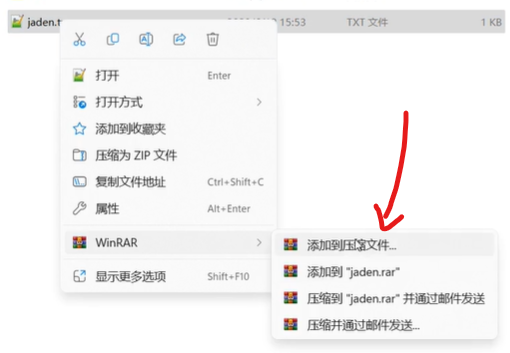

# [1. csrf介绍--跨站请求伪造](https://www.bilibili.com/video/BV1HE421N79e/?spm_id_from=333.337.search-card.all.click&vd_source=a7089a0e007e4167b4a61ef53acc6f7e)

`cross-site request forgery` 跨站请求伪造

forgery: 伪造

**描述**：攻击者诱使用户在不知情的情况下，向目标服务器发送恶意请求


通过以上的攻击原理描述 总结CSRF两个侧重点：

- CSRF攻击建立在浏览器与Web服务器的会话之中
- 欺骗用户访问URL

# 2. csrf分类


# 3. csrf漏洞检测


# [4. csrf攻击实验](https://www.bilibili.com/video/BV1HE421N79e/?p=2&spm_id_from=pageDriver&vd_source=a7089a0e007e4167b4a61ef53acc6f7e)

## 1. 利用自解压包删除网络数据

随便新建一个test.txt，里面输入一些内容。右键选择’添加到压缩文件‘

|  |  |
| :----------------------------------------------------------: | :----------------------------------------------------------: |
|  |  |
|                  最后生成一个.exe后缀的文件                  |  |

## [2. dz数据库备份](https://www.bilibili.com/video/BV1HE421N79e/?p=3&spm_id_from=pageDriver&vd_source=a7089a0e007e4167b4a61ef53acc6f7e)


## [3. 通过crsf漏洞添加账号](https://www.bilibili.com/video/BV1HE421N79e/?p=5&spm_id_from=pageDriver&vd_source=a7089a0e007e4167b4a61ef53acc6f7e)

## 4. 通过crsf漏洞修改密码

https://www.bilibili.com/video/BV1HE421N79e/?p=6&spm_id_from=pageDriver&vd_source=a7089a0e007e4167b4a61ef53acc6f7e

5min20s处

# [5. csrf之referer请求头的防御和绕过](https://www.bilibili.com/video/BV1HE421N79e/?p=7&spm_id_from=pageDriver&vd_source=a7089a0e007e4167b4a61ef53acc6f7e)

**Token 机制可以有效地防止 CSRF（Cross-Site Request Forgery）攻击**


# 6. 什么情况下csrf攻击中的referer是黑客网站

在 CSRF（跨站请求伪造）攻击中，`Referer` 头部字段通常显示为黑客网站的情况主要涉及到以下几种情况：

### 1. **攻击者通过恶意网站触发请求**

**情况**:
- 攻击者创建一个恶意网页，该网页包含向目标网站发起请求的代码。当受害者访问这个恶意网站时，恶意代码会通过受害者的浏览器向目标网站发送请求。

**示例**:
- 攻击者在其网站上嵌入一个隐形的 `` 标签或 `<form>` 元素，这些元素会向目标网站发送请求，例如提交表单或加载图片。因为请求是从攻击者的网站发出的，所以 `Referer` 头部可能会显示为攻击者的网站 URL。

**代码示例**:
```html
<!-- 攻击者的网页 -->

```

**`Referer` 头部**:
- 在这种情况下，`Referer` 头部会包含攻击者网站的 URL，因为请求是从攻击者网站发出的。

### 2. **利用 HTML 表单或链接**

**情况**:
- 攻击者在其网站上放置恶意链接或表单，诱使受害者点击或提交。这些表单或链接会向目标网站发起请求，利用受害者的身份验证信息（如 cookies）。

**示例**:
- 攻击者创建一个带有隐藏字段的表单，并自动提交该表单。表单的 `action` 指向目标网站，受害者的浏览器将带着用户的身份验证信息向目标网站发送请求。

**代码示例**:
```html
<!-- 攻击者的网页 -->
<form action="https://target-website.com/perform_action" method="POST">
  <input type="hidden" name="param1" value="value1">
  <input type="submit">
</form>
<script>
  document.forms[0].submit(); // 自动提交表单
</script>
```

**`Referer` 头部**:
- `Referer` 头部会显示为攻击者网站，因为请求是从攻击者的网站发出的。

### 3. **通过恶意脚本**

**情况**:
- 攻击者利用 JavaScript 注入攻击，使用 JavaScript 向目标网站发送请求。这种攻击通常发生在恶意网站或攻击者控制的页面中。

**示例**:
- 攻击者在他们的网站上嵌入恶意 JavaScript，这些脚本会向目标网站发起 AJAX 请求或其他类型的请求。

**代码示例**:
```html
<!-- 攻击者的网页 -->
<script>
  fetch('https://target-website.com/perform_action', {
    method: 'POST',
    headers: {
      'Content-Type': 'application/x-www-form-urlencoded'
    },
    body: new URLSearchParams({
      'param1': 'value1'
    })
  });
</script>
```

**`Referer` 头部**:
- 请求的 `Referer` 头部会显示为攻击者网站，因为 JavaScript 代码是在攻击者的网站上执行的。

### 4. **恶意广告或追踪器**

**情况**:
- 攻击者通过广告或追踪器在用户浏览器中植入恶意代码，诱使用户的浏览器向目标网站发送请求。

**示例**:
- 恶意广告或追踪器在用户浏览器中嵌入了向目标网站发送请求的代码。用户访问包含恶意广告的网站时，这些请求会带着用户的身份验证信息发送到目标网站。

**`Referer` 头部**:
- 在这种情况下，`Referer` 头部会显示为广告或追踪器网站，因为请求是从这些源发出的。

### 总结

- **恶意网站触发请求**: 攻击者在其网站上嵌入恶意代码，发起请求到目标网站，`Referer` 头部显示为攻击者网站。
- **恶意表单或链接**: 攻击者通过表单或链接发起请求，`Referer` 头部显示为攻击者网站。
- **恶意脚本**: 攻击者的 JavaScript 代码发起请求，`Referer` 头部显示为攻击者网站。
- **恶意广告或追踪器**: 通过广告或追踪器发送请求，`Referer` 头部显示为广告或追踪器网站。

在这些情况下，攻击者利用 `Referer` 头部来隐藏攻击的真实来源，或利用请求本身来进行 CSRF 攻击。为了防止这些攻击，可以采用 CSRF 令牌、检查 `Referer` 头部、使用 `SameSite` Cookies 属性等措施。

# 7. 什么情况下csrf攻击中的referer不是黑客网站

在 CSRF（跨站请求伪造）攻击中，`Referer` 头部字段通常显示为攻击者网站，因为攻击者的恶意请求是从他们的网站发出的。不过，某些情况下 `Referer` 头部可能不是黑客网站，这些情况主要取决于攻击的具体策略和受害者的浏览器设置。以下是一些可能的情况：

### 1. **利用用户的已登录状态**

**情况**:
- 攻击者利用受害者已经登录的状态进行攻击。攻击者创建恶意请求，诱使受害者的浏览器在不需要实际访问攻击者网站的情况下直接发送请求。

**示例**:
- 攻击者通过社交工程或其他手段，诱使用户点击一个恶意链接。该链接可能直接触发某个操作（例如，发送一个 POST 请求）到目标网站，而没有通过攻击者网站。

**`Referer` 头部**:
- 在这种情况下，`Referer` 头部可能为空，或显示为用户实际访问的页面，而不是黑客网站。 

### 2. **跨站脚本攻击（XSS）**

**情况**:
- 攻击者在目标网站上利用 XSS 漏洞注入恶意 JavaScript 代码，这些代码会在受害者的浏览器中执行，直接向目标网站发起请求。

**示例**:
- 攻击者注入脚本，使其在用户访问目标网站时触发。脚本可以在受害者的浏览器内执行，发送请求到目标网站。由于请求是从目标网站内部发出的，`Referer` 头部可能显示为目标网站本身。

**`Referer` 头部**:
- `Referer` 头部可能是目标网站的 URL，因为请求是在目标网站内发起的。

### 3. **使用图片或嵌入式内容**

**情况**:
- 攻击者通过在其恶意网站上嵌入图片或其他嵌入式内容，诱使受害者的浏览器发送请求。

**示例**:
- 攻击者的恶意网站包含一个指向目标网站的 `` 标签，这个标签触发一个 GET 请求到目标网站。

**`Referer` 头部**:
- 在某些情况下，尤其是对于图片请求，`Referer` 头部可能被设置为空，或者设置为目标网站的 URL，因为请求是直接嵌入的。

### 4. **浏览器隐私设置**

**情况**:
- 用户的浏览器设置可能会阻止或更改 `Referer` 头部的发送。浏览器隐私设置可能会导致 `Referer` 头部为空或被修改。

**示例**:
- 一些浏览器扩展或隐私设置可能会防止 `Referer` 头部被发送，或者将其伪装为一个不同的 URL。

**`Referer` 头部**:
- 在这种情况下，`Referer` 头部可能为空，或者显示为一个非攻击者的网站。

### 5. **跨站点资源共享 (CORS)**

**情况**:
- 如果目标网站的 CORS 策略设置了 `Access-Control-Allow-Origin`，允许来自不同来源的请求，攻击者可以利用 CORS 请求。

**示例**:
- 攻击者可能利用 `CORS` 机制发起请求，尤其是在没有严格验证 `Referer` 或 `Origin` 头部的情况下。

**`Referer` 头部**:
- 在某些 CORS 请求中，`Referer` 头部可能会被排除，或者显示为攻击者网站的 URL。

### 总结

- **用户的已登录状态**: 攻击者利用受害者的登录状态直接发起请求，`Referer` 可能为空或为用户实际访问的页面。
- **XSS 攻击**: 恶意 JavaScript 在目标网站上执行，请求的 `Referer` 可能是目标网站。
- **图片或嵌入式内容**: `Referer` 可能为空或为目标网站。
- **浏览器隐私设置**: `Referer` 头部可能为空或被修改。
- **CORS**: 在某些情况下，`Referer` 头部可能被排除或更改。

这些情况说明了 CSRF 攻击的多样性以及为什么 `Referer` 头部可能不会总是显示为黑客网站。在设计防御机制时，考虑到这些不同的攻击方式可以帮助更全面地保护应用程序免受 CSRF 攻击。

# 8. CSRF

CSRF（Cross-Site Request Forgery，跨站请求伪造）是一种通过欺骗用户的身份来发起恶意请求的攻击方式。攻击者在用户不知情的情况下，通过用户的身份权限来向服务器发送伪造的请求，导致未授权的操作。

### CSRF 攻击原理

CSRF 攻击的核心在于利用用户已认证的身份。当用户在某个站点（例如银行、社交平台等）已登录且保持会话状态，攻击者诱导用户点击恶意链接或访问包含恶意请求的页面。浏览器会自动携带用户的身份认证信息（例如 Cookie），导致伪造请求被服务器误认为是用户的真实请求，从而执行攻击者指定的操作。

#### CSRF 攻击流程
1. **用户登录目标网站并认证**：用户在目标网站（如银行）登录并保留了会话状态。
2. **用户访问恶意页面**：攻击者创建一个包含恶意请求的页面或链接，并诱导用户点击。
3. **发送伪造请求**：恶意页面中的脚本发送请求到目标网站，浏览器会自动附带用户的 Cookie 等认证信息。
4. **服务器误以为是用户的真实请求**：由于请求携带了用户的认证信息，服务器会认为请求是用户发起的，执行请求内容中的操作。

例如，攻击者可以在论坛发帖，包含一个请求 URL：
```html

```
当已登录银行网站的用户浏览到该帖时，浏览器会自动请求图片链接，并带上银行的 Cookie，导致银行服务器执行转账请求。

### CSRF 的危害
CSRF 攻击可以导致用户在不知情的情况下执行高权限的操作，例如转账、修改个人资料、删除账户等，给用户和服务带来严重的安全风险。

### 防范 CSRF 攻击

1. **使用 CSRF Token**
   - 在请求时加入一个随机生成的 Token（CSRF Token），并将其与用户会话绑定。服务器在接收请求时，验证 Token 是否匹配，匹配则认为请求有效，否则拒绝。
   - CSRF Token 应该是随机生成的、不可预测的，并在每个请求时重新生成。

2. **验证请求来源（Referer 和 Origin 验证）**
   - 服务器检查请求的 `Referer` 或 `Origin` 头，确保请求是从合法的站点发起的。
   - 如果请求的 `Referer` 或 `Origin` 与服务器域名不符，可以判定请求是伪造的。

3. **使用 SameSite Cookie 属性**
   - 将敏感 Cookie 设置 `SameSite=Strict` 或 `SameSite=Lax`，使其仅在同一站点内的请求中携带，从而防止跨站请求带上 Cookie。
   - `Strict` 模式完全禁止跨站请求携带 Cookie；`Lax` 模式允许部分安全的跨站请求携带 Cookie。

4. **用户确认操作**
   - 在执行敏感操作之前，要求用户进行额外确认（如输入密码、验证码等），避免在不知情的情况下执行关键操作。

### 示例：CSRF Token 机制

假设一个电商网站需要保护用户的转账功能，可以采用 CSRF Token 来防范：

1. **服务器生成 Token**：用户访问转账页面时，服务器生成一个 CSRF Token，并保存在用户会话中，将 Token 以隐藏字段的形式添加到表单中。
   ```html
   <form action="/transfer" method="POST">
       <input type="hidden" name="csrf_token" value="随机生成的Token">
       <input type="text" name="amount" placeholder="转账金额">
       <button type="submit">转账</button>
   </form>
   ```

2. **服务器验证 Token**：当用户提交表单，服务器会验证提交的 CSRF Token 是否与会话中的 Token 一致，不一致则拒绝请求。
   ```javascript
   // 服务器代码示例
   if (req.body.csrf_token !== req.session.csrf_token) {
       return res.status(403).send('CSRF Token 无效');
   }
   ```

这种方式有效防止 CSRF 攻击，因为攻击者无法获取用户的 CSRF Token，从而无法伪造合法请求。


