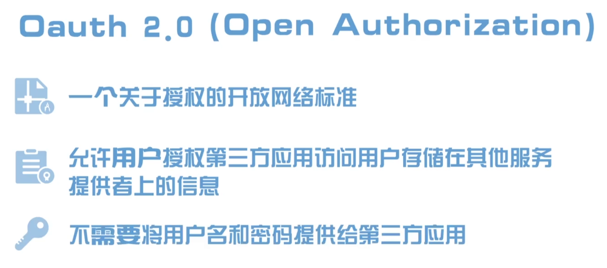

# 1. OAuth2

https://www.youtube.com/watch?v=ZV5yTm4pT8g

- jargon 行话，黑话
- frown upon: 不赞成或不同意，表示对某事持否定的态度或观点
- encounter： 遇到
- the early days of the internet: sharing info was straightforward, just hand over your username and password to another service

# 2. OAuth2

https://www.bilibili.com/video/BV1FL411h7es/?spm_id_from=333.337.search-card.all.click&vd_source=a7089a0e007e4167b4a61ef53acc6f7e

> Open Authorization

|  |  |
| ------------------------------------------------------------ | ------------------------------------------------------------ |
|                                                              | 第三方应用指的是例子中的百度 服务提供者指的是微信         |

