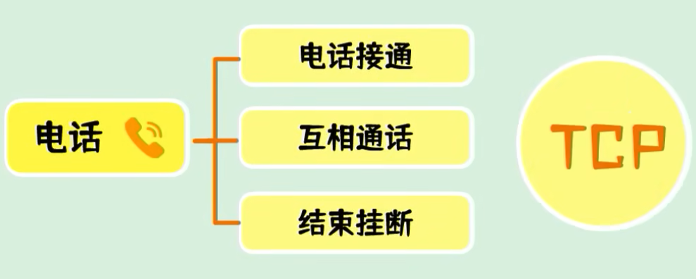
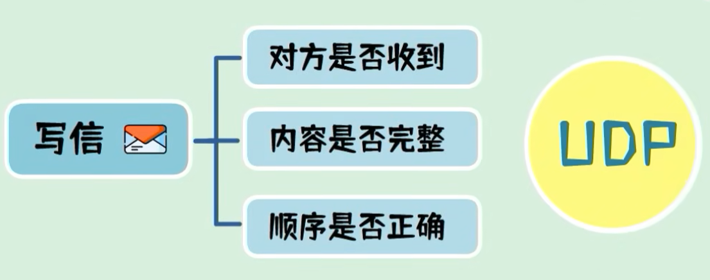

# [1. TCP——UDP——三次握手——四次挥手](https://www.bilibili.com/video/BV1kV411j7hA/?spm_id_from=333.337.search-card.all.click&vd_source=a7089a0e007e4167b4a61ef53acc6f7e)

> 都是**传输层**的协议
>
> 他们的目标：都是在程序（APP）之间传递数据


## 1.1 TCP和UDP的区别

|      |       TCP——Transmission Control Protocol——传输控制协议       |         UDP——User Datagram Protocol——用户数据报协议          |
| ---- | :----------------------------------------------------------: | :----------------------------------------------------------: |
|      |                           基于连接                           |                          基于非连接                          |
|      |  |  |
|      |   这三个流程都能得到及时的反馈，并且能确认对方准确的接收到   | 这三项都是未知数，甚至你填写的收信地址和收信人是否存在，你都无法确认 |
|      | TCP是如何保证以上过程的，有三个关键的步骤：**三次握手，传输确认，四次挥手** |                                                              |

## 1.2 三次握手

> 因为这个过程中互相发送了三包数据，所以称之为三次握手


## 1.3 为什么要三次握手，而不是两次握手

- 为什么要三次握手，而不是两次握手，即为什么不在服务端回复完SYN+ACK后就建立连接？
  - 这是为了防止因为已失效的请求报文突然又传到服务器引起错误  
  - 看完下表中的图，就能理解：**三次握手本质上来说，就是为了解决网络信道不可靠的问题**


- 假设采用两次握手建立连接：

| 1. 客户端向服务端发送了一个SYN1包，来请求建立连接            |  |
| ------------------------------------------------------------ | ------------------------------------------------------------ |
| 2. 因为某些未知的原因，该SYN1包并没有到达服务器，在中间某个网络节点产生了滞留 |                                                              |
| 3. 为了建立连接，客户端会重发SYN2包，这次的数据包正常到达    |  |
| 4. 服务端回复SYN+ACK之后建立起了连接。                       |  |
| 5. 但是第一包数据阻塞的网络节点突然恢复，第一包SYN包又送达到服务端。<br>这时服务端会误以为是客户端又发起了一个新的连接。<br>服务端认为是两个连接，而客户端认为是一个连接，造成了状态不一致。 |  |
| 如果在三次握手的情况下，服务端收不到最后的ACK包，不会建立连接。 |                                                              |
| ？？？连接状态不一致会引起什么问题？？？                     |                                                              |

## 1.4 如何处理丢包问题和乱序问题

- 一包数据有可能会被拆成多包发送，如何处理丢包问题

- 拆分后的数据包到达的先后顺序不同，如何处理乱序问题

  

- 针对以上要求，TCP协议为每一个连接建立了一个发送缓冲区，从建立链接后的第一个字节的序列号为0，后面每个字节的序列号就会增加1

- 发送数据时，从发送缓冲区取一部分数据组成发送报文，在其TCP协议头中会附带序列号和长度。

- 接收端在收到数据后，需要回复确认报文。确认报文中的ACK等于接收序列号+长度，也就是下一包数据需要发送的起始序列号


## 1.5 四次挥手


- 处于连接状态的客户端和服务端，都可以发起关闭连接请求


1. 客户端向服务端发送FIN包，表示要关闭连接，客户端进入FIN-WIAT-1状态（终止等待1状态）。【FIN（Finish）包用于表示一方**已经没有数据要发送了，但仍然可以接收数据**】
2. 服务端收到FIN包，向客户端发送ACK包，表示自己进入了CLOSE-WAIT状态 (关闭等待状态)
3. 客户端进入FIN-WAIT-2状态（终止等待2状态）
4. 服务端此时还可以发送未发送的数据，客户端还可以接收数据
5. 待服务端发送完数据之后，发送一个FIN包，服务端进入LAST-ACK状态（最后确认状态）
6. 客户端收到后回复ACK包，进入TIME-WAIT状态（超时等待状态）
7. 经过超时时间后，客户端关闭连接
8. 而服务端收到ACK包后，立即关闭连接

## 1.6 SYN包

在TCP三次握手中的SYN包是建立连接过程中的第一步。SYN包的具体结构包括TCP头部的各个字段，下面是一个详细的描述：

### SYN包的具体内容

1. **源端口（Source Port）**：
   - 发起连接的一方的端口号，例如`12345`。

2. **目的端口（Destination Port）**：
   - 接收连接请求的一方的端口号，例如`80`（HTTP）。

3. **序列号（Sequence Number）**：
   - 发起连接的一方选择的初始序列号（ISN），比如`1000`。在SYN包中，这个序列号是随机生成的。

4. **确认号（Acknowledgment Number）**：
   - 在SYN包中，该字段为0，因为这时没有数据需要确认。

5. **数据偏移（Data Offset）**：
   - 表示TCP头部的长度，通常为`5`（表示20字节，因为每个数据偏移单位是4字节）。

6. **保留字段（Reserved）**：
   - 通常为0，用于将来扩展。

7. **标志位（Flags）**：
   - **SYN**：设置为1，表示这是一个SYN包。
   - 其他标志位如ACK、FIN、RST、PSH、URG都为0。

8. **窗口大小（Window Size）**：
   - 表示接收窗口的大小，比如`65535`。

9. **校验和（Checksum）**：
   - 用于错误检测，确保数据传输的完整性。

10. **紧急指针（Urgent Pointer）**：
    - 在SYN包中通常为0，因为没有紧急数据。

### 示例（简化版）

假设SYN包的字段值如下：

- 源端口：`12345`
- 目的端口：`80`
- 序列号：`1000`
- 确认号：`0`
- 数据偏移：`5`
- 保留：`0`
- 标志位：`SYN=1`
- 窗口大小：`65535`
- 校验和：`0x1a2b`
- 紧急指针：`0`

**示例TCP头部（简化表示）**：

```
+------------------+------------------+------------------+
| Source Port (12345) | Destination Port (80) | Sequence Number (1000) |
+------------------+------------------+------------------+
| Acknowledgment Number (0) | Data Offset (5) | Reserved (0) | Flags (SYN=1) |
+------------------+------------------+------------------+
| Window Size (65535) | Checksum (0x1a2b) | Urgent Pointer (0) |
+------------------+------------------+------------------+
```

**这个包主要用于初始化连接，告诉接收方发起方想要建立连接。接收方收到SYN包后，会发送一个SYN-ACK包作为回应。**

## 1.7 FIN包

> FIN（Finish）包用于表示一方**已经没有数据要发送了，但仍然可以接收数据**。以下是FIN包的具体内容和特点：
>

1. **TCP头部**：
   - **源端口（Source Port）**：发送方的端口号。
   - **目的端口（Destination Port）**：接收方的端口号。
   - **序列号（Sequence Number）**：用于确保数据包的顺序。
   - **确认号（Acknowledgment Number）**：用于确认已收到的数据。
   - **数据偏移（Data Offset）**：TCP头部的长度。
   - **保留字段（Reserved）**：通常为0。
   - **标志位（Flags）**：FIN标志位（FIN=1），其他标志位如SYN、RST、PSH、ACK、URG等根据实际情况设置。
   - **窗口大小（Window Size）**：接收方的接收窗口大小。
   - **校验和（Checksum）**：用于错误检测。
   - **紧急指针（Urgent Pointer）**：如果URG标志位被设置，则紧急指针的值。

2. **FIN包的标志位**：
   - **FIN**：设置为1，表示发送方已经没有数据要发送了。

3. **数据部分**：
   - 通常FIN包的数据部分为空，因为FIN包只是用于关闭连接的通知。

**示例（简化版）**：
```
+------------------+------------------+------------------+
| Source Port      | Destination Port | Sequence Number  |
+------------------+------------------+------------------+
| Acknowledgment Number | Data Offset  | Reserved | Flags (FIN=1) |
+------------------+------------------+------------------+
| Window Size      | Checksum         | Urgent Pointer   |
+------------------+------------------+------------------+
| Data (usually empty)                     |
+------------------+------------------+
```

# 3. 对1的引申问题：TCP是如何保证可靠性的？

- 滑动窗口控制
- 超时重传
- 流量控制
- 拥塞控制

# 5. 为什么连接的时候是三次，关闭的时候是四次？

# 7. 如果已经建立了连接，但是客户端突然出现故障了怎么办？

# 8. 为什么TIME_WAIT状态需要经过2MSL(最大报文段生存时间)才能返回到CLOSE状态？

# 9. TCP对应的应用层协议有哪些？UDP对应的应用层协议有哪些？

