# 1. HTTP全称

> HyperText Transfer Protocol 超文本传输协议

# [2. HTTP版本](https://www.bilibili.com/video/BV1vv4y1U77y/?spm_id_from=333.337.search-card.all.click&vd_source=a7089a0e007e4167b4a61ef53acc6f7e)

> https://ke.qq.com/webcourse/2837895/102948532#taid=10038639948680583&vid=5285890787804243247

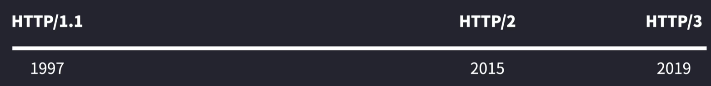

## 1.1 HTTP/0.9

所以最初的网页是没有图片和视频的，只有文字

## 1.2 HTTP/1.0·

- 增加POST请求方式
- 支持多种数据格式（图片，视频等）的请求和访问
- 支持cache缓存功能
- 新增状态码

 

- 早期的HTTP/1.0不支持keep-alive长连接，只支持串行链接
- 后期的HTTP/1.0增加Connection：keep-alive字段（非标准字段），开始支持长连接

## 1.3 HTTP/1.1

> HTTP/1.1才是互联网的第一个真正意义的HTTP标准版本
>
> 发送一个HTTP请求的时候，是需要等收到HTTP响应，才可以再发送下一个HTTP请求???跟管道机制的描述冲突

| 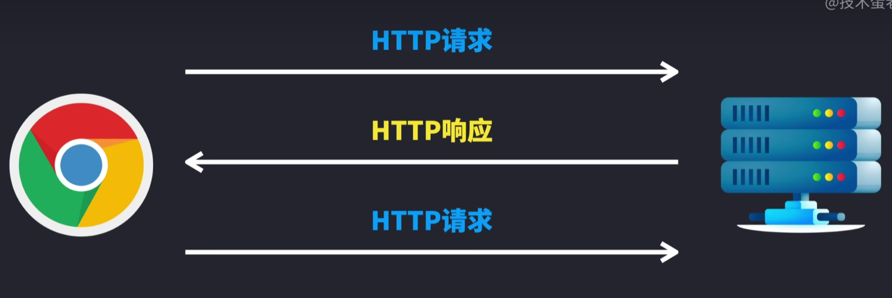 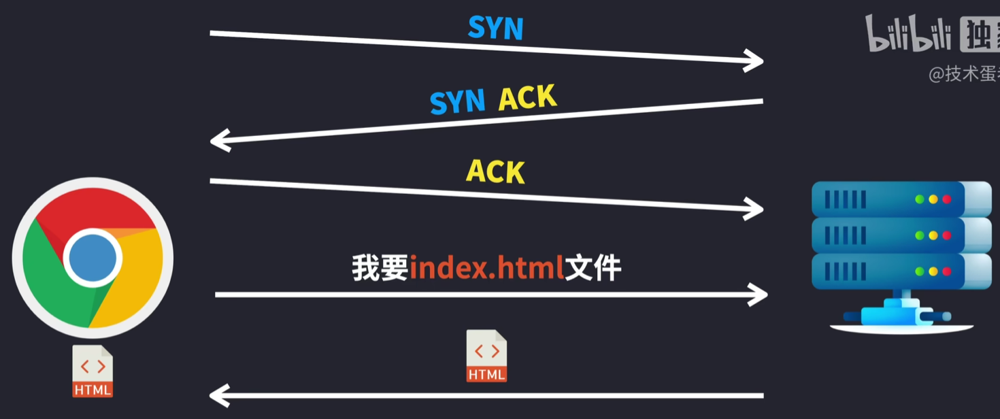 | 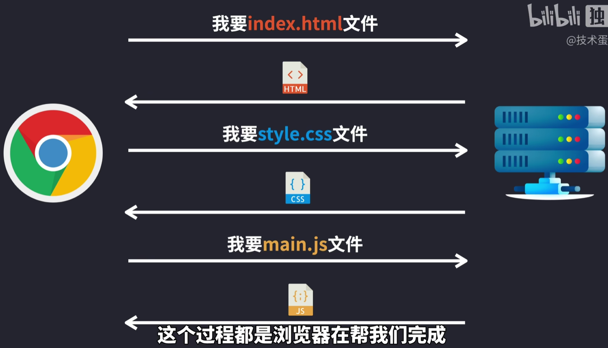 |
| ------------------------------------------------------------ | ------------------------------------------------------------ |
| 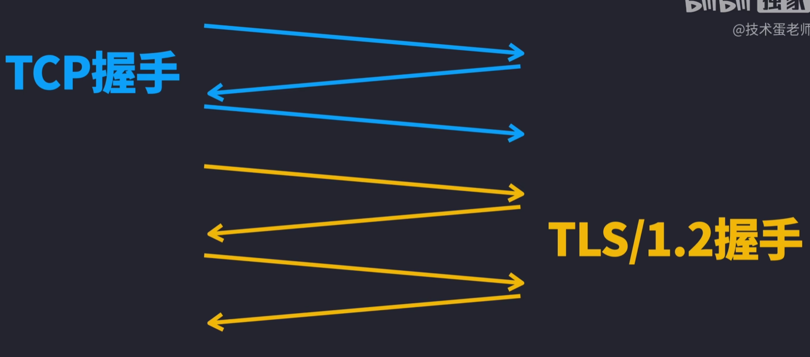 | 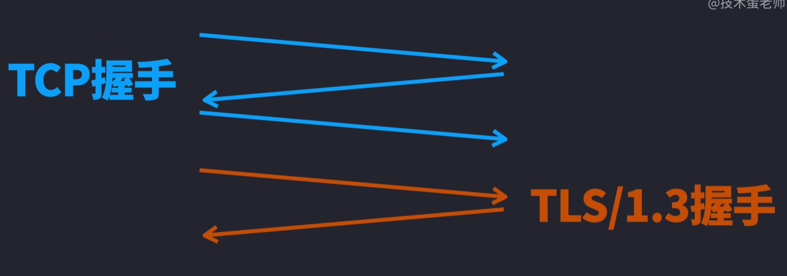 |
|  | 1. **默认持久连接 Keep-Alive**：保持某一个TCP连接，无需对每个请求再来一轮TCP握手，请求和响应都可以放在**同一个连接**里面 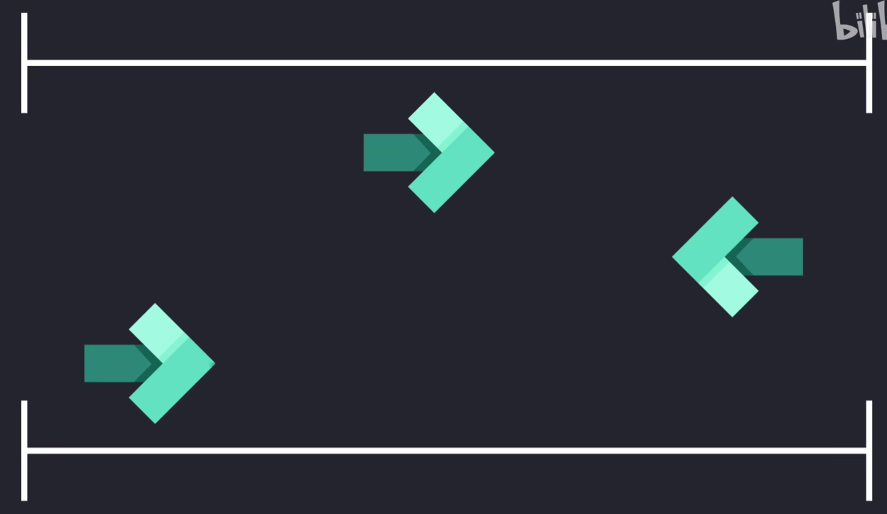 |

## 1.4 HTTP/2.0

> 特点：**多路复用**
>
> 主要解决HTTP/1.1**队头阻塞**的问题

| 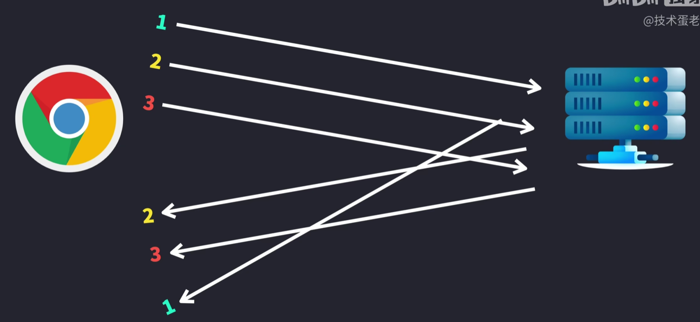 | 单个TCP连接就可以进行交错发送请求和响应，而且请求和响应之间不影响 |
| ------------------------------------------------------------ | ------------------------------------------------------------ |
|  |                                                              |

## 1.5 HTTP/3.0

> 整合：把TCP和TLS的握手过程整合在一起了

## 1.6 HTTP/1.1和HTTP/2.0的区别

| HTTP/1.1                                                     | HTTP/2.0                                                     |
| ------------------------------------------------------------ | ------------------------------------------------------------ |
| 报文主体压缩，报文首部不压缩 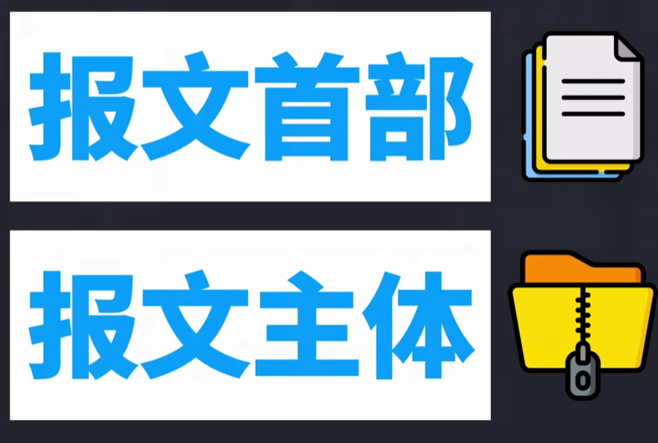 | 报文主体和报文首部均压缩 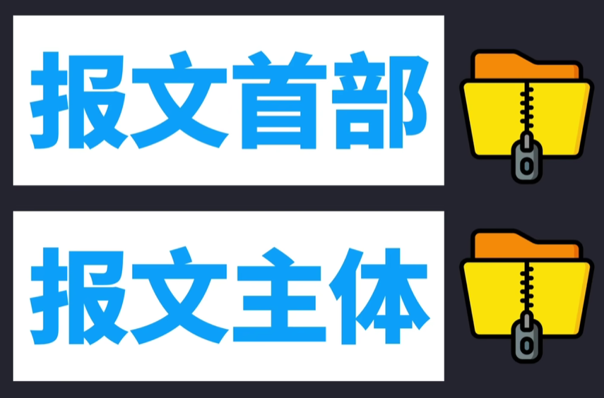 |

# 3. 常见状态码及使用场景

|      |                  |                            |
| :--: | :--------------: | :------------------------: |
| 1xx  |   信息性状态码   |     接受的请求正在处理     |
| 2xx  |    成功状态码    |      请求正常处理完毕      |
| 3xx  |   重定向状态码   | 需要进行附加操作以完成请求 |
| 4xx  | 客户端错误状态码 |     服务端无法处理请求     |
| 5xx  | 服务器错误状态码 |     服务端处理请求出错     |

# 3. http缓存

[http缓存](https://developer.mozilla.org/zh-CN/docs/Web/HTTP/Caching)

# 4. http get和post的区别

* 数据传输方式：get方法通过url将数据传输到服务器，post方法通过http消息主体将数据传输到服务器
* 数据长度限制：get方法对url的长度有限制，通常在2048个字符左右，而post方法没有这样的限制
* 数据安全性：由于get方法通过url传输数据，所以数据可以被保存在浏览器的历史纪录中。而post方法通过http消息主体传输数据，所以数据不会被保存在浏览器的历史纪录中，这使得post方法更加安全
* 数据缓存：get方法可以被缓存，这意味着浏览器可以从缓存中加载已经获取的数据，而不必再次从服务器获取数据。而post方法不能被缓存，这意味着每次需要从服务器获取数据
* 使用场景：get方法适合用于请求数据，例如请求某个网页或图像，而post方法适合用于发送数据，例如提交表单或者上传文件

# 5. http https的区别

# 6. HTTP队头阻塞

HTTP队头阻塞（Head-of-Line Blocking）是指在HTTP请求和响应过程中，由于某些请求被阻塞，导致后续请求也被阻塞的问题。具体来说，当一个请求在处理时发生延迟，它可能会阻止后续请求的处理，尽管这些后续请求可能已经准备好被处理。

这种现象在HTTP/1.x协议中比较常见，原因在于HTTP/1.x是基于TCP的，而TCP是一个面向流的协议，它需要保证数据的顺序和完整性。因此，当一个请求被阻塞时，整个连接上的其他请求也会受到影响。

例如，如果在一个HTTP/1.x连接中，前面的请求需要很长时间才能完成，那么后面的请求就必须等待前面的请求完成才能被处理。这会导致延迟的累积，影响整体的响应时间。

HTTP/2引入了一些机制来解决这个问题，比如多路复用（Multiplexing）。在HTTP/2中，多个请求和响应可以并行发送和接收，而不会相互阻塞，从而有效地减少了队头阻塞的影响。

# 7. 查看浏览器使用的HTTP版本

在响应头中勾选原始查看

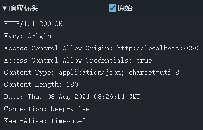

# 8. HPACK压缩算法

> HPACK算法要求浏览器和服务器都保存一张静态只读的表

`HTTP/1.1 200 OK` --> `:status:200`

少了三个字节

# 1. 为什么Http是无状态的短连接，而TCP是有状态的长连接？Http不是建立在TCP的基础上吗，为什么还能是短连接？

* Http就是在每次请求完成后就把TCP连接关了，所以是短连接。而我们直接通过Socket编程使用TCP协议的时候，因为我们自己可以通过代码区控制什么时候打开连接什么时候关闭连接，只要我们不通过代码把连接关闭，这个连接就会在客户端和服务端的进程中一直存在，相关状态数据会一直保存着。
